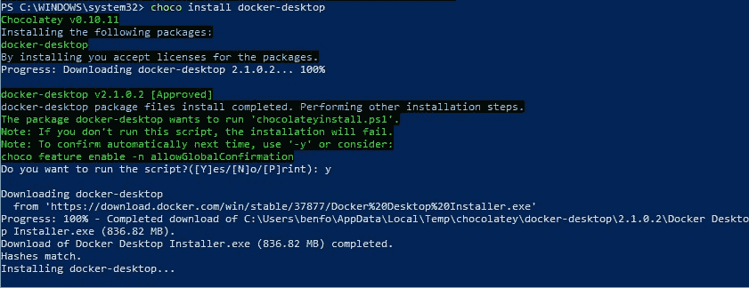
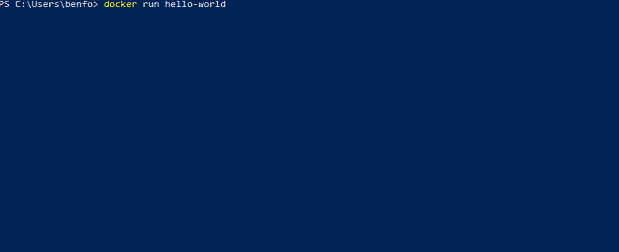
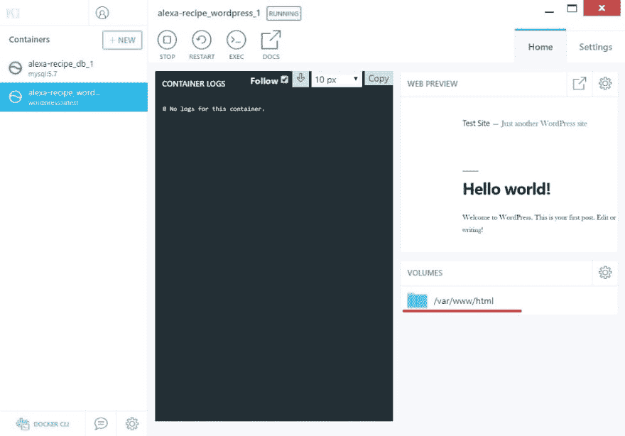

# Wordpress 插件开发环境

> 原文:[https://dev . to/the enforce/WordPress-plugin-development-environment-ko9](https://dev.to/thebenforce/wordpress-plugin-development-environment-ko9)

# [](#setup-docker)设置 Docker

我使用名为 [chocolatey](%5Bhttps://chocolatey.org/%5D(https://chocolatey.org/)) 的软件包管理器来安装/卸载软件。如果你有 chocolatey 安装程序，只需运行下面的命令来安装 docker:

```
choco  install  docker-desktop 
```

<svg width="20px" height="20px" viewBox="0 0 24 24" class="highlight-action crayons-icon highlight-action--fullscreen-on"><title>Enter fullscreen mode</title></svg> <svg width="20px" height="20px" viewBox="0 0 24 24" class="highlight-action crayons-icon highlight-action--fullscreen-off"><title>Exit fullscreen mode</title></svg>

[T2】](https://res.cloudinary.com/practicaldev/image/fetch/s--WI7pHTGC--/c_limit%2Cf_auto%2Cfl_progressive%2Cq_auto%2Cw_880/https://thepracticaldev.s3.amazonaws.com/i/wzd6y6nyjf74fcp6ktbr.jpg)

Kitematic 为 docker 提供了一个可视化界面，所以如果你不太喜欢命令行，我建议你也安装它:

```
choco  install  docker-kitematic 
```

<svg width="20px" height="20px" viewBox="0 0 24 24" class="highlight-action crayons-icon highlight-action--fullscreen-on"><title>Enter fullscreen mode</title></svg> <svg width="20px" height="20px" viewBox="0 0 24 24" class="highlight-action crayons-icon highlight-action--fullscreen-off"><title>Exit fullscreen mode</title></svg>

## [](#starting-docker)开始停靠

安装完成后，注销然后重新登录。按下 windows 键并搜索`docker desktop`，运行 docker desktop。一旦 docker 准备好了，你会看到系统托盘中的图标停止活动，一个登录窗口将会出现。

[T2】](https://res.cloudinary.com/practicaldev/image/fetch/s--FDFUVPew--/c_limit%2Cf_auto%2Cfl_progressive%2Cq_auto%2Cw_880/https://thepracticaldev.s3.amazonaws.com/i/gemay3sgw5wks6ciwvr7.jpg)

最后一步是确保 docker 正在工作。打开一个新的 powershell 窗口并运行以下命令:

```
docker  run  hello-world 
```

<svg width="20px" height="20px" viewBox="0 0 24 24" class="highlight-action crayons-icon highlight-action--fullscreen-on"><title>Enter fullscreen mode</title></svg> <svg width="20px" height="20px" viewBox="0 0 24 24" class="highlight-action crayons-icon highlight-action--fullscreen-off"><title>Exit fullscreen mode</title></svg>

您应该看到输出表明 docker 正在运行。
[T3】](https://res.cloudinary.com/practicaldev/image/fetch/s--P0p1pmwU--/c_limit%2Cf_auto%2Cfl_progressive%2Cq_66%2Cw_880/https://thepracticaldev.s3.amazonaws.com/i/4p96i9n9ugymu335y8a2.gif)

# [](#run-wordpress-in-docker)在 Docker 中运行 WordPress

现在 docker 已经在你的系统上设置好了，我们可以启动 WordPress 了。由于 WordPress 需要运行一个 MySql 实例来存储它的所有数据，我们需要运行两个容器并将它们连接起来。如果我们停止容器并在以后重新启动它们，我们还希望它们的数据能够持久。为此，我们创建了一个 docker 合成文件，其中包含每个容器的卷。

将以下文件另存为`docker-compose.yml`。

```
version: "3.3"

services:
  db:
    image: mysql:5.7
    volumes:
      - db_data:/var/lib/mysql
    ports:
      - "3306:3306"
    restart: always
    environment:
      MYSQL_ROOT_PASSWORD: somewordpress
      MYSQL_DATABASE: wordpress
      MYSQL_USER: wordpress
      MYSQL_PASSWORD: wordpress

  wordpress:
    depends_on:
      - db
    image: wordpress:latest
    volumes:
      - wordpress:/var/www/html
    ports:
      - "8000:80"
    restart: always
    environment:
      WORDPRESS_DB_HOST: db:3306
      WORDPRESS_DB_USER: wordpress
      WORDPRESS_DB_PASSWORD: wordpress
      WORDPRESS_DB_NAME: wordpress
volumes:
  db_data: {}
  wordpress: {} 
```

<svg width="20px" height="20px" viewBox="0 0 24 24" class="highlight-action crayons-icon highlight-action--fullscreen-on"><title>Enter fullscreen mode</title></svg> <svg width="20px" height="20px" viewBox="0 0 24 24" class="highlight-action crayons-icon highlight-action--fullscreen-off"><title>Exit fullscreen mode</title></svg>

在保存 docker 合成文件的目录中打开一个 shell 并运行`docker-compose up -d`。几分钟后，WordPress 就可以在你的机器上运行了。

## [](#running-wordpress-install)运行 WordPress Install

在你开始为 WordPress 编写插件之前，你需要在你的新服务器上运行设置页面。浏览到[http://localhost:8000/WP-admin/install . PHP](http://localhost:8000/wp-admin/install.php)并按照说明进行操作。

# [](#creating-a-plugin)创建插件

要创建一个插件，你需要在 WordPress 的目录下添加一个文件夹。要找到根目录，单击系统托盘中的 docker 图标并从菜单中选择`kitematic`来打开 kitematic。

[T2】](https://res.cloudinary.com/practicaldev/image/fetch/s---LKpnJRT--/c_limit%2Cf_auto%2Cfl_progressive%2Cq_auto%2Cw_880/https://thepracticaldev.s3.amazonaws.com/i/4p0phzxief0h1tfzofz7.jpg)

现在选择窗口左侧的 WordPress 容器，并点击右侧卷列表下的`/var/www/html`。

[T2】](https://res.cloudinary.com/practicaldev/image/fetch/s--PrutSx3t--/c_limit%2Cf_auto%2Cfl_progressive%2Cq_auto%2Cw_880/https://thepracticaldev.s3.amazonaws.com/i/6x2ul7z79m4xqmites00.jpg)

这将打开 Windows 资源管理器，并选中`html`文件夹。打开它，然后浏览到`wp-content` - > `plugins`。创建一个名为`first-plugin`的新文件夹，然后打开它。在新文件夹中创建一个名为`index.php`的文件，并将下面的代码粘贴到其中:

```
<?php
/**
* Plugin Name: First Plugin
* Plugin URI: https://voiceify.io
* Description: Your very first plugin!
* Version: 1.0
* Author: Ben Force
* Author URI: https://twitter.com/theBenForce
* License: GPLv2 or later
**/ 
```

<svg width="20px" height="20px" viewBox="0 0 24 24" class="highlight-action crayons-icon highlight-action--fullscreen-on"><title>Enter fullscreen mode</title></svg> <svg width="20px" height="20px" viewBox="0 0 24 24" class="highlight-action crayons-icon highlight-action--fullscreen-off"><title>Exit fullscreen mode</title></svg>

保存文件并浏览到[http://localhost:8000/WP-admin/plugins . PHP](http://localhost:8000/wp-admin/plugins.php)，你应该在列表中找到你的插件。

* * *

我希望这篇教程给了你一个好的起点，这比安装 php 服务器和 mysql 更容易。如果你有任何建议或问题，请告诉我。