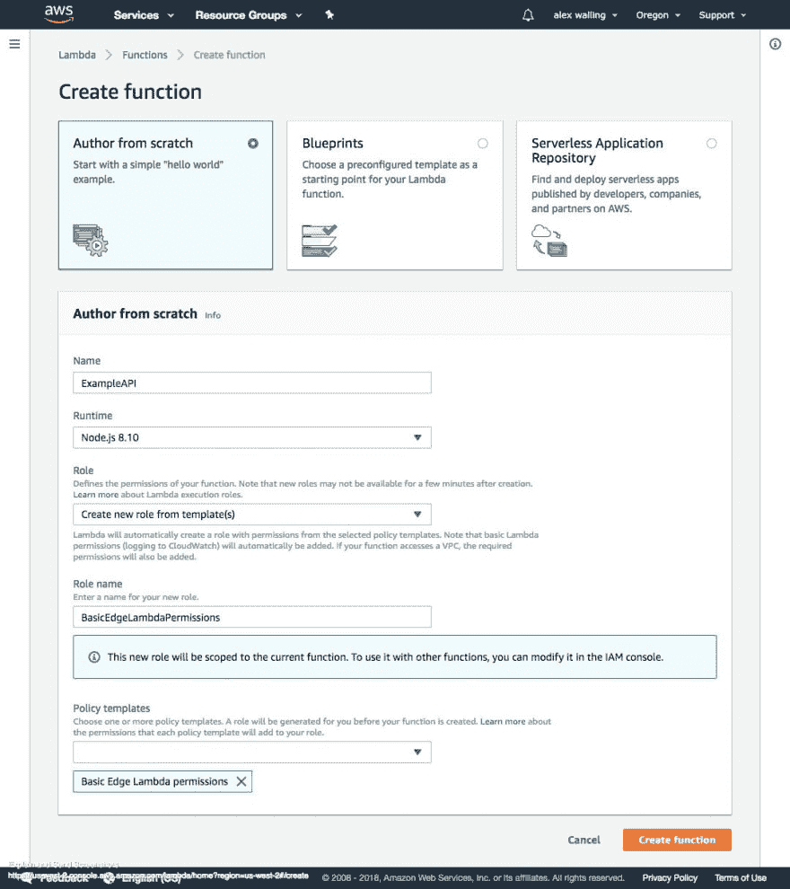
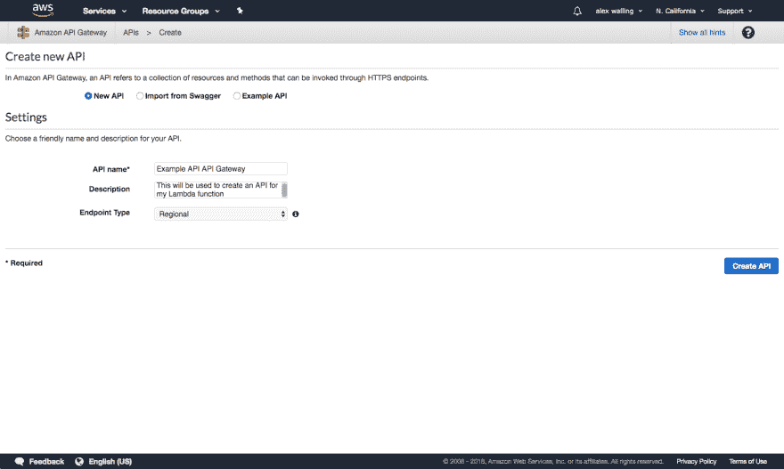
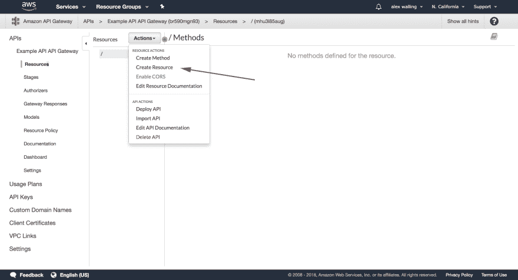
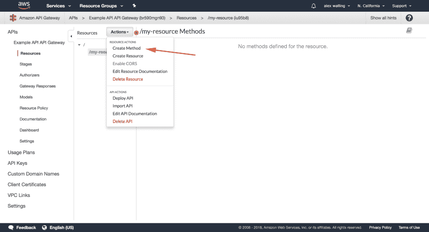
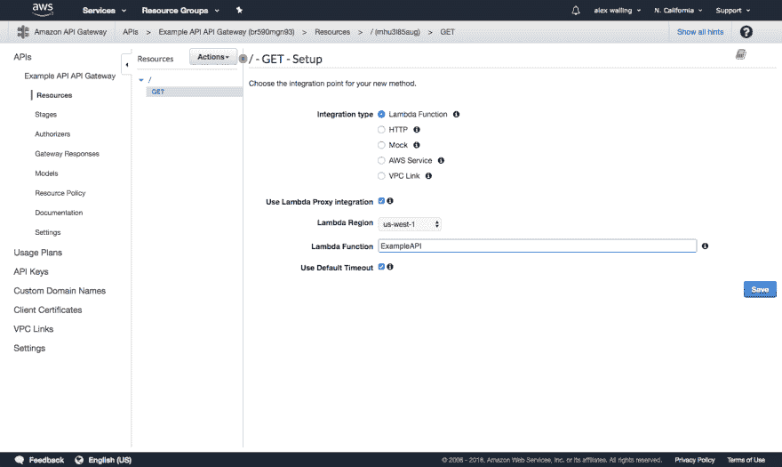
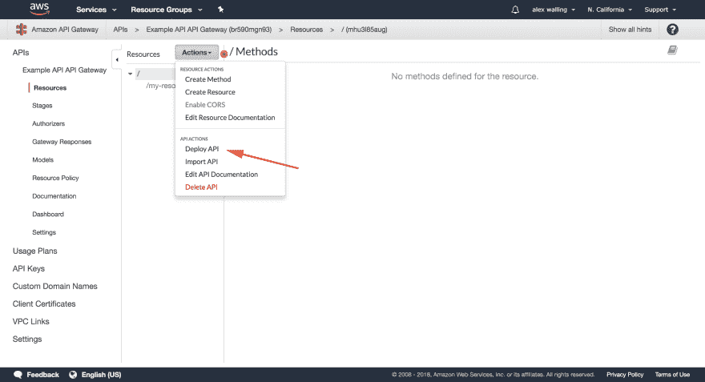
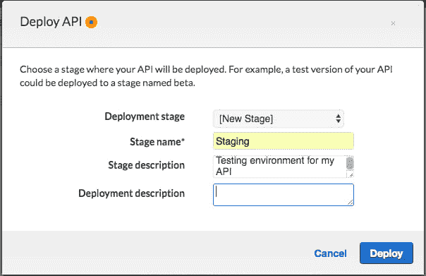
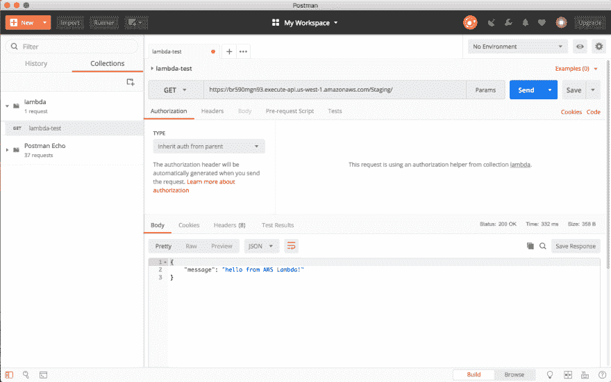

# 使用 AWS Lambda 和 RapidAPI 创建 API 教程]

> 原文:[https://dev . to/Alex walling/creating-an-API-with-AWS-lambda-and-rapidapi-tutorial-3a1e](https://dev.to/alexwalling/creating-an-api-with-aws-lambda-and-rapidapi-tutorial-3a1e)

最近，我对无服务器技术和各种理想的用例非常感兴趣。我有一个项目，这将是它的一个完美的用例，所以我决定深入了解 AWS Lambda！

不幸的是，当我开始着手这个项目时，我找不到太多好的、最新的、关于如何使用 AWS Lambda 和 API Gateway 创建 API 的资源。在了解了如何做到这一点的来龙去脉后，我决定为其他也想学习的人写一篇自己的博客。

## [](#creating-the-lambda-function)创建 Lambda 函数

首先登录 AWS 控制台，导航到 [Lambda 页面](https://us-west-1.console.aws.amazon.com/lambda/home)，创建一个新的 Lambda 函数。对于 Lambda 函数的“角色”,我建议您从模板创建一个新角色，并使用基本的 Edge Lambda 权限模板。如果你的 API 需要写 S3 或者做任何更复杂的操作，你可能需要授予你的 Lambda 函数更多的权限。为了学习更多关于 Lambda 函数权限的知识，这里有一个来自亚马逊的[有趣的文档。](https://docs.aws.amazon.com/lambda/latest/dg/intro-permission-model.html)

[T2】](https://res.cloudinary.com/practicaldev/image/fetch/s--HlCC9szn--/c_limit%2Cf_auto%2Cfl_progressive%2Cq_auto%2Cw_880/https://i.imgur.com/AR5LAD7.jpg)

API 的最基本版本是这样一个 API，它简单地允许您调用 API 并返回一个 200 响应，其主体为“hello from AWS Lambda！”为了用 Lambda 函数实现这一功能，您需要输入以下代码:

```
exports.handler = (event, context, callback) => {
    var responseBody = {
        message: "hello from AWS Lambda!"
    };
    callback(null, {
        statusCode: 200,
        headers: { "x-custom-header" : "my custom header value" },
        body: JSON.stringify(responseBody)
    });
}; 
```

这是非常简单的代码，其中使用了函数成功执行的回调参数结果。其中包括状态代码 200 以及标题和正文。所有这些信息都将作为对首先调用 API 的代码的响应发送出去。

### [](#parsing-params-and-headers-in-lambda-function)解析 Lambda 函数中的参数和头

对于一些 API 请求，可能会向您的 API 发送参数或标头来更改 API 的功能。如果这是您想要构建的 API 的情况，那么您将需要通过 event 参数访问头和参数。你可以使用下面的代码来访问这些变量:

```
let parameter = event['queryStringParameters']['name_of_parameter'];
let header = event['headers']['name_of_header'];

// OR

let paramter2 = event.queryStringParameters.name_of_parameter_one;
let header2 = event.headers.name_of_header_one; 
```

## [](#creating-the-api-gateway)创建 API 网关

现在您已经有了 Lambda 函数的代码，您需要设置 [API 网关](https://blog.rapidapi.com/api-glossary/api-gateway/)，它将启动 Lambda 代码。转到 [AWS API 网关](https://us-west-2.console.aws.amazon.com/apigateway/home)页面并创建一个新的 API。

[T2】](https://res.cloudinary.com/practicaldev/image/fetch/s--AfuRWb6e--/c_limit%2Cf_auto%2Cfl_progressive%2Cq_auto%2Cw_880/https://i.imgur.com/ZC3j3NK.png)

一旦创建了 API，就需要开始定义 API 的规范。

### [](#proxy-api-vs-defined-api)代理 API 与定义的 API

有两种不同的方法来设置你的 API，每一种都有它自己的好处。这两种类型是“代理资源”和“完全定义的 API”

#### [](#proxy-api)代理 API

定义新资源时，您可以选择将其配置为代理资源。

这意味着你的 API 网关将把每一个包含你的基本 URL 的 HTTP 请求路由到你的 Lambda 集成，然后你的 Lambda 集成将处理不同类型的请求。

假设您的基本 URL 是[https://api.myapi.com/](https://api.myapi.com/)，然后您有一个对 https://api.myapi.com/hello[的 GET 请求和对 https://api.myapi.com/goodbye](https://api.myapi.com/hello)[的 POST 请求](https://api.myapi.com/goodbye)。尽管这些都是针对不同资源的不同 HTTP 方法，但是当使用代理资源集成时，您的 lambda 函数将针对这两个请求执行。

这种设置的好处是，您可以将多条路径路由到同一个 Lambda 集成。如果您已经以这种方式建立了代码库，那么这将是一种开始使用无服务器技术的简单方法，而不必完全重构您的代码。

尽管如此，你还是应该知道一些不好的方面。这些缺点包括:

*   Lambda 函数的代码会很大，因为你必须处理代码中的所有逻辑路径。
*   您需要付费运行 Lambda 函数中的路由，而不是让 API 网关为您完成。
*   你没有利用 API gateway 的很多特性，比如 API 文档。

##### [](#parsing-different-endpoints-within-the-same-lambda-function)解析同一 Lambda 函数内的不同端点

如果您最终使用代理集成特性，那么您需要自己的逻辑以不同的方式处理每个端点。您将访问 API 请求路径信息，访问方式与访问头和参数信息的方式类似。这样做的代码是:

```
let nameOfPath = event['path'];

// OR

let nameOfPath2 = event.path; 
```

如果选择这个选项，您可能希望使用 if 语句来处理每个不同的可用路径，并使用一个无所不包的 else 语句来处理任何未定义的 API 端点。这可能是这样的:

```
exports.handler = (event, context, callback) => {
    if (event.path === '/hello') {
        callback(null, {
            statusCode: 200,
            body: JSON.stringify({message: 'hello'})
        });
    } else if (event.path === '/goodbye') {
        callback(null, {
            statusCode: 200,
            body: JSON.stringify({message: 'goodbye'})
        });
    } else {
        callback(null, {
            statusCode: 404
        }); 
    }
} 
```

#### [](#fully-defined-api)完全定义的 API

另一个选择是在 API 网关中定义每个 API 端点。这将允许您将能够被调用的端点限制为您定义的端点。您还可以为每个端点使用不同的 Lambda 函数。

我决定添加一个名为“/my-resource”的新资源

[T2】](https://res.cloudinary.com/practicaldev/image/fetch/s--M5A5oIgD--/c_limit%2Cf_auto%2Cfl_progressive%2Cq_auto%2Cw_880/https://i.imgur.com/Xgn1Cak.png)

当定义资源时，您只需要输入资源名称和资源路径。因为我们没有使用代理资源，所以您可以不选中它。

[T2】](https://res.cloudinary.com/practicaldev/image/fetch/s--9D5MqphA--/c_limit%2Cf_auto%2Cfl_progressive%2Cq_auto%2Cw_880/https://i.imgur.com/tcYfmIo.png)

创建完资源后，您将需要为该资源创建一个方法。

[T2】](https://res.cloudinary.com/practicaldev/image/fetch/s--zV-eiqyK--/c_limit%2Cf_auto%2Cfl_progressive%2Cq_auto%2Cw_880/https://i.imgur.com/bFhaL7Z.png)

我选择对我的/我的资源端点使用 GET 请求。

当创建一个新方法时，确保使用 Lambda 代理集成。这允许参数和头被发送到你的 Lambda 函数。当这个端点被调用时，您还需要选择想要激活的 Lambda 函数。

[T2】](https://res.cloudinary.com/practicaldev/image/fetch/s--P9Lmogaz--/c_limit%2Cf_auto%2Cfl_progressive%2Cq_auto%2Cw_880/https://i.imgur.com/6lPTVj4.png)

一旦定义了所有的 API 端点，就需要部署 API 了。

[T2】](https://res.cloudinary.com/practicaldev/image/fetch/s--Yx2EDkm_--/c_limit%2Cf_auto%2Cfl_progressive%2Cq_auto%2Cw_880/https://i.imgur.com/Pq1MAVQ.png)

部署时，您必须创建一个新的阶段来部署您的 API。我已经决定把我的命名为 Staging，因为我还在开发阶段，但是你可以随意命名你的 API stage。

[T2】](https://res.cloudinary.com/practicaldev/image/fetch/s--BOVlQ34l--/c_limit%2Cf_auto%2Cfl_progressive%2Cq_auto%2Cw_880/https://i.imgur.com/Sj5YLo8.png)

部署完 API 后，您应该会看到一个“调用 URL ”,这是您将用来调用 API 的 URL。调用 API 的格式将是您的 Invoke URL 后跟您的资源名称:[https://QA 397 wgn 73 . execute-API . us-west-1 . Amazon AWS . com/Staging/my-resource](https://qa397wgn73.execute-api.us-west-1.amazonaws.com/Staging/my-resource)

## [](#making-your-first-request)提出你的第一个请求

现在，您可以向 API 的基本 URL 发出 GET 请求，如下所示:

[T2】](https://res.cloudinary.com/practicaldev/image/fetch/s--33XxsAXs--/c_limit%2Cf_auto%2Cfl_progressive%2Cq_auto%2Cw_880/https://i.imgur.com/aabSShN.png)

## [](#adding-api-key-authentication-with-rapidapi)用 RapidAPI 添加 API 密钥认证

认证请求的一种方法是通过 API 网关并在那里设置新的 API 密钥。这很容易做到，但是如果你想让其他开发人员使用这个 API，那么就很难生成新的 API 键并管理你拥有的所有不同的活动 API 键。您还必须考虑是否要对 API 的使用收费，这就涉及到处理付款和开发票。

一款名为 [RapidAPI](https://rapidapi.com/) 的工具是为您进行用户管理、API 密钥生成、分析和计费的绝佳工具。

首先，您需要登录到 [RapidAPI](https://rapidapi.com/) 。一旦你创建了一个账户，你就可以阅读我们关于[添加和管理你的 API](https://docs.rapidapi.com/docs/getting-started) 的文档。这将详细说明您希望如何将 API 添加到 RapidAPI marketplace。基本步骤是:

1.  创建并命名您的 API
2.  添加 API 的基本 URL
    *   这将是来自 AWS API 网关的调用 URL。
3.  记录 API 可用的所有端点
    *   这将是您为 API 定义的所有资源和方法。

既然您的 API 已经通过 RapidAPI 进行了记录，那么您就可以设置[认证](https://blog.rapidapi.com/api-glossary/api-authentication/)了。

RapidAPI 的美妙之处在于，我们为您处理所有用户管理和计费！这意味着，只要您根据您希望允许开发人员访问 API 的方式设置了[定价计划](https://docs.rapidapi.com/docs/pricing-your-api-1)和 API 访问，那么您所要做的就是在您的代码中验证请求是否来自 RapidAPI。由于我们会在 API 请求发送到您的系统之前进行所有身份验证，因此您可以允许来自 RapidAPI 系统的任何请求成功调用您的 API。

最简单的方法是使用我们的 [secret 隐藏头](https://docs.rapidapi.com/docs/headers-sent-by-mashape-proxy)称为“X-RapidAPI-Proxy-Secret ”,这是一个独特的密钥，随每个 API 请求发送到您的系统。使用您的 API 的开发人员将永远看不到这个密钥，而且这个密钥对于每个 API 都是唯一的。要找到您的 X-RapidAPI-Proxy-Secret，请转到 [RapidAPI 提供者仪表板](//provider.rapidapi.com)中的 API 设置页面。

要使用这个密钥对来自 RapidAPI 的请求进行身份验证，您只需在请求进来时快速检查一下，看看 X-RapidAPI-Proxy 头是否存在，是否与您的惟一密钥匹配。下面是这样做的代码:

```
exports.handler = (event, context, callback) => {
    if(event['headers']['X-RapidAPI-Proxy-Secret'] != '*******************') {
        callback(null, {
            statusCode: 401,
            body: JSON.stringify({message: 'Unauthorized'})
        });
    } else {
        // You API logic goes here
        let name = event['queryStringParameters']['name'];

        var responseBody = {
            message: "hello " + name + "!"
        };
        callback(null, {
            statusCode: 200,
            body: JSON.stringify(responseBody)
        });
    }
} 
```

除了轻松添加用户身份验证和 API 密钥管理之外，您还可以自动向我们的大型开发人员社区公开您的 API，他们会很高兴使用您的出色 API！如果你把你的 API 发布并在市场上运行，我们很乐意听到它的全部内容！欢迎发送电子邮件至 community@rapidapi.com，让我们了解您在 RapidAPI 上添加的任何 API 或您正在通过 RapidAPI 使用 API 的项目。