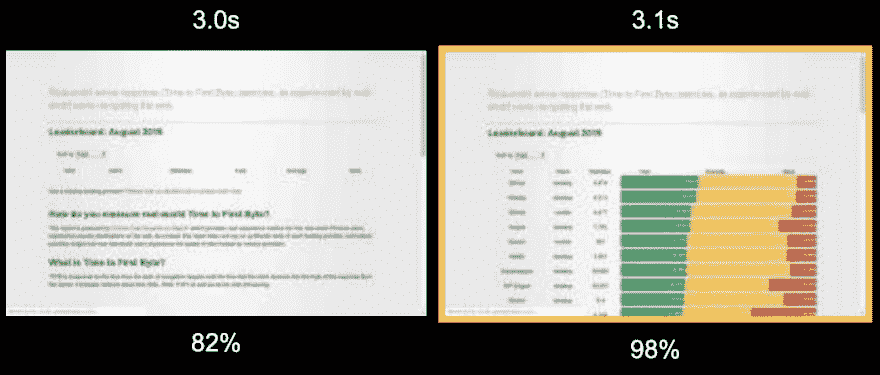
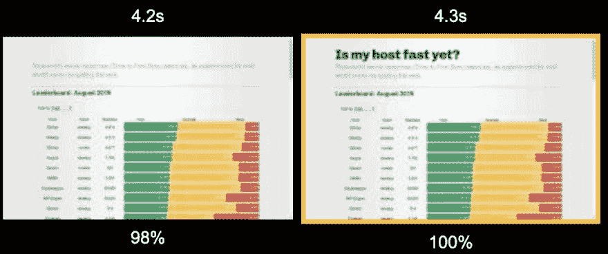
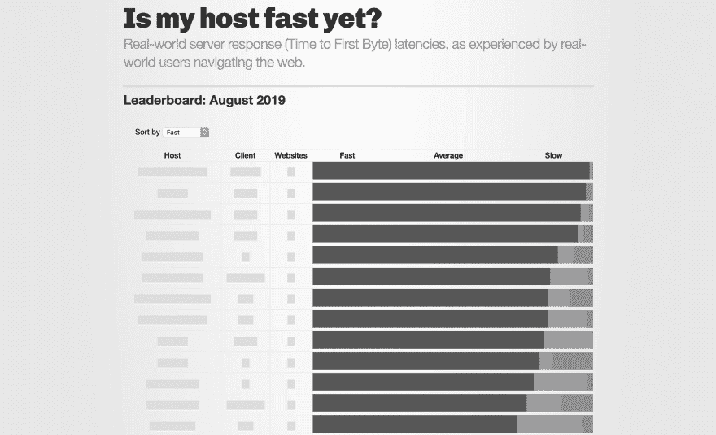
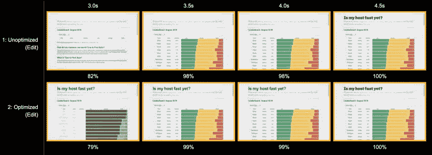

# 修复布局不稳定性

> 原文：<https://dev.to/chromiumdev/fixing-layout-instability-176c>

在之前的一篇文章中，我在 WebPageTest 中写了关于[测量累积布局偏移](https://dev.to/chromiumdev/measuring-cumulative-layout-shift-cls-in-webpagetest-5cle) (CLS)的内容。CLS 是所有布局变化的集合，所以在这篇文章中，我认为深入研究并检查页面上的每个布局变化会很有趣，以试图了解是什么导致了不稳定并实际尝试修复问题。

## 测量布置班次

使用布局不稳定性 API，我们可以得到一个页面上所有布局移位事件的列表:

```
new Promise(resolve => {
  new PerformanceObserver(list => {
    resolve(list.getEntries().filter(entry => !entry.hadRecentInput));
  }).observe({type: "layout-shift", buffered: true});
}).then(console.log); 
```

<svg width="20px" height="20px" viewBox="0 0 24 24" class="highlight-action crayons-icon highlight-action--fullscreen-on"><title>Enter fullscreen mode</title></svg> <svg width="20px" height="20px" viewBox="0 0 24 24" class="highlight-action crayons-icon highlight-action--fullscreen-off"><title>Exit fullscreen mode</title></svg>

这将产生一个布局移动数组，其前面没有输入事件:

```
[  {  "name":  "",  "entryType":  "layout-shift",  "startTime":  210.78500000294298,  "duration":  0,  "value":  0.0001045969445437389,  "hadRecentInput":  false,  "lastInputTime":  0  }  ] 
```

<svg width="20px" height="20px" viewBox="0 0 24 24" class="highlight-action crayons-icon highlight-action--fullscreen-on"><title>Enter fullscreen mode</title></svg> <svg width="20px" height="20px" viewBox="0 0 24 24" class="highlight-action crayons-icon highlight-action--fullscreen-off"><title>Exit fullscreen mode</title></svg>

在本例中，在 210 毫秒时有 0.01%的微小偏移。

了解移动的时间和严重性有助于缩小导致移动的原因范围。让我们回到 [WebPageTest](https://webpagetest.org) 的实验室环境来做更多的测试。

## 测量网页测试中的布局偏移

类似于在 WebPageTest 中测量 CLS，测量单个布局偏移将需要一个定制的度量。幸运的是，现在 Chrome 77 稳定了，这个过程就容易多了。默认情况下，布局不稳定性 API 是启用的，因此您应该能够在 Chrome 77 内的任何网站上执行该 JS 片段，并立即获得结果。在 WebPageTest 中，您可以使用默认的 Chrome 浏览器，而不必担心命令行标志或使用 Canary。

因此，让我们修改脚本，为 WebPageTest:
生成一个自定义指标

```
[LayoutShifts]
return new Promise(resolve => {
  new PerformanceObserver(list => {
    resolve(JSON.stringify(list.getEntries().filter(entry => !entry.hadRecentInput)));
  }).observe({type: "layout-shift", buffered: true});
}); 
```

<svg width="20px" height="20px" viewBox="0 0 24 24" class="highlight-action crayons-icon highlight-action--fullscreen-on"><title>Enter fullscreen mode</title></svg> <svg width="20px" height="20px" viewBox="0 0 24 24" class="highlight-action crayons-icon highlight-action--fullscreen-off"><title>Exit fullscreen mode</title></svg>

这个脚本中的承诺解析为数组的 JSON 表示，而不是数组本身。这是因为自定义指标只能产生像字符串或数字这样的原始数据类型。

我将用于测试的网站是[ismyhostfastyet.com](https://ismyhostfastyet.com/)，这个网站是我为了比较真实世界中网络主机的负载性能而建立的。

## 识别布局不稳定的原因

在[结果](http://webpagetest.org/custom_metrics.php?test=190918_6E_ef3c166b4a34033171d47e389cf82939&run=5&cached=0)中，我们可以看到 LayoutShifts 自定义指标具有这个值:

```
[  {  "name":  "",  "entryType":  "layout-shift",  "startTime":  3087.2349999990547,  "duration":  0,  "value":  0.3422101449275362,  "hadRecentInput":  false,  "lastInputTime":  0  }  ] 
```

<svg width="20px" height="20px" viewBox="0 0 24 24" class="highlight-action crayons-icon highlight-action--fullscreen-on"><title>Enter fullscreen mode</title></svg> <svg width="20px" height="20px" viewBox="0 0 24 24" class="highlight-action crayons-icon highlight-action--fullscreen-off"><title>Exit fullscreen mode</title></svg>

总而言之，在 3087 毫秒发生了 34.2%的单个布局偏移。为了帮助识别罪魁祸首，让我们使用 WebPageTest 的[幻灯片视图](http://webpagetest.org/video/compare.php?tests=190918_6E_ef3c166b4a34033171d47e389cf82939-r%3A5-c%3A0&thumbSize=200&ival=100&end=visual)。

[](https://res.cloudinary.com/practicaldev/image/fetch/s--oy-e3Fr0--/c_limit%2Cf_auto%2Cfl_progressive%2Cq_auto%2Cw_880/https://thepracticaldev.s3.amazonaws.com/i/arg61baxb690dbn38pqc.png)

滚动到电影胶片中大约 3 秒钟的标记向我们展示了 34%布局偏移的确切原因:彩色表格。构建网站的方式是异步获取一个 JSON 文件，然后将其呈现到一个表中。该表最初是空的，所以在加载结果时等待填充会导致移位。

[](https://res.cloudinary.com/practicaldev/image/fetch/s--xk-7ua-C--/c_limit%2Cf_auto%2Cfl_progressive%2Cq_auto%2Cw_880/https://thepracticaldev.s3.amazonaws.com/i/8oabdvlzekzq5srtvoa9.png)

但这还不是全部。当页面以大约 4.3 秒的速度完成时，我们可以看到页面的`<h1>`“我的主机运行得够快了吗？”不知从哪里冒出来的。发生这种情况是因为该网站使用网络字体，并且没有采取任何措施来优化渲染。当这种情况发生时，布局实际上并没有发生变化，但要等这么长时间才能阅读标题仍然是一种糟糕的用户体验。

## 修复布局不稳

现在我们知道异步生成的表导致了三分之一的视口移动，是时候修复它了。在 JSON 结果被实际加载之前，我们不知道表的内容，但是我们仍然可以用某种类型的*占位符数据*填充表，以便在呈现 DOM 时布局本身相对稳定。

下面是生成占位符数据的代码:

```
function getRandomFiller(maxLength) {
  var filler = '█';
  var len = Math.ceil(Math.random() * maxLength);
  return new Array(len).fill(filler).join('');
}

function getRandomDistribution() {
  var fast = Math.random();
  var avg = (1 - fast) * Math.random();
  var slow = 1 - (fast + avg);
  return [fast, avg, slow];
}

// Temporary placeholder data.
window.data = [];
for (var i = 0; i < 36; i++) {
  var [fast, avg, slow] = getRandomDistribution();
  window.data.push({
    platform: getRandomFiller(10),
    client: getRandomFiller(5),
    n: getRandomFiller(1),
    fast,
    avg,
    slow
  });
}
updateResultsTable(sortResults(window.data, 'fast')); 
```

<svg width="20px" height="20px" viewBox="0 0 24 24" class="highlight-action crayons-icon highlight-action--fullscreen-on"><title>Enter fullscreen mode</title></svg> <svg width="20px" height="20px" viewBox="0 0 24 24" class="highlight-action crayons-icon highlight-action--fullscreen-off"><title>Exit fullscreen mode</title></svg>

占位符数据在排序前随机生成。它包括重复随机次数的“█”字符，以创建文本的可视占位符，以及三个主要值的随机生成分布。我还添加了一些样式来降低表中所有颜色的饱和度，以清楚地表明数据尚未完全加载。

你使用的占位符的外观对于布局稳定性来说并不重要，因为它们可以向用户保证内容*即将到来并且页面不会被破坏。*

以下是 JSON 数据加载时占位符的样子:

[](https://res.cloudinary.com/practicaldev/image/fetch/s--7B1mW3fs--/c_limit%2Cf_auto%2Cfl_progressive%2Cq_auto%2Cw_880/https://thepracticaldev.s3.amazonaws.com/i/4t7x6h3ibkgpmr1pxgy1.png)

解决网络字体问题要简单得多。因为站点使用 Google 字体，我们只需要在 CSS 请求中传递`display=swap`属性。仅此而已。Fonts API 将在字体声明中添加`display: swap`样式，使浏览器能够立即以备用字体呈现文本。下面是包含修复的相应标记:

```
<link href="https://fonts.googleapis.com/css?family=Chivo:900&display=swap" rel="stylesheet"> 
```

<svg width="20px" height="20px" viewBox="0 0 24 24" class="highlight-action crayons-icon highlight-action--fullscreen-on"><title>Enter fullscreen mode</title></svg> <svg width="20px" height="20px" viewBox="0 0 24 24" class="highlight-action crayons-icon highlight-action--fullscreen-off"><title>Exit fullscreen mode</title></svg>

## 验证优化

通过 WebPageTest 重新运行页面后，我们可以生成一个前后[比较](http://webpagetest.org/video/compare.php?tests=190918_6E_ef3c166b4a34033171d47e389cf82939%2C190918_WF_60f9c9a1c669b20039860c09ca27df7c&thumbSize=200&ival=100&end=visual)来可视化差异，并测量新的布局不稳定程度:

[](https://res.cloudinary.com/practicaldev/image/fetch/s--AzQ_n78C--/c_limit%2Cf_auto%2Cfl_progressive%2Cq_auto%2Cw_880/https://thepracticaldev.s3.amazonaws.com/i/e23be8b4l6094cstdzgn.png)T3】

```
[  {  "name":  "",  "entryType":  "layout-shift",  "startTime":  3070.9349999997357,  "duration":  0,  "value":  0.000050272187989256116,  "hadRecentInput":  false,  "lastInputTime":  0  }  ] 
```

<svg width="20px" height="20px" viewBox="0 0 24 24" class="highlight-action crayons-icon highlight-action--fullscreen-on"><title>Enter fullscreen mode</title></svg> <svg width="20px" height="20px" viewBox="0 0 24 24" class="highlight-action crayons-icon highlight-action--fullscreen-off"><title>Exit fullscreen mode</title></svg>

根据[自定义指标](http://webpagetest.org/custom_metrics.php?test=190918_WF_60f9c9a1c669b20039860c09ca27df7c&run=9&cached=0)，在 3071 毫秒时仍有布局偏移发生(大约与之前相同的时间)，但是偏移的严重程度*小得多*:0.005%。我可以忍受。

从幻灯片中也可以清楚地看到,`<h1>`字体立即回落到系统字体，使用户能够更快地阅读它。

## 结论

复杂的网站可能会经历比这个例子更多的布局变化，但补救过程仍然是相同的:向 WebPageTest 添加布局不稳定性指标，交叉引用结果与视觉加载电影胶片以识别问题，并使用占位符实施修复以保留屏幕空间。

### (还有一件事)

能够在优化前后在页面上运行 WebPageTest 并看到指标的改进是很好的，但真正重要的是用户体验实际上正在变得更好。这不正是我们最初努力让网站变得更好的原因吗？

因此，如果我们开始测量真实用户的布局不稳定性体验以及我们传统的 web 性能指标，那将是一件好事。这是优化反馈循环的一个关键部分，因为拥有来自现场的数据可以告诉我们问题在哪里，以及我们的修复是否产生了积极的影响。

除了收集你自己的布局不稳定性数据，查看一下 [Chrome UX 报告](https://twitter.com/ChromeUXReport/status/1138555303379816448)，其中包括来自数百万网站真实用户体验的累积布局偏移数据。它可以让你发现你(或你的竞争对手)的表现，或者你可以用它来探索整个网页布局的不稳定性。