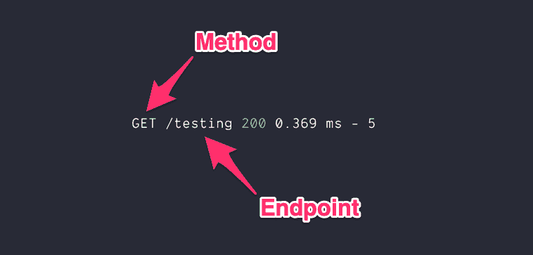

# 三个有用的 Express 中间件

> 原文:[https://dev.to/zellwk/three-useful-express-middleware-1di](https://dev.to/zellwk/three-useful-express-middleware-1di)

当我用 Express 和 Node 创建应用程序时，我了解了三个有用的中间件:

1.  摩根
2.  茶包
3.  删除空属性

在这三者中，Morgan 是一个真正的中间件。可以直接从 npm 下载[摩根](https://www.npmjs.com/package/morgan)。另外两个是我分别用[茶包钥匙](https://www.npmjs.com/package/camelcase-keys)和[省略空钥匙](https://www.npmjs.com/package/omit-empty)创建的中间件。

我想分享这三个中间件的作用，以及当我创建应用程序时，它们是如何让我的生活变得更简单的。

## [](#morgan4)摩根 4

摩根是一个请求记录者。当您的服务器收到请求时，它会告诉您一些事情。它可以记录如下内容:

*   日期
*   HTTP 版本
*   方法
*   推荐人
*   远程地址
*   远程用户
*   请求标题
*   响应标题
*   响应时间
*   状态代码
*   请求的 Url
*   用户代理人

Morgan 提供了五种预定义的格式供您选择:

1.  联合的；共同的
2.  普通的
3.  短的
4.  偏差
5.  微小的

我只用`dev`格式。来自摩根的一条`dev`日志如下所示:

[T2】](https://res.cloudinary.com/practicaldev/image/fetch/s--wIZFLwir--/c_limit%2Cf_auto%2Cfl_progressive%2Cq_auto%2Cw_880/https://zellwk.cimg/2019/express-middlewares/200.png)

我用摩根来检查两件事:

1.  方法和端点
2.  状态代码

### [](#checking-the-method-and-endpoint)检查方法和终点

当您编写后端代码时，您需要确保使用正确的方法和端点发送请求。如果方法或端点是错误的，您将无法触发您期望触发的请求处理程序。

例如，如果您想在下面的代码中触发`requestHandler`，您需要向`/testing`端点发送一个`GET`请求。

```
app.get("/testing", requestHandler); 
```

如果我编写后端应用程序时出错，我首先会检查我是否发送了正确的方法和端点。首先检查这一点可以帮助我节省大量的调试时间。

当我向服务器发送请求时，我从 Morgan 那里得到一个日志。这个日志告诉我方法和端点。第一个值是方法。第二个值是端点。

[T2】](https://res.cloudinary.com/practicaldev/image/fetch/s--WKOxCEz2--/c_limit%2Cf_auto%2Cfl_progressive%2Cq_auto%2Cw_880/https://zellwk.cimg/2019/express-middlewares/breakdown.png)

### [](#checking-status-codes)检查状态代码

因为后端是关于[通信](https://zellwk.com/blog/frontend-vs-backend)的，所以我想确保我将正确的状态代码发送回前端。如果用户试图使用不正确的用户名或密码登录，我想发送 401 未授权错误，而不是 500 内部服务器错误。

关于`dev`格式最好的部分是它用不同的颜色显示状态代码。这使得状态代码更容易被发现。

200+状态代码为绿色:

[T2】](https://res.cloudinary.com/practicaldev/image/fetch/s--wIZFLwir--/c_limit%2Cf_auto%2Cfl_progressive%2Cq_auto%2Cw_880/https://zellwk.cimg/2019/express-middlewares/200.png)

300+状态代码为青色:

[T2】](https://res.cloudinary.com/practicaldev/image/fetch/s--gH7556N3--/c_limit%2Cf_auto%2Cfl_progressive%2Cq_auto%2Cw_880/https://zellwk.cimg/2019/express-middlewares/300.png)

400+状态代码为黄色:

[T2】](https://res.cloudinary.com/practicaldev/image/fetch/s--OMUiClc5--/c_limit%2Cf_auto%2Cfl_progressive%2Cq_auto%2Cw_880/https://zellwk.cimg/2019/express-middlewares/400.png)

500+状态代码为红色:

[T2】](https://res.cloudinary.com/practicaldev/image/fetch/s--vviITIsa--/c_limit%2Cf_auto%2Cfl_progressive%2Cq_auto%2Cw_880/https://zellwk.cimg/2019/express-middlewares/500.png)

## [](#camelcase)茶包

假设您想从表单中获取用户的名字。为此，在 HTML 中需要一个`<form>`。`<form>`应该包含一个带有`first-name`的`name`的`<input>`。

```
<form>
  <input name="first-name" />
</form> 
```

要在后端接收`first-name`，需要使用括号符号。这是因为`-`在 JavaScript 中是一个操作符。它不被识别为连字符。

```
app.get("/endpoint", (req, res) => {
  // Bracket notation to get the value of a property
  const firstName = req.body["first-name"];
}); 
```

我不喜欢使用括号符号。我更喜欢尽可能使用点符号。

```
app.get("/endpoint", (req, res) => {
  // Dot notation
  const firstName = req.body.firstName;
}); 
```

我更喜欢点符号，因为我在任何地方都使用它。我习惯用 JavaScript 写 camel case。如果我不使用点符号，感觉很奇怪。另外，如果我可以使用点符号，我可以析构这个属性。

```
app.get("/endpoint", (req, res) => {
  const { firstName } = req.body;
}); 
```

为了使用点符号，我需要确保`<input>`元素中的`name`属性是用 camel case 编写的。

```
<input name="firstName"> 
```

但是这感觉很奇怪，因为我们通常不会在 HTML 中使用 camel case！我们用连字符分隔单词！

```
<!-- This feels weird -->
<input name="firstName" />

<!-- This feels normal -->
<input name="first-name" /> 
```

我的解决方案是在它到达我的请求处理器之前将所有属性转换成 camel case。我用一个我用辛德雷·索胡斯的[came case-keys](https://www.npmjs.com/package/camelcase-keys)包做的中间件来做这个。

```
const camelcaseKeys = require("camelcase-keys");

const camelcase = () => {
  return function(req, res, next) {
    req.body = camelcaseKeys(req.body, { deep: true });
    req.params = camelcaseKeys(req.params);
    req.query = camelcaseKeys(req.query);
    next();
  };
}; 
```

你可以这样使用中间件:

```
app.use(camelcase()); 
```

有了`camelcase`，你就不用担心`first name`、`first_name`、`first-name`或者`FirstName`了。永远都是`firstName`。

不管你是来自`req.body`、`req.params`还是`req.query`都没关系。所有财产将在骆驼的情况下。

## [](#remove-empty-properties)清除空属性

让我们想象一种情况，你期望一系列的技能。

```
fetch('/endpoint', {
  method: 'post',
  headers: { 'Content-Type': 'application/json' }
  body: JSON.stringify({
    name: 'Zell',
    skills: ['coding', 'designing', 'writing']
  })
} 
```

如果有一项或多项技能，您希望将这些技能添加到数据库中。

```
app.post("/endpoint", (req, res) => {
  const { skills } = req.body;

  if (skills.length !== 0) {
    // Add skills to database
  }
}); 
```

但是我们有一个问题。用户可以向您发送请求的变体:

1.  不包含`skills`属性
2.  包含空的`skills`属性
3.  包含至少有一项技能的`skills`属性

如果用户没有给你发送一个`skills`属性，你就不能写`skills.length`。你会得到一个写着`Cannot read property 'length' of undefined`的错误。

要正确检查一项或多项技能，您需要两个条件:

1.  检查是否有技能数组
2.  检查数组中是否至少有一项

```
app.post("/endpoint", (req, res) => {
  const { skills } = req.body;

  if (skills && skills.length !== 0) {
    // Add skills to database
  }
}); 
```

有一种方法可以简化这些检查。我的解决方案是用乔恩·施林克特的、T2 的【省略-清空】包创建一个中间件。

从对象中删除空属性。

```
const object = {
  null: null,
  undefined: undefined,
  emptyString: "",
  emptyArray: [],
  emptyObject: {},
  filled: "yay"
};

console.log(omitEmpty(object));
// {
//   filled: 'yay'
// } 
```

下面是我做的中间件:

```
const omitEmpty = require("omitEmpty");

const removeEmptyProperties = () => {
  return function(req, res, next) {
    req.body = omitEmpty(req.body);
    req.params = omitEmpty(req.params);
    req.query = omitEmpty(req.query);
    next();
  };
}; 
```

你可以这样使用`removeEmptyProperties`:

```
app.use(removeEmptyProperties()); 
```

一旦使用了`removeEmptyProperties`中间件，就不用检查`skills`的长度了。您可以确定`skills`包含一个或多个项目，如果它存在的话。

所以代码变成:

```
app.post("/endpoint", (req, res) => {
  const { skills } = req.body;

  if (skills) {
    // Add skills to database
  }
}); 
```

简单多了！

* * *

感谢阅读。这篇文章最初发表在我的博客上。如果你想要更多的文章来帮助你成为一个更好的前端开发者，请注册[我的时事通讯](https://zellwk.com)。