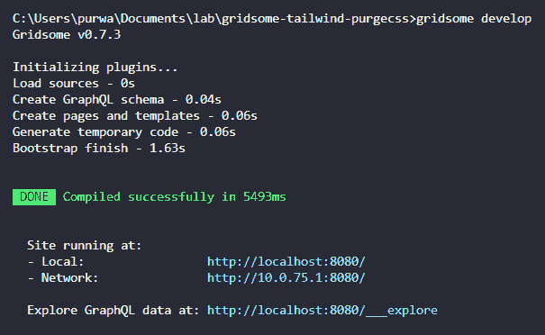
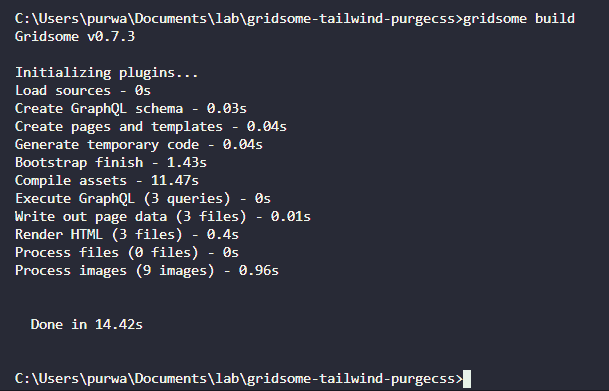

# 不使用插件使用 Gridsome 开始使用 Tailwindcss

> 原文：<https://dev.to/purwnt/getting-started-tailwindcss-with-gridsome-without-using-plugin-2la>

Tailwindcss 是一个新的 css 框架，以强大的思维开发 web 应用程序。当其他框架(Bootstrap、布尔玛等)专注于使用样板文件来制作一些 UI 时，Tailwind 更专注于实用优先 CSS 框架来快速构建定制设计。

这意味着我们不需要与来自其他 CSS 框架的 ui 样板进行斗争来进行定制设计，我们只需要使用一些可重用的类来设计我们的 web 组件，如`mt-4`用于页边距顶部，`shadow-xl`用于框阴影，`bg-red-500`用于红色背景。甚至为每个类定义一些屏幕大小的响应断点，这是非常强大的。

另一方面, [Gridsome](https://gridsome.org) 是一个基于 Vue.js 的静态站点生成器。自从 JAMstack 出现以来，静态站点生成器是我们如何开发和交付网站的后起之秀，尤其是登录页面或文档站点。

在这篇文章中，我们将尝试使用 Gridsome 来使用 Tailwindcss。我们将手动设置 Tailwind，而不是使用插件，以减少文件大小和其他依赖性。但是如果你想使用插件，你可以跳过这篇文章，到这里来([grid some-plugin-tairwindcss](https://gridsome.org/plugins/gridsome-plugin-tailwindcss))。

### **1。安装 Gridsome cli**

*   使用**纱线** : `yarn global add @gridsome/cli`
*   使用 **NPM** : `npm install --global @gridsome/cli`

### **2。创建新的 Gridsome 项目**

在你的机器上安装 gridsome-cli 之后，创建项目来生成样板文件，并开始开发你的网站。

*   `gridsome create my-gridsome-site`
*   `cd my-gridsome-site`

### **3。安装尾翼**

*   `npm i tailwindcss`

### **4。添加顺风配置文件**

要了解更多关于 Tailwind 配置文件的信息，请点击这里的[文档](https://tailwindcss.com/docs/configuration)

*   `npx tailwind init`
*   或将新文件`tailwind.config.js`添加到根文件夹

```
// tailwind.config.js
module.exports = {
  theme: {},
  variants: {},
  plugins: []
} 
```

Enter fullscreen mode Exit fullscreen mode

### **5。将顺风导入网格体**

*   在`assets/css`上创建新文件夹并添加新文件`global.css`

```
/* /src/assets/css/global.css */
@tailwind base;
@tailwind components;
@tailwind utilities; 
```

Enter fullscreen mode Exit fullscreen mode

*   然后在你的`main.js`文件中导入`global.css`。

```
// main.js
import "./assets/css/global.css"; 
```

Enter fullscreen mode Exit fullscreen mode

### **6。将 tailwindcss 添加到 gridsome 配置文件**

```
// gridsome.config.js

const tailwindcss = require("tailwindcss")

module.exports = {
  siteName: 'Gridsome',
  plugins: [],
  css: {
    loaderOptions: {
      postcss: {
        plugins: [
          tailwindcss
        ],
      },
    },
  }
} 
```

Enter fullscreen mode Exit fullscreen mode

完成，tailwindcss 已经在 gridsome 项目上设置好了。让我们尝试添加一些示例代码。

将下面的代码添加到索引文件`src/pages/Index.vue`

```
<div class="bg-indigo-900 text-center py-4 lg:px-4 mt-10">
  <div class="p-2 bg-indigo-800 items-center text-indigo-100 leading-none lg:rounded-full flex lg:inline-flex" role="alert">
    <span class="flex rounded-full bg-indigo-500 uppercase px-2 py-1 text-xs font-bold mr-3">New</span>
    <span class="font-semibold mr-2 text-left flex-auto">Get the coolest t-shirts from our brand new store</span>
    <path d="M12.95 10.707l.707-.707L8 4.343 6.586 5.757 10.828 10l-4.242 4.243L8 15.657l4.95-4.95z"/>
  </div>
</div>

<div class="bg-blue-100 border-t border-b border-blue-500 text-blue-700 px-4 py-3 mt-10" role="alert">
  <p class="font-bold">Informational message</p>
  <p class="text-sm">Some additional text to explain said message.</p>
</div>

<button class="bg-blue-500 hover:bg-blue-700 text-white font-bold py-2 px-4 rounded mt-10">
  Button
</button>

<button class="bg-white hover:bg-gray-100 text-gray-800 font-semibold py-2 px-4 border border-gray-400 rounded shadow ml-3">
  Button
</button> 
```

Enter fullscreen mode Exit fullscreen mode

使用命令`gridsome develop`启动开发服务器

[](https://res.cloudinary.com/practicaldev/image/fetch/s--YLSzXsTP--/c_limit%2Cf_auto%2Cfl_progressive%2Cq_auto%2Cw_880/https://thepracticaldev.s3.amazonaws.com/i/egyerkgk9s18kqo39zs5.PNG)

在浏览器上转到 [http://localhost:8080](http://localhost:8080) 并查看结果

[](https://res.cloudinary.com/practicaldev/image/fetch/s--nM-LUnvh--/c_limit%2Cf_auto%2Cfl_progressive%2Cq_auto%2Cw_880/https://thepracticaldev.s3.amazonaws.com/i/n044ur0slkonnpmgm9du.PNG)

对于生产，你需要运行 build `gridsome build`并将文件夹`dist`中的文件发送到你的网络服务器、亚马逊 S3 或谷歌云存储。

[](https://res.cloudinary.com/practicaldev/image/fetch/s--5h7yY_2F--/c_limit%2Cf_auto%2Cfl_progressive%2Cq_auto%2Cw_880/https://thepracticaldev.s3.amazonaws.com/i/2j7yecgype5v71vkpzx9.PNG)

这是我在 dev.to 上的第一篇文章，如果有错误，请告诉我。谢谢你。

**[源代码](https://github.com/purwnt/vue-gridsome-tailwindcss-example)**