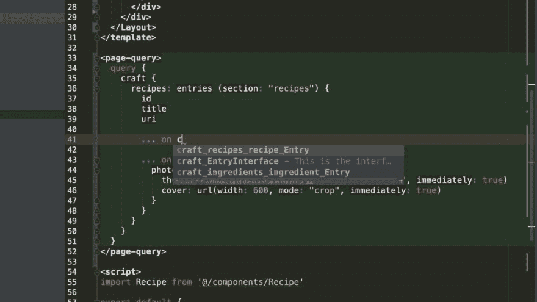
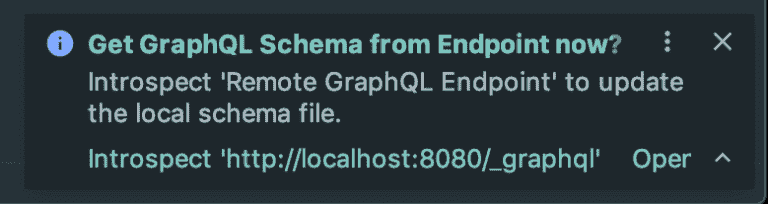
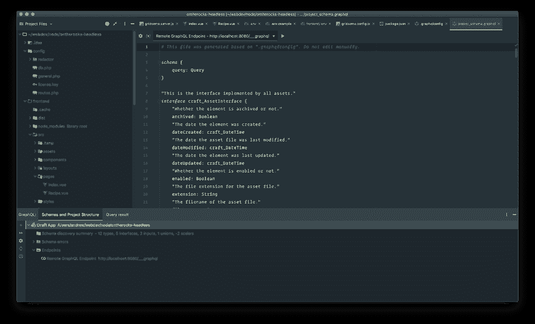
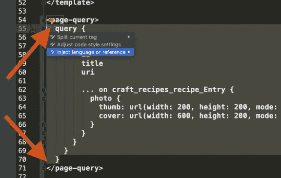
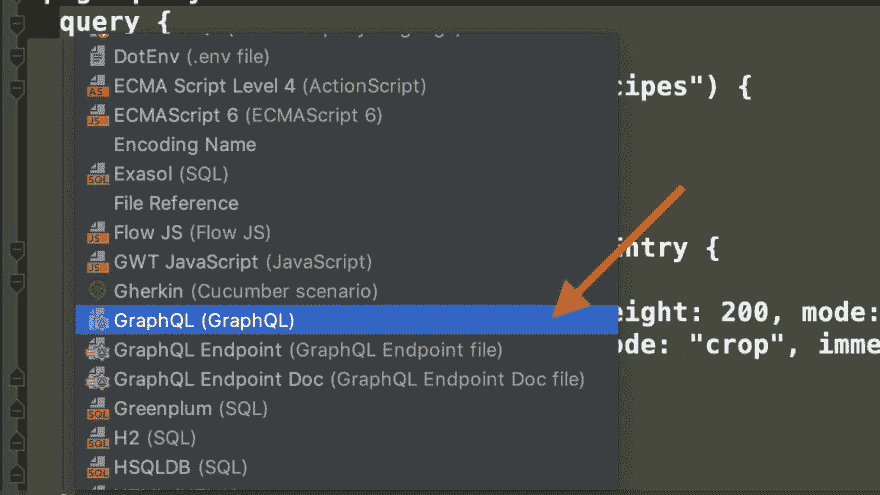
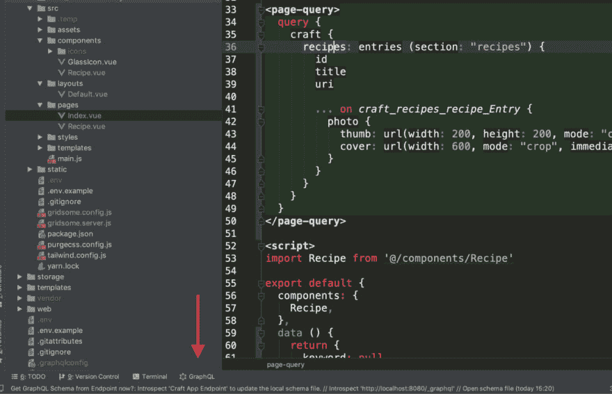

# 使用 PhpStorm 自动完成 GraphQL 模式

> 原文:[https://dev . to/gaijinity/graph QL-schema-auto-completion-with-PHP storm-512h](https://dev.to/gaijinity/graphql-schema-auto-completion-with-phpstorm-512h)

# [](#graphql-schema-autocompletion-with-phpstorm)用 PhpStorm 自动完成 GraphQL 模式

### JS GraphQL plu g 与 lit tle mag ic 相结合，将为您提供 PhpStorm 中 GraphQL 模式的完全自动编译和合成高亮显示

安德鲁·韦尔奇

[T2】](https://res.cloudinary.com/practicaldev/image/fetch/s--uOdtOD9c--/c_limit%2Cf_auto%2Cfl_progressive%2Cq_auto%2Cw_880/https://nystudio107-ems2qegf7x6qiqq.netdna-ssl.com/img/blog/_1200x675_crop_center-center_82_line/4085/graphql-auto-completion-phpstorm.jpg)

GraphQL 是一种最近越来越流行的查询语言，如果你正在使用 [Php Storm](https://www.jetbrains.com/phpstorm/) ，有一个叫做 [JS GraphQL](https://plugins.jetbrains.com/plugin/8097-js-graphql) 的流行插件会让你的体验更加愉快。

正确配置后，JS CraftQL 插件将为您提供:

*   Syn tax 突出显示 GraphQL 查询，甚至嵌入在 React 或 Vue 组件中
*   在 Php Storm 中自动编译您的 GraphQL 模式，就像在 GraphQL 或 GraphQL Playground 中一样
*   在框架中使用流行模式生成器的工作方式类似于通过或[网格点](https://gridsome.org/)或任何 GraphQL 端点使用 [Gats](https://www.gatsbyjs.org/)

…还有更多，但是如果您正在使用 GraphQL 做很多事情，这些特性本身就使它变得很有价值。

当你学习 GraphQL 的时候，这也是非常有用的。所以让我们来安装和配置它吧！

## [](#make-it-go)让它去吧

所以你需要做的第一件事就是在 Php Storm 中安装 JS GraphQL 插件，方法是进入**偏好→插件**并点击**市场**。然后搜索插件，并安装它。

接下来，您需要在项目根目录下创建一个名为`.graphqlconfig`的文件，如下所示:

```
 {
    "name": "Craft App",
    "schemaPath": "project_schema.graphql",
    "extensions": {
        "endpoints": {
            "Remote GraphQL Endpoint": {
                "url": "http://localhost:8080/___graphql",
                "headers": {
                    "Authorization": "Bearer TOKEN"
                },
                "introspect": true
            }
        }
    }
} 
```

`schemaPath`键是应该保存来自 GraphQL 端点的模式转储的地方。如果该文件存在，JS GraphQL 插件将使用其中的模式定义进行自动编译、合成高亮显示等。

如果这个文件不存在，JS GraphQL plu g in 可以*引入*您在`url`中指定的 GraphQL 端点，将模式定义转储到`schemaPath`文件中。

在我们的例子中，我们使用 Gats 或 Grid some 提供的 GraphQL 端点，在本地开发环境中运行。

然而，你可以使用任何你喜欢的图表端点，并根据文档中的 [JS 图表，用授权头或尤尔喜欢的任何东西来配置它。](https://jimkyndemeyer.github.io/js-graphql-intellij-plugin/docs/getting-started.html)

一旦建立了`.graphqlconfig`文件，有两种方法可以生成初始模式转储。当您的项目打开时，您将看到一个“提示”，询问您是否应该从端点获取模式:

[T2】](https://res.cloudinary.com/practicaldev/image/fetch/s--WqSg3f6S--/c_limit%2Cf_auto%2Cfl_progressive%2Cq_auto%2Cw_880/https://nystudio107-ems2qegf7x6qiqq.netdna-ssl.com/img/blog/_768x204_crop_center-center_100_line/graphql-schema-inspection.png)

如果您单击 Intro spect 链接，它将查询您的 GraphQL 端点并转储模式。然而，重新打开您的项目只是为了让它获得模式更改有点多，所以您也可以单击⏩但是 ton 在 JS GraphQL 工具窗口中:

[T2】](https://res.cloudinary.com/practicaldev/image/fetch/s--llUJhIer--/c_limit%2Cf_auto%2Cfl_progressive%2Cq_auto%2Cw_880/https://nystudio107-ems2qegf7x6qiqq.netdna-ssl.com/img/blog/_1200x557_crop_center-center_100_line/graphql-update-local-schema-from-endpoint.png)

**Pro 提示:**当您尝试转储 GraphQL 模式时，请确保您的 GraphQL 端点正在运行！

模式转储生成后，您将能够看到产生的模式转储文件和 JS GraphQL 状态:

[T2】](https://res.cloudinary.com/practicaldev/image/fetch/s--i7p8Gtdg--/c_limit%2Cf_auto%2Cfl_progressive%2Cq_auto%2Cw_880/https://nystudio107-ems2qegf7x6qiqq.netdna-ssl.com/img/blog/_1200x727_crop_center-center_100_line/graphql-schema-result.png)

一旦我们的 GraphQL 模式转储正常工作，我们只需要告诉 Php Storm 我们想在哪里进行语言注入。

Php Storm 在做 syn tax high light ing 方面非常出色，但是如果我们在 Gats 内部进行 GraphQL 查询或者网格一些组件(或者甚至只是在 JavaScript 内部)，它需要一点帮助。

因此，只需选择 GraphQL 文本，然后单击出现的灯泡:

[T2】](https://res.cloudinary.com/practicaldev/image/fetch/s--OVWOcf9k--/c_limit%2Cf_auto%2Cfl_progressive%2Cq_auto%2Cw_880/https://nystudio107-ems2qegf7x6qiqq.netdna-ssl.com/img/blog/_576x365_crop_center-center_100_line/graphql-inject-language-selection.png)

然后选择**注入语言或参考→图表**:

[T2】](https://res.cloudinary.com/practicaldev/image/fetch/s--fO4RT2hp--/c_limit%2Cf_auto%2Cfl_progressive%2Cq_auto%2Cw_880/https://nystudio107-ems2qegf7x6qiqq.netdna-ssl.com/img/blog/_1200x675_crop_center-center_82_line/4103/graphql-inject-language-graphql.jpg)

您只需这样做一次，从那时起，Php Storm 将自动为项目中具有相同扩展名的所有文件进行语言注入。

然后我们有爱 ly syn 税突出:

[T2】](https://res.cloudinary.com/practicaldev/image/fetch/s--K0W1QlHN--/c_limit%2Cf_auto%2Cfl_progressive%2Cq_auto%2Cw_880/https://nystudio107-ems2qegf7x6qiqq.netdna-ssl.com/img/blog/_1200x773_crop_center-center_100_line/graphql-tool-window.png)

…以及模式的自动编译:

[T2】](https://res.cloudinary.com/practicaldev/image/fetch/s--uOdtOD9c--/c_limit%2Cf_auto%2Cfl_progressive%2Cq_auto%2Cw_880/https://nystudio107-ems2qegf7x6qiqq.netdna-ssl.com/img/blog/_1200x675_crop_center-center_82_line/4085/graphql-auto-completion-phpstorm.jpg)

关于这个有价值的事情是，它在 Vue 模板，反应组件内部工作，并且与一般的阿尔一起工作，像 Grid some & Gats by…无论什么！

这篇文章是基于我和 [Josh Angell](https://twitter.com/josh_angell) 在 [DotAll 2019](https://dotall.com/2019) 大会上研究的[要点](https://gist.github.com/joshangell/6b590ca1953599303e207f89f0181824)撰写的。

Hap py 查询！

## [](#further-reading)进一步阅读

如果你想获得新文章的通知，请在 Twitter 上关注[纽约时报 107](https://twitter.com/nystudio107) 。

版权所有 2020 nystudio107。由 nystudio107 设计