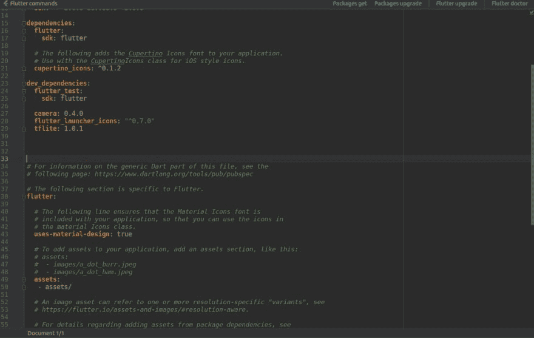
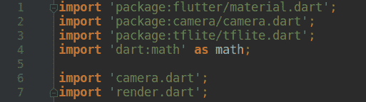
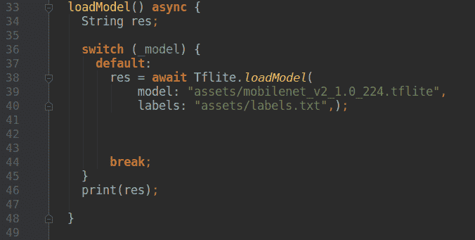

# 基于 Flutter 和 TFlite 的 Android 实时图像分类

> 原文:[https://dev . to/innovation incu/real-time-image-class ification-on-Android-using-flutter-tflite-5a9f](https://dev.to/innovationincu/real-time-image-classification-on-android-using-flutter-tflite-5a9f)

[https://www.youtube.com/embed/ZY6KG7c_YCw](https://www.youtube.com/embed/ZY6KG7c_YCw)

[T2】](https://res.cloudinary.com/practicaldev/image/fetch/s--f8MZqTVX--/c_limit%2Cf_auto%2Cfl_progressive%2Cq_auto%2Cw_880/https://cdn-images-1.medium.com/max/1024/0%2AnESXMWJAZ_xalDzm.jpeg)

***如想直接跳到代码，请访问我的 Github-Repo:***[https://Github . com/kr 1210/Flutter-Real-Time-Image-class ification](https://github.com/kr1210/Flutter-Real-Time-Image-Classification)

对于大多数新手，甚至是经验丰富的程序员来说，从头开始制作智能手机应用程序可能是一项艰巨的任务。进入颤动。

作为谷歌为 android 应用开发推出的一项有前途的、尽管未经测试的技术，Flutter 旨在让智能手机应用开发比以往任何时候都更容易。甚至有传言称，flutter 将很快成为移动应用程序开发的热门名称。创建 ui 轻而易举，开发人员友好的编码风格锦上添花。

作为一名人工智能工程师，我和我的团队成员遇到的最常见的问题之一是我们模型的部署问题。如何以快速而优雅的方式构建深度学习模型的原型？答案就在我们的口袋里。智能手机。没错。此时此刻，您可能正在其上阅读本文的这款功能强大的硬件是任何开发人员的梦想成真。结合智能手机无处不在的特性和机器学习的多功能技术，你会看到巨大的创新潜力。现在，在我工作的地方，人们通常被期望卷起袖子把工作完成，而不是等待帮助。因此，在一个这样的例子中，部署问题迫在眉睫，我必须在令人生畏的原生 android 开发世界和令人兴奋但未知的新技术 Flutter 之间做出选择。我选择了后者。在写这篇文章的时候，并不是 flutter 的每个方面都是超级稳定的，但可以肯定的是，所有这些问题都将消失。在本文中，我将描述将深度学习模型集成到用 flutter 制作的 android 应用程序中的重要方面。虽然我不是经验丰富的 android 或 flutter 开发人员，但我能够在大约一周内获得一个基本版本。就是这么简单。

我假设读者对 flutter 中的布局有一个基本的了解，并且对所使用的编程语言 Dart 有一个基本的了解。如果你对我刚刚提到的不熟悉，一些初学者的帖子会帮助你。虽然这个项目中提到的方法和代码并不完全是我所说的优化，但它可以作为您自己项目的起点或基础。所以让我们开始吧。

我们将使用 [TFlite 插件](https://pub.dev/packages/tflite)来整合我们的神经网络和应用程序。为了使用它，我们首先需要将它指定为一个依赖项，并指定我们的模型文件在 assets 文件夹中的存在。为此，需要遵循三个步骤:

1.  将模型文件(放在。tflite 格式)以及包含所用类名的 labels.txt 文件。
2.  指定文件在 assets 文件夹中的存在，以便编译器知道使用它，并且指定插件的用法。
3.  在 android/app/build.gradle 中，在 android block 中添加以下设置。

```
aaptOptions {
 noCompress 'tflite'
 noCompress 'lite'
 } 
```

所以让我们打开我们的 pubspec.yaml 文件。

<figure>[](https://res.cloudinary.com/practicaldev/image/fetch/s--lu3suQI8--/c_limit%2Cf_auto%2Cfl_progressive%2Cq_auto%2Cw_880/https://cdn-images-1.medium.com/max/1024/0%2AoR_qq-H4N-J5bUuy.png)

<figcaption>pub spec . YAML</figcaption>

</figure>

在这里，您可以看到我已经将 tflite: 1.0.1 指定为 dev_dependency。现在，它已准备好导入并与我们的应用程序一起使用。就这么简单(不尽然)。当 flutter 运行 packages get 命令时，运行这个插件所需的文件将被下载，而无需我们采取任何进一步的行动。

现在让我们打开 home.dart 文件，这是带有 ignite 按钮的页面，标签为“开始分类”。

<figure>[](https://res.cloudinary.com/practicaldev/image/fetch/s--tXAN_08H--/c_limit%2Cf_auto%2Cfl_progressive%2Cq_auto%2Cw_880/https://cdn-images-1.medium.com/max/513/0%2AN8hOYUjcC0N4BT9I.png) 

<figcaption>导入 tflite 插件</figcaption>

</figure>

如您所见，我已经在 *home.dart* 页面的第 3 行导入了 tfliteplugin，类似于我在其他标准编程语言中导入库文件的方式。

TF lite 插件附带了一个名为 loadModel()的函数，用于指定要加载的模型的名称和 labels.txt 文件，该文件包含所使用的类的名称。

<figure>[](https://res.cloudinary.com/practicaldev/image/fetch/s---VBKUce1--/c_limit%2Cf_auto%2Cfl_progressive%2Cq_auto%2Cw_880/https://cdn-images-1.medium.com/max/676/0%2Am_DgJMns31u-xd_E.png) 

<figcaption>加载模型</figcaption>

</figure>

出于表示的目的，我将这个过程包装在我自己的函数中，也称为 loadmodel()。

<figure>[](https://res.cloudinary.com/practicaldev/image/fetch/s--fC4Fun4m--/c_limit%2Cf_auto%2Cfl_progressive%2Cq_auto%2Cw_880/https://cdn-images-1.medium.com/max/392/0%2A9tdHWbqbiNGJtdF7.png)

<figcaption>runModelOnFrame()函数</figcaption>

</figure>

现在让我们转到 *camera.dart* 文件，在这里进行实际的推理。这里，我们使用函数 runModelOnFrame()，它从相机流中提取帧，并将其作为模型的输入。这个函数需要一个参数列表，比如框架、高度、宽度、要显示的结果数量等等。

输出以在 Flutter Pub 上找到的插件自述文件指定的格式接收。

```
{
 index: 0,
 label: "person",
 confidence: 0.629
} 
```

该输出由*识别*变量接收。

从模型接收的输出被施加到 *render.dart* 页面上来自摄像机的 *ImageStream* 上。为了做到这一点，从模型中获得的结果作为一个名为结果的列表被传递到 *render.dart* 页面中。这些结果随后会与置信度一起显示在屏幕上。

所有代码和项目文件都在我的 GitHub 里:[https://GitHub . com/kr 1210/Flutter-Real-Time-Image-class ification](https://github.com/kr1210/Flutter-Real-Time-Image-Classification)

> 最后但同样重要的是，我要感谢我的领导和导师， [Bhartendu Takur](https://www.linkedin.com/in/matrixb/) 向我推荐了 Flutter 作为一种部署方式。

* * *