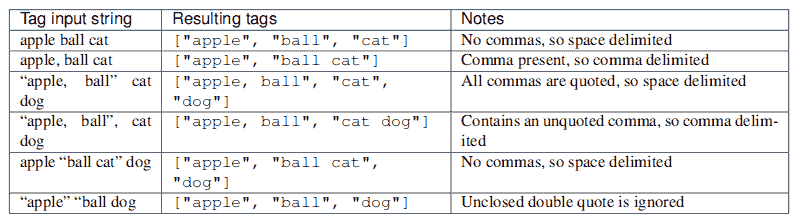
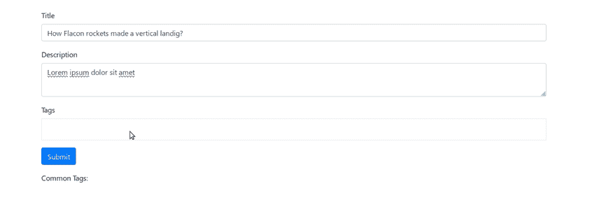
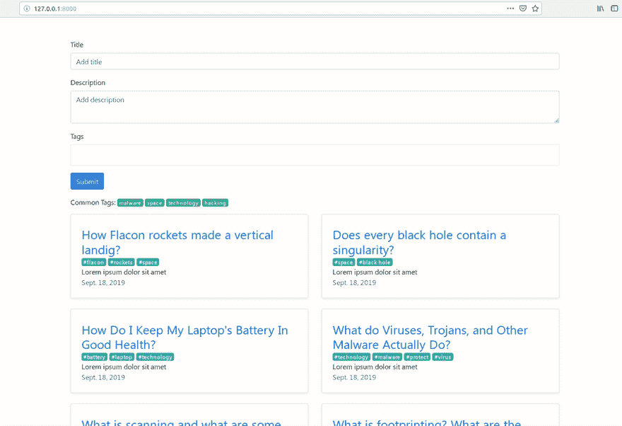

# 如何在 Django | Django Packages 系列#1 中为您的模型添加标签

> 原文：<https://dev.to/thepylot/how-to-add-tags-to-your-models-in-django-django-packages-series-1-3704>

通过[反转 Python](https://reversepython.net)

嘿德夫斯！

欢迎来到 Django 套餐系列第一帖。在本教程中，您将学习如何向模型添加标记功能。

类别和标签帮助您组织您的网站或博客，并帮助您的用户找到他们想要的信息。博客类别是您在博客上提出的主题。你的类别列表就像你博客的目录。标签更具体，它针对你在某篇博文中讨论的内容。标签通常只有一两个词，反映了文章的关键词或要点。如果类别是你博客的目录，标签就是你博客的索引。通过用相关的关键词标记一篇文章，用户可以很容易地找到信息，从而使你的博客更加专业。

django-taggit 是一个可重用的应用程序，它主要为您提供一个标签模型，以及一个可以方便地向任何模型添加标签的管理器。我们将创建一个非常简单的博客应用程序，并在其中实现标签系统。

我假设你已经创建了 Django 项目。让我们通过以下命令开始安装包:

```
pip3 install django-taggit 
```

<svg width="20px" height="20px" viewBox="0 0 24 24" class="highlight-action crayons-icon highlight-action--fullscreen-on"><title>Enter fullscreen mode</title></svg> <svg width="20px" height="20px" viewBox="0 0 24 24" class="highlight-action crayons-icon highlight-action--fullscreen-off"><title>Exit fullscreen mode</title></svg>

安装完成后，打开 **settings.py** 并将 taggit 包含在 INSTALLED_APPS 中

```
INSTALLED_APPS = [
    ...
    'taggit'
] 
```

<svg width="20px" height="20px" viewBox="0 0 24 24" class="highlight-action crayons-icon highlight-action--fullscreen-on"><title>Enter fullscreen mode</title></svg> <svg width="20px" height="20px" viewBox="0 0 24 24" class="highlight-action crayons-icon highlight-action--fullscreen-off"><title>Exit fullscreen mode</title></svg>

#### 创建模型

现在，打开 **models.py** 并创建 Post 模型:

```
from django.db import models
from taggit.managers import TaggableManager

class Post(models.Model):
    title = models.CharField(max_length=250)
    description = models.TextField()
    published = models.DateField(auto_now_add=True)
    slug = models.SlugField(unique=True, max_length=100)
    tags = TaggableManager()

    def __str__(self):
        return self.title 
```

<svg width="20px" height="20px" viewBox="0 0 24 24" class="highlight-action crayons-icon highlight-action--fullscreen-on"><title>Enter fullscreen mode</title></svg> <svg width="20px" height="20px" viewBox="0 0 24 24" class="highlight-action crayons-icon highlight-action--fullscreen-off"><title>Exit fullscreen mode</title></svg>

TaggableManager 将在模型表单或管理中自动显示为一个字段。通过表单字段输入的标签解析如下:

*   如果输入不包含任何逗号或双引号，它将被简单地视为一个以空格分隔的标记名列表。
*   如果输入包含这些字符中的任何一个

*   出现在双引号之间的字符组优先作为多单词标记(因此双引号标记名可以包含逗号)。未结束的双引号将被忽略。
*   否则，如果输入中有任何未加引号的逗号，它将被视为逗号分隔。否则，它将被视为空格分隔。



#### 创建表单

在您的**表格. py** 中:

```
from django import forms
from .models import Post

class PostForm(forms.ModelForm):
    class Meta:
        model = Post
        fields = [
            'title',
            'description',
            'tags',
        ] 
```

<svg width="20px" height="20px" viewBox="0 0 24 24" class="highlight-action crayons-icon highlight-action--fullscreen-on"><title>Enter fullscreen mode</title></svg> <svg width="20px" height="20px" viewBox="0 0 24 24" class="highlight-action crayons-icon highlight-action--fullscreen-off"><title>Exit fullscreen mode</title></svg>

我们在模型表单中加入了标签，但是我们不会用 Django 的模板语言来呈现它。

#### 创建视图

让我们看看 **views.py** :

```
from django.shortcuts import render, get_object_or_404
from django.template.defaultfilters import slugify

from .models import Post
from .forms import PostForm
from taggit.models import Tag

def home_view(request):
    posts = Post.objects.order_by('-published')
    # Show most common tags 
    common_tags = Post.tags.most_common()[:4]
    form = PostForm(request.POST)
    if form.is_valid():
        newpost = form.save(commit=False)
        newpost.slug = slugify(newpost.title)
        newpost.save()
        # Without this next line the tags won't be saved.
        form.save_m2m()
    context = {
        'posts':posts,
        'common_tags':common_tags,
        'form':form,
    }
    return render(request, 'home.html', context)

def detail_view(request, slug):
    post = get_object_or_404(Post, slug=slug)
    context = {
        'post':post,
    }
    return render(request, 'detail.html', context)

def tagged(request, slug):
    tag = get_object_or_404(Tag, slug=slug)
    # Filter posts by tag name  
    posts = Post.objects.filter(tags=tag)
    context = {
        'tag':tag,
        'posts':posts,
    }
    return render(request, 'home.html', context) 
```

<svg width="20px" height="20px" viewBox="0 0 24 24" class="highlight-action crayons-icon highlight-action--fullscreen-on"><title>Enter fullscreen mode</title></svg> <svg width="20px" height="20px" viewBox="0 0 24 24" class="highlight-action crayons-icon highlight-action--fullscreen-off"><title>Exit fullscreen mode</title></svg>

保存表单时，必须使用 commit=False 选项，并在保存对象后调用表单上的 save_m2m()。

我们使用 slugify 将我们的文章标题(字符串)转换为有效的 slug。

正如你看到的，你可以通过标签名称过滤文章，并显示最常用的标签。

#### 创建模板

太好了！现在我们可以创建模板了。

**base.html**T2】

```
<html>
    <head>
        <title>Simple Blog</title>
        <meta charset="utf-8">
        <meta name="viewport" content="width=device-width, initial-scale=1, shrink-to-fit=no">
        <link rel="stylesheet" href="https://stackpath.bootstrapcdn.com/bootstrap/4.3.1/css/bootstrap.min.css" integrity="sha384-ggOyR0iXCbMQv3Xipma34MD+dH/1fQ784/j6cY/iJTQUOhcWr7x9JvoRxT2MZw1T" crossorigin="anonymous">
        <link rel="stylesheet" href="/static/css/tagsinput.css" />
    </head>

    <body>
    
    <script src="https://code.jquery.com/jquery-3.3.1.slim.min.js" integrity="sha384-q8i/X+965DzO0rT7abK41JStQIAqVgRVzpbzo5smXKp4YfRvH+8abtTE1Pi6jizo" crossorigin="anonymous"></script>
    <script src="https://cdnjs.cloudflare.com/ajax/libs/popper.js/1.14.7/umd/popper.min.js" integrity="sha384-UO2eT0CpHqdSJQ6hJty5KVphtPhzWj9WO1clHTMGa3JDZwrnQq4sF86dIHNDz0W1" crossorigin="anonymous"></script>
    <script src="https://stackpath.bootstrapcdn.com/bootstrap/4.3.1/js/bootstrap.min.js" integrity="sha384-JjSmVgyd0p3pXB1rRibZUAYoIIy6OrQ6VrjIEaFf/nJGzIxFDsf4x0xIM+B07jRM" crossorigin="anonymous"></script>
    <script src="/static/js/tagsinut.js"></script>
    <script>
    $("#post-form").submit(function(e){
        e.preventDefault();
        });</script>
    </body>
</html> 
```

<svg width="20px" height="20px" viewBox="0 0 24 24" class="highlight-action crayons-icon highlight-action--fullscreen-on"><title>Enter fullscreen mode</title></svg> <svg width="20px" height="20px" viewBox="0 0 24 24" class="highlight-action crayons-icon highlight-action--fullscreen-off"><title>Exit fullscreen mode</title></svg>

**home.html**T2】

```



        <div class="container pt-5">
            <form method="POST">
                
                <div class="form-group">
                    <label>Title</label>
                    <input type="text" class="form-control" name="title" placeholder="Add title">
                </div>
                <div class="form-group">
                    <label>Description</label>
                    <textarea type="text" class="form-control" name="description" placeholder="Add description"></textarea>
                </div>
                <div class="form-group">
                    <label>Tags</label>
                    <input type="text" data-role="tagsinput" class="form-control" name="tags">
                </div>
                <button type="submit" class="btn btn-primary">Submit</button>
            </form>
            <p>Common Tags: 
            
                <a href="#" class="badge badge-success">{{mt}}</a>
            
            </p>
            <div class="row mb-2 posts">
                    
                    <div class="col-md-6">
                        <div class="cards">
                            <div class="row no-gutters border rounded  flex-md-row mb-4 shadow-sm h-md-250">
                                <div class="col p-4 d-flex flex-column position-static">
                                    <h3 class="my-1"><a href="">{{post.title}}</a></h3>
                                    <div style="display:flex">
                                        
                                        <a href="" class="mr-1 badge badge-info">#{{ tag }}</a>
                                        
                                    </div>
                                    <p class="mb-auto">{{post.description}}</p>
                                    <p class="mb-auto text-muted">{{post.published}}</p>
                                </div>
                            </div>
                        </div>       
                    </div>
                    
            </div>
        </div>    
 
```

<svg width="20px" height="20px" viewBox="0 0 24 24" class="highlight-action crayons-icon highlight-action--fullscreen-on"><title>Enter fullscreen mode</title></svg> <svg width="20px" height="20px" viewBox="0 0 24 24" class="highlight-action crayons-icon highlight-action--fullscreen-off"><title>Exit fullscreen mode</title></svg>

在表单标签中，你可以看到名称属性，它只是我们在 HTML 模板中作为属性的表单字段名称。我们必须覆盖标签输入，这就是为什么我们没有用 Django 的模板语言来呈现它的主要原因。

我们正在使用 jQuery 插件，它提供了一个用于管理标签的 Twitter 引导用户界面。这个插件基本上可以将文本输入转换成真正的标签。看一看[自举标签输入](http://bootstrap-tagsinput.github.io/bootstrap-tagsinput/examples/)

以下是最终结果:

[](https://res.cloudinary.com/practicaldev/image/fetch/s--boQHDVVP--/c_limit%2Cf_auto%2Cfl_progressive%2Cq_66%2Cw_880/https://thepracticaldev.s3.amazonaws.com/i/443wk1si9kysdsvuoh5l.gif)

并按标签过滤帖子:

[](https://res.cloudinary.com/practicaldev/image/fetch/s--hXK41Gsz--/c_limit%2Cf_auto%2Cfl_progressive%2Cq_66%2Cw_880/https://thepracticaldev.s3.amazonaws.com/i/zkduydzwkqku80s887vq.gif)

更多信息，请查看 django-taggit 的文档。

您可以从我的 GitHub 克隆或下载该项目

## [the pylot](https://github.com/thepylot)/[django-taggit-tutorial](https://github.com/thepylot/django-taggit-tutorial)

### 使用 django-taggit | Django 软件包系列为您的模型添加标签

<article class="markdown-body entry-content container-lg" itemprop="text">

# 姜戈-塔吉特-教程

使用 django-taggit | Django 软件包系列#1 为您的模型添加标签

## 入门指南

这个项目在 **Python 3+** 和 Django 2+上工作。

安装依赖项:

```
python3 -m pip3 install -r requirements.txt 
```

然后运行以下命令:

```
python3 manage.py makemigrations posts
python3 manage.py migrate
python3 manage.py runserver 
```

</article>

[View on GitHub](https://github.com/thepylot/django-taggit-tutorial)

就是这样！请在社交媒体上分享并关注我(你的支持很重要)！:)还要检查[反向 Python](https://reversepython.net) 并一如既往地保持连接！🚀

[给我买杯咖啡:)](https://www.buymeacoffee.com/xT2K0N1PY)
[insta gram](https://www.instagram.com/coderasha/?hl=en)
[Twitter](https://twitter.com/coderasha?lang=en)