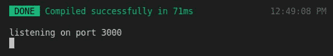
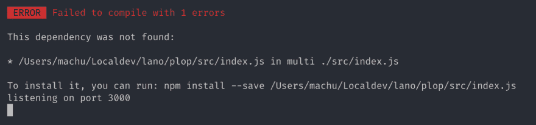

# 将 Typescript 与 Node.js 一起使用

> 原文:# t0]https://dev . to/jeansmaug/use-typescript-with-node-js-3 API

要使用服务器端 Typescript，可以选择 nos，Node.js 的创建者设计的 Typescript 运行引擎。问题，它还没有[稳定](https://deno.land/manual.html#disclaimer)。
第二种解决方案是在与 Node.js 一起运行之前先对我们的 Typescript 进行堆栈。
本课题已经存在教程，但很少有人谈到 [Backpack](https://github.com/jaredpalmer/backpack) 。这是一个基于 Webpack 的 Node.js 的 bundler 模块。

## 背包

开始停放安装者背包

```
yarn add -DE backpack-core 
```

接下来，我们将安装 Koa，它将成为我们的服务器

```
yarn add -E koa 
```

然后将服务器创建为位于`src/index.js`中的文件。这是默认的 Backpack 入口点

```
// src/index.js
const Koa = require("koa")

const app = new Koa()

app.use(ctx => {
  ctx.body = "Jon Snow meurt saison 5 épisode 10"
})

app.listen(3000)
console.log("listening on port 3000") 
```

最后，我们将脚本添加到我们的包中。json

```
{  "scripts":  {  "dev":  "backpack",  "build":  "backpack build"  }  } 
```

我们发射一个‘t0’和-我...。

[](https://res.cloudinary.com/practicaldev/image/fetch/s--Z1y73rkM--/c_limit%2Cf_auto%2Cfl_progressive%2Cq_auto%2Cw_880/https://thepracticaldev.s3.amazonaws.com/i/mlfhg8v9ruxjpkxqmrl0.jpg)

-我...。Backpack 捆绑我们的 Javascript 源没有问题

## 添加类型脚本

首先添加 Typescript，以及 Node 和 Koa 的类型

```
yarn add -DE typescript @types/node @types/koa 
```

然后使用
初始化 Typescript 配置

```
yarn tsc --init 
```

必须将文件“`src/index.js`”重命名为“`src/index.ts`”，然后更新代码。

```
// src/index.ts
import Koa, { Context } from "koa"

const app: Koa = new Koa()

app.use((ctx: Context) => {
  ctx.body = "Jon Snow meurt saison 5 épisode 10"
})

app.listen(3000)
console.log("listening on port 3000") 
```

但是如果我再发射一次‘t0’，我会得到-我...。

[](https://res.cloudinary.com/practicaldev/image/fetch/s--JTVBP25v--/c_limit%2Cf_auto%2Cfl_progressive%2Cq_auto%2Cw_880/https://thepracticaldev.s3.amazonaws.com/i/qhwpyptfojaqwi88xwym.png) 
-我...。一个很好的错误。

错误显而易见，Backpack 在“`src/index.js`”中找不到文件。因此，我们将重载默认的 Backpack 配置，以指示它现在的入口点是文件“`src/index.ts`”，同时我们还将为它提供了解 Typescript 文件的机会。

因为 Backpack 是基于 Webpack 的，所以我们可以使用现有的加载程序。添加 Typescript 加载程序。

```
yarn add -DE ts-loader 
```

我们只需创建一个名为“`backpack.config.js`”的配置文件，然后将新的入口点和 typescript loader 添加到该文件中。

```
// backpack.config.js
module.exports = {
  webpack: (config, options, webpack) => {
    // nouveau point d'entrée
    config.entry.main = ["./src/index.ts"]

    // résolution automatique des extensions
    config.resolve = {
      extensions: [".ts", ".js", ".json"],
    }

    // loader Typescript
    config.module.rules.push({
      test: /\.ts$/,
      loader: "ts-loader",
    })

    return config
  },
} 
```

我们发射一枚‘t0’，一切正常！

[](https://res.cloudinary.com/practicaldev/image/fetch/s--Z1y73rkM--/c_limit%2Cf_auto%2Cfl_progressive%2Cq_auto%2Cw_880/https://thepracticaldev.s3.amazonaws.com/i/mlfhg8v9ruxjpkxqmrl0.jpg)

一切都结束了。就这么简单？

谢谢你读给我听。