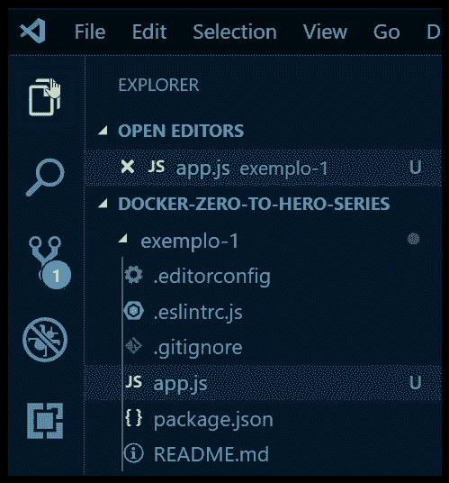
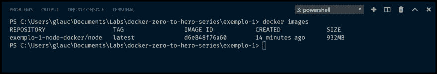
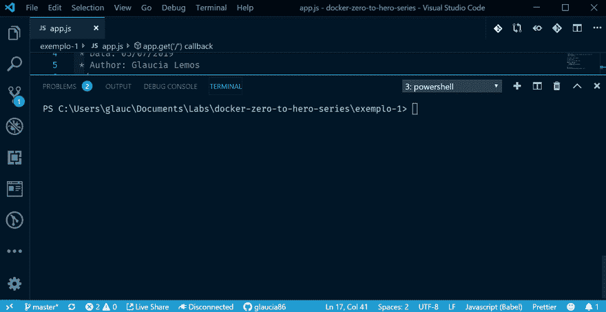
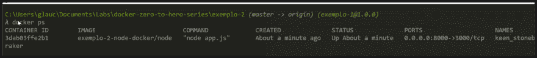
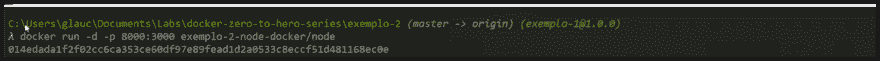
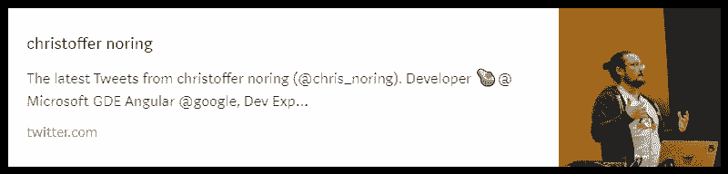

# Node.js y Express.js con Docker

> 原文：<https://dev.to/azure/desarrollo-de-aplicaciones-node-js-y-express-js-con-docker-4agm>

[](https://postimg.cc/VJ2WzhgB)

*原由 Chris Noring - **[在此](https://dev.to/softchris/5-part-docker-series-beginner-to-master-3m1b)*** 撰写的文章

在 **[【最后一篇】](https://dev.to/azure/introduccion-a-docker-conceptos-basicos-51id)** 中，我们看到并学习了码头、图像和集装箱的基本概念。现在是开发应用程序和在应用程序中使用 docker 的时候了。

我们走吧？！

## Comencemos a codici car！

现在我们了解了坞站是什么以及为什么要使用它，现在正是我们应该在一些应用程序中练习使用坞站的时候！

嗯，我们需要一个在坞站中广泛使用的文件:坞站文件。因为它在文件*【docketerfile】*中，我们将具体说明有关操作系统、环境变量以及如何运行我们的应用程序的所有需要。

现在让我们深入了解一下这一部分。通过此文件，我们将在一个与外界隔离的容器内运行我们的应用程序，但可用于其他端口(“T0”端口“”)。

我们将采取以下步骤:

*   **在 Node.js** 上创建应用程序

让我们使用 Express 开发 Node.js 应用程序。就像 rest API。

*   **创建文件‘dock file’**

此文件将负责告诉 docker 如何构建我们的应用程序。

*   **建立影像**

为了使我们的应用程序正常工作，我们必须创建一个名为 Docker 的映像。

*   创建容器

最后，我们将看到我们的应用程序正在运行，并从坞站图像创建一个归档文件。

我们现在要遵循这些步骤吗？！

## crea ción la applica ción node . js y Express con Docker

现在打开您的 Visual Studio 代码，创建一个名为:“t0”【example-2】的文件夹，然后在该文件夹中键入以下命令:

```
> npm init -y 
```

Enter fullscreen mode Exit fullscreen mode

此命令将为我们创建一个名为: **package.json** 的文件。

最后，文件 **package.json** 将如下所示:

```
{  "name":  "exemplo-2",  "version":  "1.0.0",  "description":  "Código do exemplo do artigo: Introdução a Docker - Parte I",  "main":  "app.js",  "scripts":  {  "dev":  "nodemon",  "lint":  "eslint --ext .js,.html -f ./node_modules/eslint-friendly-formatter . --fix",  "prepush":  "npm run lint",  "start":  "node app.js"  },  "keywords":  [  "nodejs",  "javascript",  "docker",  "azure",  "express"  ],  "author":  "Glaucia Lemos",  "license":  "MIT",  "bugs":  {  "url":  "https://github.com/glaucia86/docker-zero-to-hero-series/issues"  },  "homepage":  "https://github.com/glaucia86/docker-zero-to-hero-series/blob/master/README.md",  "devDependencies":  {  "eslint":  "^5.16.0",  "eslint-config-airbnb-base":  "^13.1.0",  "eslint-plugin-import":  "^2.17.3",  "husky":  "^2.3.0",  "nodemon":  "^1.19.1"  },  "dependencies":  {  "eslint-friendly-formatter":  "^4.0.1",  "eslint-plugin-html":  "^5.0.5",  "express":  "^4.17.1"  }  } 
```

Enter fullscreen mode Exit fullscreen mode

如果您要开发源代码，我在 GitHub 上创建了一个存储库。在这种情况下，只需下载整个工程 **[【此处](https://github.com/glaucia86/docker-zero-to-hero-series)**

那么，让我们在文件夹 *example-2* 中创建文件 **app.js** ，然后创建文件**docerfile**

最后，项目结构如下:

[](https://postimg.cc/cgSz1ftD)

现在，在文件夹
示例-2 中，运行以下命令:

```
> npm install 
```

Enter fullscreen mode Exit fullscreen mode

此命令将安装我们项目所需的所有依赖项，并创建一个名为“*”node _ modules“*”的文件夹

太棒了我们开始发展吧！

## 开发‘app . js’文件

创建项目结构并在我们的应用程序中安装必要的依赖项后，我们打开文件 **app.js** ，并添加以下代码:

```
/**
 * Arquivo: app.js
 * Descrição: arquivo principal e responsável pela execução da aplicação.
 * Data: 05/07/2019
 * Author: Glaucia Lemos
 */

const express = require('express');

const app = express();

const port = process.env.PORT || 3000;

app.get('/', (req, res) => {
  res.status(200).send({
    success: 'true',
    message: 'Seja Bem-Vindo(a) ao mundo Docker!',
    version: '1.0.0',
  });
});

app.listen(port);
console.log('Aplicação executando na porta ', port); 
```

Enter fullscreen mode Exit fullscreen mode

现在转到命令提示符并运行命令:**【nodemon】**，然后打开邮递员并在 URL:*[【http://localhost:3000/](http://localhost:3000/)*上键入，看看 Api 是否正在运行:

[](https://postimg.cc/Z9c0YtwX)

∞信息显示如上图所示，是因为一切工作顺利！借助我们的教程！

## 正在开发‘dock file’文件

现在，我们将创建文件*docerfile*。此文件是一个清单，其中包含编译和运行我们的应用程序所需的所有说明。但是，通过*docerfile*运行应用程序需要∞吗？我们需要:

*   **通过 docker 容器复制**所有应用文件。

*   安装依赖项。

*   **打开一扇门**在将要进入的容器中，可以这么说，在外面。

*   **指示**容器如何启动我们的应用程序

在更复杂的应用程序中，我们需要报告更多信息，例如设置环境变量或设置数据库凭据，或运行特定数据库等。但是，由于这是一个简单的应用程序，我们认为*坞站式*方式非常简单:

```
WORKDIR /app

COPY . .

RUN npm install EXPOSE 3000

ENTRYPOINT ["node", "app.js"] 
```

Enter fullscreen mode Exit fullscreen mode

现在我们了解了每个命令的作用:

*   **从**这里我们正在选择坞站枢纽操作系统的图像。docker hub 是一个全局存储库，其中包含可以在本地提取的图像。就我们而言，我们选择的是已安装 Node.js(称为 Node)的 Ubuntu 映像。我们还使用以下标签指定了 Node.js 的较新版本:`latest`

*   **WORKDIR** 这里只是指我们定义了一个工作目录。这是一种在下面的命令中配置后续内容的方法。

*   **COPY** 在此，我们通过此命令将文件从指定目录复制到其中。

*   **运行**在这里我们将在终端上运行一个命令。对于我们，我们将安装使用 Express 开发 Node.js 应用程序所需的所有库。

*   **暴露**这里指的是我们会打开一定的门(港口)。通过这个门我们可以和集装箱沟通。

*   **【entry point】**这里是我们应该指出如何开始我们的申请的地方。必须将命令指定为数组，例如:["node "，" app.js"]。就好像我们在终端上遇到了命令:“node app.js”

## 创建图像

要创建映像，我们必须执行以下两个步骤:

*   *创建映像:* *借助‘docketerfile’文件和`docker build`命令，我们将创建映像

*   启动容器

现在我们有了一个图像，我们需要创建一个容器。

现在这些步骤！打开项目文件夹“`ejemplo-2`”并运行以下命令:(**不要忘记运行 docker desktop！！！*)

```
> docker build -t exemplo-2-node-docker/node:latest . 
```

Enter fullscreen mode Exit fullscreen mode

请注意，末尾有一个句号`(.)`。被包括在内来创造我们的形象！因为它告诉 dock，告诉他 Dockerfile 的位置，在我们的例子中，就是他所在的目录。如果您没有作业系统影像，我们会要求您输入「`FROM`」指令，并引导我们从 docker hub 下载，最后建立 dockerfile 中指定的影像。您的终端应显示为以下 gif(取决于 Internet 连接，此命令可能需要几分钟才能完成):

[](https://gifyu.com/image/EJJm)

我们在 gif 中看到的是操作系统图片`node:latest`如何通过坞站集线器进行传送和下载。然后我们的每一个命令都以`WORKDIR`、`RUN`等形式执行。我们在这里看到的是 docker 能够非常智能地运行，并在每个命令后缓存所有不同的文件层，从而加快速度。最后，我们看到消息“已成功构建”，表明我们的映像已成功构建。让我们来看看我们的形象是如何形成的。打开终端并输入以下命令:

```
> docker images 
```

Enter fullscreen mode Exit fullscreen mode

[](https://postimg.cc/dLgwpzkR)

∞显示为图像是因为图像创建成功！

## 创建容器

下一步是取我们创建的映像，并为其构建一个容器。容器是在其中运行我们应用程序的隔离部件。我们通过运行以下命令创建了一个归档文件:`docker run`。再次打开终端并运行以下命令:

```
> docker run -p 8000:3000 exemplo-2-node-docker/node 
```

Enter fullscreen mode Exit fullscreen mode

∞在文件`Dockerfile`中我们设置了门(端口)？而且我们在上一篇文章中已经解释过，我们需要主机上的外部端口(port)映射。请记住，这是我们要在浏览器中运行的应用程序。因此，我们必须作如下映射:

```
-p [puerta externa]:[puerta interna] 
```

Enter fullscreen mode Exit fullscreen mode

请参见 gif 上一个命令的执行:

[](https://gifyu.com/image/EltG)

请注意，在浏览器中，必须放置外门，在本例中是门:`8000`。

但是，为了停止运行此归档文件，我们需要运行一些命令:

1.  我们必须先列出正在运行的容器

```
> docker container ls 
```

Enter fullscreen mode Exit fullscreen mode

1.  然后从归档文件中复制** Id **，并运行以下命令:

```
> docker kill <Id do Container> 
```

Enter fullscreen mode Exit fullscreen mode

Vea·埃尔·吉夫:

[](https://gifyu.com/image/El5b)

## 用环境变量改进设置

太好了！我们已经学习了如何使用 Node.js & Express 创建我们的第一个 docker 映像，学习了如何运行归档文件，最后使用文件“`DockerFile`”运行我们的应用程序。但是，我们可以在文件`DockerFile`中改进变量 **PORT** 。照现在的样子，很容易出错。

要解决此问题，我们可以包括一个环境变量。有了这个，我们会做两个改变:

*   新增环境变数至 **Dockerfile**
*   从文件 **app.js** 中的环境变量读取

## 添加环境变量

为此，我们需要使用** ENV **。打开文件`DockerFile`并更改如下:

```
FROM node:latest

WORKDIR /app

COPY . .

ENV PORT=3000

RUN npm install EXPOSE 3000

ENTRYPOINT ["node", "app.js"] 
```

Enter fullscreen mode Exit fullscreen mode

又一个变化！现在更新变量**暴露**，然后删除静态值，依靠变量如下:

```
FROM node:latest

WORKDIR /app

COPY . .

ENV PORT=3000

RUN npm install EXPOSE $PORT

ENTRYPOINT ["node", "app.js"] 
```

Enter fullscreen mode Exit fullscreen mode

请注意，我们已将命令**改为****$ port】**。这里非常重要的一点:我们使用的任何变量都必须以字符“`$`t5”作为前缀

```
> EXPOSE $PORT 
```

Enter fullscreen mode Exit fullscreen mode

## 读取 App.js 文件中环境变量的值

我们可以按如下方式读取 Node.js 中的环境变量值:

```
> process.env.PORT 
```

Enter fullscreen mode Exit fullscreen mode

所以我们将更新文件`app.js` :

```
/**
 * Arquivo: app.js
 * Descrição: arquivo principal e responsável pela execução da aplicação.
 * Data: 05/07/2019
 * Author: Glaucia Lemos
 */

const express = require('express');

const app = express();

const port = process.env.PORT;

app.get('/', (req, res) => {
  res.status(200).send({
    success: 'true',
    message: 'Seja Bem-Vindo(a) ao mundo Docker!',
    version: '1.0.0',
  });
});

app.listen(port);
console.log(`Aplicação executando na porta..: ${port}`); 
```

Enter fullscreen mode Exit fullscreen mode

请注意，当我们变更为档案`app.js`或档案`Dockerfile`时，我们需要重建影像。这意味着我们需要再次运行 Docker 编译命令，在此之前，我们必须使用以下命令停止容器:

```
> docker stop 
```

Enter fullscreen mode Exit fullscreen mode

```
> docker rm 
```

Enter fullscreen mode Exit fullscreen mode

稍后再谈这两个命令！😉

## 管理容器

好吧！您刚刚启动了容器，并意识到在终端上的运行未完成/关闭。惊慌失措的地方！😳😳

在这种情况下，您可以打开另一个终端窗口并运行以下命令:

```
> docker ps 
```

Enter fullscreen mode Exit fullscreen mode

此命令将列出计算机上运行的所有容器。您可以按如下方式查看容器名称及其 Id:

[](https://postimg.cc/Y4n59X0G)

如您所见，我们有**栏【container _ id】**和**栏**名称。两种价值观都会起到打破我们容器的作用，因为这就是我们要做的，所以:

```
> docker stop 3da 
```

Enter fullscreen mode Exit fullscreen mode

我们选择使用**【container _ id】**栏，只需输入前 3 位数，无需包括 **ID** 完整。运行此命令后，请注意，键入“`docker ps`”后，将不再显示任何容器，并将停止运行我们的映像。

## Modo 守护进程

我们可以像以前那样，开一个单独的新终点站。但是，它在**守护进程模式**中运行，在这种情况下是最好的选择。这意味着我们将在后台运行归档文件，并且所有输出都不可见。为此，只需添加-d 标志即可。

```
> docker run -d -p 8000:3000 exemplo-2-node-docker/node 
```

Enter fullscreen mode Exit fullscreen mode

[](https://postimg.cc/bDKkzhj6)

请注意，我们现在有容器 ID。∞停止跑步更容易！只需输入 ID 的前 3 位数。例:

```
> docker stop 014 
```

Enter fullscreen mode Exit fullscreen mode

## 码头工人杀 vs 码头工人停

到目前为止，我们一直以`docker stop`命令作为停止容器的方法。但是，还有另一种停止容器的方法，即执行命令`docker kill`。但有什么区别呢？

*   **坞站停止**:此命令发送信号**SIGTERM** ，之后是 **SIGKILL** 。简而言之，这是一种更优雅地减小容器大小的方法，意味着释放资源并节省状态。

*   **【码头杀手】**:此命令立即发送**【sigkill】**。这意味着释放资源或国家储蓄可能无法按计划运作。开发中，无论使用哪一个命令，但在生产场景中依靠命令`docker stop`更为谨慎。

## 集装箱清洗

最终，在应用程序开发过程中，您将创建许多容器。然后，为了确保删除/清理这些容器，只需键入命令:

```
> docker rm <id-do-contêiner> 
```

Enter fullscreen mode Exit fullscreen mode

例:

```
> docker rm -f ef8 
```

Enter fullscreen mode Exit fullscreen mode

```
> docker ps 
```

Enter fullscreen mode Exit fullscreen mode

## 结论

在本文中，我们学习了如何使用 docker 实用的分步方式创建 Node.js & Express.js 应用程序。我们学习了一些重要的对接命令，这不会停止在这里。因为我们还有很多重要的事情要学，例如如何使用数据库、卷、如何链接容器以及为什么和如何管理多个容器，也称为编排。

∞这是一系列文章！我们得停在某个地方否则这篇文章会很长。注意看下一部分，我们将在这里谈论卷和**数据库**。

如果您想学习和学习更多坞站，我建议您学习以下坞站课程:

**[免费课程-使用坞站编译集装箱中的 web 应用](https://docs.microsoft.com/es-es/learn/modules/intro-to-containers/?WT.mc_id=devto-blog-gllemos)**

**[Otros Cursos grátis de Docker](https://docs.microsoft.com/es-es/learn/browse/?term=docker&WT.mc_id=devto-blog-gllemos)T3】**

并且为了了解这个和其他的事态发展，∞在 twitter 上！

[](https://twitter.com/glaucia_lemos86)

跟着克里斯诺林！

[](https://postimg.cc/4HkX5JtR)

回头见！