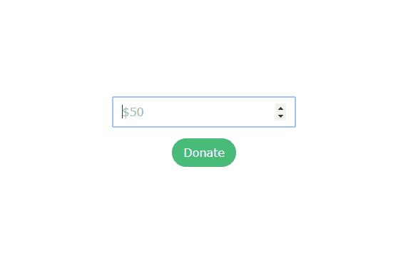

# 构建无服务器捐赠表单

> 原文：<https://dev.to/monty5811/building-a-serverless-donate-form-6j4>

了解如何在网站上放置捐赠表格——使用 Netlify & Stripe——完全符合 SCA，无需管理服务器！

我们将:

*   在 [Netlify](https://www.netlify.com/) 上托管一个静态站点
*   使用[条纹检验](https://stripe.com/docs/payments/checkout)处理捐赠
*   用一个无服务器的[网络功能](https://www.netlify.com/docs/functions/)连接在一起

*TL；*博士直接跳到这里的代码:

## [5 月 811 日](https://github.com/monty5811) / [捐赠形式](https://github.com/monty5811/donate-form)

### 示例无服务器捐赠表单，带 stripe 和 netlify

<article class="markdown-body entry-content container-lg" itemprop="text">

# 捐赠形式

[](https://github.com/monty5811/donate-form/flowchart.png?raw=true)

这个回购是如何用 Stripe & Netlify 构建捐赠表单的一个例子。

*   [演示](https://donate-form-example.netlify.com/)
*   更多信息[此处](https://github.com/monty5811/donate-form)

有两个主要组件:

1.  一个超级简单的[表单](https://github.com/monty5811/donate-form/blob/master/index.html),用一些 JS 来处理重定向流
2.  一个 [netlify 函数](https://github.com/monty5811/donate-form/blob/master/netlify_functions/get_checkout_session.js)与条带 API 对话

</article>

[View on GitHub](https://github.com/monty5811/donate-form)

## 第一步:设置

首先，我们需要一个表单，用户可以选择捐赠多少:

```
<!DOCTYPE html>
<html>

<head>
    <meta charset="utf-8">
    <title>Serverless Donate Form</title>
    <link href="https://unpkg.com/tailwindcss@^1.0/dist/tailwind.min.css" rel="stylesheet">
    <style>
        html {
            font-family: 'Lucida Grande', Verdana, sans-serif;
        }
    </style>
</head>

<body class="h-screen flex flex-col justify-center">
    <form class="antialiased max-w-xs mx-auto" id="payment-form">
        <input class="block w-64 py-2 px-3 mx-auto mb-4 border-gray-300 border rounded-md" type="number" min="0" placeholder="$50" id="giving-amount" />
        <button class="bg-green-500 hover:bg-green-600 text-white py-2 px-4 rounded-full mx-auto block" id="giving-button">
        Donate
      </button>
    </form>
</body>

</html> 
```

<svg width="20px" height="20px" viewBox="0 0 24 24" class="highlight-action crayons-icon highlight-action--fullscreen-on"><title>Enter fullscreen mode</title></svg> <svg width="20px" height="20px" viewBox="0 0 24 24" class="highlight-action crayons-icon highlight-action--fullscreen-off"><title>Exit fullscreen mode</title></svg>

它看起来是这样的(我们用[顺风](https://tailwindcss.com)做造型):
[](https://res.cloudinary.com/practicaldev/image/fetch/s--BSXJQaRc--/c_limit%2Cf_auto%2Cfl_progressive%2Cq_auto%2Cw_880/https://thepracticaldev.s3.amazonaws.com/i/ag4vdpbh9txrzzganfuf.png)

## 第二步:给表单添加条纹

现在我们需要一些 javascript 来处理与 Stripe 的交互。我们做了一些不同的事情来将我们的表单与 Stripe 挂钩:

1.  倾听提交表单的用户
2.  将表单更新为“等待”状态
3.  从我们的 lambda 函数中获取条带检出会话 ID
4.  重定向至带会话 ID 的条带托管结帐
5.  处理任何错误

所需的更改:

```
 <!-- rest of content as above -->
    <!-- add jquery & stripe -->
    <script src="https://code.jquery.com/jquery-3.4.1.min.js" crossorigin="anonymous"></script>
    <script src="https://js.stripe.com/v3/"></script>
    <script type="text/javascript">
        var errorText = "Failed. You have not been charged.";

        // look out for submit events on the form
        document.addEventListener("DOMContentLoaded", function(event) {
            var submitButton = document.getElementById("giving-button");

            var stripe = Stripe("<YOUR_STRIPE_PUBLISHABLE_KEY_HERE>");

            var form = document.getElementById("payment-form");
            form.addEventListener("submit", function(event) {
                event.preventDefault();
                const buttonText = submitButton.innerText;
                submitButton.innerText = "Working...";

                var data = {
                    amount: document.getElementById("giving-amount").valueAsNumber * 100,
                };

                // create a stripe session by talking to our netlify function
                $.ajax({
                    type: "POST",
                    url: "/.netlify/functions/get_checkout_session/",
                    data: JSON.stringify(data),
                    success: function(data) {
                        // we got a response from our netlify function:
                        switch (data.status) {
                            case "session-created":
                                // it worked - send the user to checkout:
                                stripe
                                    .redirectToCheckout({
                                        sessionId: data.sessionId
                                    })
                                    .then(function(result) {
                                        submitButton.innerText = result.error.message;
                                    });
                                break;
                            default:
                                submitButton.innerText = errorText;
                        }
                    },
                    dataType: "json"
                });
            });
        });
    </script>
</body>

</html> 
```

<svg width="20px" height="20px" viewBox="0 0 24 24" class="highlight-action crayons-icon highlight-action--fullscreen-on"><title>Enter fullscreen mode</title></svg> <svg width="20px" height="20px" viewBox="0 0 24 24" class="highlight-action crayons-icon highlight-action--fullscreen-off"><title>Exit fullscreen mode</title></svg>

## 第三步:添加我们的 lambda 函数

现在我们有了一个表单，它将接受捐款金额并重定向到 Stripe 的托管结帐。然而，为了在 Stripe Checkout 中使用自定义“价格”,我们需要一个服务器端组件。 <sup id="fnref1">[1](#fn1)</sup>

设置一个完整的服务器看起来有点大材小用——无服务器功能是理想的。

无服务器函数只是从 Stripe 中获取数量和会话 ID。然后，这个会话 ID 被发送回浏览器，在那里用户被重定向以完成他们的捐赠。

```
const stripe = require("stripe")(process.env.STRIPE_SECRET_KEY); // get from ENV

const headers = {
  "Access-Control-Allow-Origin": "*",
  "Access-Control-Allow-Headers": "Content-Type"
};

exports.handler = function(event, context, callback) {
  // some error checking:
  if (event.httpMethod !== "POST" || !event.body) {
    callback(null, {
      statusCode: 400,
      headers,
      body: JSON.stringify({ status: "bad-payload" })
    });
  }
  // Parse the body contents into an object.
  const data = JSON.parse(event.body);

  // Make sure we have all required data. Otherwise, escape.
  if (!data.amount) {
    console.error("Required information is missing.");

    callback(null, {
      statusCode: 400,
      headers,
      body: JSON.stringify({ status: "missing-information" })
    });

    return;
  }
  // actually create the session with Stripe
  // we need to provide a couple of redirect urls:
  stripe.checkout.sessions.create(
    {
      success_url: "https://donate-form-example.netlify.com/success",
      cancel_url: "https://donate-form-example.netlify.com/cancel",
      payment_method_types: ["card"],
      billing_address_collection: "required",
      payment_method_types: ["card"],
      submit_type: "donate",
      line_items: [
        {
          name: "Donation!",
          amount: data.amount,
          currency: "usd",
          quantity: 1
        }
      ]
    },
    function(err, session) {
      // asynchronously called
      if (err !== null) {
        console.log(err);
        callback(null, {
          statusCode: 200,
          headers,
          body: JSON.stringify({ status: "session-create-failed" })
        });
      }
      // woohoo! it worked, send the session id back to the browser:
      callback(null, {
        statusCode: 200,
        headers,
        body: JSON.stringify({
          status: "session-created",
          sessionId: session.id
        })
      });
    }
  );
}; 
```

<svg width="20px" height="20px" viewBox="0 0 24 24" class="highlight-action crayons-icon highlight-action--fullscreen-on"><title>Enter fullscreen mode</title></svg> <svg width="20px" height="20px" viewBox="0 0 24 24" class="highlight-action crayons-icon highlight-action--fullscreen-off"><title>Exit fullscreen mode</title></svg>

在完整的回购中，您可以看到这是如何与净值挂钩的:

## [5 月 811 日](https://github.com/monty5811) / [捐赠形式](https://github.com/monty5811/donate-form)

### 示例无服务器捐赠表单，带 stripe 和 netlify

<article class="markdown-body entry-content container-lg" itemprop="text">

# 捐赠形式

[](https://github.com/monty5811/donate-form/flowchart.png?raw=true)

这个回购是如何用 Stripe & Netlify 构建捐赠表单的一个例子。

*   [演示](https://donate-form-example.netlify.com/)
*   更多信息[此处](https://github.com/monty5811/donate-form)

有两个主要组件:

1.  一个超级简单的[表单](https://github.com/monty5811/donate-form/blob/master/index.html),用一些 JS 来处理重定向流
2.  一个 [netlify 函数](https://github.com/monty5811/donate-form/blob/master/netlify_functions/get_checkout_session.js)与条带 API 对话

</article>

[View on GitHub](https://github.com/monty5811/donate-form)

## 结论

就是这样！我们已经建立了一个捐赠表格，用户可以选择他们愿意捐赠多少，我们已经做到了，从来没有担心运行我们自己的服务器。

对于非静态站点，您可以轻松地做到这一点——您只需要在站点上用一个路由来替换无服务器功能，该路由将创建一个条带会话，并将 id 返回给前端。

* * *

1.  如果你有固定的价格或固定的捐赠金额，那么你不需要任何服务器端组件。你可以在客户端做任何事情。查看[条纹文档](https://stripe.com/docs/payments/checkout/client)了解更多信息 [↩](#fnref1)