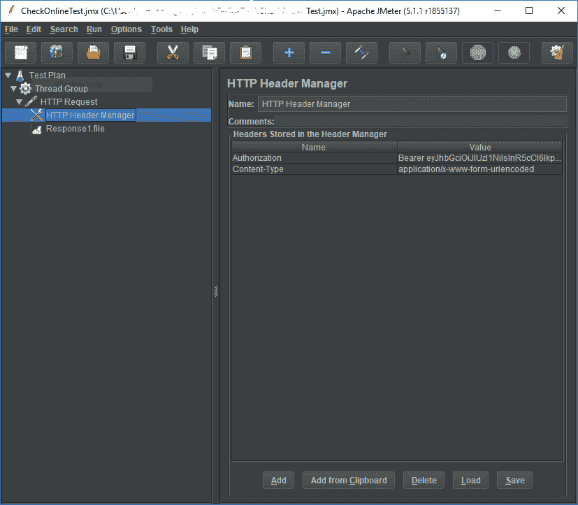

# 用 JMeter 多次调用一个 API

> 原文：<https://dev.to/afsharm/multiple-calling-an-api-with-jmeter-4h6l>

在[熟悉了 JMeter](https://dev.to/afsharm/jmeter-acquaintance-and-installation-36ag) 之后，是时候解决一个现实问题了。最近，我在我们的项目中遇到了一个可耻但常见的错误:一个特殊的数据库字段，它的增量行为由应用程序控制，而不是由数据库填充重复的值。该领域具有很强的业务影响，应该立即解决。这种虫子很难被复制。只有一个顾客抱怨过。经过一番试错，发现可能是并发问题导致的。

**JMeter** 从现在开始玩。在工具的正确设置下，我能够模拟错误。 **JMeter** 的每次运行结果都是一样的糟糕。有了这些，开发人员可以很容易地检查他们的解决方案是否正确地解决了问题。此外，测试场景有助于猜测根本原因。

为了让 **JMeter** 对项目进行负载测试，首先，我创建了一个新项目。后来，我添加了一个不难配置的*线程组*。我只是将*的线程数*设置为 5，并将*的斜升*设置为相同的值。在第二步中，我向线程组添加了一个类型为 *HTTP 请求*的*采样器*。线程组表示有多少线程将运行测试；而采样器是创建请求并将它们发送到服务器的东西。HTTP 请求的基本配置是不言自明的:它只包括服务器名、方法和路径。

第一次通过命令行运行时，我只看到一堆 401 未授权的错误。目标 API 被配置为使用 JWT 作为保护屏障。它需要一个填充了合适令牌的*授权*报头才能工作，就像*邮递员*一样。为此，我在 *HTTP 请求中添加了一个 *HTTP Header Manager 配置元素*。然后，添加了两个头，*Authorization* 来传递令牌， *Content-Type* 设置为`application/x-www-form-urlencoded`。后者让我能够通过 *HTTP 请求*传递 API 参数。最后一步是在 CLI 模式下运行它:

```
jmeter -n -t CheckAPI.jmx -l LogFile.log 
```

<svg width="20px" height="20px" viewBox="0 0 24 24" class="highlight-action crayons-icon highlight-action--fullscreen-on"><title>Enter fullscreen mode</title></svg> <svg width="20px" height="20px" viewBox="0 0 24 24" class="highlight-action crayons-icon highlight-action--fullscreen-off"><title>Exit fullscreen mode</title></svg>

看看这个简单但有用的测试项目:

[](https://res.cloudinary.com/practicaldev/image/fetch/s--3GLE4vVn--/c_limit%2Cf_auto%2Cfl_progressive%2Cq_auto%2Cw_880/https://thepracticaldev.s3.amazonaws.com/i/k8ljfrq6b8u6x4pwarca.PNG)