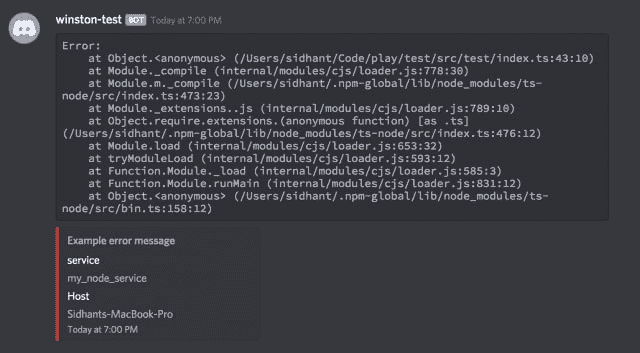

# 温斯顿·罗格的不和谐运输

> 原文：<https://dev.to/sidhantpanda/a-discord-transport-for-winston-logger-370f>

我刚刚发布了一个 npm 包，将日志消息直接发送到你们的 Discord 频道。

在 Github 上查看[Winston-discord-transport](https://github.com/sidhantpanda/winston-discord-transport)！

如果您已经使用 winston 管理服务器日志，那么使用起来非常简单。

### 安装包

```
$ npm i winston-discord-transport 
```

### 使用交通工具

```
import winston from "winston";
import DiscordTransport from "winston-discord-transport";

const logger = winston.createLogger({
  transports: [
    new DiscordTransport({
      webhook: "https:/your/discord/webhook",
      defaultMeta: { service: "my_node_service" },
      level: "warn"
    })
  ]
});

logger.log({
  level: "error",
  message: "Error intializing service",
  error: new Error()
}); 
```

如果您在日志消息中提供一个`error`，传输将把整个错误堆栈发送到 Discord，因此您可以直接从消息中锁定错误的位置。

[](https://res.cloudinary.com/practicaldev/image/fetch/s--yXnBPUOX--/c_limit%2Cf_auto%2Cfl_progressive%2Cq_auto%2Cw_880/https://i.ibb.co/nsQR12X/Screenshot-2019-09-18-at-7-04-59-PM.png)

查看[自述文件](https://github.com/sidhantpanda/winston-discord-transport)了解更多信息！