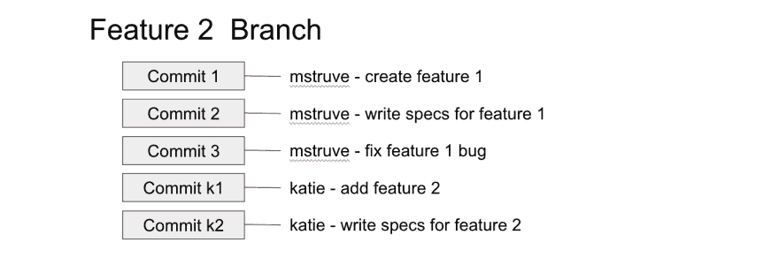
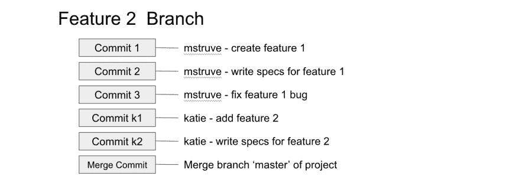
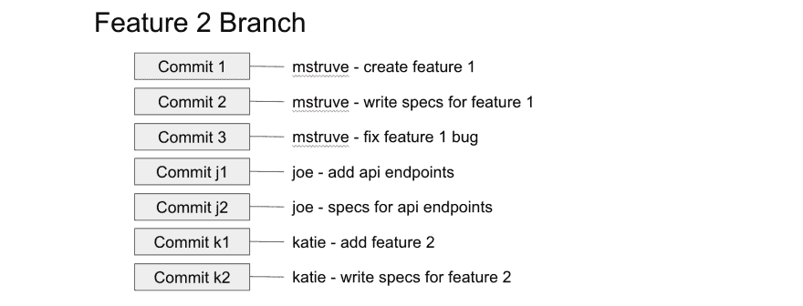

# 没有“正确”的方法:Git Rebase vs Merge

> 原文:[https://dev . to/Molly/there-is-no-right-way-git-rebase-vs-merge-2hc 5](https://dev.to/molly/there-is-no-right-way-git-rebase-vs-merge-2hc5)

为了纪念我的新牌照，我决定做一个简短的帖子，介绍 rebase vs merge，它们是如何工作的，以及我如何选择使用它们。让我们先来看看每一个是如何工作的。

# Rebase 和 Merge 是如何工作的

首先，我们有两个分支。我们有一个主分支，还有一个刚从主分支上切下来的功能 2 分支。两者如下所示。因为我们刚刚剪切了我们的特征 2 分支，它与主分支完全相同，所以没有任何变化。

[T2】](https://res.cloudinary.com/practicaldev/image/fetch/s--QS0PmxQ2--/c_limit%2Cf_auto%2Cfl_progressive%2Cq_auto%2Cw_880/https://thepracticaldev.s3.amazonaws.com/i/4n023bbfpjvlqpqnzfwr.png)

几天后，我们的特性 2 分支有了一些新的提交，新的特性工作已经完成。

[T2】](https://res.cloudinary.com/practicaldev/image/fetch/s--3pWSvQC3--/c_limit%2Cf_auto%2Cfl_progressive%2Cq_auto%2Cw_880/https://thepracticaldev.s3.amazonaws.com/i/h9k17tba7l05v3ydb5ci.png)

在同一天，master 分支也有来自另一个开发人员的几个新的提交，他也在这个项目上工作。

[T2】](https://res.cloudinary.com/practicaldev/image/fetch/s--NLI7n0xU--/c_limit%2Cf_auto%2Cfl_progressive%2Cq_auto%2Cw_880/https://thepracticaldev.s3.amazonaws.com/i/n8xrpljasbrtdl055tm4.png)

现在我们已经准备好测试我们的特性 2 分支，但是在我们测试它之前，我们要确保它已经用 master 中所有的新代码更新了。为了用 master 中的新变化来更新我们的 Feature 2 分支，我们有两个选择，我们可以合并，也可以重定基础。

# 合并

merge 命令将让我们获得主分支上出现的所有开发变更，并通过一次合并提交将它们集成到 Feature 2 分支中。

[T2】](https://res.cloudinary.com/practicaldev/image/fetch/s--5nPj32vJ--/c_limit%2Cf_auto%2Cfl_progressive%2Cq_auto%2Cw_880/https://thepracticaldev.s3.amazonaws.com/i/zte2nmw2u6z31u3j83g2.png)

这个合并提交包含了主分支的所有变更。合并的一个缺点是，如果你的主分支非常活跃，它可能会污染你的特征分支的历史。如果您不希望在您的特性分支历史中包含合并提交，那么您可能需要考虑重新设置基础。

# 重置基础

我们可以使用 rebase 命令，通过重写提交历史，将主分支中的更改集成到我们的 Feature 2 分支中，以便产生一系列直接的线性提交。重设基础将整个特征 2 分支移动到主分支的尖端。

[T2】](https://res.cloudinary.com/practicaldev/image/fetch/s--lM4Xy8p0--/c_limit%2Cf_auto%2Cfl_progressive%2Cq_auto%2Cw_880/https://thepracticaldev.s3.amazonaws.com/i/fkfsfklu67w1wg1rde7w.png)

正如您所看到的，没有额外的提交，一切都井然有序，就像我们刚刚在新的主分支之上添加了特性 2 提交一样。

# 我的换基 vs 合并策略

当谈到重定基础和合并时，我在不同的场景中使用两者。当我需要更新一个我和 master 一起工作的特征分支时，我总是会重定基础。我选择这样做，因为我喜欢我的分支历史干净。如果所有的提交都是新代码，我就更容易阅读和理解。当需要将我的分支变更放入 master 时，我会使用合并。我喜欢这样做，因为这样我就可以很容易地找到一个包含所有分支变更的提交。

根据我的经验，当您与团队一起处理 repo 时，将功能分支合并到主分支中是最常见的做法。你如何选择处理更新你自己的个人特性分支通常由你决定，这就引出了我的下一个观点。

# 没有“正确”的方式

重定基础还是合并是开发社区中存在的古老争论之一，就像制表符还是空格一样。此外，就像制表符和空格一样，当涉及到重设基础和合并时，没有正确的方法。有些人坚持认为你必须总是合并。另一些人认为做事的唯一正确方法是改变基础。猜猜看，既没有对也没有错！如何选择使用 rebase vs merge 取决于您和您的工作流程。

同样的概念也适用于许多常见的开发争论，比如一行应该有多少个字符，一个方法应该有多少行，等等。通常当你学习新东西时，你想知道的是做事的“正确”方法。你一直在找个人告诉你该做什么。不幸的是，这并不总是那么容易。当你开始的时候，不要去寻找正确的方式，去寻找最适合你的方式。每个人都有自己的风格和最有效的工作方式。看看你的周围，沉浸在其他开发者正在做的事情中，但是最终你自己决定什么是最好的。

你还能想到哪些“发展辩论”两种方式都有效，选择哪一种只是个人偏好？