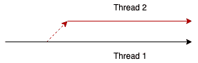
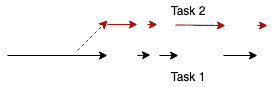
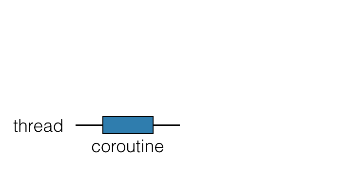

# corinne corinne-async 和并行编程

> 原文：<https://dev.to/canerpatir/kotlin-coroutine-asenkron-ve-paralel-programlama-37l>

### 锅炉的 corinne—async 与并行程序设计

因为异步和并行编程在不同的技术生态系统中有不同的含义，所以我想在开始写作之前先说明这些概念。

#### 并行程序设计(并行化)

在多个 CPU 上，通过将一个任务划分为可并行处理的较小子任务，意味着通过**线程**并行执行。并行处理与所需的数据和资源是相互独立的，并且通常不需要**同步**。举例来说，一个数据源(DB、filesystem 等)。)如果我们要读取一组已知的 id，我们可以将它们划分成若干部分并并行收集。

#### 异步编程(竞争)

这意味着一个应用程序可以同时处理多个任务(竞争)。但在**线程**中，这些并行操作不同**可能不处理**。用于长时间 IO 作业阻止 CPU(无阻塞 IO)。在执行线程 IO 操作的同时，不阻塞线程是一项基于其他任务的任务，并在高利用率情况下使用 CPU。使用 context switch 技术实现此目的。实现此方法的困难在于确保子任务之间的同步。现代编程语言已经在编译器级别解决了同步问题。

**corinne 的**编程语言提供了一种称为**corinuine 的结构。coroutine 表示子任务，并通过名为“T4”的结构实现任务之间的同步。.总而言之，调度程序负责在任务之间共享线程，也就是上下文交换机的工作。**

在接下来的写作中，我将讨论如何用 corione**来进行异步编程。**

#### 你身上的例程？

首先，我要指出的是，corione 不是" T0 "线程。这是一个用来进入社群感知的类比，虽然柯罗蒂诺的团队称之为「T2」「轻量执行绪」「T3」。如果我们想定义死因，可以说是线程执行的任务的一部分。如标题中的 gif 所示，任何线程都可以在 x 瞬间获得并操作花冠。但这并不意味着线程会等待相关的 coroutine 完成。进入阻塞区时(暂停点)会释放线程电晕，并启动另一个线程电晕(context switch)。暂停的任务可以在完成后由另一个线程继续运行。这样就可以在不阻塞线程的情况下有效地使用线程。**冠状动脉异常修补程序**来组织它。使用标有" T8 "特殊功能"的**暂停的**关键字来进行 corotine 非补丁程序上下文切换。在使用 coroutine 和代码示例之前，必须先了解挂起的函数。

#### 暂停功能

我告诉过你 corinne 在特定的悬挂点插入了 context switche。开发人员必须向编译器声明这些点。这些宣告都是以*suspend*做为相关方法的标签。