# 如何使用 Azure 函数构建 Google Actions

> 原文:[https://dev . to/heyay/how-to-build-Google-actions-using-azure-functions-34 D1](https://dev.to/heyay/how-to-build-google-actions-using-azure-functions-34d1)

> 本文是 [#ServerlessSeptember](https://dev.to/azure/serverless-september-content-collection-593p-temp-slug-4543319?preview=f13be4da8a729201c3ed6f23d46efb13851b6800b723ddb762f89e410cdc057436b66afc9bdc49068f5fd8afddc5fb72575f4035266fadea4345a207) 的一部分。在这个无服务器的内容集合中，您可以找到其他有用的文章、详细的教程和视频。9 月份，每天都有来自社区成员和云倡导者的新文章发布，没错，每天都有。
> 
> 在[https://docs.microsoft.com/azure/azure-functions/](https://docs.microsoft.com/azure/azure-functions/?WT.mc_id=servsept_devto-blog-cxa)了解更多关于微软 Azure 如何实现你的无服务器功能。

#### 我将向大家展示如何使用 Azure 函数为 Google Assistant 构建一个动作。

更准确地说，我们将看看如何在 Dialogflow 中通过 webhook 实现，使用 Azure Functions 的后端。

***TL；*博士**

> 1.  Go to [Google Action Console](http://actions.google.com) to create a new project.
> 2.  Set call
> 3.  Build Actions-> Integrate Actions from dialogflow-> Go to dialogflow
> 4.  Set default welcome intention-> enable webhook call set default fallback intention-> enable webhook call
> 5.  For welcome, which stores sessionID & word, generates a mixed word from the dictionary and sends it as a response.
> 6.  For fallback, look up the same session id and return the word in response.

这是一个关于我如何建立我的第一个谷歌行动的故事。你可能会问自己，“什么是谷歌行动？”

[ on [Unsplash](https://unsplash.com?utm_source=medium&utm_medium=referral)](img/a339f9875b29f362bc17448e3f5a5041.png) ](https://res.cloudinary.com/practicaldev/image/fetch/s--qEfWnG6V--/c_limit%2Cf_auto%2Cfl_progressive%2Cq_auto%2Cw_880/https://cdn-images-1.medium.com/max/12000/0%2AJyROyT2IkvhRTSO8) *照片由[凯文·巴加](https://unsplash.com/@kevnbhagat?utm_source=medium&utm_medium=referral)在 [Unsplash](https://unsplash.com?utm_source=medium&utm_medium=referral)* 

### **上的动作谷歌**是一个平台，允许开发者创建被称为“动作”的软件应用，这些应用扩展了 ***谷歌助手*** 的功能。

**谷歌助手**是一款由谷歌开发的*人工智能*驱动的*虚拟助手*，主要用于移动和智能家居设备。谷歌助手可以通过佐马托和优步分别启用的操作来订餐和预订出租车。

一些人(比如我的祖父母、一些医生和其他能力不同的人)发现使用他们的声音比键盘更容易完成日常任务。甚至有人预测在未来的工作站上，声音将会取代键盘。(但是我们将如何编码呢？！)

在语音平台(如谷歌助手)上构建应用的好处之一是，它有助于为你的产品带来包容性，确保每个人都能从你相信的变化中获得同样的好处。

## *什么是字 Jumblr？*

[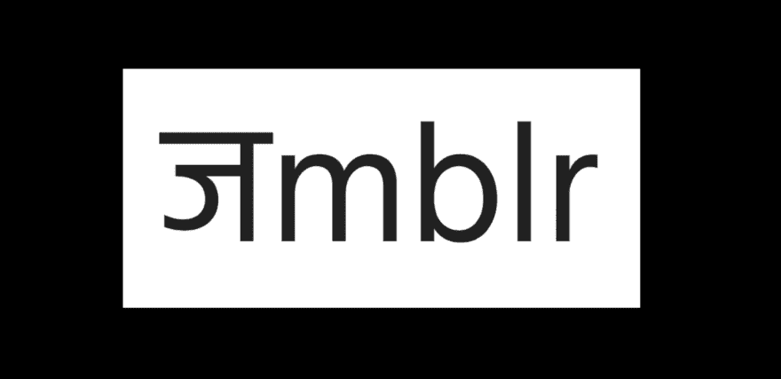 ](https://res.cloudinary.com/practicaldev/image/fetch/s--m7vzDsYT--/c_limit%2Cf_auto%2Cfl_progressive%2Cq_auto%2Cw_880/https://cdn-images-1.medium.com/max/3612/1%2AOcD9GsAQutwLvU1ftnhu4g.png) * Jumblr 标志*

我的 app [word Jumblr](https://assistant.google.com/u/2/services/a/uid/0000002f793261ed) 是一个游戏，给你一个杂乱的单词去解读。

[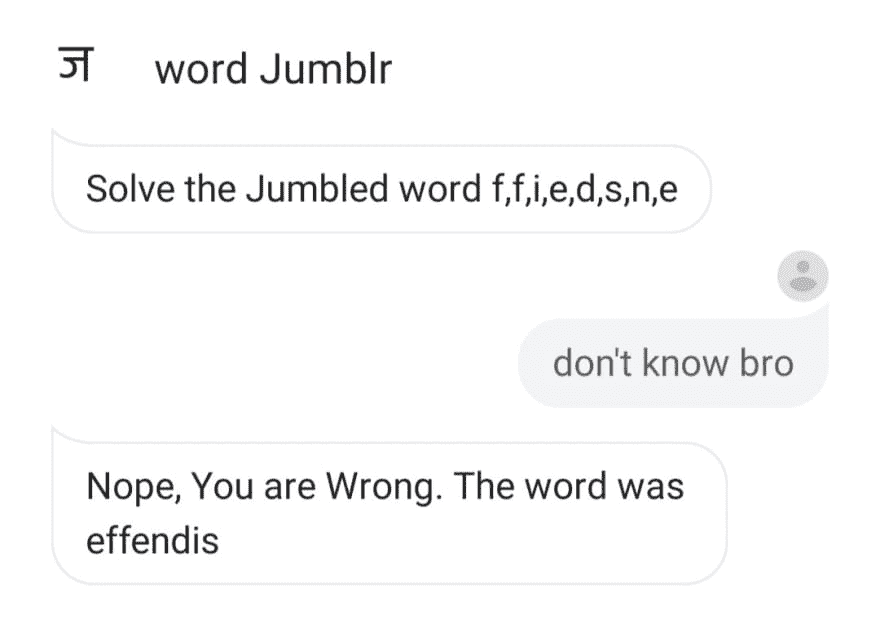 ](https://res.cloudinary.com/practicaldev/image/fetch/s--ryXhCGxV--/c_limit%2Cf_auto%2Cfl_progressive%2Cq_auto%2Cw_880/https://cdn-images-1.medium.com/max/2160/1%2AlGtYG-200ax2TMvVZsQv0w.jpeg) *用于带其他设备的人—例如。Windows Phone*

而且，如果你有一个*安卓*或*苹果*设备，你可以从你的应用商店安装谷歌助手，你就可以开始了。

## 还有，你可以对谷歌助手说，

## *“嘿谷歌，跟 word Jumblr 说话”。*

让我们来理解调用 word Jumblr 时会发生什么。

[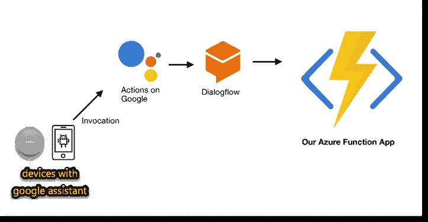 ](https://res.cloudinary.com/practicaldev/image/fetch/s--grnf5LGq--/c_limit%2Cf_auto%2Cfl_progressive%2Cq_auto%2Cw_880/https://cdn-images-1.medium.com/max/2000/1%2ATEsDXmf6H6b37KTsccLMTQ.png) *请求流*

每当用户说出短语(对动作的调用)时，就会触发动作，从而触发 Azure 函数后端处理用户在短语中发送的请求。

示例—
可能是"*从* *优步** " *为我预订一辆出租车，这将调用谷歌助理目录中列出的优步谷歌操作，并将调用他们的后端服务。

对我们来说，是"*与**word Jumblr* ** "触发了我们的 google 操作，然后检查到 dialogflow，然后将请求转发到我们的后端 Azure 功能。

以下是您需要开始的内容:

1.  一个谷歌账户(你不需要谷歌助手设备，你可以在 Actions 门户测试)

2.  一个[微软 Azure 账户](https://azure.microsoft.com/free/?wt.mc_id=heroesvue-github-jopapa&WT.mc_id=azuremedium-blog-chwarren)

## 让派对开始吧！

### ***第一步***——*设置谷歌动作*

转到[谷歌动作控制台](http://actions.google.com)并创建一个新项目。

[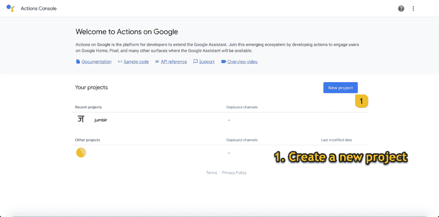 ](https://res.cloudinary.com/practicaldev/image/fetch/s--qyNuXRrZ--/c_limit%2Cf_auto%2Cfl_progressive%2Cq_auto%2Cw_880/https://cdn-images-1.medium.com/max/2880/1%2ArI0AupjUOYIEE4nfNSQMiQ.png) *创建新项目*

[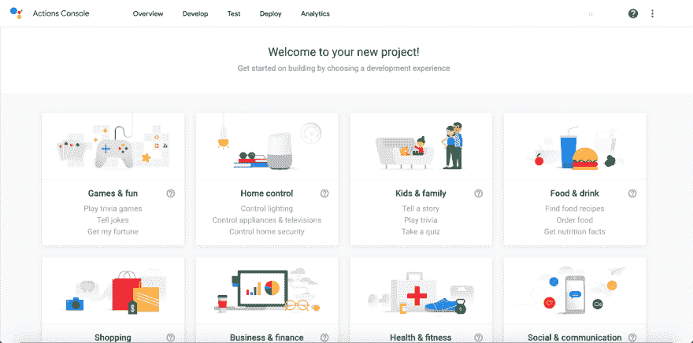 ](https://res.cloudinary.com/practicaldev/image/fetch/s--DiwIMkoZ--/c_limit%2Cf_auto%2Cfl_progressive%2Cq_auto%2Cw_880/https://cdn-images-1.medium.com/max/2880/1%2AA9gnN0C-iUBE2Fe0iEqztw.png) *动作门户会建议一些模板—选择对话式*

选择对话式，因为我将指导如何设置意图和网页挂钩，定制的经验将最适合我们这个项目。

[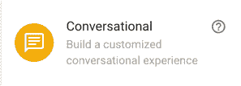 ](https://res.cloudinary.com/practicaldev/image/fetch/s--hmtAEDuJ--/c_limit%2Cf_auto%2Cfl_progressive%2Cq_auto%2Cw_880/https://cdn-images-1.medium.com/max/2000/1%2AtHrqL3qb0dr4hhuDu9vXhg.png) *下面选择对话式下拉菜单。*

*   设置项目的调用——调用设置人们将如何使用短语来触发我们的 google 操作。

[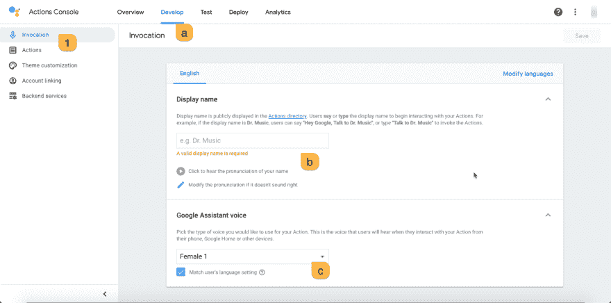 ](https://res.cloudinary.com/practicaldev/image/fetch/s--x-8Ltz45--/c_limit%2Cf_auto%2Cfl_progressive%2Cq_auto%2Cw_880/https://cdn-images-1.medium.com/max/2880/1%2Apr-_lDGPbUdYpXktsBIJqQ.png) *嘿音乐博士，你能不能弹点共鸣的？*

*   构建操作->集成 dialogflow 中的操作->转到 dialogflow

[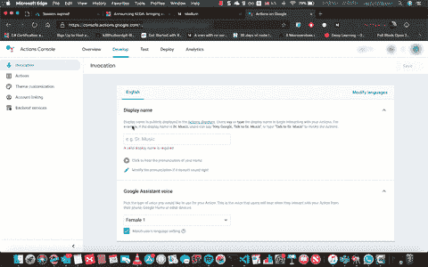 ](https://i.giphy.com/media/YRzjXXj3JLWMIhTWQW/giphy.gif) *设置动作和意图—对话流*

## 第二步。安静点

Dialogflow 是谷歌旗下的基于自然语言对话的人机交互技术开发商。

我们将在这里讨论意图——
《韦氏词典词典》给出的意思是“做一件事时的精神状态”蒂姆·哈尔邦。

这意味着什么活动，或事件，或特定的消息集传达做什么-在这里，在**欢迎意图* *-我想让他们发送请求到我的 Azure 函数，它会用一个混乱的词来响应。

[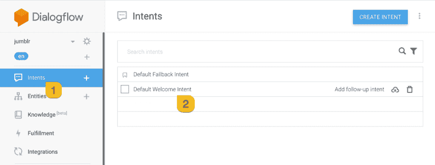 ](https://res.cloudinary.com/practicaldev/image/fetch/s--zhv9a0Zx--/c_limit%2Cf_auto%2Cfl_progressive%2Cq_auto%2Cw_880/https://cdn-images-1.medium.com/max/2154/1%2AwEL71OPQtuXtrW7_MJ323A.png) **设置默认欢迎意图**

设置事件—
*通过 Dialogflow* 欢迎、*谷歌助手*欢迎、*玩游戏*。

有时，用户可以要求隐式调用
(他可以说“玩游戏”，而不是说“和 word jumblr 说话”)
，google action 可以自动调用 word jumblr。

[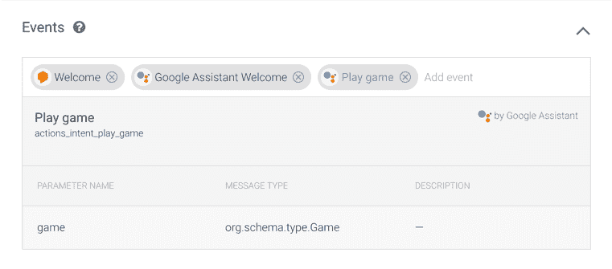 ](https://res.cloudinary.com/practicaldev/image/fetch/s--o_3N47Zo--/c_limit%2Cf_auto%2Cfl_progressive%2Cq_auto%2Cw_880/https://cdn-images-1.medium.com/max/2000/1%2AQ2dkyV4wohKCVF0DGLpbbw.png) *设置调用欢迎意图的事件*

现在，我们需要训练哪些信息/短语与我们的意图是一致的，哪些是受欢迎的意图。

[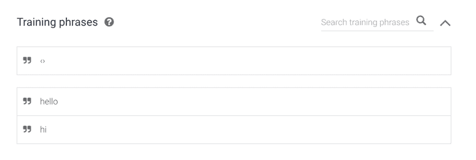 ](https://res.cloudinary.com/practicaldev/image/fetch/s--rjUvPvyI--/c_limit%2Cf_auto%2Cfl_progressive%2Cq_auto%2Cw_880/https://cdn-images-1.medium.com/max/2000/1%2ANzLhyWgOWI-W1gPmkdsP-Q.png) *下面是一些训练短语*

动作和参数在后端简化了调用 Azure 函数的意图动作。如果出现这种情况，不要担心，我们将在稍后的**步骤三**中进行介绍。

[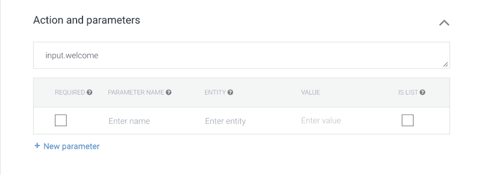](https://res.cloudinary.com/practicaldev/image/fetch/s--wV5tIz2L--/c_limit%2Cf_auto%2Cfl_progressive%2Cq_auto%2Cw_880/https://cdn-images-1.medium.com/max/2000/1%2Av2OiIqaWtnQ7rGO0poPcFQ.png)*行动*

最后一步是打开实现并启用 webhook，这样无论何时事件发生，它都会将请求发送到我们的 azure 函数 URL。

[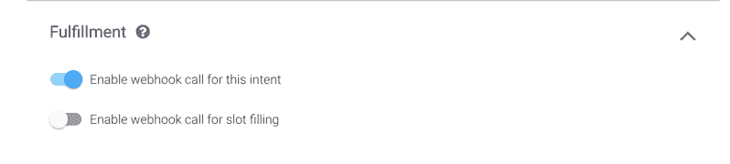](https://res.cloudinary.com/practicaldev/image/fetch/s--ow-20ztB--/c_limit%2Cf_auto%2Cfl_progressive%2Cq_auto%2Cw_880/https://cdn-images-1.medium.com/max/2000/1%2AXhfFcmSm6sm5-pE9Mq1XZw.png)T3】启用 Webhook

我们需要对**默认回退意图**做同样的事情

将操作设置为未知。

[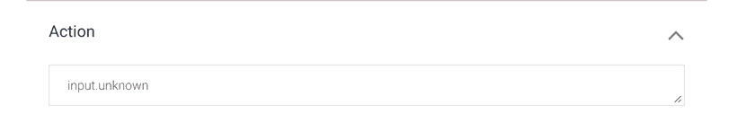 ](https://res.cloudinary.com/practicaldev/image/fetch/s--96sgpPTo--/c_limit%2Cf_auto%2Cfl_progressive%2Cq_auto%2Cw_880/https://cdn-images-1.medium.com/max/2000/1%2AOl78qaaGVHgAbJsg1vZoKA.png) *行动意图*

接下来转到履行并启用 webhook。

[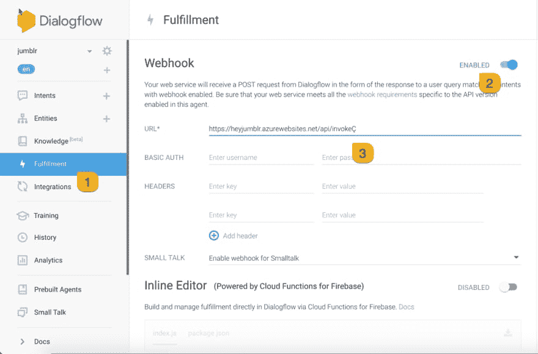 ](https://res.cloudinary.com/practicaldev/image/fetch/s--s4ER3vW8--/c_limit%2Cf_auto%2Cfl_progressive%2Cq_auto%2Cw_880/https://cdn-images-1.medium.com/max/2162/1%2ApGJ59qVYGisw9grrqvFgEQ.png) *对话流程履行*

所以我们需要一个 webhook 中的 URL，而这还没有发生。
按住这个标签，用**【portal.azure.com】**打开一个新的

现在我知道你会说，嘿，阿尤什，停下火车，解释为什么我们要设定目标和实现目标。

 
*火车*

这里我们来看另一个图表—

[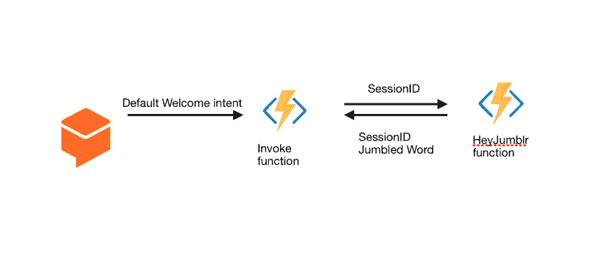 ](https://res.cloudinary.com/practicaldev/image/fetch/s--jXvUtBy4--/c_limit%2Cf_auto%2Cfl_progressive%2Cq_auto%2Cw_880/https://cdn-images-1.medium.com/max/2924/1%2Ay6e6EJFX4xnwPInEZGfjLQ.png) *步骤后调用欢迎意向*

当有人说，“*说话字 jumblr* ”、“*嗨*”、“*你好*等。
一个请求被发送到我们的应用程序，带有一个 sessionID 和一个欢迎意图的操作，即' *input.welcome'*

看一看[这里](https://dialogflow.com/docs/fulfillment/how-it-works)在 [dialogflow 文档](https://dialogflow.com/docs/fulfillment/how-it-works)知道什么在引擎盖下。

[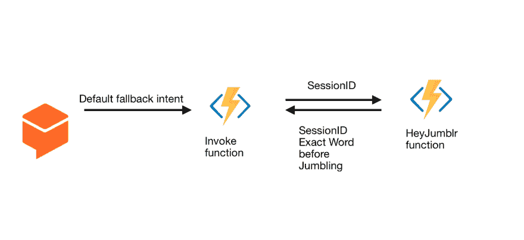 ](https://res.cloudinary.com/practicaldev/image/fetch/s--zw7_GaoI--/c_limit%2Cf_auto%2Cfl_progressive%2Cq_auto%2Cw_880/https://cdn-images-1.medium.com/max/2676/1%2ArhFDmLhlyQC8vza-3TfzBA.png) *后退意图后的步骤*

那么什么是回退，我们为什么需要它呢？每当用户试图解决一个单词时，我们的应用程序都需要一个意图。现在，尝试可以是任何词，像任何事，甚至“退出”或“再见”或一些模糊的东西，所以这种方式没有意图，让它陷入后退可能会帮助我们。

一个带有 sessionID 和回退意图动作的请求被发送到我们的应用程序，回退意图是' *input.unknown '。*

## 第三步。正在准备 Azure 函数。

希望你在新标签页打开了 Azure Portal，因为这里会变得很糟糕

[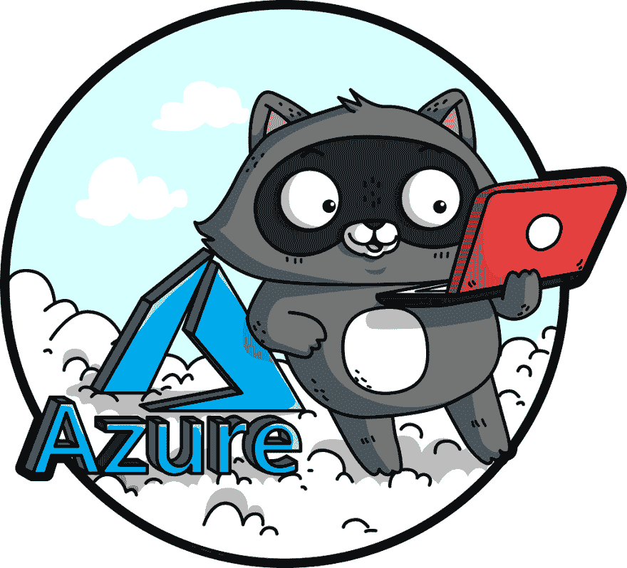T2】](https://res.cloudinary.com/practicaldev/image/fetch/s--_2WWAu8m--/c_limit%2Cf_auto%2Cfl_progressive%2Cq_auto%2Cw_880/https://cdn-images-1.medium.com/max/2048/1%2ANzNP9S4VA3cNONIykXVdNg.png)

1.  创建功能应用程序

2.  选择一个 HTTP 触发器函数，将其命名为 invoke

3.  创建另一个 HTTP 触发器函数，并将其命名为 HeyJumblr

但是你会说，什么是 Azure 函数？

**Azure** **Functions** 是一个事件驱动、按需计算的体验，它扩展了现有的 **Azure** 应用平台，能够实现由虚拟环境中发生的事件触发的代码。

那么函数 I (invoke)中发生了什么