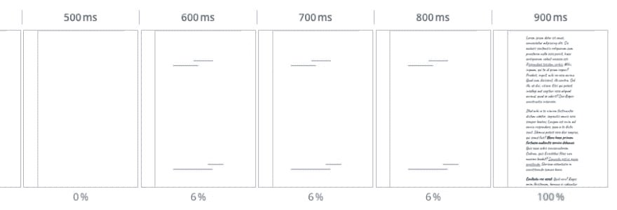

# 第一次内容丰富的绘画(FCP)，开始渲染，第一次绘画。如何正确衡量页面渲染的开始？

> 原文:[https://dev . to/borisschapira/first-content ful-paint-FCP-start-render-first-paint-how-to-rightly-measure-the-begin-of-page-rendering-1919](https://dev.to/borisschapira/first-contentful-paint-fcp-start-render-first-paint-how-to-properly-measure-the-beginning-of-page-rendering-1919)

如何正确衡量网页开始显示内容的速度？有几个 Web 性能指标可以回答这个问题，包括第一次绘制，开始渲染和一个最新的:第一次内容丰富的绘制(FCP)。FCP 是如何脱颖而出的，它的局限性是什么？让我们深入研究一下衡量浏览器早期网页渲染的指标。

在点击或任何其他导航动作之后，如果一些内容已经开始呈现，用户只能感知页面正在加载。我们如何知道渲染开始的时刻？找到导航后浏览器第一次呈现内容的最简单方法之一是询问浏览器本身。这被称为“第一次描绘”，也是最早的 web 性能指标之一。

然而，First Paint 可能会产生误导:“Paint”是从浏览器的角度，而不是从用户的角度。并且浏览器可以执行用户不可见的绘制。例如，如果一个元素使用与默认背景相同的背景进行渲染，那么**第一次绘制**同样会被触发。

使用 First Paint 来跟踪你的页面性能并不能保证你是在跟踪什么时候向你的访问者显示了什么。

我们怎样才能把注意力集中在对访问者有意义的事情上？这是第一幅内容丰富的画试图回答的问题。根据[油漆定时规范](https://w3c.github.io/paint-timing/#first-contentful-paint):

> FCP 是浏览器呈现来自文档对象模型(DOM)的第一部分内容的点，这些内容可能是文本、图像、SVG，甚至是画布元素。
> 
> <cite>绘时 1
> 编辑稿，2019 年 6 月 13 日</cite>

对于 First Paint，浏览器在处理 web 元素的呈现时会返回信息，但它还会检查元素类型(文本、图像、SVG 或画布)。

首先有内容的绘画可以在 Dareboost、WebPageTest 或谷歌服务中找到，如 [Lighthouse](https://blog.dareboost.com/en/2018/06/lighthouse-tool-chrome-devtools/) 或 Chrome UX 报告，这些数据用于 [PageSpeed Insights](https://blog.dareboost.com/en/2018/06/google-page-speed-insights-2/) 。目前，FCP 只在 Chrome 和 Opera 上可用。[火狐也考虑支持它](https://bugzilla.mozilla.org/show_bug.cgi?id=1519410)。

以下是你如何从 Chrome DevTools 获得第一张令人满意的图片:

```
let fcp = performance.getEntriesByName(``"first-contentful-paint"``)[0].startTime; 
```

<svg width="20px" height="20px" viewBox="0 0 24 24" class="highlight-action crayons-icon highlight-action--fullscreen-on"><title>Enter fullscreen mode</title></svg> <svg width="20px" height="20px" viewBox="0 0 24 24" class="highlight-action crayons-icon highlight-action--fullscreen-off"><title>Exit fullscreen mode</title></svg>

不幸的是，FCP 也有一些局限性。

首先，它没有考虑 iframe，如果您的主要内容依赖 iframe 来加载，这可能是一个问题(但这肯定是一个要避免的边缘情况)。

其次，等待待处理的 web 字体被呈现的文本节点可能会使 FCP 有所偏差。[在下面的示例](https://www.dareboost.com/en/report/d_15d6836e290b9986db76db85e?reportIds=d_15d6836e290b9986db76db85e)中，我们假设 FCP 在 900 毫秒左右被触发，因为在此之前我们没有看到任何内容:

<figure>

[T2】](https://res.cloudinary.com/practicaldev/image/fetch/s--vdgUJ1z5--/c_limit%2Cf_auto%2Cfl_progressive%2Cq_auto%2Cw_880/https://lh6.googleusercontent.com/BkAQ3bTLN6eJAi2-wcAytLoeyT_1wZMNCqVeyovF_kqcetg4eg3DgywX73vPUQsnDCoxZ0D2uIhPj5uUZuhW2nOATuYwt222Wf74N9l-foKK2WE9AIYfJF886DpV95vQtJpWe2of)

<figcaption>The filmstrip of our example</figcaption>

</figure>

实际的 FCP 值约为 600 毫秒，因为这是浏览器首次呈现文本节点的时间，即使字体尚未加载，因此文本会暂时保持“空白”(不可见)。这种现象被称为隐形文本闪烁(FOIT)。

为了避免您的网站上出现这种行为，请确保您使用的@font-face CSS 指令中的[`font-display`描述符](https://developer.mozilla.org/en-US/docs/Web/CSS/@font-face/font-display)没有默认值。如果你使用谷歌字体，请注意这项服务现在鼓励用户使用`font-display:swap`值。确保您的 Google 字体导入声明为 URL 查询中的“display”参数指定了一个值。

```
<link href="https://fonts.googleapis.com/css?family=Caveat&amp;display=swap" 
 rel="stylesheet"> 
```

<svg width="20px" height="20px" viewBox="0 0 24 24" class="highlight-action crayons-icon highlight-action--fullscreen-on"><title>Enter fullscreen mode</title></svg> <svg width="20px" height="20px" viewBox="0 0 24 24" class="highlight-action crayons-icon highlight-action--fullscreen-off"><title>Exit fullscreen mode</title></svg>

使用 First Contentful Paint 可能面临的一个主要限制是度量没有绑定到视口。无论内容显示在哪里，它都会触发 FCP，即使内容不在文件夹上方，因此对访问者来说是不可见的。

为了真正跟踪我们确定有东西向用户显示和可见的时间，我们必须使用另一个度量: **Start Render** 。开始渲染算法基于页面加载的视频分析，在视口中寻找第一个改变的像素。

即使无论内容类型如何(作为第一次绘制)，启动渲染都会触发，这也是一个很好的方法来跟踪用户可以感知到页面正在加载的时间，同时避免跟踪与浏览器相关的“技术”绘制。

“开始渲染”仅通过合成监控工具可用，因为需要视频分析，而“FCP”和“第一次绘制”可以直接从浏览器中请求，这使得它们也可用于真实用户监控(RUM)。

简而言之:

**First Paint**

The first paint action of the browser, from the browser own perspective. Not necessarily visible from a human.

**First Contentful Paint**

The first paint action of the browser, from the browser own perspective, concerning a text, an image, an SVG or a Canvas. Iframes are excluded, and text can be painted but still not visible (because of a webfont still being loaded, or outside of the viewport).

**Start Render**

Something is visible by the user in the viewport. Whatever it is, even if it’s only a background.

使用 Dareboost，您可以非常容易地测量和监控这些指标。我们建议只关注其中的一个，我们建议开始渲染，因为它是边缘情况较少的一个。

如果您还不是我们卓越的客户之一，请不要再等待，立即申请试用我们的[合成监测服务](https://www.dareboost.com/en/tool/website-monitoring)。