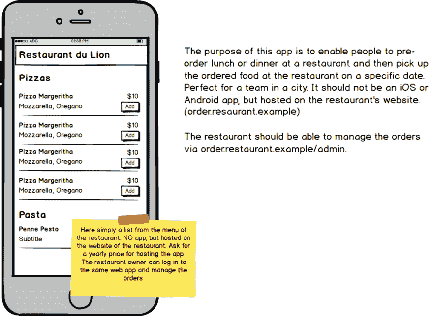
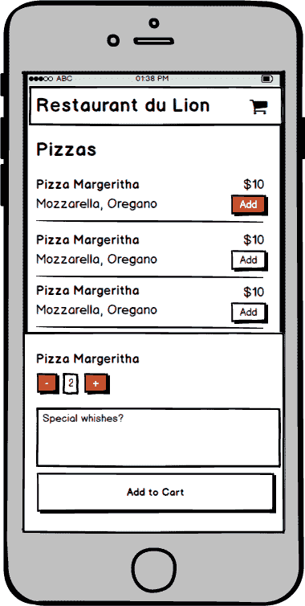
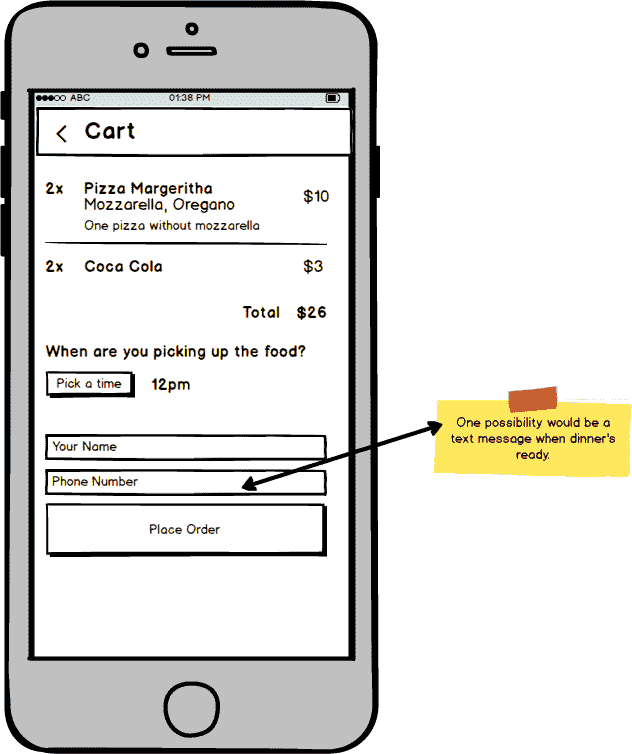
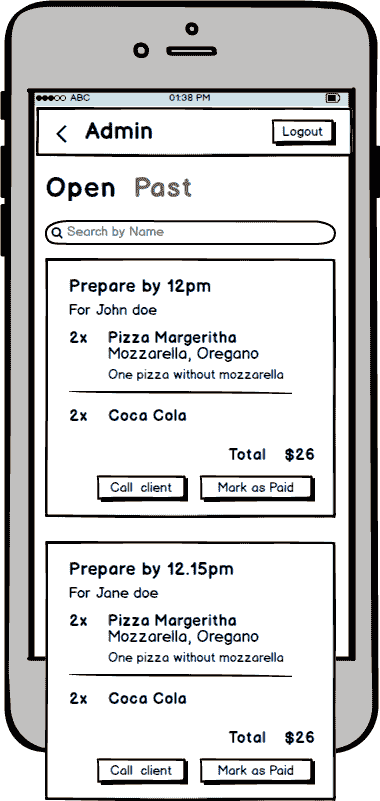

# 边项目想法#15 -简单的预购外卖 PWA -托管在一家餐厅的子域。

> 原文：<https://dev.to/binconsole/side-project-ideas-15-simple-pre-order-to-takeaway-pwa-hosted-on-a-restaurant-s-subdomain-405p>

这个想法实际上相对容易实现，但我仍然认为它会在某些城镇和村庄取得成功。就是写一个小的 PWA，托管在餐厅的网站上。你可以收取托管年费，并且在这一年中没有进一步的努力。

很多餐厅不送餐，但是可以上门取菜。队伍通常很长，一个团队可能不想等太久才能拿到食物。

| 屏幕 | 实体模型 |
| --- | --- |
| 主页 |  |
| 选择项目 |  |
| 购物车详细信息 |  |
| 管理 |  |

那在你的城镇里可能吗？问一家餐馆他们是否感兴趣。