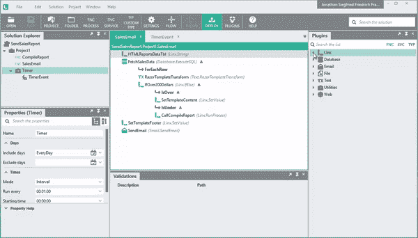
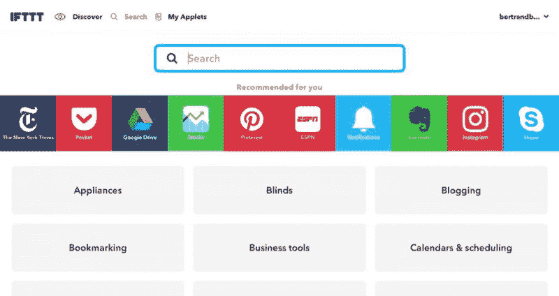
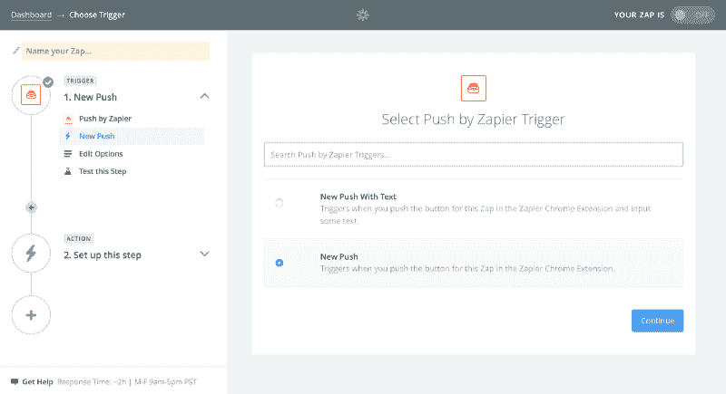
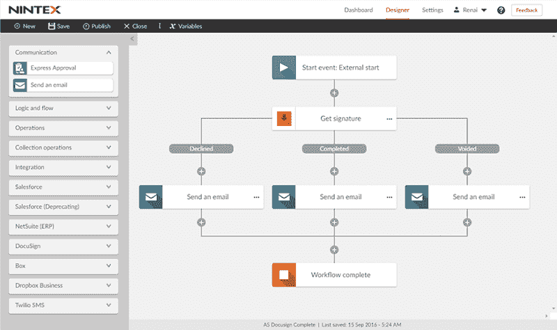
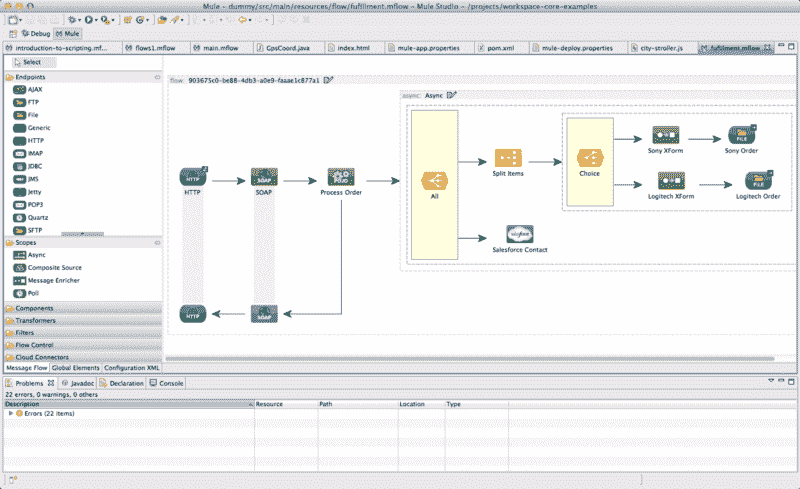

# 自动化工作流程的五大工具

> 原文:[https://dev . to/linx software/top-5-tools-to-automate-workflows-333 e](https://dev.to/linxsoftware/top-5-tools-to-automate-workflows-333e)

现代全球市场的竞争要求尽可能实现自动化工作流程。这意味着在许多不同领域替换或补充人力资源。对于没有经验的人来说，这可能很难采用，但是幸运的是，有一些易于理解和实现的解决方案可用并且正在开发中。

自动化通过显著提高生产率来增加价值。这可以为更重要的事情腾出时间和资源，让你走在时代的前面。传统上，自动化需要高级编程和训练有素的(昂贵的)工程师。然而，现在市场上有用户友好的工作流自动化工具来帮助你适应。

## Linx

[Linx](https://linx.software) 是一个低代码集成开发环境(IDE)和服务器，设计、构建和集成定制的自动化解决方案。它通过创建具有技术上复杂的任务和多个步骤的以流程为中心的应用程序来丰富业务。

[T2】](https://res.cloudinary.com/practicaldev/image/fetch/s--VpQ-0olM--/c_limit%2Cf_auto%2Cfl_progressive%2Cq_66%2Cw_880/https://cdn-images-1.medium.com/max/800/1%2A5nQMC2ur8Gvbg2VDxIszUA.gif)

**用例**

Linx 可以轻松地生成 Windows 进程、创建和使用 web 服务、集成传统或 SaaS 系统、自动化数据传输、处理大量文件管理等等。它通过可重复业务流程的自动化来培养效率。对于自动化流程和 web 服务的快速开发和部署，Linx 是一个很好的工具。

**利弊**

*   优点:具有许多预建的集成插件，全面而简单的集成，后端开发，低代码或无代码操作。
*   缺点:没有简单的图形用户界面，所有进程都在 IDE 中构建和管理，并部署在后台运行。

**更多信息和定价**

您可以免费下载并保留设计工具。如果您想要自动化您的应用程序(您已经在设计器中创建的)，那么您需要应用服务器。云服务器按托管的应用程序收费，[每月 149 美元起](https://linx.software/pricing/)。<abbr title="Phone &amp; email preferential support including solution review and training.">高级支持</abbr>每月另付 99 美元)。

* * *

IFTTT

IFTTT 已经因其社交媒体应用而闻名。它是一个软件集成工具，为所有经验水平的用户生成了一个大型的自动化部件库。

[T2】](https://res.cloudinary.com/practicaldev/image/fetch/s--iJCVwJ0c--/c_limit%2Cf_auto%2Cfl_progressive%2Cq_auto%2Cw_880/https://cdn-images-1.medium.com/max/800/1%2AyJKEl4V51V8tQNp7xbFX4A.jpeg)

**用例**

你可以连接不同的产品(比如日历应用和微博平台)来简化数字流程。

**利弊**

*   优点:一个拥有各种产品实现的大型用户社区，包括许多常见的日常应用。
*   缺点:不是最面向业务的平台。

**更多信息和定价**

业余爱好者、设计者、开发者和企业可以出于多种目的使用 IFTTT。如果你注册了一个免费账户，你可以建立简单的工具来同步不同的应用程序，然后从那里开始。业务选项是最全面的解决方案，定价根据您独特的业务需求而定。

* * *

扎皮尔

Zapier 简化了 web 应用程序之间的自动化，这样用户就可以专注于其他重要的任务。

[T2】](https://res.cloudinary.com/practicaldev/image/fetch/s--V7xjUzzh--/c_limit%2Cf_auto%2Cfl_progressive%2Cq_auto%2Cw_880/https://cdn-images-1.medium.com/max/800/1%2AAse98pGZK8_8yohnyHgCkg.png)

**用例**

这种解决方案特别适合寻求将自动化工作流集成到他们的环境中，而几乎不需要任何编码经验的企业。

**利弊**

*   优点:您可以用这个工具集成许多不同的现有工作流，并且如果需要的话，可以非常简单地创建新的自动化工作流。
*   缺点:这不是目前最便宜的选择(特别是如果你有一个多样化的工作流工具集)。

**更多信息和定价**

Zapier 中的每个自动化部件被称为“Zap”他们的定价模式是非常递增的，并考虑到你需要使用多少 Zaps。

虽然如果您确切地知道您需要什么，并且您的需求不会有太大的波动，这可能非常有用，但是如果您试图扩展，并且很难预测工作流中的剧烈变化，这可能会导致预算问题。

永久免费选项允许 5 次切换，而初级选项允许 20 次，专业选项允许 50 次，专业增强选项允许 125 次(每月费用分别为 20 美元、50 美元和 125 美元)。

在团队和公司层，团队选项具有专业选项的所有功能，但针对协作使用进行了增强(包括团队文件夹等有用的工具)。

* * *

Nintex

[Nintex](https://www.nintex.com/) 是业务自动化工作流程的综合解决方案。其灵活性使其成为具有广泛工作流需求的企业的理想选择。

[T2】](https://res.cloudinary.com/practicaldev/image/fetch/s--GgwHtQLQ--/c_limit%2Cf_auto%2Cfl_progressive%2Cq_auto%2Cw_880/https://cdn-images-1.medium.com/max/800/1%2Ayd-hOuIDlDB5rgDDBPEdNA.png)

**用例**

Nintex 最适合需要分析来跟踪效率和责任的地方，特别是在分布式团队环境中。

**利弊**

*   优点:该产品享有相对广泛的知名度和灵活的定价模式。
*   缺点:用户界面不太直观，而且有人抱怨令人困惑的提示(尤其是错误信息)。

**更多信息和定价**

Nintex 对于远程协作非常有价值。价格涵盖了广泛的业务，所以建议您联系他们，以更好地了解您的预算。他们的仪表板类似于 Sharepoint 或吉拉，对所有用户来说可能不是最直观的。尽管如此，先进的分析使它在许多方面具有潜在的价值。

单就过程自动化而言，Nintex 每月为您提供五个工作流，用户数量不限，每月 650 美元(标准版)和 950 美元(企业版)。为了添加他们的流程管理功能(每月 25)，他们的计划每月起价 1，400 美元，并可以根据您的业务需求进行扩展。

* * *

Mulesoft

Mulesoft 是一个自动化应用网络和工作流集成的平台，跨团队管理相对简单。

[T2】](https://res.cloudinary.com/practicaldev/image/fetch/s--MPH0mgj3--/c_limit%2Cf_auto%2Cfl_progressive%2Cq_auto%2Cw_880/https://cdn-images-1.medium.com/max/800/1%2Ae-d9Bt-MsBo2dWkAUNhizA.png)

**用例**

该解决方案最适合数据需求较少的企业，尤其是涉及移动最终用户设备的企业。

**利弊**

*   优点:它非常适合涉及非面向技术的团队的企业和跨部门工作流，具有非常直观的 UI 和仪表板。
*   缺点:对于需要扩大数据需求的企业来说，这不是最可靠的选择。

**更多信息和定价**

Mulesoft 的 Anypoint 平台提供了广泛的定价选择，并拥有许多著名的顶级客户。该产品用于构建和管理整个企业的应用程序。它允许您使用自动化和 API 来集成软件并极大地提高业务生产率。

Mulesoft Anypoint 平台有三个定价等级:黄金级、白金级和钛级。直接联系 Mulesoft 了解价格。

摘要

虽然大型企业可能会从 Nintex 和 Mulesoft for Enterprise 等产品中受益，但 IFTTT 可能更适合刚刚起步的小型企业。如果你经营一家小企业，想要扩大你的社交媒体影响力，可以看看 IFTTT 的 Twitter 小程序，看看他们的其他工具。

像 IFTTT 一样，Zapier 也非常适合刚刚起步或希望自动化小而简单的任务的企业。对于有后端开发、流程自动化和 web 服务经验的高级用户来说，Linx 要好得多。

无论您或您的员工的技能水平如何，最好从这些工具开始，因为它们正在塑造业务工作流的未来。

原帖来自[https://dzone . com/articles/5-tools-for-fast-workflow-automation](https://dzone.com/articles/5-tools-for-fast-workflow-automation)

帖子[自动化工作流的五大工具](https://linx.software/5-tools-to-automate-workflows/)首先出现在 [Linx](https://linx.software) 上。