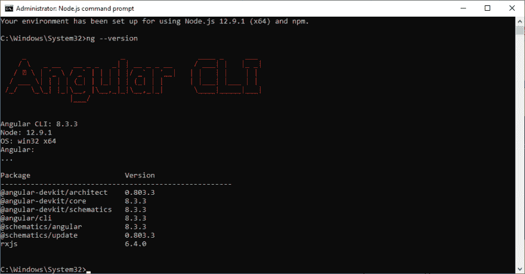
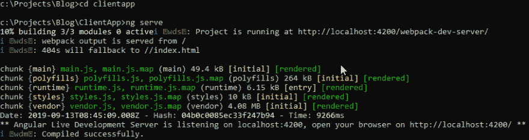
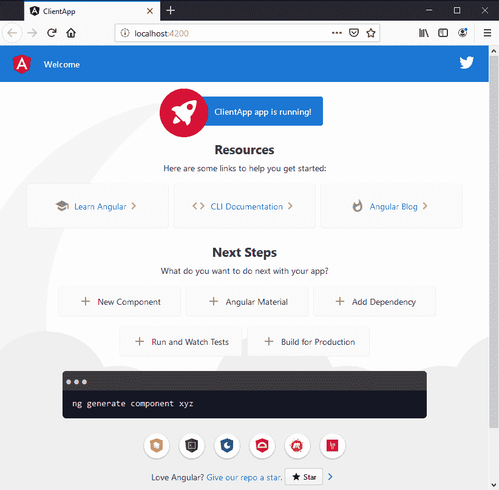

# 用 REST API 和 ASP.NET 核心 2.2 构建 Angular 8 应用程序——第 2 部分

> 原文：<https://dev.to/dileno/build-an-angular-8-app-with-rest-api-and-asp-net-core-2-2-part-2-46ap>

在本教程的第 1 部分，我们构建了 ASP.NET 核心后端。

## 第二部分-创建 Angular 8 app

现在，我们最后从 Angular app 开始。我们将使用 [Node.js](https://nodejs.org/en/) 和 [Angular CLI](https://cli.angular.io/) 生成角度项目和必要的文件。

记住。 **[Github repo 在这里:Angular 8 博客 app 教程使用。NET Core 2.2 和实体框架后端](https://github.com/dileno/Blog-tutorial-Angular-8-.NET-Core-2.2-CRUD)T3】**

## 先决条件

*   [Node.js](https://nodejs.org/en/)

*   [角度 CLI](https://cli.angular.io/)

*   [VS 代码](https://code.visualstudio.com/)

安装 Node.js 后，可以打开 Node.js 命令提示符。

在命令提示符下执行此命令以安装 Angular 8 CLI:

`npm install -g @angular/cli`

这将在全球范围内安装最新的 Angular CLI，需要一点时间。完成后，您可以使用以下命令检查角度版本:

`ng --version`

Node.js 命令提示符应该如下所示:

现在，让我们转到 Visual Studio 后端所在的文件夹。使用 cd 命令可以做到这一点:

`cd c:/projects/blog`

我们将简单地把我们的 Angular 8 应用程序称为 ClientApp。让我们执行创建角度应用程序的命令:

`ng new ClientApp`

我们会被提示一些问题。我们想使用路由(按 Y)和样式表格式:SCSS。然后让 Node 做自己的事情，创建 web 应用程序。它需要一分钟左右。

创建应用程序后，将 cd 命令放入应用程序文件夹:

`cd ClientApp`

然后用`ng serve`命令构建并运行应用程序:

`ng serve`

命令提示符将如下所示:

构建成功，现在你可以通过 URL**[http://localhost:4200](http://localhost:4200)**浏览你的 Angular 应用。基本的 Angular 8 应用程序基于一个模板，看起来像这样:

如果你看一下源代码，它会是这样的: