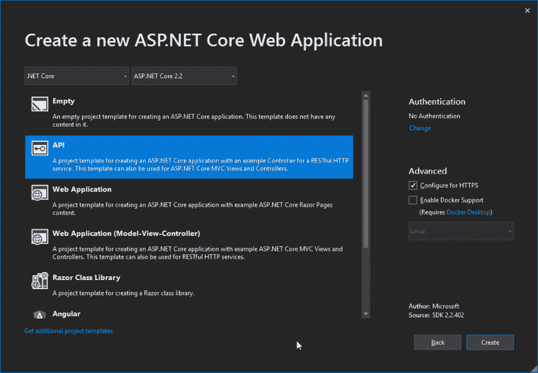

# 用 Angular 8 和 ASP.NET 核心 2.2 构建一个简单的 CRUD 应用程序——第 1 部分——后端

> 原文:[https://dev . to/dile no/build-a-simple-crud-app-with-angular-8-and-ASP-net-core-2-2-part-1-back-end-39e 1](https://dev.to/dileno/build-a-simple-crud-app-with-angular-8-and-asp-net-core-2-2-part-1-back-end-39e1)

## 第 1 部分-具有 ASP.NET 核心 2.2 和实体框架核心的后端

让我们看看如何使用 ASP.NET 核心 2.2、实体框架核心和 Angular 8 构建 CRUD web 应用程序。这是我们关注后端的第 1 部分。

[第二部分在这里——Angular 8 应用与 REST API](https://dev.to/dileno/build-an-angular-8-app-with-rest-api-and-asp-net-core-2-2-part-2-46ap)

我们将在后端有一个 REST API，在前端有一个 Angular app。

基本的 CRUD 应用程序将会是一个博客，在这里我们可以 **C** 创建、 **R** 阅读、 **U** 更新和 **D** 删除博客文章。

**[Github repo 在这里:Angular 8 博客 app 教程使用。NET Core 2.2 和实体框架后端](https://github.com/dileno/Blog-tutorial-Angular-8-.NET-Core-2.2-CRUD)T3】**

## 先决条件

*   [。网芯 2.2 SDK](https://dotnet.microsoft.com/download)

*   [Visual Studio 2019](https://visualstudio.microsoft.com/vs/)

对于有角度的前端，我们还将使用:

*   [VS 代码](https://code.visualstudio.com/)

*   [Node.js](https://nodejs.org/en/)

*   [角度 CLI](https://cli.angular.io/)

确保安装了以上各项。后端我们会用 Visual Studio 2019，前端用 VS 代码。但是，如果您愿意，您可以只使用 Visual Studio 2019。

截止到 9 月 15 日，已经有了。使用 Visual Studio 2019 预览版的 NET Core 3。然而，在本教程中，我们不会使用任何预览，只使用完全发布版本的。NET Core 2 和 Visual Studio 2019。

## 创建 ASP.NET 核心 2.2 REST API

在 Visual Studio 2019 中，创建一个新项目并选择 ASP.NET 核心 Web 应用程序。命名我们的项目(博客)。然后选择. ASP.NET Core 2.2 版本和 API 模板:

[T2】](https://res.cloudinary.com/practicaldev/image/fetch/s--GXxQjJ-h--/c_limit%2Cf_auto%2Cfl_progressive%2Cq_auto%2Cw_880/https://thepracticaldev.s3.amazonaws.com/i/sgoh4c7tiz8kv0ugusnb.png)

## 添加模型和实体框架数据库上下文

接下来，让我们创建一个名为 Models 的文件夹，然后添加一个名为 **BlogPost.cs** 的类文件。确保导入必要的名称空间。