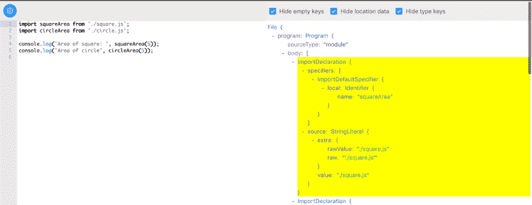

# 我写了我的模块捆绑器

> 原文:[https://dev.to/tanhauhau/i-wrote-my-module-bundler-23cl](https://dev.to/tanhauhau/i-wrote-my-module-bundler-23cl)

在我之前的文章中，我解释了模块捆绑器是如何工作的。我使用了 [webpack](https://webpack.js.org) 和 [rollup](https://rollupjs.org) 作为例子，它们中的每一个都给了我们一个不同的视角，告诉我们如何捆绑我们的 JavaScript 应用。

在本文中，我将向您展示我是如何编写我的模块 bundler 的。模块捆扎机本身并不适合生产，但我通过练习学到了很多，而且我越来越欣赏现代模块捆扎机所提供的东西。

* * *

⚠️ **警告:前方有大量的 JavaScript 代码。🙈😱😨** ⚠️

* * *

# [](#getting-started)入门

我在我的前一篇文章中谈到了模块捆绑器的输入(JavaScript 模块)和输出(捆绑的 JavaScript 文件)。现在是时候编写一个接收输入并产生输出的模块捆绑器了。

一个*基本*模块捆扎机可以分为两个部分:

*   理解代码并构建依赖图**(依赖解析)**
*   将模块组装成一个(或多个)JavaScript 文件 **(Bundle)**

> **依赖图**是模块间依赖关系的图形表示。

## [](#the-input)输入

在本文中，我将使用以下文件作为我对 bundler 的输入:

```
// filename: index.js
import squareArea from './square.js';
import circleArea from './circle.js';

console.log('Area of square: ', squareArea(5));
console.log('Area of circle', circleArea(5)); 
```

```
// filename: square.js
function area(side) {
  return side * side;
}
export default area; 
```

```
// filename: circle.js
const PI = 3.141;
function area(radius) {
  return PI * radius * radius;
}
export default area; 
```

我已经在 [Github](https://github.com/tanhauhau/byo-bundler/tree/master/fixture) 上创建了这个项目，所以如果你有兴趣亲自尝试一下，你可以克隆它并检查`fixture-1`标签。输入文件在`fixture/`文件夹中。

# [](#writing)写作

我从模块捆绑器的主要结构开始:

```
function build({ entryFile, outputFolder }) {
  // build dependency graph
  const graph = createDependencyGraph(entryFile);
  // bundle the asset
  const outputFiles = bundle(graph);
  // write to output folder
  for(const outputFile of outputFiles) {
    fs.writeFileSync(
      path.join(outputFolder, outputFile.name),
      outputFile.content,
      'utf-8'
    )
  }
} 
```

> **依赖图**是一个[有向图](https://en.wikipedia.org/wiki/Directed_graph)，其中顶点是模块，有向边是模块之间的依赖关系。

```
function createDependencyGraph(entryFile) {
  const rootModule = createModule(entryFile);
  return rootModule;
} 
```

所以，入口模块是图的“根”。

在`createModule`中，我实例化了一个新的`Module`实例:

```
function createModule(filePath) {
  return new Module(filePath);
} 
```

类`Module`将用于记录模块属性，例如内容、依赖关系、导出的密钥等。

```
class Module {
  constructor(filePath) {
    this.filePath = filePath;
    this.content = fs.readFileSync(filePath, 'utf-8');
    this.dependencies = [];
  }
} 
```

虽然`content`是模块的字符串内容，为了理解它的实际含义，我使用[巴别塔](http://babeljs.io)到*将内容*解析成 AST(抽象语法树):

```
// highlight-next-line
const babel = require('@babel/core');

class Module {
  constructor(filePath) {
    this.filePath = filePath;
    this.content = fs.readFileSync(filePath, 'utf-8');
    // highlight-next-line
    this.ast = babel.parseSync(this.content);
  }
} 
```

接下来，我需要找出这个模块的依赖:

```
class Module {
  constructor(filePath) {
    this.filePath = filePath;
    this.content = fs.readFileSync(filePath, 'utf-8');
    this.ast = babel.parseSync(this.content);
    // highlight-start
    this.dependencies = this.findDependencies();
  }
  findDependencies() {
    //
  }
  // highlight-end
} 
```

那么，我怎么知道这个模块的依赖关系是什么呢？

我可以在
[babel-ast-explorer](https://lihautan.com/babel-ast-explorer/#?eyJiYWJlbFNldHRpbmdzIjp7InZlcnNpb24iOiI3LjQuNSJ9LCJ0cmVlU2V0dGluZ3MiOnsiaGlkZUVtcHR5Ijp0cnVlLCJoaWRlTG9jYXRpb24iOnRydWUsImhpZGVUeXBlIjp0cnVlfSwiY29kZSI6ImltcG9ydCBzcXVhcmVBcmVhIGZyb20gJy4vc3F1YXJlLmpzJztcbmltcG9ydCBjaXJjbGVBcmVhIGZyb20gJy4vY2lyY2xlLmpzJztcblxuY29uc29sZS5sb2coJ0FyZWEgb2Ygc3F1YXJlOiAnLCBzcXVhcmVBcmVhKDUpKTtcbmNvbnNvbGUubG9nKCdBcmVhIG9mIGNpcmNsZScsIGNpcmNsZUFyZWEoNSkpO1xuIn0=) 的帮助下从 AST 中查找`import`语句。

[](https://res.cloudinary.com/practicaldev/image/fetch/s--J1WhJ4kO--/c_limit%2Cf_auto%2Cfl_progressive%2Cq_auto%2Cw_880/https://lihautan.com/static/87b78a845870fcfa5bb6756e80815d95/7a439/ast-import.png) 
*通过巴别塔可视化 AST-AST-explorer*

我发现 AST 中的`import`语句被称为`ImportDeclaration`。它有`specifiers`和`source`，`source.value`告诉我们这个模块是从什么地方导入的:

```
findDependencies() {
  // highlight-start
  return this.ast.program.body
    .filter(node => node.type === 'ImportDeclaration')
    .map(node => node.source.value)
  // highlight-end
} 
```

所以我有了模块请求的路径，但是它可能是相对于当前文件的，例如`"./foo/bar"`，或者来自`node_modules`，例如:`"lodash"`。我如何知道模块请求的**实际文件路径**是什么？

基于请求路径计算出实际路径的步骤被称为**“解析”** :

```
findDependencies() {
  return this.ast.program.body
    .filter(node => node.type === 'ImportDeclaration')
    .map(node => node.source.value)
  // highlight-next-line
    .map(relativePath => resolveRequest(this.filePath, relativePath))
}

// highlight-start
// resolving
function resolveRequest(requester, requestedPath) {
  //
} 
```

*解析路径到实际文件路径*

## [](#resolving)解析

先说化解。我们知道，在下面的例子中“导入”`./b.js`将导致获得一个不同的文件，因为当我们指定`./`时，我们是相对于当前文件“导入”的。

```
// filename: project/a.js
import './b.js'; 
```

```
// filename: project/foo/a.js
import './b.js'; 
```

那么，解析一个模块的规则是什么呢？

Node.js 文档已经列出了模块解析算法的[详细步骤:](http://nodejs.org/api/modules.html#modules_all_together)

当我们指定一个相对路径`./b`时，Node.js 将首先假设`./b`是一个文件，如果它不完全匹配文件名，就尝试下面的扩展名:

```
b
b.js
b.json
b.node 
```

如果该文件不存在，Node.js 将尝试将`./b`视为一个目录，并尝试以下操作:

```
"main" in b/package.json
b/index.js
b/index.json
b/index.node 
```

如果我们改为指定`import 'b'`，Node.js 将把它视为`node_modules/`中的一个包，并具有不同的解析策略。

通过上图我们可以看出，解决`import './b'`并不像看起来那么简单。除了默认的 Node.js 解析行为， [webpack 提供了更多的定制选项](https://webpack.js.org/configuration/resolve/)，比如定制扩展、别名、模块文件夹等等。

在这里，我向您展示了*“最简单的”*解析器，它只解析相对路径:

```
const path = require('path');
// highlight-start
// resolving
function resolveRequest(requester, requestedPath) {
  return path.join(path.dirname(requester), requestedPath);
} 
```

> <small>**注意:**你应该试着从`node_modules/`</small> 写一个完整的节点解析器，既可以相对解析也可以绝对解析

现在我知道了实际请求的文件路径，然后我用它们创建模块。

```
findDependencies() {
  return this.ast.program.body
    .filter(node => node.type === 'ImportDeclaration')
    .map(node => node.source.value)
    .map(relativePath => resolveRequest(this.filePath, relativePath))
    // highlight-next-line
    .map(absolutePath => createModule(absolutePath))
} 
```

因此，对于每个模块，我找到它们的依赖项，解析它们，找到每个依赖项的依赖项，也解析它们，找到它们的依赖项，以此类推。在这个过程的最后，我得到了一个模块依赖图，看起来像这样:

```
Module {
  filePath: '/Projects/byo-bundler/fixture/index.js',
  content:
   'import squareArea from \'./square.js\';\nimport circleArea from \'./circle.js\';\n\nconsole.log(\'Area of square: \', squareArea(5));\nconsole.log(\'Area of circle\', circleArea(5));\n',
  ast:
   Node { /*...*/ },
  dependencies:
   [ Module {
       filePath: '/Projects/byo-bundler/fixture/square.js',
       content:
        'function area(side) {\n return side * side;\n}\nexport default area;\n',
       ast: Node {/* ... */},
       dependencies: []
      },
     Module {
       filePath: '/Projects/byo-bundler/fixture/circle.js',
       content:
        'const PI = 3.141;\nfunction area(radius) {\n return PI * radius * radius;\n}\nexport default area;\n',
       ast: Node {/* ... */},
       dependencies: []
      }
   ]
} 
```

图的根是我们的入口模块，你可以通过模块的`dependencies`遍历图。如您所见，`index.js`有两个依赖项，`square.js`和`circle.js`。

> <small>**注意:**如果您正在跟进，您可以检查标签`feat-1-module-dependency-graph`，查看我到目前为止编写的代码。</small>

## [](#bundling)捆绑

有了模块依赖图，是时候将它们捆绑到一个文件中了！

此时，我们可以选择是以**“web pack 方式”**还是以**“roll up 方式”**进行捆绑。在这篇文章中，我将向你展示我是如何做到的**“网络包方式”**。在下一篇文章中，我将在**“roll up way”**中讨论捆绑。

> 如果你不知道什么是**、**、**、**、[上一篇文章](https://lihautan.com/what-is-module-bundler-and-how-does-it-work/)中我已经“创造”了这个术语，并有详细的解释！

让我们看看最终的捆绑文件会是什么样子:

```
const modules = {
  'circle.js': function(exports, require) {
    const PI = 3.141;
    exports.default = function area(radius) {
      return PI * radius * radius;
    };
  },
  'square.js': function(exports, require) {
    exports.default = function area(side) {
      return side * side;
    };
  },
  'app.js': function(exports, require) {
    const squareArea = require('square.js').default;
    const circleArea = require('circle.js').default;
    console.log('Area of square: ', squareArea(5));
    console.log('Area of circle', circleArea(5));
  },
};

webpackStart({
  modules,
  entry: 'app.js',
}); 
```

让我们把它分成几个步骤:

*   **将模块分组到文件中**
*   **创建模块图**并将每个模块包装在一个“特殊的”模块工厂函数中
*   **创建“运行时”**，将各个模块连接在一起的粘合剂。

### [](#grouping-modules-into-files)将模块分组成文件

这一步是决定哪个模块去哪个文件。由于动态导入和优化，我们可以将模块分成不同的文件，例如 webpack 的[块分割](https://webpack.js.org/plugins/split-chunks-plugin/)。

以后我会支持代码拆分。现在，我将所有模块分组到一个文件中。

为了将模块图中的所有模块收集到一个模块列表中，我做了一个图遍历:

```
function bundle(graph) {
  // highlight-next-line
  collectModules(graph);
  return [];
}

// highlight-start
function collectModules(graph) {
  const modules = [];
  collect(graph, modules);
  return modules;

  function collect(module, modules) {
    modules.push(module);
    module.dependencies.forEach(dependency => collect(dependency, modules));
  }
} 
```

...我用模块列表创建了一个模块图。

### [](#creating-module-map)创建模块图

我创建的模块映射是一个字符串，它将被内联到最终的包文件中。

我遍历了每个模块，使用`module.filePath`作为键，使用`module.content`作为值。

我不使用`JSON.stringify(moduleMap)`而是手动连接来构建模块映射的原因是因为 JSON 只能接受 [JSON 原始数据类型](https://documentation.progress.com/output/ua/OpenEdge_latest/index.html#page/dvjsn/json-data-types.html)作为值，但是我在这里构建的是一个 JavaScript 映射，以`function`作为值，但是在字符串中。

```
function bundle(graph) {
  const modules = collectModules(graph);
  // highlight-next-line
  const moduleMap = toModuleMap(modules);
  return [];
}

// highlight-start
function toModuleMap(modules) {
  let moduleMap = '';
  moduleMap += '{';

  for (const module of modules) {
    moduleMap += `"${module.filePath}": `;
    moduleMap += `function(exports, require) { ${module.content} },`;
  }

  moduleMap += '}';
  return moduleMap;
} 
```

包装`module.content`的函数被称为模块工厂函数。它向模块提供 2 个参数:

*   `exports`，模块可以将其导出值赋给的对象
*   `require`，模块可以用模块路径调用的函数，从另一个模块导入导出值

模块图现在不是可以执行的东西:

```
{
  "index.js": function(exports, require) {
    import squareArea from './square.js';
    import circleArea from './circle.js';

    console.log('Area of square: ', squareArea(5));
    console.log('Area of circle', circleArea(5));
  },
  "square.js": function(exports, require) {
    function area(side) {
      return side * side;
    }
    export default area;
  },
  "circle.js": function(exports, require) {
    const PI = 3.141;
    function area(radius) {
      return PI * radius * radius;
    }
    export default area;
  },
} 
```

因为它还是用`import`和`export`。我必须转换它们来使用我们传入的`exports`和`require`。

为了转换代码，我再次使用了模块的 ast:转换 ast 并从转换后的 AST 生成新代码。

我需要的是把下面的“从”转换成“到:

```
// #1
// from
import a, { b, c } from 'foo';
// to
const { default: a, b, c } = require('foo');

// #2
export default a;
export const b = 2;
export { c };
// to
exports.default = a;
exports.b = 2;
exports.c = c; 
```

> 我写了一篇关于如何写巴别塔变换的[循序渐进指南](https://lihautan.com/step-by-step-guide-for-writing-a-babel-transformation)，请务必查看。

知道了 AST 上的目标**和**转换后的 AST 看起来如何**，我编写了我的转换代码:** 

```
for (const module of modules) {
  // highlight-next-line
  module.transformModuleInterface();
  moduleMap += `"${module.filePath}": function(exports, require) { ${module.content} },`;
}
// ...
class Module {
  // ...
  // highlight-start
  transformModuleInterface() {
    const { ast, code } = babel.transformFromAstSync(this.ast, this.content, { ... });
    this.ast = ast;
    this.content = code;
  }
  // highlight-end
} 
```

我省略了实际的 babel 转换代码，因为它很长。如果你有兴趣阅读它，你可以从我的 Github repo 中查看

所以，现在模块图看起来准备好了:

```
{
  "index.js": function(exports, require) {
    const { default: squareArea } = require('square.js');
    const { default: circleArea } = require('circle.js');

    console.log('Area of square: ', squareArea(5));
    console.log('Area of circle', circleArea(5));
  },
  "square.js": function(exports, require) {
    function area(side) {
      return side * side;
    }
    exports.default = area;
  },
  "circle.js": function(exports, require) {
    const PI = 3.141;
    function area(radius) {
      return PI * radius * radius;
    }
    exports.default = area;
  },
} 
```

需要注意的一点是，对于`require`语句，我将请求路径替换为实际解析路径，因为我使用实际解析路径作为模块映射的键。

### [](#create-the-runtime)**创建“运行时”**

现在是时候创建运行时了。运行时是作为输出包一部分的一段代码，它在应用程序代码运行时运行，因此也是运行时。

运行时代码可以来自模板文件，但是为了简单起见，我将运行时代码保存为一个字符串:

```
function bundle(graph) {
  const modules = collectModules(graph);
  const moduleMap = toModuleMap(modules);
  // highlight-next-line
  const moduleCode = addRuntime(moduleMap, modules[0].filePath);
  return [];
}
// highlight-start
function addRuntime(moduleMap, entryPoint) {
  return trim(`
    const modules = ${moduleMap};
    const entry = "${entryPoint}";
    function webpackStart({ modules, entry }) {
      const moduleCache = {};
      const require = moduleName => {
        // if in cache, return the cached version
        if (moduleCache[moduleName]) {
          return moduleCache[moduleName];
        }
        const exports = {};
        // this will prevent infinite "require" loop
        // from circular dependencies
        moduleCache[moduleName] = exports;

        // "require"-ing the module,
        // exported stuff will assigned to "exports"
        modules[moduleName](exports, require);
        return moduleCache[moduleName];
      };

      // start the program
      require(entry);
    }

    webpackStart({ modules, entry });`);
}

// trim away spaces before the line
function trim(str) {
  const lines = str.split('\n').filter(Boolean);
  const padLength = lines[0].length - lines[0].trimLeft().length;
  const regex = new RegExp(`^\\s{${padLength}}`);
  return lines.map(line => line.replace(regex, '')).join('\n');
} 
```

上面的代码是不言自明的，除非你不知道`webpackStart()`是做什么的，你可以在[我之前的文章](https://lihautan.com/what-is-module-bundler-and-how-does-it-work/)中读到更多。

最后，我从`bundle`函数中返回了模块代码:

```
function bundle(graph) {
  const modules = collectModules(graph);
  const moduleMap = toModuleMap(modules);
  const moduleCode = addRuntime(moduleMap, modules[0].filePath);
  // highlight-next-line
  return [{ name: 'bundle.js', content: moduleCode }];
} 
```

现在我运行我的 bundler，它生成一个`output/bundle.js`文件。我用 node 运行生成的文件，我看到:

```
Area of square:  25
Area of circle 78.525 
```

就是这样！一个工作模块捆绑器！

当然，我在这里展示的模块捆绑器**与 webpack** 相差甚远。Webpack 支持更多的模块系统、解析策略、加载策略、插件系统、优化等等。

# 优化

我摆弄了一下我的模块捆绑器，很快发现了一个 bug: **循环依赖**。

这是我调整过的输入文件:

```
// filename: index.js
import squareArea from './square.js';
import circleArea from './circle.js';

// highlight-next-line
export const PI = 3.141;

console.log('Area of square: ', squareArea(5));
console.log('Area of circle', circleArea(5)); 
```

```
// filename: circle.js
// highlight-start
// const PI = 3.141;
import { PI } from './index.js';
// highlight-end

function area(radius) {
  return PI * radius * radius;
}
export default area; 
```

当我在我的模块 bunlder 中运行它时，它立即遇到了堆栈溢出:

```
RangeError: Maximum call stack size exceeded 
```

## [](#circular-dependency)循环依赖

代码进行递归遍历有两个地方导致了无限循环:

*   生成依赖图
*   用于捆绑的遍历模块图

```
// fixing circular dependencies when generating module graph
// highlight-next-line
const MODULE_CACHE = new Map();

function createModule(filePath) {
 // highlight-next-line
 if (!MODULE_CACHE.has(filePath)) {
   const module = new Module(filePath);
   // highlight-next-line
   MODULE_CACHE.set(filePath, module);
   // highlight-next-line
   module.initDependencies();
 }
 // highlight-next-line
 return MODULE_CACHE.get(filePath);
}

class Module {
  ...
  // highlight-next-line
  initDependencies() {
    // highlight-next-line
    this.dependencies = this.findDependencies();
  // highlight-next-line
  }
}

// fixing circular dependencies when traversing module graph
function collectModules(graph) {
  // highlight-next-line
  const modules = new Set();
  collect(graph, modules);
  // highlight-next-line
  return Array.from(modules);

  // highlight-start
  function collect(module, modules) {
    if (!modules.has(module)) {
      modules.add(module);
      module.dependencies.forEach(dependency => collect(dependency, modules));
    }
  }
} 
```

用最新的代码捆绑，栈溢出就没了。然而，当我执行输出包时，我看到了

```
$ node output/bundle.js
Area of square:  25
Area of circle NaN 
```

所以我看了一下输出包:

```
{
  'index.js': function(exports, require) {
    const { default: squareArea } = require('square.js');
    // 1\. require circle.js
    const { default: circleArea } = require('circle.js');
    // 3\. define PI on exports
    exports.PI = 3.141;
    console.log('Area of square: ', squareArea(5));
    // 4\. call `circleArea`
    console.log('Area of circle', circleArea(5));
  },
  'circle.js': function(exports, require) {
    // 2\. at the point of executing this, PI is not yet defined
    const { PI: PI } = require('index.js');
    function area(radius) {
      // 5\. PI is undefined
      return PI * radius * radius;
    }
    exports.default = area;
  },
} 
```

所以，问题是我在定义之前从`index.js`的导出中析构了`PI`，所以自然地，`circle.js`中的`PI`在整个应用程序中保持为`undefined`。然而在我调用`circleArea`之前，我们在`index.js`的输出上定义了`PI`，我希望它是可用的。

所以我用 webpack 构建了我的应用程序，并研究了 webpack 是如何解决这个问题的。

```
{
  'index.js': function(exports, require) {
    const square_import = require('square.js');
    // 1\. require circle.js
    const circle_import = require('circle.js');
    // 3\. define PI on exports
    exports.PI = 3.141;
    console.log('Area of square: ', square_import['default'](5));
    // 4\. call `circleArea`
    console.log('Area of circle', circle_import['default'](5));
  },
  'circle.js': function(exports, require) {
    // 2\. we keep a reference of the `index.js`'s `exports` object
    const index_import = require('index.js');
    function area(radius) {
      // 5\. we get PI from the `exports`
      return index_import['PI'] * radius * radius;
    }
    exports.default = area;
  },
} 
```

太棒了。关键是需要的时候懒懒的获取`PI`的值！

我改变了我的巴别塔转换代码，我没有在这里展示它。如果你足够好奇，可以看看[我从 Github](https://github.com/tanhauhau/byo-bundler/compare/feat-2-bundling...feat-3-circular-dependency) 做的改动。

# [](#summary)总结

模块捆绑分为两个阶段:**依赖解析**和**捆绑**。

我向您展示了如何通过查找导入语句和解析模块来构建依赖图。我分享了我如何在**捆绑**期间创建模块映射和转换导入/导出语法。最后，我修复了我的模块捆绑器的第一个版本中的循环依赖错误。

### [](#whats-next)接下来是什么？

我有一些想法要添加到我的模块捆绑器中，例如:

*   代码拆分
*   观察模式和重新加载

当它们准备好时，我将在下一篇文章中介绍它们。

在那之前。干杯。😎

# [](#further-readings)进一步阅读

*   [Ronen Amiel，建立你自己的网络包——你会爱上 Frontend 2018](https://www.youtube.com/watch?v=Gc9-7PBqOC8)
*   [Luciano Mammino，解开 JavaScript 模块 bundler-Dublin js 2018 年 7 月](https://slides.com/lucianomammino/unbundling-the-javascript-module-bundler-dublinjs)
*   [Adam Kelly，让我们学习模块捆绑器是如何工作的，然后自己写一个](https://www.freecodecamp.org/news/lets-learn-how-module-bundlers-work-and-then-write-one-ourselves-b2e3fe6c88ae/)

* * *

如果你喜欢这篇文章，并希望阅读更多类似的文章，请在 Twitter 上关注我