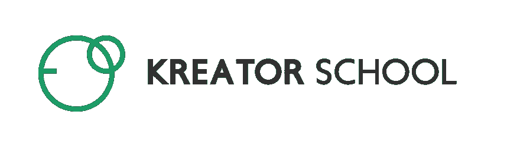

# Kreatorschool -基于选择的教程#NoCode

> 原文：<https://dev.to/rudrakshborana/kreatorschool-a-nocode-significant-content-platform-1of6>

大家好，我是来自 Kreatorschool.com 的 Rudraksh，我们是一家基于内容的初创公司，我们启发人们关于无代码及其意义，人们可以来到我们的研讨会，从零开始构建自己的产品，无需代码，并验证原型的想法。
[T3】](https://res.cloudinary.com/practicaldev/image/fetch/s--nvLb19WY--/c_limit%2Cf_auto%2Cfl_progressive%2Cq_auto%2Cw_880/https://thepracticaldev.s3.amazonaws.com/i/o7xaugh45ed92lju923e.png)