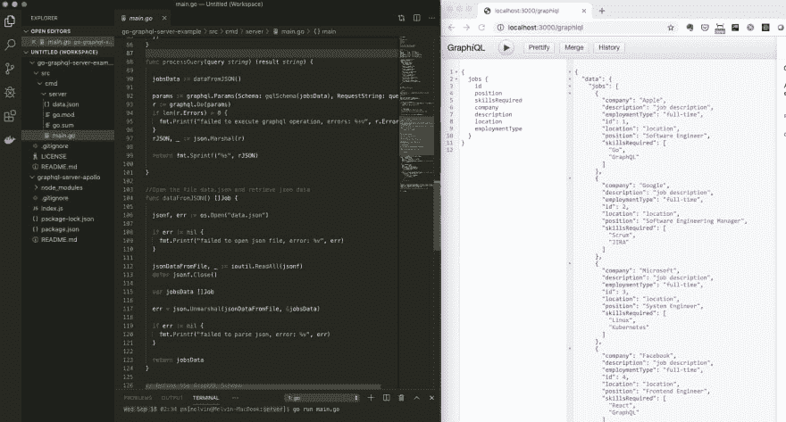
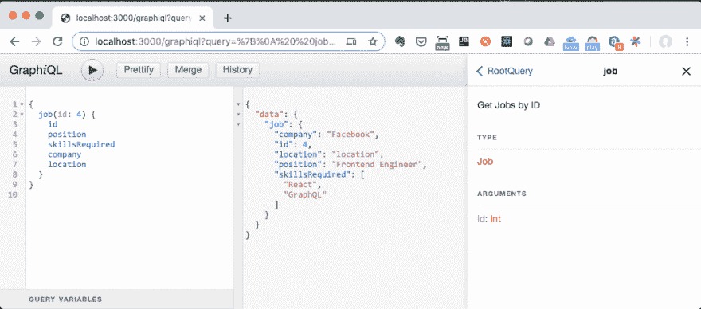

# 如何使用 Go (Golang)创建 GraphQL API 服务器

> 原文:[https://dev . to/don vito/how-to-create-a-graph QL-API-server-using-go-golang-2j9e](https://dev.to/donvito/how-to-create-a-graphql-api-server-using-go-golang-2j9e)

[T2】](https://res.cloudinary.com/practicaldev/image/fetch/s--TifidquG--/c_limit%2Cf_auto%2Cfl_progressive%2Cq_auto%2Cw_880/https://www.melvinvivas.com/conteimg/2019/09/Screenshot-2019-09-18-15.36.37.png)

我写了一个关于如何使用 Apollo Server 开发一个 [GraphQL API 的例子。使用 Apollo 和 NodeJS 非常简单。然而，我想用](http://www.melvinvivas.com/graphql-api-using-apollo-server-example/) [Go(Golang)](https://golang.org/) 来完成我正在进行的一个新项目。最初，我在 Go 中犹豫了一下，因为它看起来不容易。在阅读了一些参考资料和一些坚持之后，我设法想出了一个如何使用 [graphql-go](https://github.com/graphql-go/graphql) 创建 GraphQL 的例子，n graph QL for Go/Golang 的实现。

使用 Go 构建 GraphQL APIs 时，可以从几个有趣的框架开始。以下是 GraphQL 网站上的一些内容:

*   [graph QL-Go](https://github.com/graphql-go/graphql):graph QL for Go/Golang 的一个实现。
*   [graph-gophers/graph QL-go](https://github.com/graph-gophers/graphql-go):graph QL 在 Golang 中的主动实现(曾是 https://github.com/neelance/graphql-go)。
*   [GQLGen](https://github.com/99designs/gqlgen)——去生成基于 graphql 的服务器库。
*   [graphql-relay-go](https://github.com/graphql-go/relay) :一个 Go/Golang 库，帮助构建一个支持 react-relay 的 graphql-go 服务器。
*   machine box/graph QL:graph QL 的一个优雅的底层 HTTP 客户端。
*   samsarahq/thunder :一个 GraphQL 实现，具有简单的模式构建、实时查询和批处理。

在这个例子中，我们将使用列表中的第一个 [graphql-go](https://github.com/graphql-go/graphql) 。我们开始吧。完整的源代码可以在下面我的 github repo 中找到。

##  [【多诺维托】](https://github.com/donvito)/[【go-graph QL 服务器实例】](https://github.com/donvito/go-graphql-server-example)

### 使用 go-graphql 的 GraphQL 服务器示例。这个例子是用 Go v1.12 版测试的。这是我的博客文章中的源代码-

<article class="markdown-body entry-content container-lg" itemprop="text">

# go-graphql-server-example

我已经使用 go-graphql 创建了一个 GraphQL 服务器的例子。希望能对正在用 Go 学习 GraphQL 的人有用。这个例子是用 Go v1.12 测试的。这是我的博客文章[http://www . melvinvivas . com/develop-graph QL-we b-APIs-using-golang](http://www.melvinvivas.com/develop-graphql-web-apis-using-golang)的源代码

## 运行示例

```
cd cd src/cmd/server/
go run main.go 
```

## 运行示例后访问 GraphiQL

http://localhost:3000/graphic QL

访问我的博客[http://www.melvinvivas.com](http://www.melvinvivas.com)获取更多科技文章

相关博文[http://www . melvinvivas . com/develop-graph QL-we b-APIs-using-golang/](http://www.melvinvivas.com/develop-graphql-web-apis-using-golang/)

## 博客帖子

[T2】](https://camo.githubusercontent.com/692884288f60f538f77e225e2e5544b7d3b84f9a/68747470733a2f2f7777772e6d656c76696e76697661732e636f6d2f636f6e74656e742f696d616765732f323031392f30392f53637265656e73686f742d323031392d30392d31382d31352e33362e33372e706e67)

我写了一个关于如何使用 Apollo Server 开发一个 [GraphQL API 的例子。使用 Apollo 和 NodeJS 非常简单。然而，我想用](http://www.melvinvivas.com/graphql-api-using-apollo-server-example/) [Go(Golang)](https://golang.org/) 来完成我正在进行的一个新项目。最初，我在 Go 中犹豫了一下，因为它看起来不容易。在阅读了一些参考资料和一些坚持之后，我设法想出了一个如何使用 [graphql-go](https://github.com/graphql-go/graphql) 创建一个 GraphQL 的例子

</article>

[View on GitHub](https://github.com/donvito/go-graphql-server-example)

下面是我们的主要功能。在第 3 行中，我们创建了一个 GraphiQL 处理程序。这将为我们的 api 服务器启用 GraphiQL，因此它不必单独运行。graph QL 是一个浏览器内工具，用于探索 GraphQL APIs。稍后，一旦我们完成了代码，我们将能够看到 GraphiQL 是什么样子的。

因为我们希望我们的服务器接受使用 http 的请求，所以我们在第 10 行创建了一个使用标准 http 包在端口 3000 上运行的服务器。我们还需要处理 GraphQL 查询，所以我们为它创建了一个 gqlHandler 处理程序。

```
func main() {
    graphiqlHandler, err := graphiql.NewGraphiqlHandler("/graphql")
    if err != nil {
        panic(err)
    }

    http.Handle("/graphql", gqlHandler())
    http.Handle("/graphiql", graphiqlHandler)
    http.ListenAndServe(":3000", nil)
} 
```

下面是我们的处理程序的代码。在这个函数中，我们接收请求并将其解码为 json。如果 json 解析中有错误，我们将返回 HTTP 错误 400。

之后，在查询中调用函数 processQuery()传递。

```
func gqlHandler() http.Handler {
    return http.HandlerFunc(func(w http.ResponseWriter, r *http.Request) {
        if r.Body == nil {
            http.Error(w, "No query data", 400)
            return
        }

        var rBody reqBody
        err := json.NewDecoder(r.Body).Decode(&rBody)
        if err != nil {
            http.Error(w, "Error parsing JSON request body", 400)
        }

        fmt.Fprintf(w, "%s", processQuery(rBody.Query))

    })
} 
```

下面是我们的 process Query()函数的样子。我们现在使用 dataFromjson()函数从 JSON 文件中检索数据，但理想情况下，这应该是查询数据库。在获得我们将使用的数据后，我们调用 gqlSchema(jobsData ),它从我们的数据中创建 GraphQL 模式。jobsData 是作业结构的一部分，包含来自 json 文件的数据。

```
func processQuery(query string) (result string) {

    retrieveJobs := retrieveJobsFromFile()

    params := graphql.Params{Schema: gqlSchema(retrieveJobs), RequestString: query}
    r := graphql.Do(params)
    if len(r.Errors) > 0 {
        fmt.Printf("failed to execute graphql operation, errors: %+v", r.Errors)
    }
    rJSON, _ := json.Marshal(r)

    return fmt.Sprintf("%s", rJSON)

} 
```

GraphQL 的魔力发生在 gqlSchema(jobsData)函数中。在这个例子中，我们支持两个查询， **/jobs** 和 **jobs/{id}**

**/jobs -** 返回所有作业(第 3 行)

**/jobs/{id} -** 支持单个参数 id，返回按 id 筛选的单个作业(第 10 行)

两个函数的解析器在第 6 行和第 18 行。解析器负责为查询返回数据。

```
func gqlSchema(queryJobs func() []Job) graphql.Schema {
    fields := graphql.Fields{
        "jobs": &graphql.Field{
            Type:        graphql.NewList(jobType),
            Description: "All Jobs",
            Resolve: func(params graphql.ResolveParams) (interface{}, error) {
                return queryJobs(), nil
            },
        },
        "job": &graphql.Field{
            Type:        jobType,
            Description: "Get Jobs by ID",
            Args: graphql.FieldConfigArgument{
                "id": &graphql.ArgumentConfig{
                    Type: graphql.Int,
                },
            },
            Resolve: func(params graphql.ResolveParams) (interface{}, error) {
                id, success := params.Args["id"].(int)
                if success {
                    for _, job := range queryJobs() {
                        if int(job.ID) == id {
                            return job, nil
                        }
                    }
                }
                return nil, nil
            },
        },
    }
    rootQuery := graphql.ObjectConfig{Name: "RootQuery", Fields: fields}
    schemaConfig := graphql.SchemaConfig{Query: graphql.NewObject(rootQuery)}
    schema, err := graphql.NewSchema(schemaConfig)
    if err != nil {
        fmt.Printf("failed to create new schema, error: %v", err)
    }

    return schema

} 
```

## [](#run-the-graphql-api-server)运行 GraphQL API 服务器

```
git clone https://github.com/donvito/go-graphql-server-example.git
cd go-graphql-server-example/src/cmd/server/
go run main.go 
```

## [](#access-graphiql-after-running-the-server)运行服务器后访问 GraphiQL

http://localhost:3000/graphic QL

[T2】](https://res.cloudinary.com/practicaldev/image/fetch/s--PpbUWTvR--/c_limit%2Cf_auto%2Cfl_progressive%2Cq_auto%2Cw_880/https://www.melvinvivas.com/conteimg/2019/09/Screenshot-2019-09-18-14.36.12-1.png)

就是这样！我们现在已经使用 Go 创建了一个 GraphQL API。

完整的源代码可以在我的 github repo 中找到。

【https://github.com/donvito/go-graphql-server-example】T2

**参考文献**

[https://github.com/graphql-go/graphql](https://github.com/graphql-go/graphql)

[https://github.com/friendsofgo/graphiql](https://github.com/friendsofgo/graphiql)

[https://graphql.org/code/#go](https://graphql.org/code/#go)

干杯！希望这对那些刚开始使用 Go 和 GraphQL 的人有所帮助！

关于我新博客的更多更新，你可以在 Twitter [@donvito](https://twitter.com/donvito) 关注我。我也在我的 [GitHub](https://github.com/donvito) 中分享代码。如果你想知道更多关于我是做什么的，请在 [LinkedIn](https://www.linkedin.com/in/melvinvivas/) 加我。我最近新开了一个 youtube 频道——我也上传了一些教程。看看吧！

我也在寻找技术博客的工作。请查看[我的博客](https://www.melvinvivas.com)中的博文样本。会感谢线索。:)