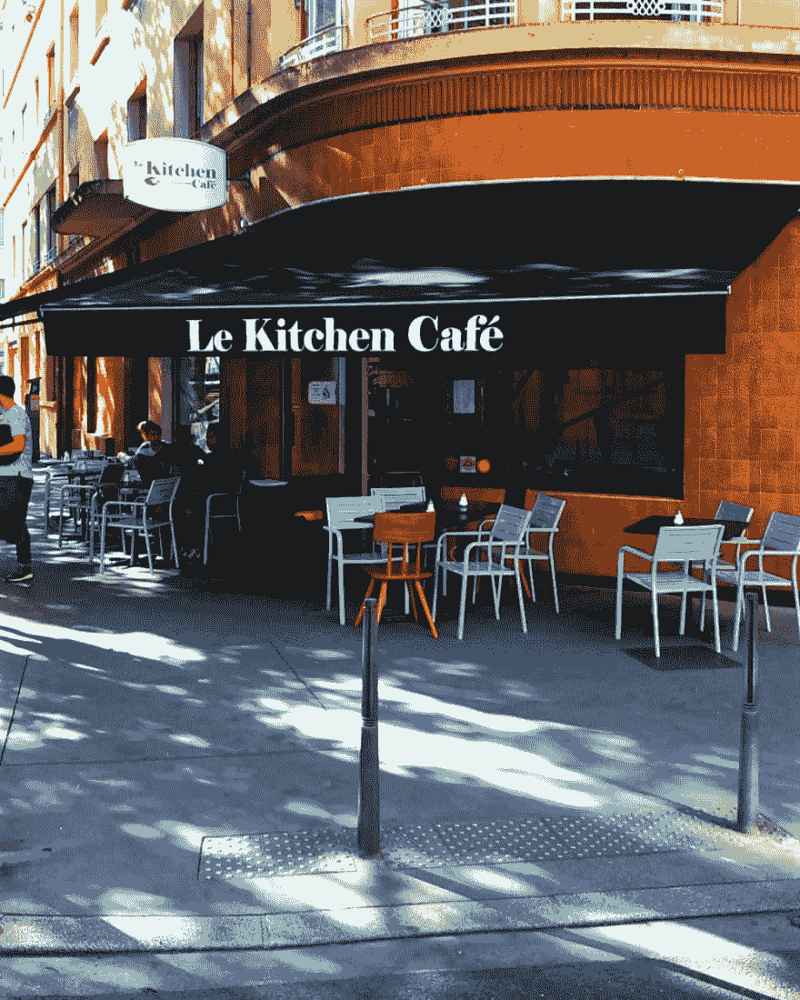
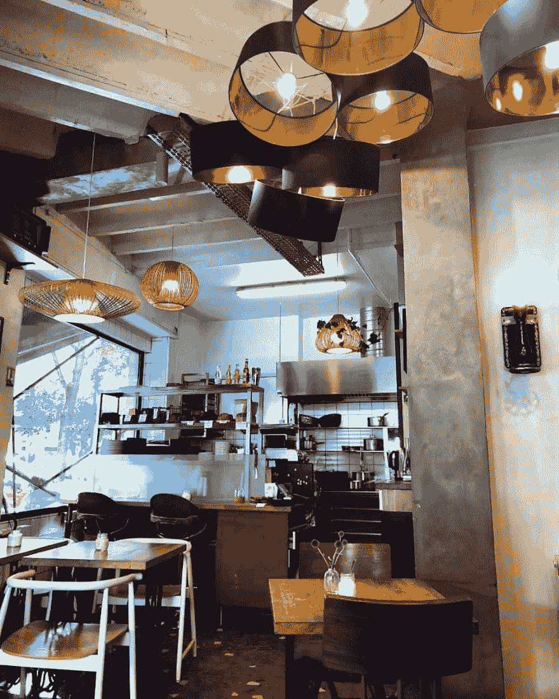
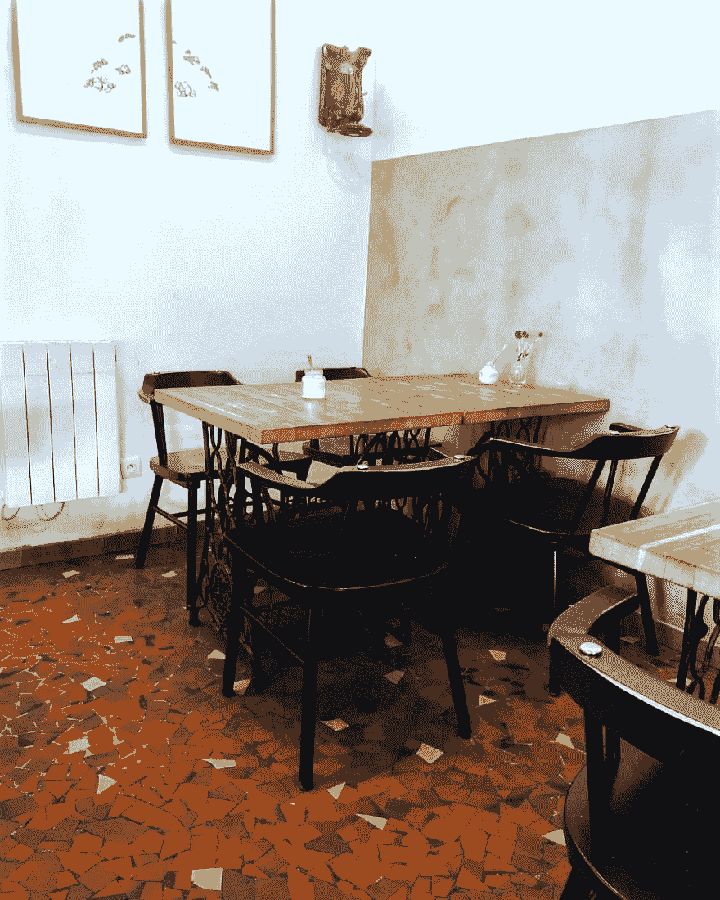
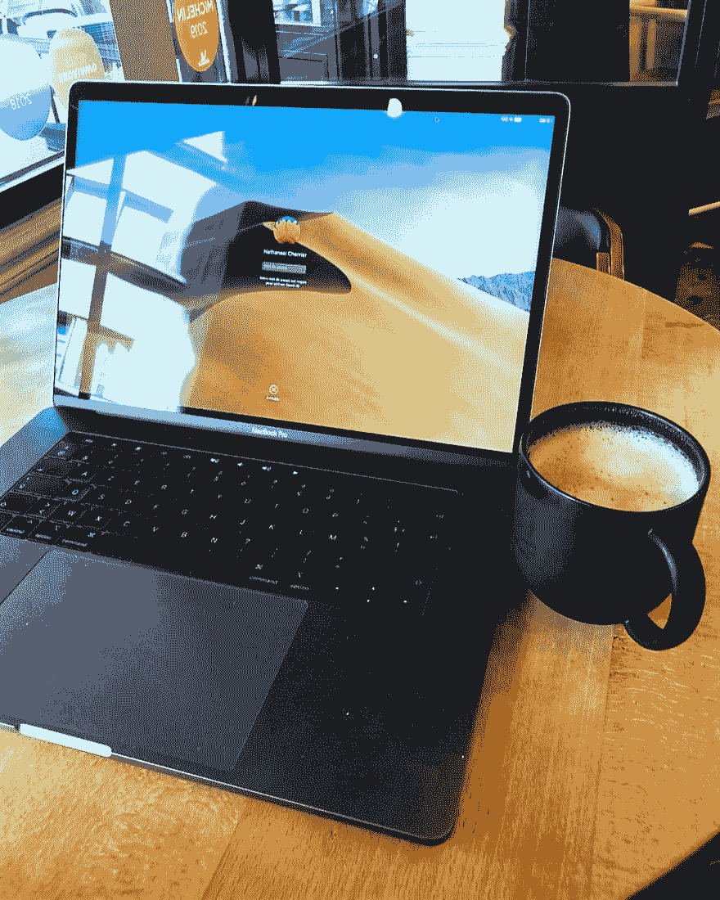
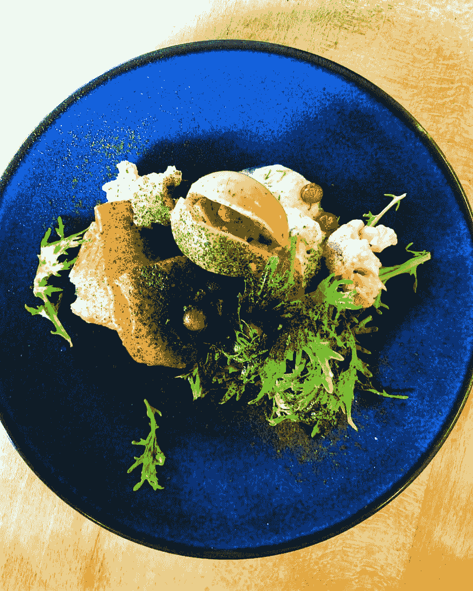
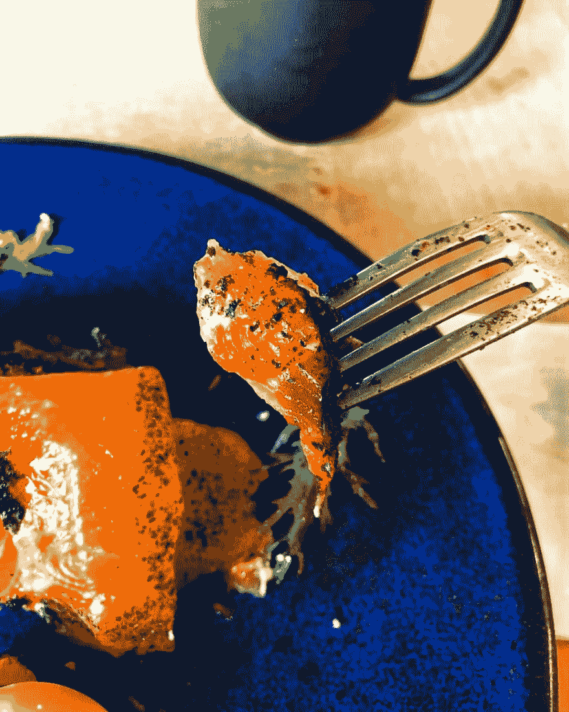
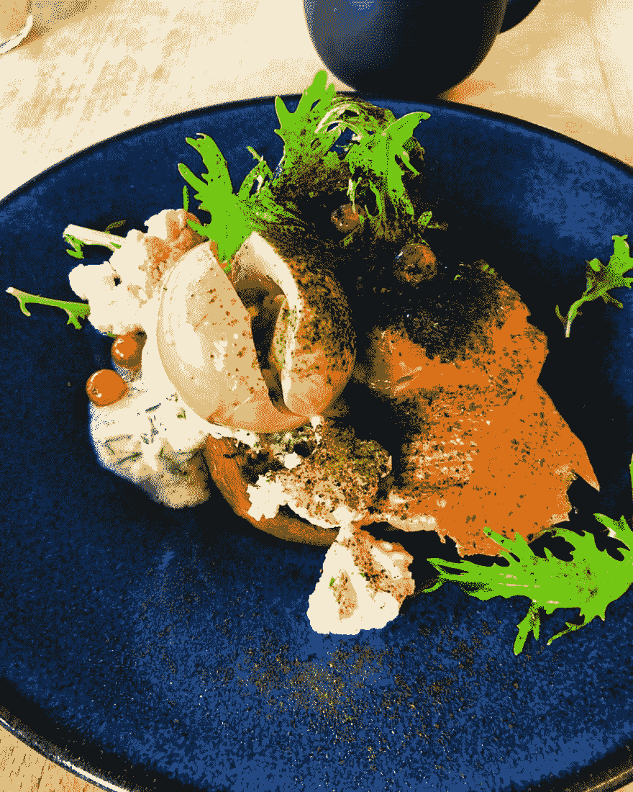
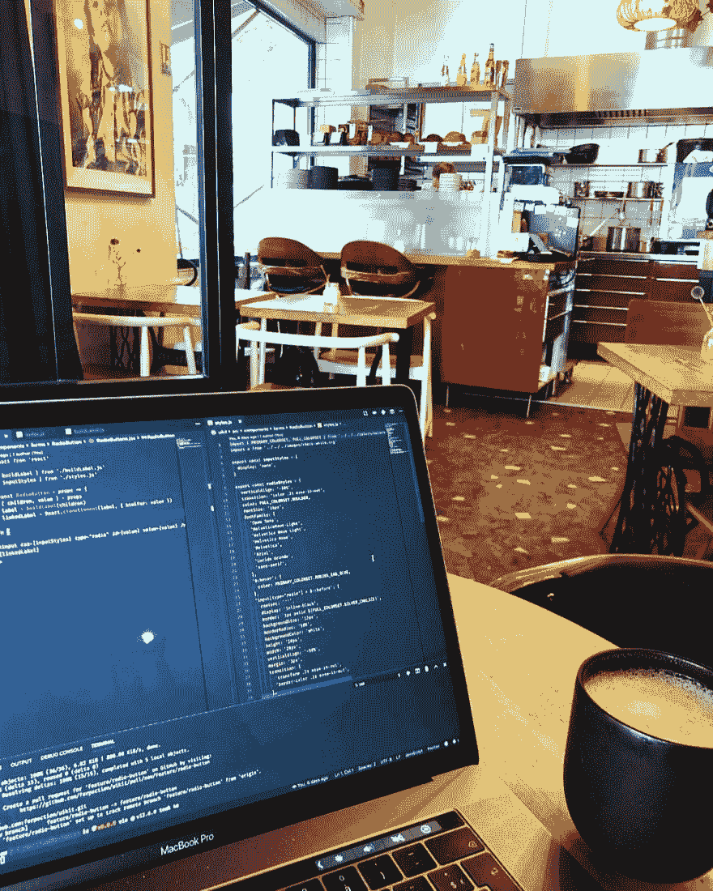

# 在 Le Kitchen Café吃饱肚子，平静地编码

> 原文：<https://dev.to/mindsers/coding-in-peace-with-a-full-belly-at-le-kitchen-cafe-3733>

[](https://res.cloudinary.com/practicaldev/image/fetch/s--hxf3OuRT--/c_limit%2Cf_auto%2Cfl_progressive%2Cq_auto%2Cw_880/https://blog.nathanaelcherrier.com/conteimg/2019/09/kitchen-cafe--code.jpg)

在这个系列的第一篇文章中，我想带你去一家漂亮、简单、非常可爱的咖啡馆: [Le Kitchen Café](https://www.lekitchencafe.com/) 。如果你喜欢在提供美食的舒适环境中工作，那么你一定会喜欢乐厨房咖啡厅。

```
Le Kitchen Café
34 rue Chevreul
69007 Lyon
France 
```

Enter fullscreen mode Exit fullscreen mode

我在周四早上 8:30-9:00 左右去那里工作。这是一个咖啡馆，不是一个共同工作的空间，所以开业不是很早。

周一、周六和周五早上 8:00 准时开门，周末 8:30 开门。

## 第一印象

[](https://res.cloudinary.com/practicaldev/image/fetch/s--teqV_BRk--/c_limit%2Cf_auto%2Cfl_progressive%2Cq_auto%2Cw_880/https://blog.nathanaelcherrier.com/conteimg/2019/08/kitchen-cafe--deventure.jpg)

当我到达时，我首先看到的是另外两个人在他们的电脑上工作，喝着他们的含咖啡因的饮料。

有点失望，我不是第一个来的，但这总是一个好迹象。其他人(甚至可能是开发人员)认为这是一个工作的好地方！

透过大窗户，有一件事让我印象深刻，那就是这个地方的大小。它很小，我猜里面大约有 16 个座位。这也解释了为什么他们把桌子放在外面。夏天在外面吃早餐是非常令人愉快的。

虽然大小并没有困扰我很久，但一旦坐下，我就不会觉得我们都在对方身上。实际上，我觉得这个小空间让它变得非常舒适和温暖。

## 装潢&大气

[](https://res.cloudinary.com/practicaldev/image/fetch/s--6ea66Qrz--/c_limit%2Cf_auto%2Cfl_progressive%2Cq_auto%2Cw_880/https://blog.nathanaelcherrier.com/conteimg/2019/08/kitchen-cafe--comptoir.jpg)

这个地方的设计是由一些粗糙的墙壁，一些油漆过的，不匹配的椅子，许多不同的灯泡，回收的家具，干花和古董组成的。如果你读了这篇文章，你可能会认为创造一个伟大的空间是行不通的。然而，业主们成功地利用回收和二手材料将这家位于里昂市中心的咖啡馆变成了一个美丽而明亮的地方。

我个人喜欢这个空间的设计和氛围，因为它蕴含着强烈的价值观。业主最明确的价值观:高品质、高标准、手工制作。有点像“工匠”风格，我绝对喜欢成为软件工艺的专家。

[](https://res.cloudinary.com/practicaldev/image/fetch/s--PbkVYQEt--/c_limit%2Cf_auto%2Cfl_progressive%2Cq_auto%2Cw_880/https://blog.nathanaelcherrier.com/conteimg/2019/08/kitchen-cafe--tables.jpg)

当然，因为一切都如此不同，所以有不完美的地方。你可以从装饰选择中看出:

*   桌子(外部和内部)几乎都一样，但有 4 到 5 种不同风格的椅子。
*   灯的形状和颜色也大不相同，但似乎是按功能或区域组织的。墙托架都一样，桌面灯也一样...等等。

我喜欢这种真实的感觉。这就像是在说这个行业是由人类而不是机器拥有的。就像你可以读到的:“在这里，你总是可以吃到好吃的东西，但它不会每天都尝起来完全一样”。

我不知道你是否在照片上注意到了，但缝纫主题(另一种手工工艺)在装饰中无处不在。桌脚是缝纫机的一部分，墙托架也是。还记得我说过他们喜欢回收吗！

## 食品&饮料

在咖啡店工作，你必须点些东西。事实上，作为开发者，我们消耗了大量的咖啡/茶/其他任何东西，这不应该太拖沓。

那天，我在菜单上点了一杯 Chai Latte(3.9 欧元)。味道很好，不太甜。你真的可以尝到牛奶和茶的味道。

[](https://res.cloudinary.com/practicaldev/image/fetch/s--YftapiKu--/c_limit%2Cf_auto%2Cfl_progressive%2Cq_auto%2Cw_880/https://blog.nathanaelcherrier.com/conteimg/2019/08/kitchen-cafe--chai-latte.jpg)

饮料的选择非常广泛。你一定会找到你喜欢的东西:果汁、咖啡、茶、蔬菜汤、凉茶等。菜单上标明了自制饮料。

一杯浓缩咖啡只要 1.60 欧元，自制热巧克力只要 4.50 欧元。

我喜欢美味的早餐。不幸的是，Le Kitchen Café的早餐只有甜点套餐:

*   一大杯咖啡+一份糕点 **3，90 欧元**
*   一碗格兰诺拉麦片，配有时令新鲜水果、蜂蜜和生牛奶干酪+一杯咖啡 **5.5 欧元**
*   一份糕点+一碗格兰诺拉麦片+一杯热饮+一杯果汁 **11.80 欧元**

令我非常高兴的是，服务员马上让我点一份美味的餐盘，而不是早餐套餐。

[](https://res.cloudinary.com/practicaldev/image/fetch/s--Ipu0xETZ--/c_limit%2Cf_auto%2Cfl_progressive%2Cq_auto%2Cw_880/https://blog.nathanaelcherrier.com/conteimg/2019/08/kitchen-cafe--plat1.jpg)

[](https://res.cloudinary.com/practicaldev/image/fetch/s--q45pWAXw--/c_limit%2Cf_auto%2Cfl_progressive%2Cq_auto%2Cw_880/https://blog.nathanaelcherrier.com/conteimg/2019/08/kitchen-cafe--plat2.jpg)

[](https://res.cloudinary.com/practicaldev/image/fetch/s--lb5yvXLC--/c_limit%2Cf_auto%2Cfl_progressive%2Cq_auto%2Cw_880/https://blog.nathanaelcherrier.com/conteimg/2019/08/kitchen-cafe--plat3.jpg)

我选了一盘美味的鳟鱼和烤奶油蛋卷。盘子里的天堂。这道菜的确切名称是“大豆卤蛋&烤奶油蛋卷、gravlax Alps 鳟鱼、莳萝奶油和精选蔬菜”。

我可以每天早餐都吃这个，而不会抱怨！

## 代码

是的，我是来工作的，所以别忘了这一点。

[](https://res.cloudinary.com/practicaldev/image/fetch/s--7ap5dHBb--/c_limit%2Cf_auto%2Cfl_progressive%2Cq_auto%2Cw_880/https://blog.nathanaelcherrier.com/conteimg/2019/08/kitchen-cafe--code-2.jpg)

我想说我能够在体面的条件下工作，但是缺少了一些东西。

桌子上有足够的空间放 Macbook pro 15“+我的手机+我的饮料+我的盘子。天气既不太冷也不太热。窗户很大，所以**非常明亮**，你的眼睛总是愿意看外面(这对你的眼睛健康是有益的)。

这里也相当安静。足以让我能够正常工作，专注于一项精确的任务。有交谈，一些干扰，生活，但仍然足够安静，每个人都可以工作。这就是我作为一名远程工作者所寻求的。如果你去咖啡馆工作，那里通常会有很多人，而不是你一个人呆在家里。所以那是完美的。

不利的一面是，我不得不使用我的 iPhone 4G，因为 Le Kitchen Café的客户无法使用 WIFI。偶然的机会，信号很好。

工人的第二个不利方面:**只有一个电源插座可供客户使用。**在那个特殊的日子里我并没有特别困扰，因为我的电池充满了电。中午的时候，我还剩下 62%。我想我可以在那里工作一整天，而不需要给我的 Macbook 充电，但如果我没有充满电，我就不得不回家，那会很难过。

* * *

我真的很喜欢那个地方的工作和食物。厨房咖啡厅真的有一些有价值的资产。但是，为了让体验 100%完美，有几个重要的细节被忽略了:即电源插座。

如果你有好电池，不要犹豫，去吧！