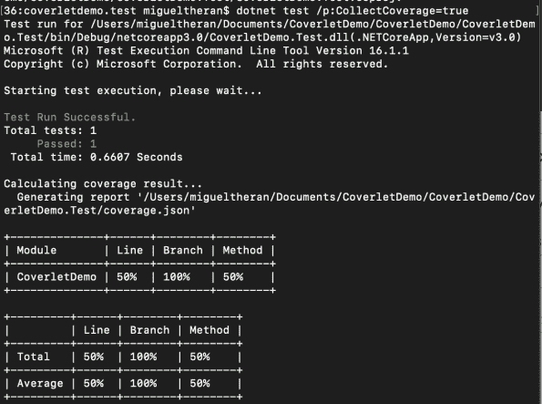

# 床罩，单元测试的覆盖范围。网

> 原文：<https://dev.to/mteheran/coverlet-unit-tests-coverage-for-net-4954>

测量单元测试的覆盖率是一个重要的话题，因为我们需要检查测试的设计和它们的代码范围。

Coverlet 是一个测量。NET 项目。

Coverlet 是完全开源和免费的。它支持。NET 和。NET 核心，你可以把它作为一个 NuGet 包添加进来。

##  [托纳多](https://github.com/tonerdo) / [床罩](https://github.com/tonerdo/coverlet)

### 的跨平台代码覆盖率。网

<article class="markdown-body entry-content p-5" itemprop="text">

# 床罩

[](https://dev.azure.com/tonerdo/coverlet/_build/latest?definitionId=3&branchName=master)

Coverlet 是一个跨平台的代码覆盖框架。NET，支持行、分支和方法覆盖。它适用于。在 Windows 和。所有支持平台上的 NET Core。

## 装置

**虚拟测试集成**:

```
dotnet add package coverlet.collector
```

注意:你**必须**只将包添加到测试项目中

**MSBuild 集成**:

```
dotnet add package coverlet.msbuild
```

注意:你**必须**只将包添加到测试项目中

**全局工具**:

```
dotnet tool install --global coverlet.console
```

## 快速启动

### 虚拟测试集成

Coverlet 作为一个数据收集器集成到 Visual Studio 测试平台中。要获得覆盖率，只需运行以下命令:

```
dotnet test --collect:"XPlat Code Coverage"
```

运行上述命令后，包含结果的一个`coverage.cobertura.json`文件将作为附件发布到`TestResults`目录。结果摘要也将显示在终端中。

高级用法见[文档](https://raw.githubusercontent.com/tonerdo/coverlet/master/Documentation/VSTestIntegration.md)。

#### 要求

*   你需要 …

</article>

[View on GitHub](https://github.com/tonerdo/coverlet)

首先，我们必须在现有的单元测试项目(MSTest、xUnit 等)中添加 NuGet..).床罩有很多使用方法，但我推荐使用 MSBuild。

`dotnet add package coverlet.msbuild`

之后，我们可以很容易地使用 MSBuild 和 coverlet 之间的集成来运行测试，并使用下面的命令测量覆盖率:

`dotnet test /p:CollectCoverage=true`

您将获得以下结果:

[](https://res.cloudinary.com/practicaldev/image/fetch/s--gF6KtPrG--/c_limit%2Cf_auto%2Cfl_progressive%2Cq_auto%2Cw_880/https://mteheran.files.wordpress.com/2019/09/screen-shot-2019-09-09-at-9.57.20-pm.png%3Fw%3D595)

在从左到右的第一列中，我们可以看到涵盖的模块列表。在“行”列中，我们得到了运行测试后检查的行的百分比，对于“分支”(语句)和“方法”(类中的函数)也是如此。

Coverlet 生成一个文件 coverage.json，其中包含控制台中显示的全部信息。您可以在自己的应用程序中使用这个文件。

试试吧！

## [mte heran](https://github.com/Mteheran)/[coveret demo](https://github.com/Mteheran/CoverletDemo)

### 单元测试覆盖的封面演示

<article class="markdown-body entry-content p-5" itemprop="text">

# 封面演示

单元测试覆盖的封面演示

</article>

[View on GitHub](https://github.com/Mteheran/CoverletDemo)