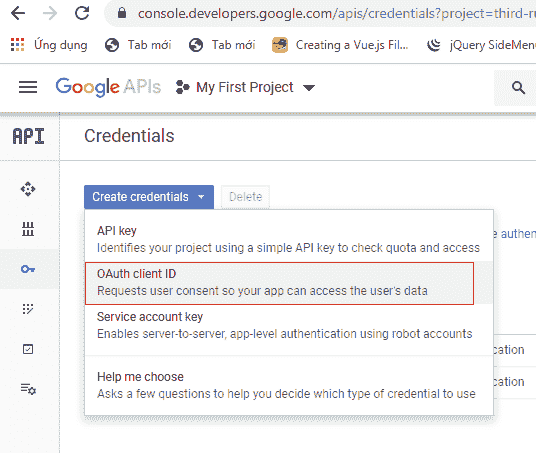
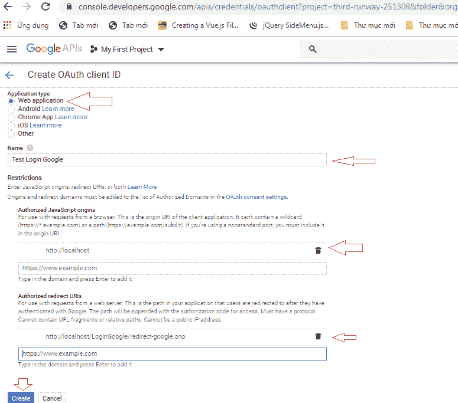
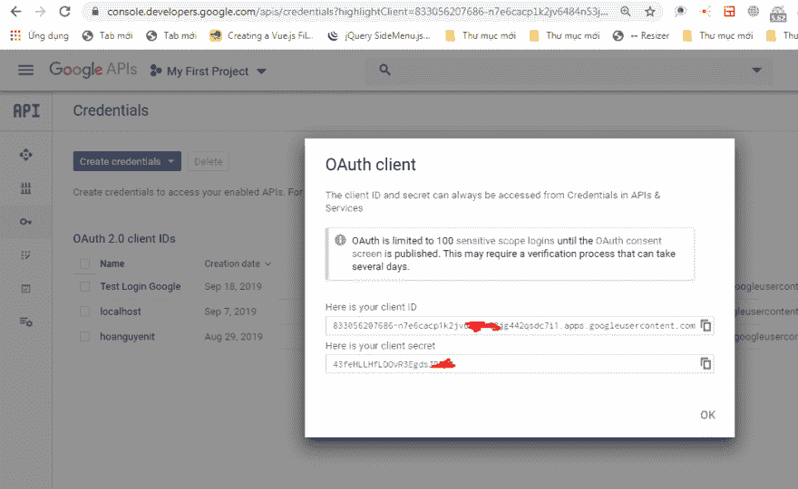
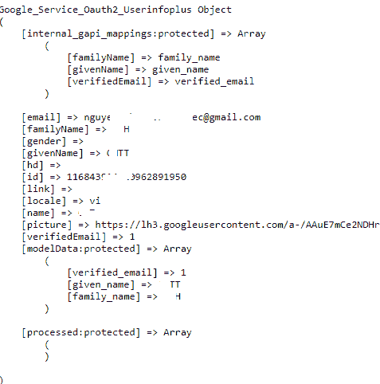

# 使用 PHP 登录 Google

> 原文：<https://dev.to/skipperhoa/login-google-using-php-46h9>

登录 google，我们可以从 Google
[](https://res.cloudinary.com/practicaldev/image/fetch/s--uIIyFTP0--/c_limit%2Cf_auto%2Cfl_progressive%2Cq_auto%2Cw_880/https://thepracticaldev.s3.amazonaws.com/i/o3jnmsnjqgpj7mcwxxi6.png)
[](https://res.cloudinary.com/practicaldev/image/fetch/s--suCXN4TI--/c_limit%2Cf_auto%2Cfl_progressive%2Cq_auto%2Cw_880/https://thepracticaldev.s3.amazonaws.com/i/lwwjngcxhgjdbn8etdv0.png)
[](https://res.cloudinary.com/practicaldev/image/fetch/s--75a83h-0--/c_limit%2Cf_auto%2Cfl_progressive%2Cq_auto%2Cw_880/https://thepracticaldev.s3.amazonaws.com/i/6tznxfze5zzub6lcjitk.png)创建 Google API 控制台

然后，我们有了客户端 ID 和客户端密码，开始下载 googleapis 或从 composer 安装

```
$composer require google/apiclient:"^2.0" 
```

或者

[下载 Google API](https://github.com/googleapis/google-api-php-client/releases)

继续，我们在 **[中创建文件**define.php**http://localhost/LoginGoogle/define . PHP](http://localhost/LoginGoogle/define.php)**

```
//define.php
<?php
    //set define login google
    define('GOOGLE_APP_ID','8330207686-ih6vo9kvhqqfnr.apps.googleusercontent.com');
    define('GOOGLE_APP_SECRET','vHI3K4N5obLHgz');
    define('GOOGLE_APP_CALLBACK_URL','http://localhost/LoginGoogle/redirect-google.php');
    define('LOCALHOST','localhost');
    define('USERNAME','root');
    define('PASSWORD','');
    define('DATABASE','ABC');
?> 
```

创建文件**redirect-google.php**在**T3】http://localhost:LoginGoogle/redirect-Google . PHPT5** 

```
<?php
    require_once('define.php');

    /**
     * SET CONNECT 
     */
    $conn = mysqli_connect(LOCALHOST,USERNAME,PASSWORD,DATABASE);
    if (!$conn) {
        echo "Error: Unable to connect to MySQL." . PHP_EOL;
        echo "Debugging errno: " . mysqli_connect_errno() . PHP_EOL;
        echo "Debugging error: " . mysqli_connect_error() . PHP_EOL;
        exit;
    }

    /**
     * CALL GOOGLE API
     */
    require_once 'google-api-php-client-2.4.0/vendor/autoload.php';
    $client = new Google_Client();
    $client->setClientId(GOOGLE_APP_ID);
    $client->setClientSecret(GOOGLE_APP_SECRET);
    $client->setRedirectUri(GOOGLE_APP_CALLBACK_URL);
    $client->addScope("email");
    $client->addScope("profile");

    if (isset($_GET['code'])) {
        $token = $client->fetchAccessTokenWithAuthCode($_GET['code']);
       // print_r($token);
        $client->setAccessToken($token['access_token']);

        // get profile info
        $google_oauth = new Google_Service_Oauth2($client);
        $google_account_info = $google_oauth->userinfo->get();
        $email =  $google_account_info->email;
        $name =  $google_account_info->name;
       // print_r($google_account_info);
       /**
        * CHECK EMAIL AND NAME IN DATABASE
        */
        $check = "SELECT * FROM `users` WHERE `email`='".$email."' and `name`='".$name."'";
        $result = mysqli_query($conn,$sql);
        $rowcount=mysqli_num_rows($result);
        if($rowcount>0){
            /**
             * USER EXITS
             */
            header('location:home');
        }
        else{
            /**
             * INSERT USER TO DATABASE
             * AFTER INSERT, YOU CAN HEADER TO HOME
             */

        }

    } else {
        /**
         * IF YOU DON'T LOGIN GOOGLE
         * YOU CAN SEEN AGAIN GOOGLE_APP_ID, GOOGLE_APP_SECRET, GOOGLE_APP_CALLBACK_URL
         */
        echo "<a href='".$client->createAuthUrl()."'>Google Login</a>";
    }
?> 
```

之后你就可以打开**[http://localhost/LoginGoogle/redirect-Google . PHP](http://localhost/LoginGoogle/redirect-google.php)**
[](https://res.cloudinary.com/practicaldev/image/fetch/s--ye1TqCXK--/c_limit%2Cf_auto%2Cfl_progressive%2Cq_auto%2Cw_880/https://thepracticaldev.s3.amazonaws.com/i/m12xm3lxp7hif2rtqemb.png)

Post: [用 PHP 登录 Google](https://hoanguyenit.com/login-google-using-php.html)