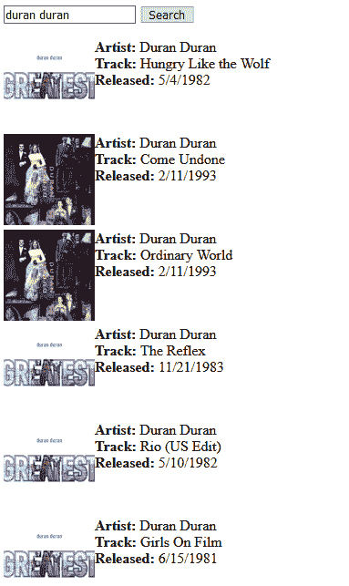
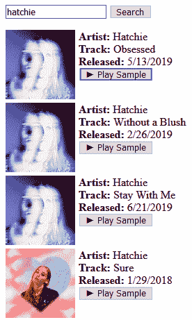
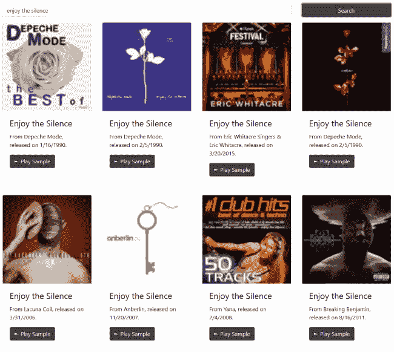

# Vue.js 内置的支持 iTunes 音频的搜索

> 原文：<https://dev.to/raymondcamden/an-itunes-audio-enabled-search-built-in-vue-js-2keh>

(在我开始之前，有一个简短的说明。iTunes API 将*随机*抛出 CORS 问题，很可能是由于他们网络中的服务器配置错误。为了在生产中使用它，我会添加一个无服务器代理。测试时，您可能会，也可能不会遇到这种情况。)当我在 Vue.js 上演示时，我展示的一个演示使用了 [iTunes 搜索 API](https://affiliate.itunes.apple.com/resources/documentation/itunes-store-web-service-search-api/) 。这不一定是一个令人兴奋的演示，我不经常使用 iTunes，但是它有有趣的数据，并且不需要任何按键，这使得它成为简单演示的一个很好的候选。我想我应该用 Vue.js 以尽可能简单的形式快速演示一下，然后通过一些更新来改进应用程序。

### 版本一

在第一个版本中，我将针对 API 进行搜索，并尽可能以最简单的方式呈现结果。当搜索开始时，我会提供一些反馈，让用户知道发生了什么，但也就这么多了。让我们从 HTML:
开始

```
<!DOCTYPE html>
<html>
    <head>
        <meta charset="utf-8">
        <title></title>
        <meta name="description" content="">
        <meta name="viewport" content="width=device-width">
        <style>
        [v-cloak] {display: none}
        </style>
        <link rel="stylesheet" href="style.css">
    </head>
    <body>

        <div id="app" v-cloak>
            <input v-model="term" type="search">
            <button @click="search">Search</button>
            <p/>

            <div v-for="result in results" class="result">
                
                <b>Artist:</b> {{result.artistName}}<br/>
                <b>Track:</b> {{result.trackName}}<br/>
                <b>Released:</b> {{result.releaseDate | formatDate}}
                <br clear="left">
            </div>

            <div v-if="noResults">
                Sorry, but no results were found. I blame Apple.
            </div>

            <div v-if="searching">
                <i>Searching...</i>
            </div>

        </div>

        <script src="https://unpkg.com/vue"></script>
        <script src="app.js"></script>
    </body>
</html> 
```

<svg width="20px" height="20px" viewBox="0 0 24 24" class="highlight-action crayons-icon highlight-action--fullscreen-on"><title>Enter fullscreen mode</title></svg> <svg width="20px" height="20px" viewBox="0 0 24 24" class="highlight-action crayons-icon highlight-action--fullscreen-off"><title>Exit fullscreen mode</title></svg>

我们在顶部有一个简单的表格，你可以通过一个按钮输入你的条件，然后开始搜索。下面是三个 div。第一个呈现结果。我选择显示作品、艺术家、曲目和发行日期。API 返回了更多的信息，但我认为这已经足够了。第二个 div 仅在没有结果返回时显示。最后一个 div 用于指示搜索正在进行中。现在让我们看看 JavaScript。

```
Vue.filter('formatDate', function(d) {
    if(!window.Intl) return d;
    return new Intl.DateTimeFormat('en-US').format(new Date(d));
}); 

const app = new Vue({
    el:'#app',
    data:{
        term:'',
        results:[],
        noResults:false,
        searching:false
    },
    methods:{
        search:function() {
            this.results = [];
            this.searching = true;
            fetch(`https://itunes.apple.com/search?term=${encodeURIComponent(this.term)}&limit=10&media=music`)
            .then(res => res.json())
            .then(res => {
                this.searching = false;
                this.results = res.results;
                this.noResults = this.results.length === 0;
            });
        }
    }
}); 
```

<svg width="20px" height="20px" viewBox="0 0 24 24" class="highlight-action crayons-icon highlight-action--fullscreen-on"><title>Enter fullscreen mode</title></svg> <svg width="20px" height="20px" viewBox="0 0 24 24" class="highlight-action crayons-icon highlight-action--fullscreen-off"><title>Exit fullscreen mode</title></svg>

我的代码从定义一个使用 Intl 规范的过滤器`formatDate`开始。(如果这听起来有趣，请阅读我写的关于这个话题的文章。)应用程序本身相当简单。我有一个向 API 发出请求的方法。请注意，我将结果总数和媒体类型都限制为音乐。完成后，我设置结果，设置没有结果的标志，就这样。

可以在这里演示一下这个版本:[https://cfjedimaster . github . io/vue-demos/itunes-search/Ajax-search/](https://cfjedimaster.github.io/vue-demos/itunes-search/ajax-search/)。试试搜索“杜兰杜兰”因为我这么说的。；)

[](https://res.cloudinary.com/practicaldev/image/fetch/s--oXQ9jRa---/c_limit%2Cf_auto%2Cfl_progressive%2Cq_auto%2Cw_880/https://static.raymondcamden.cimg/2019/09/vue1.png)

### 版本二

第二个版本实际上是一样的，除了增加了[音频 API](https://developer.mozilla.org/en-US/docs/Web/API/Web_Audio_API) 来播放 API 返回的样本。HTML 中唯一改变的是结果视图，所以我只分享那部分:

```
<div v-for="result in results" class="result">
    
    <b>Artist:</b> {{result.artistName}}<br/>
    <b>Track:</b> {{result.trackName}}<br/>
    <b>Released:</b> {{result.releaseDate | formatDate}}<br/>
    <button @click="play(result.previewUrl)">&#9658; Play Sample</button>
    <br clear="left">
</div> 
```

<svg width="20px" height="20px" viewBox="0 0 24 24" class="highlight-action crayons-icon highlight-action--fullscreen-on"><title>Enter fullscreen mode</title></svg> <svg width="20px" height="20px" viewBox="0 0 24 24" class="highlight-action crayons-icon highlight-action--fullscreen-off"><title>Exit fullscreen mode</title></svg>

在 JavaScript 中，我添加了对`play`方法的支持。代码如下:

```
const app = new Vue({
    el:'#app',
    data:{
        term:'',
        results:[],
        noResults:false,
        searching:false,
        audio:null
    },
    methods:{
        search:function() {
            if(this.audio) {
                this.audio.pause();
                this.audio.currentTime = 0;
            }
            this.results = [];
            this.searching = true;
            fetch(`https://itunes.apple.com/search?term=${encodeURIComponent(this.term)}&limit=10&media=music`)
            .then(res => res.json())
            .then(res => {
                this.searching = false;
                this.results = res.results;
                this.noResults = this.results.length === 0;
            });
        },
        play:function(s) {
            if(this.audio) {
                this.audio.pause();
                this.audio.currentTime = 0;
            }
            this.audio = new Audio(s);
            this.audio.play();
        }
    }
}); 
```

<svg width="20px" height="20px" viewBox="0 0 24 24" class="highlight-action crayons-icon highlight-action--fullscreen-on"><title>Enter fullscreen mode</title></svg> <svg width="20px" height="20px" viewBox="0 0 24 24" class="highlight-action crayons-icon highlight-action--fullscreen-off"><title>Exit fullscreen mode</title></svg>

注意，我在数据中定义了一个`audio`对象。我需要一个“全局”音频对象，这样我就可以取消以前的预览，如果你开始一个新的。(为了好玩，禁用该逻辑，然后一次播放一堆预览。)也就是字面意思。对于这个演示，你应该搜索“哈奇”，我最喜欢的新乐队之一。

[](https://res.cloudinary.com/practicaldev/image/fetch/s--tyIr5fF9--/c_limit%2Cf_auto%2Cfl_progressive%2Cq_auto%2Cw_880/https://static.raymondcamden.cimg/2019/09/vue2.png)

你可以在这里演示一下:[https://cfjedimaster . github . io/vue-demos/itunes-search/Ajax-search-2/](https://cfjedimaster.github.io/vue-demos/itunes-search/ajax-search-2/)

### 版本第三

在第三个也是最后一个版本中，我在猪身上涂了一些口红，并添加了 [BootstrapVue](https://bootstrap-vue.js.org/) 。正如你所猜测的，这是一个封装了引导 UI 项目的 Vue 组件库。我没有做太多，但是你可以在这里看到结果:

[](https://res.cloudinary.com/practicaldev/image/fetch/s--LPrmJxcQ--/c_limit%2Cf_auto%2Cfl_progressive%2Cq_auto%2Cw_880/https://static.raymondcamden.cimg/2019/09/vue3.png)

这是我第一次使用 BootstrapVue(嗯，相当长一段时间以来的第一次)，总的来说还不错。我不喜欢你有时不得不寻找随机属性，例如，我花了一段时间来弄清楚如何做间距。(公平地说，“一会儿”可能是两分钟左右。)因为 JavaScript 根本没变，所以我只展示 HTML 更新。

```
<!DOCTYPE html>
<html>
    <head>
        <meta charset="utf-8">
        <title></title>
        <meta name="description" content="">
        <meta name="viewport" content="width=device-width">
        <style>
        [v-cloak] {display: none}
        #app {
            padding-top: 50px;
        }
        </style>
        <link type="text/css" rel="stylesheet" href="//unpkg.com/bootstrap/dist/css/bootstrap.min.css" />
        <link type="text/css" rel="stylesheet" href="//unpkg.com/bootstrap-vue@latest/dist/bootstrap-vue.min.css" />
        <script src="//unpkg.com/vue@latest/dist/vue.min.js"></script>
        <script src="//unpkg.com/bootstrap-vue@latest/dist/bootstrap-vue.min.js"></script>
    </head>
    <body>

        <div id="app" v-cloak>
            <b-container >

                <b-row>
                    <b-col sm="9">
                        <b-form-input v-model="term" type="search"></b-form-input>
                    </b-col>
                    <b-col sm="3">
                        <b-button @click="search" block variant="dark">Search</b-button>
                    </b-col>
                </b-row>

                <b-row v-if="searching">
                    <b-col sm="12">
                        <i>Searching...</i>
                    </b-col>
                </b-row>

                <b-row>
                    <b-col sm="3" class="my-3" v-for="result in results" class="result">
                        <b-card :title="result.trackName"
                        class="h-100"
                        img-top
                        :img-src="result.artworkUrl100">
                            <b-card-text>
                            From {{ result.artistName }}, released on {{result.releaseDate | formatDate}}.
                            </b-card-text>
                            <b-button @click="play(result.previewUrl)" variant="dark">&#9658; Play Sample</b-button>
                        </b-card>
                    </b-col>
                </b-row>

                <b-row v-if="noResults">
                    <b-col sm="12">
                        Sorry, but no results were found. I blame Apple.
                    </b-col>
                </b-row>

            </b-container>
        </div>

        <script src="app.js"></script>
    </body>
</html> 
```

<svg width="20px" height="20px" viewBox="0 0 24 24" class="highlight-action crayons-icon highlight-action--fullscreen-on"><title>Enter fullscreen mode</title></svg> <svg width="20px" height="20px" viewBox="0 0 24 24" class="highlight-action crayons-icon highlight-action--fullscreen-off"><title>Exit fullscreen mode</title></svg>

你可以看到我在脑海中加载各种引导库(JS 和 CSS)。我几乎把所有的 HTML 标签都改成了 Vue 组件。我假设大多数都是有意义的，但是显然你可以查看 [BootstrapVue 文档](https://bootstrap-vue.js.org/docs/)来获得更多信息。(你当然也可以问我！)总之，这是一个几乎没有痛苦的过程，但我希望他们有更多的黑暗主题。(他们可能会，但我在深色 UI 元素之外找不到。)

可以在这里测试这个版本:[https://cfjedimaster . github . io/vue-demos/itunes-search/Ajax-search-3/](https://cfjedimaster.github.io/vue-demos/itunes-search/ajax-search-3/)

最后，所有的代码都可以在这里找到:[https://github . com/cfjedimaster/vue-demos/tree/master/itunes-search](https://github.com/cfjedimaster/vue-demos/tree/master/itunes-search)