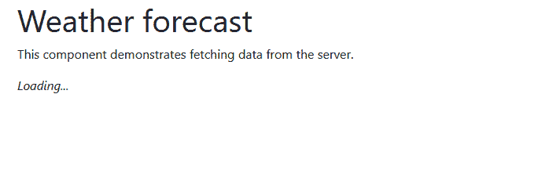

# 从 ASP.NET 核心 React 模板开始(第 3 部分——分离前端)

> 原文：<https://dev.to/jonhilt/starting-out-with-the-asp-net-core-react-template-part-3-separating-out-the-frontend-4c12>

所以现在我们[了解了一个新的 React + Web API 项目的前端部分](https://jonhilton.net/understanding-the-asp-net-react-template)，以及 [Web API 部分](https://jonhilton.net/understanding-the-asp-net-react-template-web-api)。

但是我们留下了最后一个有点扣人心弦的帖子。

我们看到了如何选择单独启动应用程序的 React 部分(在它自己的端口上运行，不与 C# API 的重建捆绑在一起)。

但是，如果您尝试这样做，启动应用程序并尝试访问“天气”页面，您将只看到加载…指示器，而没有实际数据。

[](https://res.cloudinary.com/practicaldev/image/fetch/s--8gnEk_he--/c_limit%2Cf_auto%2Cfl_progressive%2Cq_auto%2Cw_880/https://jonhilton.net/img/2019-9-18-dotnet-react-template-separate-backend/2019-09-18-21-29-37.png)

## 破网址

这是怎么回事？

好了，现在 React 前端运行在`localhost:3000`上，它与你的 ASP.NET 核心 Web API 在物理上是分离的。

所以，`FetchData.js`里的代码坏了……

```
fetch('api/SampleData/WeatherForecasts')
    .then(response => response.json())
    .then(data => {
    this.setState({ forecasts: data, loading: false });
    }); 
```

Fetch 将假设:

`api/SampleData/WeatherForecasts`

位于:

`http://localhost:3000/api/SampleData/WeatherForecasts`

这当然是错误的。

我们实际上想要做的是点击运行在另一个端口上的 API 服务器(在我的例子中是 40512；查看`Properties/launchSettings.json`以发现您的)。

要解决这个问题，我们只需手动将正确的地址包含在`fetch`调用中……

```
fetch('http://localhost:40512/api/SampleData/WeatherForecasts')
    .then(response => response.json())
    .then(data => {
    this.setState({ forecasts: data, loading: false });
    }); 
```

但是我们可能会进行很多这样的网络调用，在每种情况下都必须包含 URL 的第一部分是不理想的(尤其是因为我们可能会在开发过程中的某个时候更改它，而且肯定是在我们上线的时候)。

更好的方法是定义一次 URL，然后在任何地方使用它；使用上次添加的`.env`文件，我们可以很容易地做到这一点。

目前看起来是这样的…

```
BROWSER=none 
```

但是我们可以添加任何我们喜欢的东西。

让我们添加我们的 API URL…

```
BROWSER=none
REACT_APP_API_URL=http://localhost:40512 
```

为了能够在我们的 React (javascript)代码中检索这个值，它需要加上前缀`REACT_APP`。现在我们可以在任何需要的时候检索这些代码…

```
process.env.REACT_APP_API_URL 
```

所以，一点点字符串插值之后，我们得到了这个…

```
fetch(`${process.env.REACT_APP_API_URL}/api/SampleData/WeatherForecasts`)
    .then(response => response.json())
    .then(data => {
    this.setState({ forecasts: data, loading: false });
    }); 
```

注意这里的“不完全撇号”，url 字符串开头和结尾的反勾号？

这允许我们使用 javascript 的模板文字在字符串中插入表达式。

所以在这种情况下，我们将把`REACT_APP_API_URL`的值前置到字符串的其余部分。

## 在生产中更改 URL

到目前为止一切顺利，但我们可能不想在生产中使用`localhost`。为了在不同的环境中使用不同的设置，我们可以定义多个设置。环境文件。

所以在这种情况下，如果我们定义一个`.env.development`文件并把我们的`localhost` URL 放在那里，我们可以把实际的、生产的、API 地址放在`.env`中。

这样，我们最终应该为开发和生产提供正确的 API urls。

**。env**

```
REACT_APP_API_URL=https://API.YourDomainHere.io 
```

 **```
REACT_APP_API_URL=http://localhost:40512 
```

## 小心 CORS

当你在生产中运行你的应用时，你可能会碰到的最后一件事是 CORS。

一旦你的前端和 API 应用程序运行在不同的 URL 上，CORS 很可能会抬起头来引起你的注意！

如果您看到一个错误，表明跨来源请求被阻止，那么您很可能遇到了 CORS。

CORS 的存在是为了阻止浏览器中运行的随机代码向您的 API 发出请求，但是当您试图从自己的应用程序访问您的 API 时，它会突然出现。

令人高兴的是，您可以轻松地用 CORS 策略配置 ASP.NET 核心，该策略允许您的应用程序通过您的 API，

查看[这篇文章，了解关于 CORS](https://jonhilton.net/cross-origin-request-blocked/) 和我的便利的 [CORS 代码生成器](https://corsdot.net/)的更多细节，以获得修复问题所需的代码。**