# 用可扩展的 CSS 保持简单

> 原文:[https://dev . to/hankchizljaw/keeping-it-simple-with-CSS-that-scales-2phg](https://dev.to/hankchizljaw/keeping-it-simple-with-css-that-scales-2phg)

这是我的新演讲“用可扩展的 CSS 保持简单”的书面版本，我首次在浏览器 2019 的[状态下发表。](https://2019.stateofthebrowser.com/)

这是一篇很长的文章，所以我也录制了一个音频版本:

* * *

如今 CSS 在网络上有一个奇怪的位置。有很多两极化的观点，关于“CSS 很烂”和“CSS 规则，学得更好，傻瓜”的观点似乎是分裂的。

[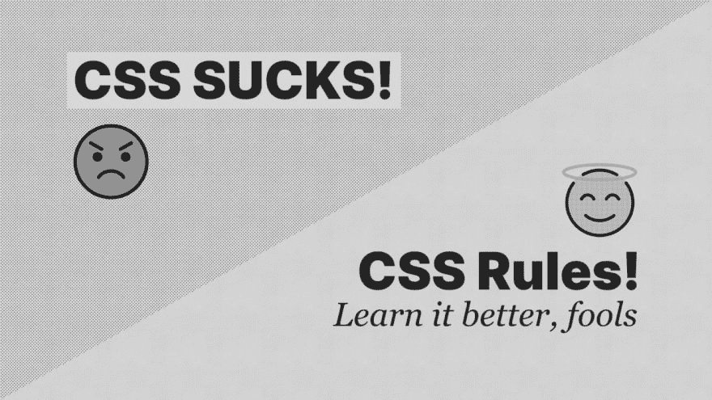T2】](https://res.cloudinary.com/practicaldev/image/fetch/s--zy4hVsKq--/c_limit%2Cf_auto%2Cfl_progressive%2Cq_auto%2Cw_880/https://res.cloudinary.com/andybelldesign/image/upload/c_scale%2Cf_auto%2Cw_1400/v1568725444/keeping-it-simple-with-css-that-scales/presentation.002_v6fao7.png)

我同情“CSS 规则”阵营，我会解释为什么:我有一个理论来解释为什么“CSS 很烂”阵营有这样的态度。我认为这是他们过度设计 CSS 的组合，没有完全理解 CSS 的力量，最后，把它当成 JavaScript 之类的语言，并期望它以同样的方式工作。

在这篇文章中，我要做的是解决第一点，并告诉大家我们如何简化 CSS，以给我们带来不可思议的能力，同时尽可能降低技术含量。秘方是，大部分内容实际上并不是关于 CSS 的，但稍后会变得更清楚。

# [](#lets-talk-about-scale)先说规模

[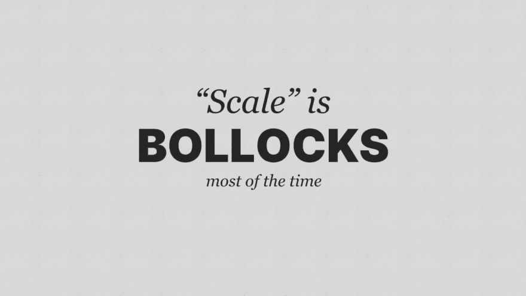T2】](https://res.cloudinary.com/practicaldev/image/fetch/s--OD05mfdC--/c_limit%2Cf_auto%2Cfl_progressive%2Cq_auto%2Cw_880/https://res.cloudinary.com/andybelldesign/image/upload/c_scale%2Cf_auto%2Cw_1400/v1568725444/keeping-it-simple-with-css-that-scales/presentation.006_kuw6cr.png)

我非常讨厌我们使用“规模”这个术语。但是我认为我们被它困住了，就像我们被“JAMstack”、“无服务器”和“performant”困住了一样。

[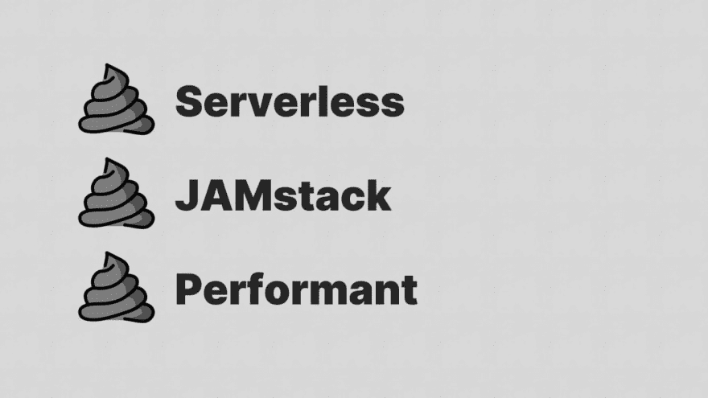T2】](https://res.cloudinary.com/practicaldev/image/fetch/s--1rhzUqqd--/c_limit%2Cf_auto%2Cfl_progressive%2Cq_auto%2Cw_880/https://res.cloudinary.com/andybelldesign/image/upload/c_scale%2Cf_auto%2Cw_1400/v1568725444/keeping-it-simple-with-css-that-scales/presentation.007_nikh6a.png)

它们都是同样可怕的词，但它们做的一件事是创造了一个共同的，可识别的交流结构。虽然这让我很痛苦，但这正是我为什么把这个演讲命名为“用可扩展的 CSS 保持简单”。在我打开我的 gob 之前，你可能已经知道我将要谈论关于大规模代码库的工作，在这个演讲的某个时刻，我将会谈到它。

[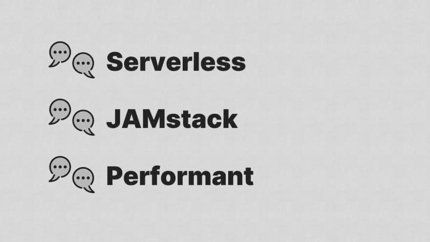T2】](https://res.cloudinary.com/practicaldev/image/fetch/s--xSVsAVGl--/c_limit%2Cf_auto%2Cfl_progressive%2Cq_auto%2Cw_880/https://res.cloudinary.com/andybelldesign/image/upload/c_scale%2Cf_auto%2Cw_1400/v1568725444/keeping-it-simple-with-css-that-scales/presentation.008_plltsn.png)

不过，我确实对“规模”感到恼火的一件事是，当人们用它作为过度设计某事的借口时，它会变得有些模糊。

就拿这个常见的例子来说吧。一些海湾地区的技术人员通常会说:

> 我们使用 CSS-in-JS 库，因为我们的产品需要伸缩

[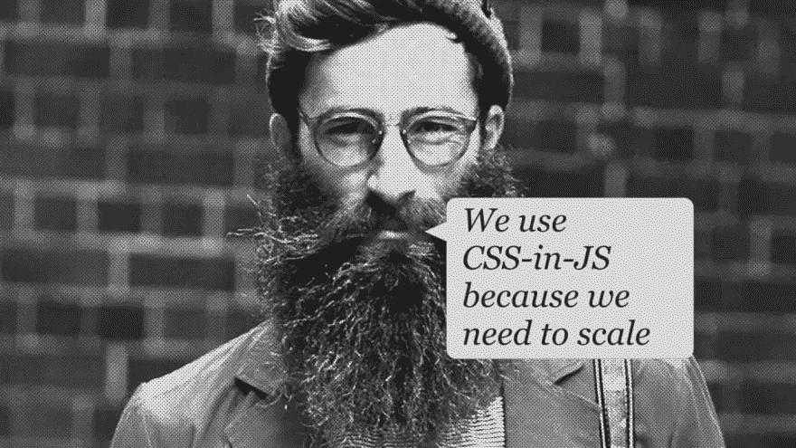T2】](https://res.cloudinary.com/practicaldev/image/fetch/s--ZoEJlts3--/c_limit%2Cf_auto%2Cfl_progressive%2Cq_auto%2Cw_880/https://res.cloudinary.com/andybelldesign/image/upload/c_scale%2Cf_auto%2Cw_1400/v1568725444/keeping-it-simple-with-css-that-scales/presentation.011_swdahl.png)

让我们诚实一会儿，伙计们:这些科技兄弟制造的大多数不温不火的废话只会扩展到垃圾箱，所以这不是一个有效的借口，不是吗？

我也要大胆坦率地说，我不认为用规模作为过度工程化的借口——尤其是 CSS——是可以接受的，即使是对于开发大型产品的大型团队。请记住这一点，因为我希望，在本次会议结束时，你们会同意我的观点。

# [](#four-key-things)四件关键的事情

我认为我们今天可以专注于四个关键的事情，对于这篇文章的其余部分，我将通过一点进展来详细介绍它们，这样你就可以大致知道你还要忍受我多长时间。

[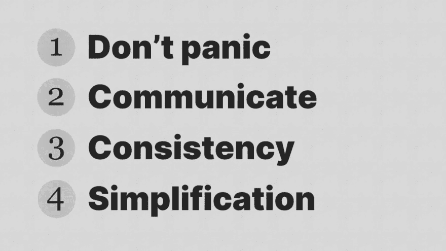T2】](https://res.cloudinary.com/practicaldev/image/fetch/s--iXddFSHD--/c_limit%2Cf_auto%2Cfl_progressive%2Cq_auto%2Cw_880/https://res.cloudinary.com/andybelldesign/image/upload/c_scale%2Cf_auto%2Cw_1400/v1568725444/keeping-it-simple-with-css-that-scales/presentation.013_wwombv.png)

我可以把这个包装成 *DCCS* 然后在那个橙色网站上扫荡向上投票，对吗？

不管怎样，我们开始吧。

## [](#dont-panic)不要惊慌

我最喜欢的书之一是《银河系漫游指南》。它讲述了地球被炸毁，为超空间高速公路让路，我们的主角亚瑟·登特和他的外星人向导福特·普里菲克特一起在太空中搭便车旅行。

我知道，这是一个很垃圾的大纲，但是你们都不是来看我谈论这本书的。

《银河系漫游指南》是一种互动百科全书——嗯，按照 1979 年的标准来说是互动的...

这部百科全书最能引起我共鸣的地方是它的封面上写着:“不要惊慌”。这个短语在整个故事中被使用了*那么多次*，即使在上下文非常需要恐慌的时候。

[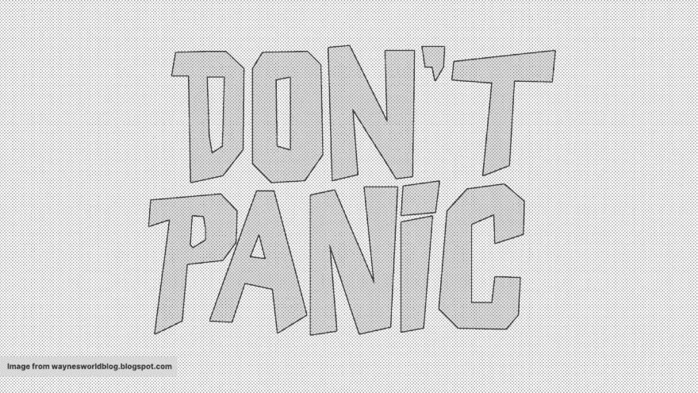T2】](https://res.cloudinary.com/practicaldev/image/fetch/s--VAB2AqfO--/c_limit%2Cf_auto%2Cfl_progressive%2Cq_auto%2Cw_880/https://res.cloudinary.com/andybelldesign/image/upload/c_scale%2Cf_auto%2Cw_1400/v1568725444/keeping-it-simple-with-css-that-scales/presentation.016_v2d0lc.png)

我发现自己真的与福特·普里菲克特产生了共鸣，引导阿瑟·登特——一个笨手笨脚的英国人经历了可以理解的令人难以置信的太空冒险。福特总是以冷静、务实的方式应对挑战，就像指南告诉他的那样:“不要惊慌”，我认为这对我们来说也是一种启示。

事实上，当亚瑟第一次拿到这本书时，他说:

> “我喜欢这个封面...不要惊慌。这是一整天以来任何人对我说的第一句有用或明白的话。”

对，反正我跑题了……“别慌”。这是个很好的建议，因为当我们恐慌时，我们会犯愚蠢的错误。想想看:当你在一个项目中遇到它，而你只需要完成它的时候，你做了多少可怕的 CSS 黑客。

许多 T2 人这样做，这是因为我们感到恐慌。截止日期快到了，没有时间来找出我们的 CSS 被破坏的原因，所以我们把`!important`扔给它，直到它被修复。

[T2】](https://res.cloudinary.com/practicaldev/image/fetch/s--C8l_QY5h--/c_limit%2Cf_auto%2Cfl_progressive%2Cq_auto%2Cw_880/https://res.cloudinary.com/andybelldesign/image/upload/c_scale%2Cf_auto%2Cw_1400/v1568725444/keeping-it-simple-with-css-that-scales/presentation.019_ohpnnj.png)

这很好:我们都这样做，但不好的是技术债务。恐慌通常不仅仅是到处小打小闹，而是升级为更严重的事情，比如使用 CSS-in-JS 框架，这相当于获得 Wonga 贷款来支付房屋抵押贷款。

高得令人难以置信的利息技术债务，令人沮丧的是，开发人员只支付了一点点，因为开发人员可能已经去找了一份新工作。就性能而言，主要是用户受到了最大的冲击，当你考虑到现代 CSS 为我们提供了什么时，这让我感到困惑。

### CSS 的当前状态

[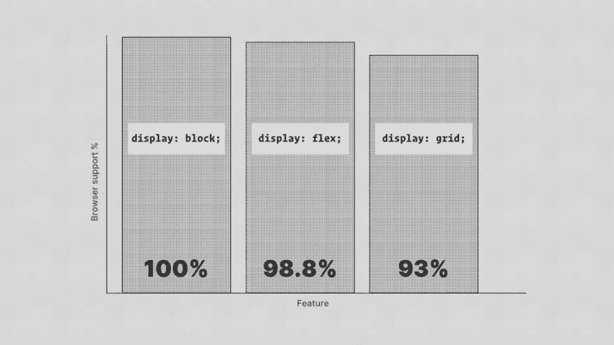T2】](https://res.cloudinary.com/practicaldev/image/fetch/s--bEi9xOsM--/c_limit%2Cf_auto%2Cfl_progressive%2Cq_auto%2Cw_880/https://res.cloudinary.com/andybelldesign/image/upload/c_scale%2Cf_auto%2Cw_1400/v1568725444/keeping-it-simple-with-css-that-scales/presentation.022_rvyrqd.png)

真的，我们从未有过比 CSS 更好的体验。我们有 93%支持的 CSS Grid 和 98.8%支持的 Flexbox。用一种安全的渐进增强的心态来使用它们，你的布局就被**排序**。任务完成。别担心。

我们还得到 CSS 自定义属性，它们是本地 CSS 变量。它们对于标记我们的 CSS 非常方便。因为它们也受到级联的影响，我们可以根据具体情况忽略它们。这使得它们对于主题化、算法和显示模式(如黑暗模式)非常有用。

```
:root { --primary: #8e8e8e;}.box { background: var(--primary);}.badge { color: var(--primary);} 
```

这些只是强大的新功能的一部分，但是你可以看到现代 CSS 是一个非常强大、有效的样式工具。但是它可能有点短，特别是当你有很多 CSS 的时候。因此，让我们来看看如何处理这个问题。

### [](#sass-for-the-win)为胜利而战！

所有这些原生功能都很酷，对吧？我们也不要忘记本地嵌套，但是当我们使用它时，谁来做所有的工作呢？是的:**浏览器**！

在大多数情况下，这很好，尽管原生 CSS 的想法让我害怕——特别是当我们已经用沉重的 JavaScript 框架组装浏览器的时候。

[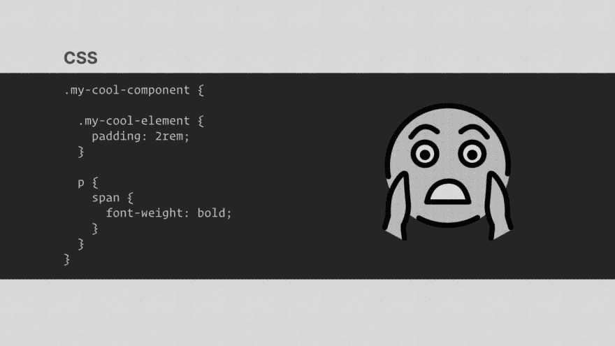T2】](https://res.cloudinary.com/practicaldev/image/fetch/s--PVI79ZwY--/c_limit%2Cf_auto%2Cfl_progressive%2Cq_auto%2Cw_880/https://res.cloudinary.com/andybelldesign/image/upload/c_scale%2Cf_auto%2Cw_1400/v1568725444/keeping-it-simple-with-css-that-scales/presentation.028_vvbjqp.png)

基本上，我要说的是我们不必放弃 Sass，因为本地语言功能即将到来。最好谨慎地预编译你的 CSS，不要强迫浏览器努力工作。这已经够辛苦的了，每次一个数据改变就重新渲染 DOM(*咳*反应式框架*咳*)，那么为什么要让它更辛苦一点，只是为了能有原生嵌套呢？在我看来，这就像是开发者体验重于用户体验。

[T2】](https://res.cloudinary.com/practicaldev/image/fetch/s--h_PGJJsp--/c_limit%2Cf_auto%2Cfl_progressive%2Cq_auto%2Cw_880/https://res.cloudinary.com/andybelldesign/image/upload/c_scale%2Cf_auto%2Cw_1400/v1568725444/keeping-it-simple-with-css-that-scales/presentation.030_grv3om.png)

我们匆忙把东西扔进垃圾箱，却没有考虑更广泛的影响。是的，我们很快就会实现嵌套，但是一个低功耗的设备如何处理 5 层嵌套的链式选择器呢？一个低功耗的设备如何处理已经被级联覆盖 5 次的自定义属性的颜色计算？原生工具有多好并不重要，因为如果我们继续向浏览器扔垃圾代码，用户将会因此而受害。

[T2】](https://res.cloudinary.com/practicaldev/image/fetch/s--e0GI74j9--/c_limit%2Cf_auto%2Cfl_progressive%2Cq_auto%2Cw_880/https://res.cloudinary.com/andybelldesign/image/upload/c_scale%2Cf_auto%2Cw_1400/v1568725444/keeping-it-simple-with-css-that-scales/presentation.031_pnmdjf.png)

萨斯的妙处在于你可以拥有两个世界的精华。你可以得到很酷的东西，比如嵌套，但是如果你做得好，你可以得到漂亮、扁平的选择器。您还可以获得组件，如果您愿意，您可以将您的项目设置为获得多个包。您还可以在构建时 lint 您的 CSS，这样您就可以在终端或 GUI 中知道什么时候事情失控了。

最重要的是，有了 Sass，SCSS，你仍然在写 CSS。SCSS 足够聪明，只做它需要关注的事情，而不去管你的 CSS 的其他部分。对我来说，这感觉像一个非常完美的设置。

[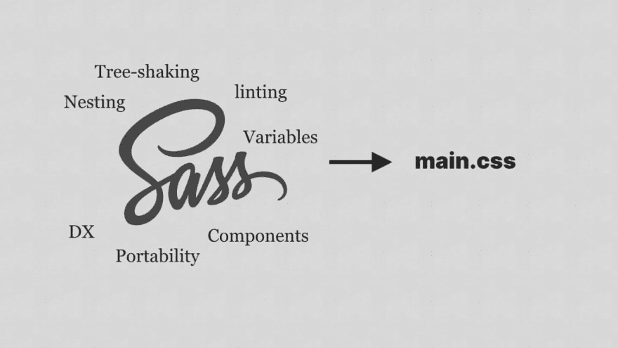T2】](https://res.cloudinary.com/practicaldev/image/fetch/s--xqpG1G_h--/c_limit%2Cf_auto%2Cfl_progressive%2Cq_auto%2Cw_880/https://res.cloudinary.com/andybelldesign/image/upload/c_scale%2Cf_auto%2Cw_1400/v1568725444/keeping-it-simple-with-css-that-scales/presentation.032_bdd6zl.png)

## [](#communicate)沟通

我们似乎处于这样一个时代，在这个时代，工具和方法被发明出来帮助避免相互交流。

生成 CSS 类名就是一个典型的例子。这是一个非常典型的问题。有些人可能会在这一点上开始有一个存在危机，或梦想机器生成的类名，但看看这个:我们将尝试这个叫做说话的新奇事物:

### [](#dev-1-lucrecia)开发#1 -卢克雷西亚

> “我想到的这个组件已经存在。让我在 git 中快速浏览一下，看看是谁创建了它。啊，是伊莎贝拉”

### [](#lucrecia-to-dev-2-isabella)卢克雷西亚到开发#2，伊莎贝拉

> "嘿，戴夫·伊莎贝拉，这个组件被称为“块”有什么原因吗？"

### [](#isabella-to-lucrecia)伊莎贝拉到卢克雷西亚

> “啊叶，这个原因很重要。你把那个部件叫做‘盒子’怎么样？”

这个重要的原因可能是你想象出来的任何东西:

*   利益相关者的决定
*   遗留代码库问题
*   设计决策

重要的是，懂得如何有效沟通的专业人士伊莎贝拉提出了一个替代方案。

### [](#lucrecia)卢克雷西亚

> “这是个好主意。谢谢！”

这有多健康？？当我们真的互相交谈时会发生令人惊奇的事情。

[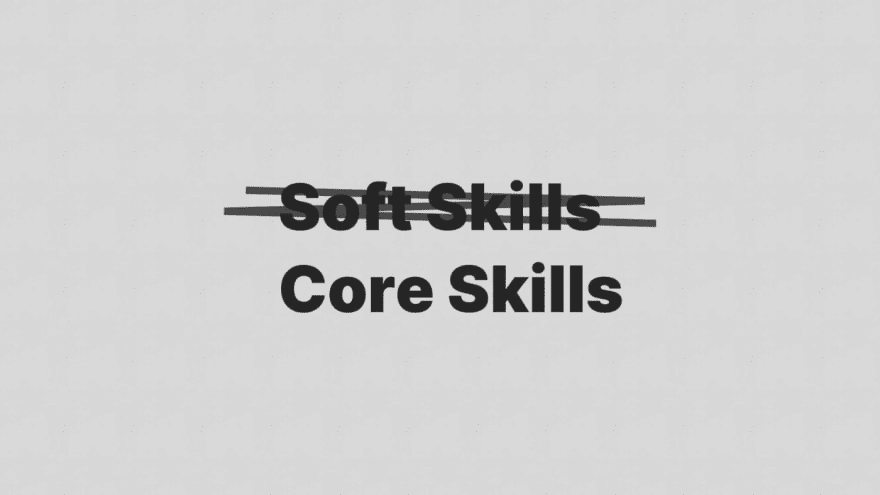T2】](https://res.cloudinary.com/practicaldev/image/fetch/s--C_HTapM8--/c_limit%2Cf_auto%2Cfl_progressive%2Cq_auto%2Cw_880/https://res.cloudinary.com/andybelldesign/image/upload/c_scale%2Cf_auto%2Cw_1400/v1568725444/keeping-it-simple-with-css-that-scales/presentation.041_gspzgv.png)

我更愿意称之为核心技能的所谓“软技能”被回避，以利于建立自己的链表或在白板上发出嘶嘶的声音。这让我很紧张，因为要成为一个团队的有效成员，*你必须能够沟通*，而你在现实世界中唯一一次发出嘶嘶的嗡嗡声是在那个耗尽生命的面试过程中…

### [](#documentation-is-everything)文档就是一切

另一种不实际的交流方式是写作。我喜欢写作，你可能注意到了，我经常写作……事实上，我几乎把所有的事情都写下来，因为我不知道什么时候可能会需要它。它还能帮助我记忆东西。

把一切都写下来真的很有价值——尤其是在一个大型的前端开发团队中，写 CSS——或者任何代码，真的。你可以记录你的思维过程，并解释你是如何和为什么做这些事情的。你可以写文档，这样如果另一个开发人员拿起你的代码，他们就知道发生了什么。

关于文档，我不是说你必须写很多很多结构化的文档:我说的是你代码中该死的注释。

举这个例子:

```
.card { background-color: #ffffff !important;} 
```

如果我落在这上面，我会想“这到底是怎么回事？”

不过，这个怎么样？

```
.card { /* When this card is used in the legacy app, there is a collision between existing styles, so unfortunately we had to go nuclear. It’s certainly a refactor target. */ background-color: #ffffff !important;} 
```

如果我落在这上面，我会更像:“嗯，很公平。我有一点空闲时间:也许我应该看看我是否能解决特殊性问题。

> 良好的书面交流可以防止人与人之间不必要的冲突，这反过来又可以防止由愚蠢的工具产生的昂贵的技术债务

在我的书里是双赢！

好了，我已经唠叨了一会儿如何成为一个正常的成年人，因为我已经讲到这里了，还没有谈到如何写 CSS。让我们开始吧。

## [](#consistency)一致性

我认为一致性是缩放 CSS 的关键(抱歉我又说了缩放)。真的，这就是这些过度抽象试图给你的，在我看来，它们走得太远了。

我使用一种类似于边界元法的方法——一种简化的版本。我称之为 **C-BEUT** ，分别代表**级联**、**区块**、**元素**、**效用**和**令牌**。我知道这是一个很垃圾的名字，但它很适合我们想出来的其他糟糕的名字，不是吗？我将解释 C-BEUT 是如何工作的。

[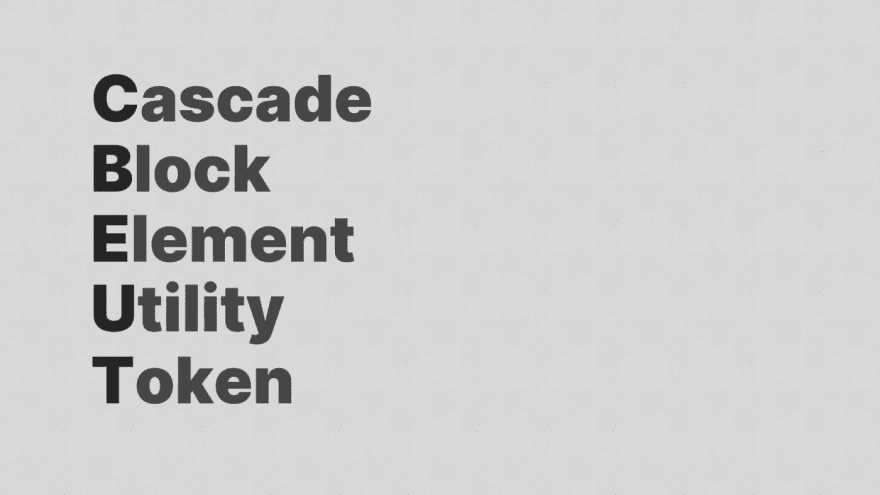T2】](https://res.cloudinary.com/practicaldev/image/fetch/s--rUTnHtHD--/c_limit%2Cf_auto%2Cfl_progressive%2Cq_auto%2Cw_880/https://res.cloudinary.com/andybelldesign/image/upload/c_scale%2Cf_auto%2Cw_1400/v1568725444/keeping-it-simple-with-css-that-scales/presentation.049_uscvwg.png)

### [](#cascade)级联

CSS 中的“C”代表“层叠”。Cascade 是 CSS 中我最喜欢的部分，因为如果你正确使用它，你可以编写很少的 CSS，并获得非常好的结果。按照这种方法，cascade 是第一个停靠港。我设置了合理的默认值，尽可能高的主题和字体。这给了我们如此大的力量。

然后，组件可以更加骨架化，只处理它们与全局的不同之处，而不是处理所有的事情。

### [](#block)块

这是你的组件，你的卡或你的按钮。它是用户界面的组成部分。这真的就差不多了——一个概念，仅此而已。

[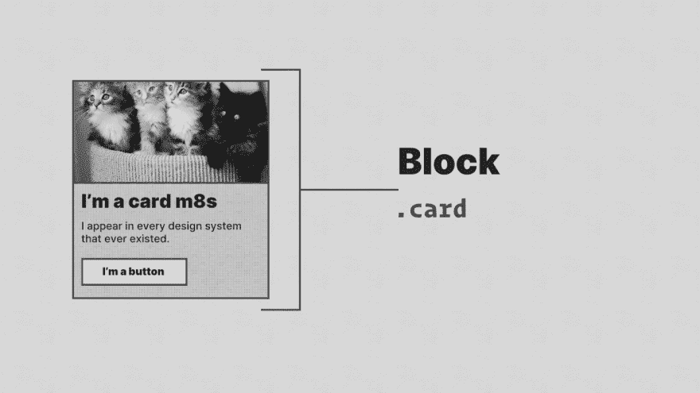T2】](https://res.cloudinary.com/practicaldev/image/fetch/s--acdIzweA--/c_limit%2Cf_auto%2Cfl_progressive%2Cq_auto%2Cw_880/https://res.cloudinary.com/andybelldesign/image/upload/c_scale%2Cf_auto%2Cw_1400/v1568725444/keeping-it-simple-with-css-that-scales/presentation.055_yykqm7.png)

### [](#element)元素

这是一个依赖于你的块的东西——一个子元素。它总是存在于它的父块中。一个很好的例子是在你的卡里，你可能有一个`card__image`。

[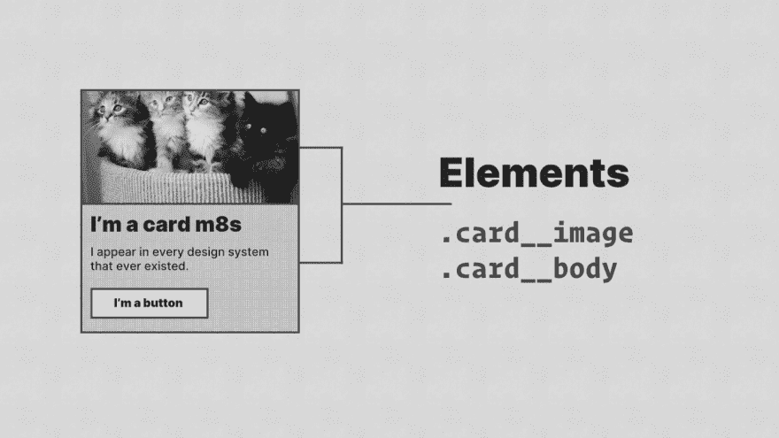T2】](https://res.cloudinary.com/practicaldev/image/fetch/s--K_-tmZnZ--/c_limit%2Cf_auto%2Cfl_progressive%2Cq_auto%2Cw_880/https://res.cloudinary.com/andybelldesign/image/upload/c_scale%2Cf_auto%2Cw_1400/v1568725444/keeping-it-simple-with-css-that-scales/presentation.056_ialkry.png)

我试图让基本类尽可能的简单，并使用 CSS 算法来分发内容，而不是更深入。

同样，这也让我们的组件文件变得轻巧、简洁。

[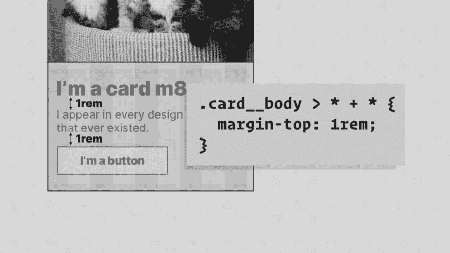T2】](https://res.cloudinary.com/practicaldev/image/fetch/s--QzVd9hl7--/c_limit%2Cf_auto%2Cfl_progressive%2Cq_auto%2Cw_880/https://res.cloudinary.com/andybelldesign/image/upload/c_scale%2Cf_auto%2Cw_1400/v1568725444/keeping-it-simple-with-css-that-scales/presentation.057_pmmipt.png)

## [](#utility)效用

这是一个完成一项工作并且做得很好的类——就像水管工或开罐器一样。实用程序类的一个例子是将文本居中或应用一些上边距。简单的低保真度工具。

重要的是，这意味着你可以编写普通的 CSS 并在你需要的地方应用它，而不是一遍又一遍地重复你自己。

[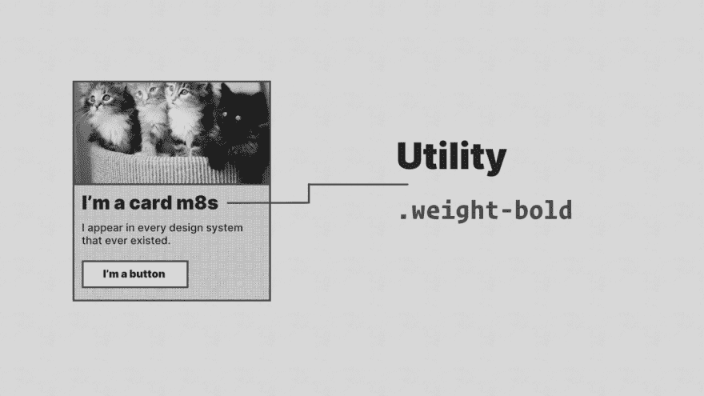T2】](https://res.cloudinary.com/practicaldev/image/fetch/s--4L-8nqeR--/c_limit%2Cf_auto%2Cfl_progressive%2Cq_auto%2Cw_880/https://res.cloudinary.com/andybelldesign/image/upload/c_scale%2Cf_auto%2Cw_1400/v1568725444/keeping-it-simple-with-css-that-scales/presentation.058_js2tem.png)

## [](#token)令牌

这实际上是一个实用程序类，但它是一个特定的实用程序类，实现了一个设计令牌，通常由一个单独的工具生成。

什么是设计符号？他们尖叫道:我会让我的朋友纪娜解释，因为他们发明了它们！

> 设计符号是设计系统的视觉原子——具体来说，它们是存储视觉设计属性的命名实体。我们用它们来代替硬编码的值，以保持一个可伸缩的和一致的视觉系统。

—[@吉娜](https://twitter.com/jina)

这些小类对于将你的 UI 从设计系统中分离出来非常有用。它使系统能够远离你所在的代码环境，这给了它巨大的力量。

[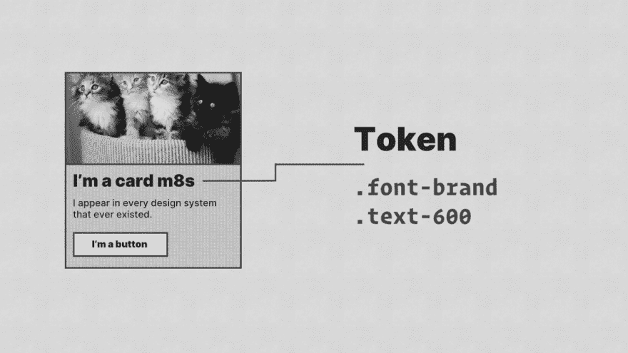T2】](https://res.cloudinary.com/practicaldev/image/fetch/s--BKkMg6hv--/c_limit%2Cf_auto%2Cfl_progressive%2Cq_auto%2Cw_880/https://res.cloudinary.com/andybelldesign/image/upload/c_scale%2Cf_auto%2Cw_1400/v1568725444/keeping-it-simple-with-css-that-scales/presentation.059_eshwwr.png)

这个符号是一个尺寸刻度的参考，就像我网站上的这个符号一样。它使用了大三度音阶，这给了我们大小之间可爱的曲线。

它也用于各种用途:

*   调整文本大小
*   间隔元素
*   添加内部填充

* * *

就是这样，我不会坐在这里告诉你这是写 CSS 的最好方法，因为它可能不是。它不过是*一致的*。就像 BEM 或者 ITCSS 一样。在一天结束的时候，找到对你的团队有用的东西，坚持下去，并记录下它的结果。**让你团队中的人能够做出一致的决定，而不会让他们慢下来**。

关于方法学，我要说的一件事是，如果你发现自己被一种方法所限制:投入时间去尝试一些不同的东西。世事无常，所以接受并拥抱这个事实吧。这就是为什么我现在使用 C-BEUT，而不是 BEM。我认为 BEM 很棒，但我也遇到了我的修饰符失控的问题，所以我坐下来，简化我试图实现的东西，并决定使用实用程序和令牌来代替。

永远对变化保持开放的态度。我们生活在一个充满活力的世界，工作在一个充满活力的行业。如果你太固执己见，将来你可能会给自己和其他人带来更多的问题。

## [](#simplification)简化

如果我做一个题为“用可扩展的 CSS 保持简单”的演示，而不谈论简化，那就太疯狂了，不是吗？

先说框架。你真的需要吗？我觉得你不再需要了。

[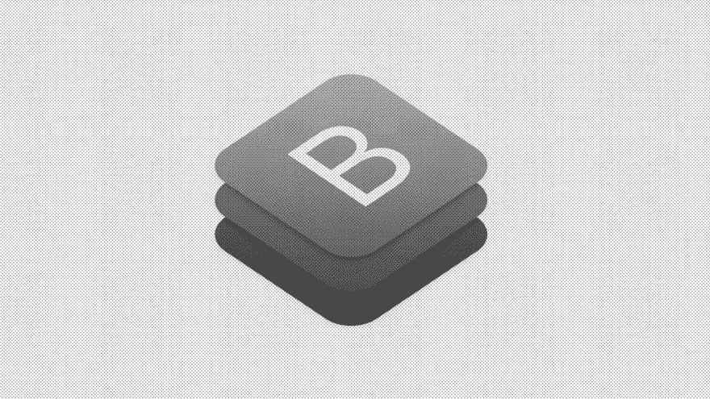T2】](https://res.cloudinary.com/practicaldev/image/fetch/s--AeAXVtSA--/c_limit%2Cf_auto%2Cfl_progressive%2Cq_auto%2Cw_880/https://res.cloudinary.com/andybelldesign/image/upload/c_scale%2Cf_auto%2Cw_1400/v1568725444/keeping-it-simple-with-css-that-scales/presentation.068_fa06xf.png)

Bootstrap 是一个非常强大的框架。它出现的时候，我们正在学习如何建立反应灵敏的网站*和*与浏览器无情的兼容性问题作斗争。这是一个地狱般的时代，值得称赞的是，Bootstrap 让这一切变得容易得多。事实上，我甚至可以说，Bootstrap 是有史以来最好的设计系统之一。

今天使用 Bootstrap 当我们有真正的原生工具用于布局时，如 grid 和 flex——就像用大锤打鸡蛋一样。它也会带来自身的复杂性。由于它的构建方式，它使用非常全局的选择器来积极地设置样式。这又导致了这样的事情:

```
.card { background-color: #ffffff !important;} 
```

老实说，大多数 CSS 框架也是如此。一个让我心惊肉跳的例子是[顺风 CSS](https://tailwindcss.com/) 默认生成超过 **4 万行 CSS**([来源](https://unpkg.com/tailwindcss@1.1.2/dist/tailwind.css))。疯子。

如果你有一个可靠的方法论，比如 BEM，ITSCSS，SMACSS 甚至 C-BEUT，你可以用 grid 来点缀一点网格系统，用 flex 添加一些布局助手，你就成功了。

[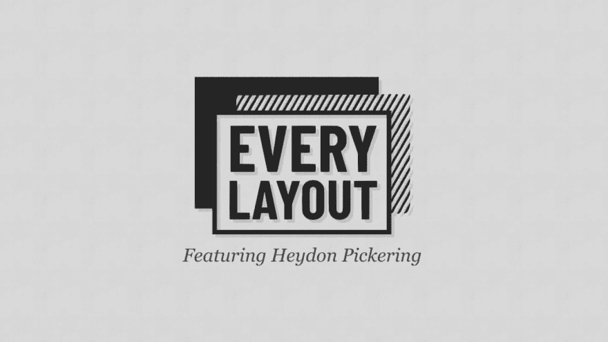T2】](https://res.cloudinary.com/practicaldev/image/fetch/s--mhrvK7wT--/c_limit%2Cf_auto%2Cfl_progressive%2Cq_auto%2Cw_880/https://res.cloudinary.com/andybelldesign/image/upload/c_scale%2Cf_auto%2Cw_1400/v1568725444/keeping-it-simple-with-css-that-scales/presentation.074_siyprj.png)

这是我们在《每一个版面的设计》中采用的方法——这本书是我和我的好朋友海登·皮克林合写的。

对于我们的布局，我们通过简化和提炼我们的问题找到最健壮的解决方案。然后，我们使用公理和基本原理提示浏览器，而不是微观管理它，让它发号施令。这产生了一个非常坚固的布局系统，该系统向上工作，在最前面逐渐增强。

这是一个非常酷的项目，引起了很多人的共鸣，所以请继续前进并[查看一下](https://every-layout.dev)。

关于渐进增强的主题，大家都过来坐一会儿。

**不要因为要支持 IE11** 就对现代 CSS 不屑一顾。

这是一种荒谬的心态，每当有人在 Twitter 上分享一个很酷的技巧时，就会有一个 Chad 出现在评论中，说“尽管 IE 11 怎么样”，这让我很恼火。

[T2】](https://res.cloudinary.com/practicaldev/image/fetch/s--6UUid379--/c_limit%2Cf_auto%2Cfl_progressive%2Cq_auto%2Cw_880/https://res.cloudinary.com/andybelldesign/image/upload/c_scale%2Cf_auto%2Cw_1400/v1568725444/keeping-it-simple-with-css-that-scales/presentation.081_allu7h.png)

停止尝试像素推动您的设计，而是使用渐进式增强来创建一个合理的默认设置，自动改善支持可用的地方。

[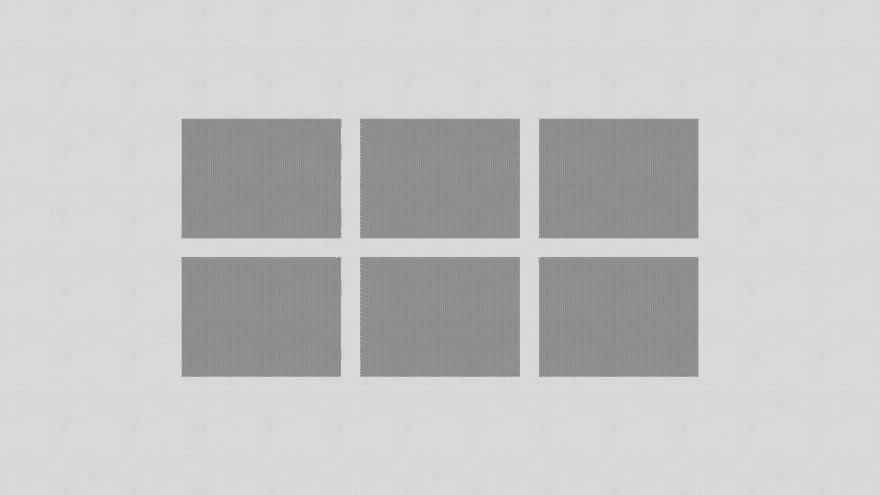T2】](https://res.cloudinary.com/practicaldev/image/fetch/s--vBKE3m_I--/c_limit%2Cf_auto%2Cfl_progressive%2Cq_auto%2Cw_880/https://res.cloudinary.com/andybelldesign/image/upload/c_scale%2Cf_auto%2Cw_1400/v1568725444/keeping-it-simple-with-css-that-scales/presentation.082_kxkt6a.png)

举个例子:我们有一个很好的三列网格。在过去，我们会使用一些技巧，不仅仅是为了展示它，也是为了让它在每个浏览器中都看起来像这样。

我的建议是，我们后退一步，简化问题，找到一个合理的基线，这就是:良好的空间叠加。我们现在可以用少量的 CSS 实现 100%的覆盖率。

[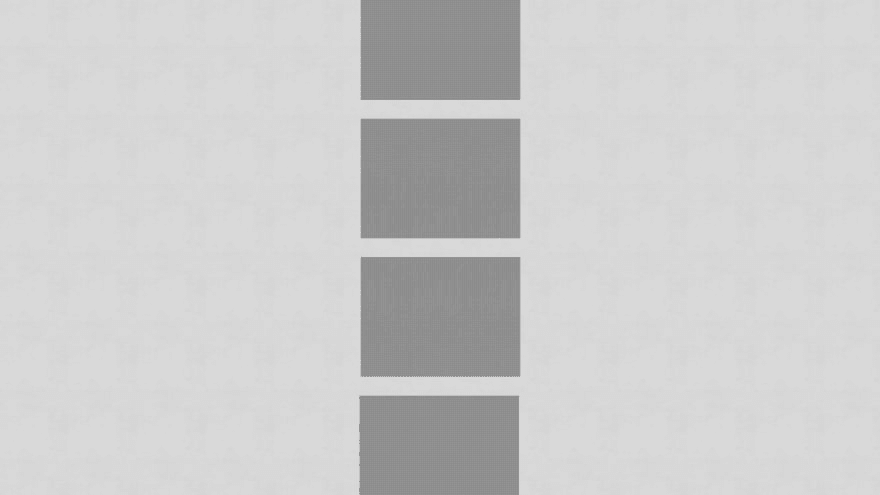T2】](https://res.cloudinary.com/practicaldev/image/fetch/s--dxxjaIeb--/c_limit%2Cf_auto%2Cfl_progressive%2Cq_auto%2Cw_880/https://res.cloudinary.com/andybelldesign/image/upload/c_scale%2Cf_auto%2Cw_1400/v1568725444/keeping-it-simple-with-css-that-scales/presentation.083_xbazps.png)

这是一个[方便的小网格系统](https://dev.to/wrote/create-a-responsive-grid-layout-with-no-media-queries-using-css-grid/)，它使用 minmax 来分配列。这意味着我们得到了一个没有媒体询问的**响应网格**。

```
.auto-grid { display: grid; grid-template-columns: repeat(auto-fill, minmax(16rem, 1fr)); grid-gap: 1rem;} 
```

但是，网格仍然没有得到完全的支持，但是由于 CSS 的本性，它会忽略它不理解的东西并继续前进，所以我们可以在网格代码下面加上这个:

```
.auto-grid > * { max-width: 25rem; margin-left: auto; margin-right: auto;}.auto-grid > * + * { margin-top: 1rem;} 
```

现在，多亏了`@supports`，我们可以在有支持的地方重新设置一些。如果一个浏览器支持网格，它支持`@supports`，那么**的工作完成**。

这是 22 行 CSS 代码，没有删改，可以一直追溯到 IE9(甚至更久)。

[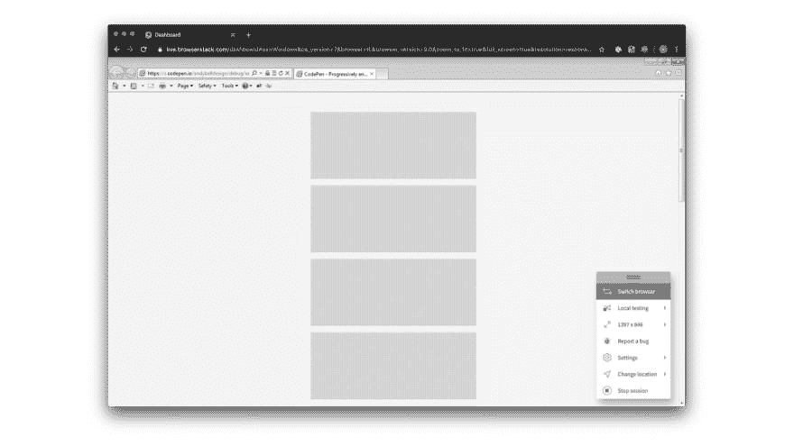T2】](https://res.cloudinary.com/practicaldev/image/fetch/s--Yj1WHESg--/c_limit%2Cf_auto%2Cfl_progressive%2Cq_auto%2Cw_880/https://res.cloudinary.com/andybelldesign/image/upload/c_scale%2Cf_auto%2Cw_1400/v1568725444/keeping-it-simple-with-css-that-scales/presentation.088_nw7okb.png)

在 [CodePen](https://codepen.io) 上看到安迪·贝尔( [@andybelldesign](https://codepen.io/andybelldesign) )的 Pen [渐进增强，免媒体查询网格](https://codepen.io/hankchizljaw/pen/xxKdvwy/)。

### [](#slow-down)减速

关于简化的最后一点，也是我结束演讲前的最后一点是“慢下来”。

说真的，**减速**。我知道当你在一个接一个的冲刺或者一个大项目中工作时，这很难，但是相信我，当事情变得棘手时，放慢速度。

今年早些时候，我在这个问题上栽了跟头。我当时正在开发一个大型系统/模式库，我们遇到了一些早期的复杂问题。我应该做的是停下来，退后一步，进行一些批判性的思考。但我所做的是在每一次冲刺、每一次回顾和每一次计划会议中坚持不懈，直到不放慢速度会产生巨大的负面影响。我在兑现科技债务，就像我在赚取航空里程一样。

我们有两到三个网格系统，一些是流体型的，一些是实用驱动型的，它们与卡组件**和**相冲突，卡组件本身就是一个网站。如果我放慢脚步，退后一步，我本可以看到这些问题，但我没有。所以说真的，慢下来，你会节省很多时间。

我将留给你这个带回家的建议:**与其快速移动和打破东西，不如缓慢而有意识地移动。**

* * *

你可以在浏览器 2019 的[状态，这里](https://www.youtube.com/watch?v=byAaV3sy5qc&t)看我发表这个演讲。

您可以看到该演示中的[幻灯片，这里是](https://noti.st/hankchizljaw/D6LsJD/keeping-it-simple-with-css-that-scales)。