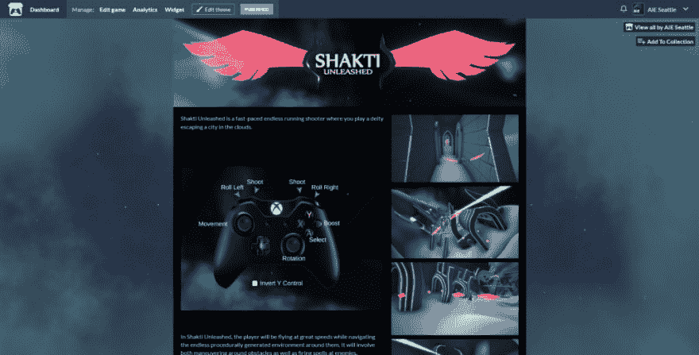

# AIE 的小生产过程

> 原文:[https://dev . to/terrehbyte/aie-s-minor-production-process-3c 38](https://dev.to/terrehbyte/aie-s-minor-production-process-3c38)

*这是由 [Lizz Rizzo (@lizz0id)](https://twitter.com/lizz0id) 编辑并在[互动娱乐学院](https://aie.edu/aie-minor-production-process/)的网站*上发布的。

对于我们的游戏开发学生来说，本课程最有价值的部分之一是在每学年结束时，有机会与其他学科的同龄人合作完成他们的最终项目。

在内部，这些项目分别被我们的一年级和二年级游戏学生称为“[小制作](https://aie.edu/what-is-minor-production/)”和“大制作”。每年，学生们都会遭遇同样的问题:沟通问题、技能差距、教师不明确的指导，或者只是一般的人际冲突。今年的变化延续了改进流程的趋势，进而创造了更强的学生体验。

## 为学生采用 Scrum

我们向学生介绍 Scrum 以培养健康的团队习惯的努力在过去的小制作项目中取得了成功，它模拟了工作室环境。团队很自然地发现最初的过渡是艰难的，但是许多人后来报告说在第二次或第三次冲刺时对这个过程感到很舒服。

我们对待出勤率就像学生在工作室环境中全职工作一样。对于那些很难按时上课的学生来说，遵守每日站立是很困难的。学生们努力灵活安排时间表或进行多次审查来缓解问题，这实际上是在用出勤问题换取沟通或生产力问题。任何进一步的问题都要上报给管理层进行监控。

教员指定特定的时间段来进行冲刺规划和冲刺回顾会议。虽然学生总是渴望批评他们的工作，但这一次团队更善于识别和解决问题。团队不再仅仅关注产品的问题，他们还能够解决过程中的问题。像规模问题这样的管道问题在以后的周期中不存在。

除了上述仪式之外，我们还要求每个小组向全班展示最近的发展。公开展示不仅强化了他们的工作应该继续为玩家创造价值的理念，也为教员提供了一个在一次会议中回顾每个团队工作的机会。如果团队的优先事项或进度有任何问题，所有教职员工都会立即看到。这改进了我们在团队中解决问题的响应时间和效率。

为了促进项目管理，我们使用 Hack n' Plan，这是一个用户友好的服务，模拟了一些常见的 Scrum 概念，如积压和用户故事。它的分类看板允许学生按学科跟踪任务进度，以最大限度地减少混乱。

## 切换到性能

今年一个主要的软件变化是从作为我们首选版本控制解决方案的 Git 过渡到 Perforce，以响应行业反馈。从学生的角度来看，Perforce 允许他们锁定文件，以防止其他人在他们工作时进行更改。

合并两组对代码的更改是可行的，但是协调对艺术资产的并发更改通常会导致工作丢失。消除合并的需要让我们消除了学生失去工作的途径。不幸的是，学生仍然会因为不恰当地使用 Perforce 而丢失工作，Git 就是这样。

采用 Perforce 的一个附带好处是降低了训练美工人员在引擎中工作以改进迭代时间的难度。程序员能够专注于 bug 修复和特性开发，而不是集成艺术资产(至少在较小的程度上)。这也意味着艺术家们可以得到更多关于他们工作的即时反馈，而不是被忙碌的程序员所阻挡。在这两种情况下，这导致了更好的迭代时间，从而允许来自所有部门的更精细的工作。

## 发布为 itch.io

[T2】](https://res.cloudinary.com/practicaldev/image/fetch/s--M1jzS7B---/c_limit%2Cf_auto%2Cfl_progressive%2Cq_auto%2Cw_880/https://thepracticaldev.s3.amazonaws.com/i/05xl0rtfzb4i3arvbqmb.png)

小制作总是严格在内部进行，这让学生们对大制作的到来毫无准备，因为它包括了一个公共展示。为了解决这个问题，每个团队都必须在 itch.io 上发布，以便更好地为游戏创建公共品牌的过程提供信息。

这对我们来说是一个双赢的局面:学生们能够在网上公开展示他们的作品，同时也给了他们一个可以衡量结果的任务。页面本身的工作自然会引出关于品牌和信息的问题:一个团队如何向公众描述其产品？它还促进了关于为游戏玩家创建指导的讨论，这在开发过程中经常被遗忘。

所有小制作项目都可以在我们的 [itch.io 个人资料页面](https://aieseattle.itch.io/)上公开查看。

## 游戏设计制作部简介

每个 AIE 校区都在努力整合游戏设计和制作(GD&P)部门，与游戏编程和游戏艺术部门相比，这是一个新的尝试。在我们的案例中，GD&P 的学生发现很难找到生产过程的部分所有权。

游戏设计工作的文档显然以 Word 文档和项目管理工具的形式落在了 GD&P 的肩上。一些人发现自己主要在监控 Hack n' Plan，而另一些人则连续几周被困在文书工作中。

随着对 GD&P 对游戏本身的直接贡献的期望，这种困惑只会变得更糟。程序员和艺术家应该如何与他们的设计师合作还不清楚，这导致了许多沟通不畅的情况。团队留下了他们不确定如何建立的关卡或需要更多游戏测试和改进的游戏循环。

围绕 GD&P 部门的职责，内部也出现了相互矛盾的信息传递，甚至在教职员工中也导致了混乱，然后向下蔓延到学生。我们希望更好地形成明年的课程，围绕一套更明确的期望，使每个人受益。

## 明年的计划

当我们计划明年的生产项目时，最终目标仍然清晰:我们必须培训学生的技能，最大限度地帮助他们应对他们在工作场所将面临的挑战。

当学生期望在一个需要来自如此多不同领域和专业的合作的行业中工作时，让他们在他们的工艺上有效本身是不够的。生产项目是我们培训和评估学生就业准备的主要方式。

我们需要改进的领域包括:

*   更好地为游戏开发团队中的不同角色建模
*   培训学生 Scrum 框架和 AIE 西雅图的实现
*   利用以前的经验，在生产项目之前解决常见的管道问题

我们倾注了大量的精力来形式化许多“Scrum”或“pipeline ”,或者前几年我们对学生寄予的无数广泛期望。现在有了基础，我们可以专注于如何为未来的生产流程做准备并与学生沟通。