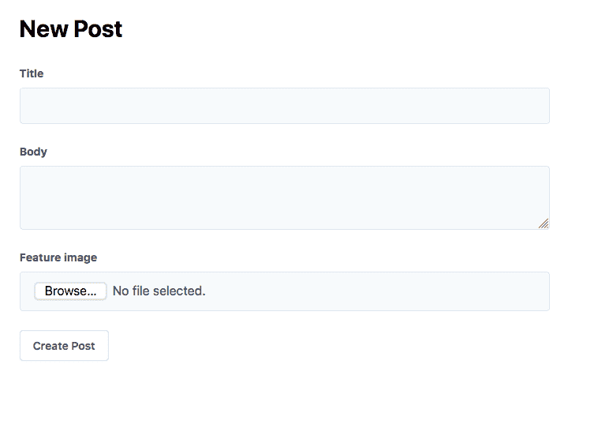
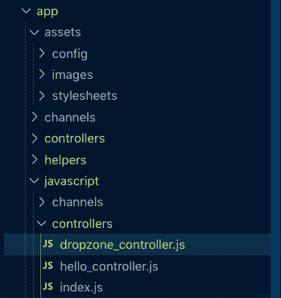
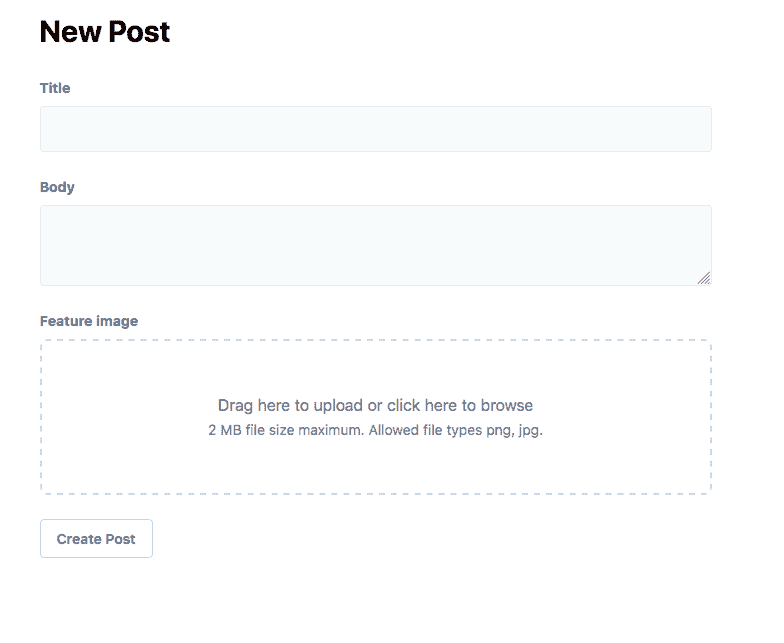
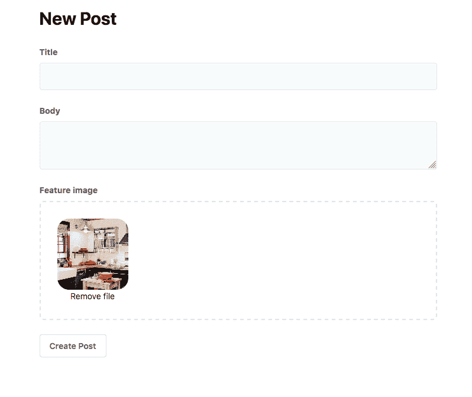

# Ruby on Rails 使用活动存储、Stimulus.js 和 Dropzone.js 拖放上传

> 原文:[https://dev . to/just alever/ruby-on-rails-drag-drop-uploads-with-active-storage-stimulus-js-and-drop zone-js-566m](https://dev.to/justalever/ruby-on-rails-drag-and-drop-uploads-with-active-storage-stimulus-js-and-dropzone-js-566m)

本教程是关于使用 Ruby on Rails 6.0 中的活动存储，使用 Stimulus.js 和 Dropzone.js 从头开始创建拖放上传体验。

[下载源代码](https://github.com/justalever/drag_and_drop_active_storage)

[https://www.youtube.com/embed/fg_8qJ-su6A](https://www.youtube.com/embed/fg_8qJ-su6A)

### [](#objective)目标

该体验的目标是引入拖放功能，并在幕后将其与 Rails 活动存储绑定在一起。我希望能够拖放多个文件进行上传，以及传递选项，调节哪些条件可以通过这些文件。这些条件可以是任何东西，从图像类型到文件大小等等。

**依赖关系:**

*   [刺激 JS](https://dev.to/scottw/stimulus-2jio)
*   [Dropzone JS](https://www.dropzonejs.com/)
*   [Webpack/Rails 6.0](https://rubyonrails.org/)
*   [启动顺风](https://github.com/justalever/kickoff_tailwind)(我个人的 Rails 应用入门模板)

### [](#how-we-solve-the-problem)我们如何解决问题

Rails 现在支持 Webpack，我计划利用几个 JavaScript 库来帮助处理大量的拖放功能。在此之上，我使用了一些来自`@rails/activestorage`的内置 JavaScript 来创建一个直接上传模式。最终，我们仍将使用服务器端呈现的 UI，这对于传统的 Ruby on Rails 应用程序来说是正常的，但用 JavaScript 增强了它，使其更具动态性。

## [](#creating-the-app)创建应用程序

本指南假设您将利用我的启动 _ 顺风入门模板。这是完全可选的使用，但确实节省了一些配置时间。我主要用这个来节省截屏的时间。

```
$ rails new active_storage_drag_and_drop -m kickoff_tailwind/template.rb --webpack=simulus 
```

<svg width="20px" height="20px" viewBox="0 0 24 24" class="highlight-action crayons-icon highlight-action--fullscreen-on"><title>Enter fullscreen mode</title></svg> <svg width="20px" height="20px" viewBox="0 0 24 24" class="highlight-action crayons-icon highlight-action--fullscreen-off"><title>Exit fullscreen mode</title></svg>

运行上面的脚本将创建一个新的 rails 应用程序并传递我的模板。为了增加这种效果，我们在本教程中利用[刺激 JS](https://dev.to/scottw/stimulus-2jio) 。它通过传递`--webpack=stimulus`被动态安装

Stimulus.js 有 Vue、React 等方面..但它旨在增强 Rails 应用程序的前端，而不是用新的框架重写它。它的工作方式非常类似于 Rails 控制器的概念，在 Rails 控制器中，您定义了一个具有相应方法/动作的控制器，这些方法/动作实际上做了一些事情。

我可能会对即将到来的 Stimulus.js 做一个概述/指导，但我认为这是一个健康的尝试。

运行这个命令应该可以让我们准备好启动应用程序。

#### [](#dropzonejs)Dropzone.js

我决定利用的另一个非常好的依赖项是 [Dropzone.js](https://www.dropzonejs.com/) 库。围绕这个库有多种利用 API 的方法，我们将讨论其中一些。总的想法是让我们选择的文件通过使用拖放功能的活动存储上传。Dropzone.js 有助于解决这类体验的许多问题。

通过在 Rails 应用程序根文件夹中的终端中运行以下命令来安装 dropzone。

```
$ yarn add dropzone 
```

<svg width="20px" height="20px" viewBox="0 0 24 24" class="highlight-action crayons-icon highlight-action--fullscreen-on"><title>Enter fullscreen mode</title></svg> <svg width="20px" height="20px" viewBox="0 0 24 24" class="highlight-action crayons-icon highlight-action--fullscreen-off"><title>Exit fullscreen mode</title></svg>

这是为了`node_module`依赖关系。接下来让我们整理一些 Rails 逻辑。

### [](#install-active-storage)安装主动存储

通过在新的 Rails 应用程序中运行一个命令，活动存储支持成为可能。运行以下命令并迁移数据库以进行设置。**务必不要跳过这一步**。这对这里的任何事情向前发展都是至关重要的。

```
$ rails active_storage:install 
```

<svg width="20px" height="20px" viewBox="0 0 24 24" class="highlight-action crayons-icon highlight-action--fullscreen-on"><title>Enter fullscreen mode</title></svg> <svg width="20px" height="20px" viewBox="0 0 24 24" class="highlight-action crayons-icon highlight-action--fullscreen-off"><title>Exit fullscreen mode</title></svg>

这会将迁移文件复制到应用程序，应用程序会添加必要的表来利用上传。

```
$ rails db:migrate

== 20190915152618 CreateActiveStorageTables: migrating ========================
-- create_table(:active_storage_blobs, {})
   -> 0.0028s
-- create_table(:active_storage_attachments, {})
   -> 0.0025s
== 20190915152618 CreateActiveStorageTables: migrated (0.0054s) =============== 
```

<svg width="20px" height="20px" viewBox="0 0 24 24" class="highlight-action crayons-icon highlight-action--fullscreen-on"><title>Enter fullscreen mode</title></svg> <svg width="20px" height="20px" viewBox="0 0 24 24" class="highlight-action crayons-icon highlight-action--fullscreen-off"><title>Exit fullscreen mode</title></svg>

### [](#creating-a-resource-for-the-uploads)为上传创建资源

我们需要一个表单来绑定我们的活动存储上传。我将使用一个`Post`模型作为例子。我们假设数据库中的`Post`将有`title`、`body`和`user_id`列。

下面我脚手架一个`Post`以节省一些时间。

```
$ rails generate scaffold Post title:string body:text user:references

      invoke active_record
      create db/migrate/20190915153310_create_posts.rb
      create app/models/post.rb
      invoke test_unit
      create test/models/post_test.rb
      create test/fixtures/posts.yml
      invoke resource_route
       route resources :posts
      invoke scaffold_controller
      create app/controllers/posts_controller.rb
      invoke erb
      create app/views/posts
      create app/views/posts/index.html.erb
      create app/views/posts/edit.html.erb
      create app/views/posts/show.html.erb
      create app/views/posts/new.html.erb
      create app/views/posts/_form.html.erb
      invoke test_unit
      create test/controllers/posts_controller_test.rb
      create test/system/posts_test.rb
      invoke helper
      create app/helpers/posts_helper.rb
      invoke test_unit
      invoke jbuilder
      create app/views/posts/index.json.jbuilder
      create app/views/posts/show.json.jbuilder
      create app/views/posts/_post.json.jbuilder
      invoke assets
      invoke scss
      create app/assets/stylesheets/posts.scss
      invoke scss
      create app/assets/stylesheets/scaffolds.scss 
```

<svg width="20px" height="20px" viewBox="0 0 24 24" class="highlight-action crayons-icon highlight-action--fullscreen-on"><title>Enter fullscreen mode</title></svg> <svg width="20px" height="20px" viewBox="0 0 24 24" class="highlight-action crayons-icon highlight-action--fullscreen-off"><title>Exit fullscreen mode</title></svg>

上面的命令将使用完全 RESTful 路由创建一个新的`Post`资源。Rails 中的脚手架可以很快地创建完整的 CRUD 概念，几乎不费吹灰之力。

请注意，我在这里没有包括任何与图像或文件上传有关的内容。这是有意的。

我还传递了`user:references`,它告诉 Rails 在`posts`表上创建一个`user_id`列(一旦迁移)以及该列的索引。

注意:如果你**没有**使用我的 kickoff_tailwind 模板，你可能想跳过这个命令的`user:references`部分。这样做的原因是，在引用模板创建新应用程序时，已经有一个`User`模型。

支架生成一个`scaffolds.scss`文件和`posts.scss`文件。我们可以删除这两个，因为我们在本指南中使用的是顺风。

再进行一次迁移，我们就应该准备好了

```
$ rails db:migrate 
```

<svg width="20px" height="20px" viewBox="0 0 24 24" class="highlight-action crayons-icon highlight-action--fullscreen-on"><title>Enter fullscreen mode</title></svg> <svg width="20px" height="20px" viewBox="0 0 24 24" class="highlight-action crayons-icon highlight-action--fullscreen-off"><title>Exit fullscreen mode</title></svg>

前往`localhost:3000/posts`会给你一个所有帖子的索引。

### [](#locking-down-the-controller)锁定控制器

即使我们现在已经退出，我仍然可以创建一个新帖子`localhost:3000/posts/new`，这可能不是一件好事。我的启动 _ 顺风模板包括[设计](https://github.com/plataformatec/devise)。因此，我们可以让用户在点击`posts/new`路径之前先登录。

```
# app/controllers/posts_controller.rb

class PostsController < ApplicationController
  before_action :authenticate_user!, except: [:show, :index] # add this line
  ...

end 
```

<svg width="20px" height="20px" viewBox="0 0 24 24" class="highlight-action crayons-icon highlight-action--fullscreen-on"><title>Enter fullscreen mode</title></svg> <svg width="20px" height="20px" viewBox="0 0 24 24" class="highlight-action crayons-icon highlight-action--fullscreen-off"><title>Exit fullscreen mode</title></svg>

添加这个 before action 允许我们要求任何用户在除了`index`和`show`操作之外的所有路径上进行新的会话。

继续创建一个测试帐户来绕过它，然后转到`localhost:3000/posts/new`。

### [](#enhancing-the-post-form)增强发文形式

我们的`Post`表单是`app/views/posts`目录中名为`_form.html.erb`的一部分。我修改了标记，加入了一些基本的样式。这没什么特别的，但比不上任何风格。

```
<!-- app/views/posts/_form.html.erb-->

<%= form_with(model: post, local: true) do |form| %>
  <% if post.errors.any? %>
    <div id="error_explanation">
      <h2><%= pluralize(post.errors.count, "error") %> prohibited this post from being saved:</h2>

      <ul>
        <% post.errors.full_messages.each do |message| %>
          <li><%= message %></li>
        <% end %>
      </ul>
    </div>
  <% end %>

  <div class="mb-6">
    <%= form.label :title, class: "label" %>
    <%= form.text_field :title, class: "input" %>
  </div>

  <div class="mb-6">
    <%= form.label :body, class: "label" %>
    <%= form.text_area :body, class: "input" %>
  </div>

  <div class="mb-6">
    <%= form.submit class: "btn-default btn" %>
  </div>
<% end %> 
```

<svg width="20px" height="20px" viewBox="0 0 24 24" class="highlight-action crayons-icon highlight-action--fullscreen-on"><title>Enter fullscreen mode</title></svg> <svg width="20px" height="20px" viewBox="0 0 24 24" class="highlight-action crayons-icon highlight-action--fullscreen-off"><title>Exit fullscreen mode</title></svg>

我在这里删除了对`user_id`的引用，因为我们将在控制器的幕后分配它(这是我们要求用户在点击`/posts/new`之前被认证的另一个原因)。这是更新后该文件的当前状态。为了清楚起见，我删除了所有的评论。

```
# app/controllers/posts_controller.rb
class PostsController < ApplicationController
  before_action :authenticate_user!, except: [:show, :index]
  before_action :set_post, only: [:show, :edit, :update, :destroy]

  def index
    @posts = Post.all
  end

  def show
  end

  def new
    @post = Post.new
  end

  def edit
  end

  def create
    @post = Post.new(post_params)
    @post.user_id = current_user.id

    respond_to do |format|
      if @post.save
        format.html { redirect_to @post, notice: 'Post was successfully created.' }
        format.json { render :show, status: :created, location: @post }
      else
        format.html { render :new }
        format.json { render json: @post.errors, status: :unprocessable_entity }
      end
    end
  end

  def update
    respond_to do |format|
      if @post.update(post_params)
        format.html { redirect_to @post, notice: 'Post was successfully updated.' }
        format.json { render :show, status: :ok, location: @post }
      else
        format.html { render :edit }
        format.json { render json: @post.errors, status: :unprocessable_entity }
      end
    end
  end

  def destroy
    @post.destroy
    respond_to do |format|
      format.html { redirect_to posts_url, notice: 'Post was successfully destroyed.' }
      format.json { head :no_content }
    end
  end

  private

    def set_post
      @post = Post.find(params[:id])
    end

    def post_params
      params.require(:post).permit(:title, :body, :user_id)
    end
end 
```

<svg width="20px" height="20px" viewBox="0 0 24 24" class="highlight-action crayons-icon highlight-action--fullscreen-on"><title>Enter fullscreen mode</title></svg> <svg width="20px" height="20px" viewBox="0 0 24 24" class="highlight-action crayons-icon highlight-action--fullscreen-off"><title>Exit fullscreen mode</title></svg>

### [](#adding-attachments)添加附件

如果您还记得，我搭建了 Post 资源，但没有提到图片或文件上传。这是故意的。使用活动存储，您不再需要直接在数据库表上使用这些列。它将存放在自己的表中，以供以后参考。这一切都发生在模型内部。

让我们在`Post`模型中添加对附件的引用。

```
# app/models/post.rb

class Post < ApplicationRecord
  belongs_to :user
  has_one_attached :feature_image # add this line
end 
```

<svg width="20px" height="20px" viewBox="0 0 24 24" class="highlight-action crayons-icon highlight-action--fullscreen-on"><title>Enter fullscreen mode</title></svg> <svg width="20px" height="20px" viewBox="0 0 24 24" class="highlight-action crayons-icon highlight-action--fullscreen-off"><title>Exit fullscreen mode</title></svg>

这里我使用了一种与活动存储相关的方法，叫做`has_one_attached`。还有`has_many_attached`(针对多次上传)。你可以随便给它起什么名字。我选择`feature_image`作为`Post`，因为一篇博客文章可能有一个 T3 是很常见的。

有了这个加法，所有的艰苦工作都完成了。我们可以扩展我们的`posts_controller`和`_form.html.erb`部分来引用附件。

```
# app/controllers/posts_controller.rb

class PostsController < ApplicationController
...

 private

    def set_post
      @post = Post.find(params[:id])
    end

    def post_params
      params.require(:post).permit(:title, :body, :user_id, :feature_image)
    end
end 
```

<svg width="20px" height="20px" viewBox="0 0 24 24" class="highlight-action crayons-icon highlight-action--fullscreen-on"><title>Enter fullscreen mode</title></svg> <svg width="20px" height="20px" viewBox="0 0 24 24" class="highlight-action crayons-icon highlight-action--fullscreen-off"><title>Exit fullscreen mode</title></svg>

在控制器中，我们需要将`post_params`私有方法中的新字段列入白名单。

```
<!-- app/views/posts/_form.html.erb-->
<%= form_with(model: post, local: true, multipart: true) do |form| %>
  <% if post.errors.any? %>
    <div id="error_explanation">
      <h2><%= pluralize(post.errors.count, "error") %> prohibited this post from being saved:</h2>

      <ul>
        <% post.errors.full_messages.each do |message| %>
          <li><%= message %></li>
        <% end %>
      </ul>
    </div>
  <% end %>

  <div class="mb-6">
    <%= form.label :title, class: "label" %>
    <%= form.text_field :title, class: "input" %>
  </div>

  <div class="mb-6">
    <%= form.label :body, class: "label" %>
    <%= form.text_area :body, class: "input" %>
  </div>

  <div class="mb-6">
    <%= form.label :feature_image, class: "label" %>
    <%= form.file_field :feature_image, class: "input" %>
  </div>

  <div class="mb-6">
    <%= form.submit class: "btn-default btn" %>
  </div>
<% end %> 
```

<svg width="20px" height="20px" viewBox="0 0 24 24" class="highlight-action crayons-icon highlight-action--fullscreen-on"><title>Enter fullscreen mode</title></svg> <svg width="20px" height="20px" viewBox="0 0 24 24" class="highlight-action crayons-icon highlight-action--fullscreen-off"><title>Exit fullscreen mode</title></svg>

我们扩展了表单以包含新的`:feature_image`字段。倒不是说是个`file_field`。因为我们现在在表单中使用文件，所以表单助手需要扩展为`multipart:true`。

这应该能让你得到类似这样的用户界面

[T2】](https://res.cloudinary.com/practicaldev/image/fetch/s--O3zErZOw--/c_limit%2Cf_auto%2Cfl_progressive%2Cq_auto%2Cw_880/https://i.imgur.com/U8N9bP3.png%255D)

那个特征图像区域看起来很无聊，所以让我们继续进行拖放操作。

我将修改表单
上的`file_field`标记，如下所示

```
<div class="mb-6">
    <%= form.label :feature_image, class: "label" %>
    <div class="dropzone dropzone-default dz-clickable" data-controller="dropzone" data-dropzone-max-file-size="2" data-dropzone-max-files="1">
    <%= form.file_field :feature_image, direct_upload: true, data: { target: 'dropzone.input' } %>
    <div class="dropzone-msg dz-message needsclick text-gray-600">
      <h3 class="dropzone-msg-title">Drag here to upload or click here to browse</h3>
      <span class="dropzone-msg-desc text-sm">2 MB file size maximum. Allowed file types png, jpg.</span>
      </div>
    </div>
  </div> 
```

<svg width="20px" height="20px" viewBox="0 0 24 24" class="highlight-action crayons-icon highlight-action--fullscreen-on"><title>Enter fullscreen mode</title></svg> <svg width="20px" height="20px" viewBox="0 0 24 24" class="highlight-action crayons-icon highlight-action--fullscreen-off"><title>Exit fullscreen mode</title></svg>

围绕着`file_field`的是一个`div`,它包含了 Stimulus.js 可以挂接的一些数据属性。更多的数据属性被绑定到 div，这允许我通过前端传递文件数量和大小的选项。

这对于以后在给定应用程序的其他部分重用相同的组件非常有用。还要注意所有的`dropzone`类。这些对于我们不久将集成的 dropzone 依赖项是必要的。目前，球场上没有那么多视觉上的变化。我们仍然需要必要的 JavaScript 和少量 CSS 来帮助完成这项工作。

### [](#integrating-the-javascript)整合 JavaScript

在我们的`app/javascript`目录中有一个名为`controllers`的文件夹，它是在我们创建新应用程序时创建的，感谢传递了`--webpack=stimulus`标志。这种约定在 Stimulus.js 库中很常见，因为控制器是一个组件，用于处理您声明的视图中某个位置的逻辑。命名惯例对刺激计划至关重要，因此有许多惯例需要习惯。一旦你这么做了，就不会那么困惑了。

所有刺激控制器都需要一个传递了控制器名称的元素。在我们的例子中，这就像你在表单文件域周围看到的一样。

```
<div class="dropzone dropzone-default dz-clickable" data-controller="dropzone" data-dropzone-max-file-size="2" data-dropzone-max-files="1">
  <%= form.file_field :feature_image %>
</div> 
```

<svg width="20px" height="20px" viewBox="0 0 24 24" class="highlight-action crayons-icon highlight-action--fullscreen-on"><title>Enter fullscreen mode</title></svg> <svg width="20px" height="20px" viewBox="0 0 24 24" class="highlight-action crayons-icon highlight-action--fullscreen-off"><title>Exit fullscreen mode</title></svg>

`data-controller="dropzone"`就是我指的那个。这告诉刺激确实有一个控制器安装并准备接收指令。我们可以在`app/javascript/controllers`目录中编写这些指令。鉴于我将控制器命名为`dropzone`，我们需要在该文件夹中创建一个名为`dropzone_controller.js`的文件。

[T2】](https://res.cloudinary.com/practicaldev/image/fetch/s--lNzBVl3y--/c_limit%2Cf_auto%2Cfl_progressive%2Cq_auto%2Cw_880/https://i2.wp.com/web-crunch.com/wp-content/uploads/2019/09/Screen-Shot-2019-09-15-at-11.12.39-AM.png%3Fresize%3D349%252C370%26ssl%3D1)

在这个文件中，所有的奇迹都会发生。值得注意的是，这个文件和`app/javascript/controllers`中的所有其他文件被导入到`app/javascript/packs/application.js`中的主`application.js`文件中。

```
// app/javascript/packs/application.js

require("@rails/ujs").start()
require("turbolinks").start()
require("@rails/activestorage").start()
require("channels")

import "controllers"
import "stylesheets/application" 
```

<svg width="20px" height="20px" viewBox="0 0 24 24" class="highlight-action crayons-icon highlight-action--fullscreen-on"><title>Enter fullscreen mode</title></svg> <svg width="20px" height="20px" viewBox="0 0 24 24" class="highlight-action crayons-icon highlight-action--fullscreen-off"><title>Exit fullscreen mode</title></svg>

这发生在`app/javascript/controllers/index.js`内部，由于这些命名约定，每个控制器都被导入。这个文件也是导入 Simulus.js 的地方。

```
// app/javascript/controllers/index.js
// Load all the controllers within this directory and all subdirectories. 
// Controller files must be named *_controller.js.

import { Application } from "stimulus"
import { definitionsFromContext } from "stimulus/webpack-helpers"

const application = Application.start()
const context = require.context("controllers", true, /_controller\.js$/)
application.load(definitionsFromContext(context)) 
```

<svg width="20px" height="20px" viewBox="0 0 24 24" class="highlight-action crayons-icon highlight-action--fullscreen-on"><title>Enter fullscreen mode</title></svg> <svg width="20px" height="20px" viewBox="0 0 24 24" class="highlight-action crayons-icon highlight-action--fullscreen-off"><title>Exit fullscreen mode</title></svg>

我们已经在我们的主布局视图文件`app/views/layouts/application.html.erb`中加载了`app/javascript/packs/application.js`，所以几乎没有什么配置要做。

```
<!DOCTYPE html>
<html>
  <head>

   <!-- more code here-->

    <%= javascript_pack_tag 'application', 'data-turbolinks-track': 'reload' %>

  </head>

  <!-- more code here--> 
```

<svg width="20px" height="20px" viewBox="0 0 24 24" class="highlight-action crayons-icon highlight-action--fullscreen-on"><title>Enter fullscreen mode</title></svg> <svg width="20px" height="20px" viewBox="0 0 24 24" class="highlight-action crayons-icon highlight-action--fullscreen-off"><title>Exit fullscreen mode</title></svg>

### [](#the-meat-and-potatoes)肉和土豆

首先，我创建了一些助手函数，并从另一个文件中导入它们。它将存在于`app/javascript/`目录中。创建一个名为`helpers`的新文件夹。在其中，添加一个名为`index.js`的文件，代码如下:

```
// app/javascript/helpers/index.js

export function getMetaValue(name) {
  const element = findElement(document.head, `meta[name="${name}"]`);
  if (element) {
    return element.getAttribute("content");
  }
}

export function findElement(root, selector) {
  if (typeof root == "string") {
    selector = root;
    root = document;
  }
  return root.querySelector(selector);
}

export function toArray(value) {
  if (Array.isArray(value)) {
    return value;
  } else if (Array.from) {
    return Array.from(value);
  } else {
    return [].slice.call(value);
  }
}

export function removeElement(el) {
  if (el && el.parentNode) {
    el.parentNode.removeChild(el);
  }
}

export function insertAfter(el, referenceNode) {
  return referenceNode.parentNode.insertBefore(el, referenceNode.nextSibling);
} 
```

<svg width="20px" height="20px" viewBox="0 0 24 24" class="highlight-action crayons-icon highlight-action--fullscreen-on"><title>Enter fullscreen mode</title></svg> <svg width="20px" height="20px" viewBox="0 0 24 24" class="highlight-action crayons-icon highlight-action--fullscreen-off"><title>Exit fullscreen mode</title></svg>

在这里，我导出每个函数，这样我们就可以根据需要在其他地方导入这些函数。这从`dropzone_controller.js`中提取了一些不必要的逻辑，并且如果我们需要的话，还可以让其他未来的 javascript 工作访问它。

最后，在 dropzone 控制器文件中，我添加了以下代码。

```
import Dropzone from "dropzone";
import { Controller } from "stimulus";
import { DirectUpload } from "@rails/activestorage";
import {
  getMetaValue,
  toArray,
  findElement,
  removeElement,
  insertAfter
} from "helpers";

export default class extends Controller {
  static targets = ["input"];

  connect() {
    this.dropZone = createDropZone(this);
    this.hideFileInput();
    this.bindEvents();
    Dropzone.autoDiscover = false; // necessary quirk for Dropzone error in console
  }

  // Private
  hideFileInput() {
    this.inputTarget.disabled = true;
    this.inputTarget.style.display = "none";
  }

  bindEvents() {
    this.dropZone.on("addedfile", file => {
      setTimeout(() => {
        file.accepted && createDirectUploadController(this, file).start();
      }, 500);
    });

    this.dropZone.on("removedfile", file => {
      file.controller && removeElement(file.controller.hiddenInput);
    });

    this.dropZone.on("canceled", file => {
      file.controller && file.controller.xhr.abort();
    });
  }

  get headers() {
    return { "X-CSRF-Token": getMetaValue("csrf-token") };
  }

  get url() {
    return this.inputTarget.getAttribute("data-direct-upload-url");
  }

  get maxFiles() {
    return this.data.get("maxFiles") || 1;
  }

  get maxFileSize() {
    return this.data.get("maxFileSize") || 256;
  }

  get acceptedFiles() {
    return this.data.get("acceptedFiles");
  }

  get addRemoveLinks() {
    return this.data.get("addRemoveLinks") || true;
  }
}

class DirectUploadController {
  constructor(source, file) {
    this.directUpload = createDirectUpload(file, source.url, this);
    this.source = source;
    this.file = file;
  }

  start() {
    this.file.controller = this;
    this.hiddenInput = this.createHiddenInput();
    this.directUpload.create((error, attributes) => {
      if (error) {
        removeElement(this.hiddenInput);
        this.emitDropzoneError(error);
      } else {
        this.hiddenInput.value = attributes.signed_id;
        this.emitDropzoneSuccess();
      }
    });
  }

  createHiddenInput() {
    const input = document.createElement("input");
    input.type = "hidden";
    input.name = this.source.inputTarget.name;
    insertAfter(input, this.source.inputTarget);
    return input;
  }

  directUploadWillStoreFileWithXHR(xhr) {
    this.bindProgressEvent(xhr);
    this.emitDropzoneUploading();
  }

  bindProgressEvent(xhr) {
    this.xhr = xhr;
    this.xhr.upload.addEventListener("progress", event =>
      this.uploadRequestDidProgress(event)
    );
  }

  uploadRequestDidProgress(event) {
    const element = this.source.element;
    const progress = (event.loaded / event.total) * 100;
    findElement(
      this.file.previewTemplate,
      ".dz-upload"
    ).style.width = `${progress}%`;
  }

  emitDropzoneUploading() {
    this.file.status = Dropzone.UPLOADING;
    this.source.dropZone.emit("processing", this.file);
  }

  emitDropzoneError(error) {
    this.file.status = Dropzone.ERROR;
    this.source.dropZone.emit("error", this.file, error);
    this.source.dropZone.emit("complete", this.file);
  }

  emitDropzoneSuccess() {
    this.file.status = Dropzone.SUCCESS;
    this.source.dropZone.emit("success", this.file);
    this.source.dropZone.emit("complete", this.file);
  }
}

function createDirectUploadController(source, file) {
  return new DirectUploadController(source, file);
}

function createDirectUpload(file, url, controller) {
  return new DirectUpload(file, url, controller);
}

function createDropZone(controller) {
  return new Dropzone(controller.element, {
    url: controller.url,
    headers: controller.headers,
    maxFiles: controller.maxFiles,
    maxFilesize: controller.maxFileSize,
    acceptedFiles: controller.acceptedFiles,
    addRemoveLinks: controller.addRemoveLinks,
    autoQueue: false
  });
} 
```

<svg width="20px" height="20px" viewBox="0 0 24 24" class="highlight-action crayons-icon highlight-action--fullscreen-on"><title>Enter fullscreen mode</title></svg> <svg width="20px" height="20px" viewBox="0 0 24 24" class="highlight-action crayons-icon highlight-action--fullscreen-off"><title>Exit fullscreen mode</title></svg>

如你所见，这里发生了很多事情。大部分逻辑处理事件监听，并从前端获取值以传递给我们的 dropzone 实例。我们连接到 dropzone 和活动存储，以使上传像宣传的那样工作。我导入了前面提到的那些助手，并在这里引用它们。

这使我们接近，但我们的拖放区看起来不像一部分。我已经为应用程序风格利用了 Tailwind CSS。多亏了现代的 Webpack 和 JavaScript，我们可以直接从 Dropzone 导入默认值。这样做发生在我预先存在的`_forms.scss`分部中。

```
/* app/javascript/stylesheets/components/_form.scss */

@import "dropzone/dist/min/dropzone.min.css";
@import "dropzone/dist/min/basic.min.css";

.input {
  @apply appearance-none block w-full bg-gray-100 text-gray-700 border border-gray-300 rounded py-3 px-4 leading-tight;
}

.input:focus {
  @apply outline-none bg-white border-gray-400;
}

.label {
  @apply block text-gray-700 text-sm font-bold mb-2;
}

.select {
  @apply appearance-none py-3 px-4 pr-8 block w-full bg-gray-100 border border-gray-300 text-gray-700
   rounded leading-tight;
  -webkit-appearance: none;
}

.select:focus {
  @apply outline-none bg-white border-gray-400;
}

.dropzone {
  @apply border-2 rounded-lg border-gray-400 border-dashed;

  &.dz-drag-hover {
    @apply border-2 rounded-lg border-gray-200 border-dashed;

    .dz-message {
      opacity: 0.9;
    }
  }
} 
```

<svg width="20px" height="20px" viewBox="0 0 24 24" class="highlight-action crayons-icon highlight-action--fullscreen-on"><title>Enter fullscreen mode</title></svg> <svg width="20px" height="20px" viewBox="0 0 24 24" class="highlight-action crayons-icon highlight-action--fullscreen-off"><title>Exit fullscreen mode</title></svg>

最注意文件开头的`@import`语句和结尾的`.dropzone`类。我们用一些特定于顺风的 CSS 对它进行了一点扩展，使用户界面看起来像下面这样:

[T2】](https://res.cloudinary.com/practicaldev/image/fetch/s--X6516Ux5--/c_limit%2Cf_auto%2Cfl_progressive%2Cq_auto%2Cw_880/https://i2.wp.com/web-crunch.com/wp-content/uploads/2019/09/Screen-Shot-2019-09-15-at-11.39.56-AM.png%3Fresize%3D784%252C643%26ssl%3D1)

现在看起来更像是一个拖放上传程序了，是吧？太好了。如果一切正常，这应该在工作秩序。

看起来对我有用！如果您遇到错误，这可能是由于我们在带有数据属性的表单元素本身上传递的图像大小/类型。您可以根据自己的需要相应地进行调整。

[T2】](https://res.cloudinary.com/practicaldev/image/fetch/s--VfvZkbC_--/c_limit%2Cf_auto%2Cfl_progressive%2Cq_auto%2Cw_880/https://i1.wp.com/web-crunch.com/wp-content/uploads/2019/09/Screen-Shot-2019-09-15-at-11.41.43-AM.png%3Fresize%3D798%252C670%26ssl%3D1)

### [](#displaying-the-upload)显示上传

在生产应用程序中，您可能希望配置通过活动存储上传的内容的存储位置。在`config/storage.yml`中你可以很容易地做到这一点。就存储提供商而言，有大量选项可供选择。您可以传递您的 API 密钥并完成。

出于本教程的目的，我们利用本地系统存储。对于开发来说，它工作得很好。

为了看到我们的工作，我们仍然需要在`index`和`show`视图上显示上传。我会更新这些来反映。

```
<!-- app/views/posts/index.html.erb-->

<div class="max-w-6xl m-auto">
  <div class="flex items-center justify-between pb-4 mb-4 border-b">
    <h1 class="text-xl font-bold mb-0 uppercase text-gray-500">Posts</h1>
    <%= link_to "New Post", new_post_path, class: "btn btn-default" if user_signed_in? %>
  </div>

<% @posts.each do |post| %>
  <article class="border rounded-lg lg:w-1/3 w-full">
    <%= link_to post do %>
      <%= image_tag post.feature_image if post.feature_image.present? %>
    <% end %>

    <div class="p-6">
      <h1 class="text-2xl font-bold"><%= link_to post.title, post %></h1>

      <div class="leading-normal text-lg">
        <%= post.body %>
      </div>

      <% if user_signed_in? && current_user.id == post.id %>
        <div class="my-4">
          <%= link_to 'Edit', edit_post_path(post), class: "btn btn-default" %>
          <%= link_to 'Delete', post, method: :delete, data: { confirm: 'Are you sure?' }, class: "btn btn-default" %>
      </div>
      <% end %>
    <% end %>
  </div>
</div> 
```

<svg width="20px" height="20px" viewBox="0 0 24 24" class="highlight-action crayons-icon highlight-action--fullscreen-on"><title>Enter fullscreen mode</title></svg> <svg width="20px" height="20px" viewBox="0 0 24 24" class="highlight-action crayons-icon highlight-action--fullscreen-off"><title>Exit fullscreen mode</title></svg>

最后是`show`视图

```
<div class="max-w-4xl m-auto">
  <%= link_to @post do %>
    <%= image_tag @post.feature_image if @post.feature_image.present? %>
  <% end %>

  <div class="p-6">
    <h1 class="text-2xl font-bold"><%= link_to @post.title, @post %></h1>

    <div class="leading-normal text-lg">
      <%= @post.body %>
    </div>

    <% if user_signed_in? && current_user.id == @post.id %>
      <div class="my-4">
        <%= link_to 'Edit', edit_post_path(@post), class: "btn btn-default" %>
        <%= link_to 'Delete', @post, method: :delete, data: { confirm: 'Are you sure?' }, class: "btn btn-default" %>
    </div>
    <% end %>
  </div>
</div> 
```

<svg width="20px" height="20px" viewBox="0 0 24 24" class="highlight-action crayons-icon highlight-action--fullscreen-on"><title>Enter fullscreen mode</title></svg> <svg width="20px" height="20px" viewBox="0 0 24 24" class="highlight-action crayons-icon highlight-action--fullscreen-off"><title>Exit fullscreen mode</title></svg>

我将路由更新为默认的根路径`/posts`。这样做:

```
# config/routes.rb

require 'sidekiq/web'

Rails.application.routes.draw do
  resources :posts
    authenticate :user, lambda { |u| u.admin? } do
      mount Sidekiq::Web => '/sidekiq'
    end

  devise_for :users
  root to: 'posts#index' # change to `posts#index`
end 
```

<svg width="20px" height="20px" viewBox="0 0 24 24" class="highlight-action crayons-icon highlight-action--fullscreen-on"><title>Enter fullscreen mode</title></svg> <svg width="20px" height="20px" viewBox="0 0 24 24" class="highlight-action crayons-icon highlight-action--fullscreen-off"><title>Exit fullscreen mode</title></svg>

### [](#closing)关闭

你有它！虽然需要做一些工作，但我们现在已经有了可重用的 Stimulus.js 组件的拖放上传。我们利用 Dropzone.js 和 Active Storage direct upload 在浏览器中用 JavaScript 触发上传，同时利用我们都知道和喜欢的 Ruby on Rails 的核心方面。我希望你能从这本指南中学到一些东西。请随意调整代码以满足您自己的需求。

### [](#shameless-plug-time)无耻的塞时间

[T2】](http://hellorails.io)

我有一门新课程叫做 [Hello Rails](https://hellorails.io) 。Hello Rails 是一门现代课程，旨在帮助您快速开始使用和理解 Ruby on Rails。如果你是 Ruby 或 Ruby on Rails 的新手，我邀请你去看看这个网站。该课程将与这些构建非常相似，但是是一个超级深入的版本，具有更现实的目标和可交付成果。[立即购买 Hello Rails！](https://hellorails.io/)！

在推特上关注 [@hello_rails](https://twitter.com/hello_rails) 和[本人@justalever](https://twitter.com/justalever) 。

帖子 [Ruby on Rails 用活动存储拖放上传，Stimulus.js 和 Dropzone.js](https://web-crunch.com/rails-drag-drop-active-storage-stimulus-dropzone/) 最先出现在 [Web-Crunch](https://web-crunch.com) 上。