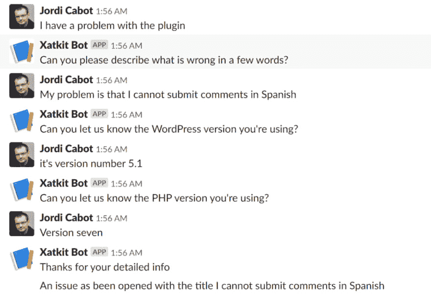
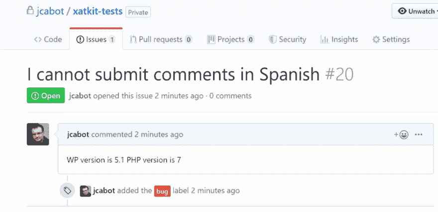
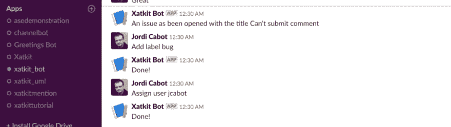
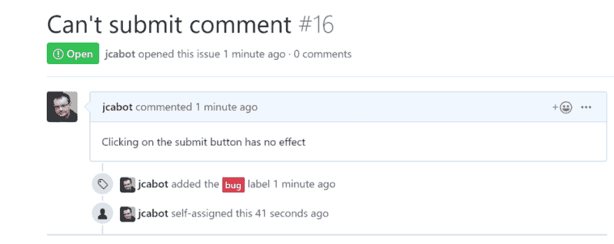

# 如何创建一个聊天机器人与你的 GitHub repos 对话

> 原文:[https://dev . to/JCA bot/how-to-create-a-chatbot-talk-with-your-github-repos-53 h1](https://dev.to/jcabot/how-to-create-a-chatbot-to-talk-with-your-github-repos-53h1)

开源的可持续性是一个巨大的问题。有很多方法可以帮助维护人员，但是一个日益增长的趋势是 T4 创造了自动完成一些任务的机器人。查看现有机器人的列表，你可以将它们添加到你的 OSS 项目中。

在本帖中，我们将向您展示如何轻松地为 GitHub 构建自己的机器人。不仅仅是一个“简单”的机器人，而是一个聊天机器人！。一旦我们完成，你将能够**与你的 GitHub 库**聊天。为了让事情变得更加有趣，我们将把**聊天机器人部署为一个 Slack 应用**。作为示例机器人，我们将创建两个聊天机器人:

1.  (为用户)一个帮助你的用户写好错误报告的机器人，这样你就不会浪费时间试图用不完整的信息重现他们的错误
2.  (针对维护人员)一个机器人，当一个新的问题被创建时，它会向你发出 pings 命令，并让你给它分配标签和开发人员。

要创建这样一个聊天机器人，你需要与 [Slack API](https://api.slack.com/) 、 [GitHub API](https://developer.github.com/v3/) 以及至少一个自然语言理解(NLU)组件进行交互，比如 [DialogFlow](https://dialogflow.com/) 。我们将依靠 [Xatkit](https://xatkit.com/) 平台(一个开源的低代码聊天机器人开发框架)，而不是自己手动完成所有这些工作。Xatkit 已经提供了这三个元素的抽象，极大地简化了聊天机器人的开发，稍后您将会看到(对于 TL；人民博士，查一下 GitHub 里的 [Xatkit 组织，看一下示例 bot](https://github.com/xatkit-bot-platform) 的[代码。](https://github.com/xatkit-bot-platform/xatkit-examples/tree/master/GithubBot)

在 Xatkit 中，您[通过两个不同的文件](https://github.com/xatkit-bot-platform/xatkit-releases/wiki/Getting-Started)定义机器人行为:*意图*库(指定用户在与聊天机器人交谈时的潜在意图)和*执行*模型(定义如何对用户意图或机器人直接接收的其他事件做出反应)。让我们看看如何使用 Xatkit 来创建我们的两个机器人。

## [](#filing-a-bug-report-from-slack)从 Slack 提交错误报告

如果你观察任何 OSS 项目，任何新的 bug 报告中的第一次迭代都是维护者试图从提交报告的用户那里获得复制报告所需的所有信息。这对双方来说都是巨大的时间浪费。而且，由于通信不是同步的，所以根据各自的可用性和时区，它可能会持续几天，从而大大延迟了错误修复。

我将向您展示聊天机器人如何确保 bug 报告包含维护人员需要的所有基本信息。在这个例子中，我们假设这个项目是一个 WordPress 插件。通常，为了调试潜在的错误，我们总是需要知道网站运行的 WP 版本和 PHP 版本。因此，为了说明我们的聊天机器人方法在 GitHub 中的能力，我们将确保聊天机器人收集这些信息。

我们从定义意图开始。请注意，有些意图只有在匹配了先前的意图之后才可能实现。一些意图存储了我们将在最后用来打开 bug 的对话数据。

```
intent OpenBug {
    inputs {
        "The plugin is not working"
        "I have a problem with the plugin"
        "I'd like to report an error"
        "I want to open a bug"
        "I want to report a bug"
        "There is an error in the plugin"
    }

}

intent DescribeBug follows OpenBug {
    inputs {
        "My error is Error"
        "The problem is Error"
        "I get this error: Error"
        "My error is that Error"
        "The problem is that Error"
        "I get the error Error"
    }
    creates context bug {
        sets parameter title from fragment Error (entity any)
    }
}

intent TellWPVersion follows DescribeBug {
    requires context bug
    inputs {
        "My version number is WPVersion"
        "I use number WPVersion"
        "It's version WPVersion"
    }
    creates context bug {
        sets parameter wpversion from fragment WPVersion (entity number)
    }
}

intent TellPHPVersion follows TellWPVersion {
    requires context bug
    inputs {
        "My version is PHPVersion"
        "I use PHPVersion"
        "It's version PHPVersion"
        "The server is on php version PHPVersion"
    }
    creates context bug {
        sets parameter phpversion from fragment PHPVersion (entity number)
    }
}

```

这是一个聊天机器人的对话框示例。

[T2】](http://livablesoftware.com/wp-content/uploads/2019/09/OpeningGitHubIssueFromSlack.png)

一旦收集了所有的错误信息，我们只需要把它们放在一起，然后打开一个问题。正如您在下面的代码摘录中看到的，一旦匹配了最后一个意图，我们就要求 GitHub 用我们在这个过程中收集的标题和正文参数创建一个新的问题。我们最终把这个新问题贴上了 bug 的标签。

```
on intent TellPHPVersion do
    action SlackPlatform.Reply(message : "Thanks for your detailed info")   
    def newissue = action GithubPlatform.OpenIssue(user : "jcabot", repository : "xatkit-tests", issueTitle : context(bug).get("title") , 
            issueContent : "WP version is " + context(bug).get("wpversion") + " PHP version is " + context(bug).get("phpversion") 
    )
    action GithubPlatform.SetLabel(issue : newissue, label : "bug")

```

这将生成从上述对话框创建的以下问题作为最终结果。
[T3】](http://livablesoftware.com/wp-content/uploads/2019/09/GitHubIssue.png)

## 从 GitHub 到 Slack:接收和响应 GitHub 通知

让我们看看如何在 Slack 中获得 GitHub 中发生的事情的通知。在本例中，我们只看“新问题”通知。该机器人应该能够:

1.  接收来自 GitHub 的新问题通知
2.  通过允许维护者给问题分配一个标签和一个可以跟进的潜在开发人员来节省维护者的时间

要处理 *OpenIssue* 通知并将其转发给 Slack，我们只需编写这段代码

```
on event Issue_Opened do
    action SlackPlatform.PostMessage(message : "An issue has been opened with the title " + context(issue).get("issue->title"), channel: config(slack.channel))
    def issue = action GithubPlatform.GetIssue(user : config(github.repository.username), repository : config(github.repository.name), issueNumber : context(issue).get("issue->number"))
    session.store("issue", issue)

```

在这里，我们从事件中获取问题信息，并将其发布到 Slack (SlackPlatform 是 Xatkit 中预定义的 [Slack 平台的一部分)。问题本身也存储在进程中以备将来使用。](https://github.com/xatkit-bot-platform/xatkit-slack-platform)

一旦维护者收到通知，聊天机器人就开始监听，看维护者是否表达了任何添加标签或为其分配用户的意图。这些意图定义将试图将 maintaner 在 Slack 中写的任何内容与这两个潜在的动作相匹配。

```
intent SetLabel {
    requires context issue
    inputs {
        "Set label Label"
        "Give label Label"
    }
    creates context  issue {
        sets parameter issueLabel from fragment Label (entity any)
    }
}

intent AssignUser {
    requires context issue
    inputs {
        "Assign user Username"
        "Username will take care of it"
    }
    creates context  issue {
        sets parameter assignedUsername from fragment Username (entity any)
    }
}

```

注意，和前面的机器人一样，意图是通过一组训练句子定义的。训练句子试图代表维护者表达该意图的不同方式(例如，设置标签或给出标签)。由于我们的 DialogFlow 集成，额外的变化也将被识别:见下面的对话框，我写“添加标签”而不是设置或给定。

[T2】](http://livablesoftware.com/wp-content/uploads/2019/09/SlackNotificationsFromGitHub.png)

在这次聊天之后，新的问题在 GitHub repo 中得到正确的标记和分配。维护人员不需要从空闲状态中走出来。与意图相关联的执行动作负责这一点。

```
on intent SetLabel do
    action GithubPlatform.SetLabel(issue : session.get("issue"), label : context(issue).get("issueLabel"))
    action SlackPlatform.Reply(message : "Done!")

```

[T2】](http://livablesoftware.com/wp-content/uploads/2019/09/NewIssueFromSlack.png)

## [](#summary-chatting-with-github)摘要:与 GitHub 聊天

总而言之，用几行代码我们已经能够创建一个双向的 *Slack-GitHub 聊天机器人*来帮助开源维护者。这只是一个例子，但我希望这是一个足够好的例子来展示(聊天)机器人的潜力，以显著提高开源的可持续性。