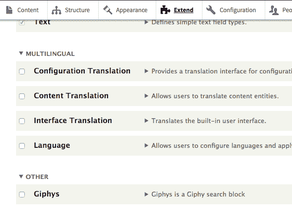

# Drupal 8 定制块模块开发

> 原文：<https://dev.to/jimfrenette/drupal-8-custom-block-module-dev-1ja>

对于那些准备超越简单的“Hello World”模块的人来说，这篇文章记录了如何在一个定制块中构建一个带有 Giphy 搜索表单的 Drupal 8 模块。该表单使用 jQuery 从 Giphy API 请求数据并显示结果。

Drupal 8 模块，演示具有以下特性的定制块创建:

*   传递到模块 js 库中的配置数据
*   使用核心 jQuery 函数的公共 API 搜索
*   前端图形搜索表单的小枝模板

##### *[源代码](https://github.com/jimfrenette/drupal-recipes/tree/master/giphys)*

 *### 模块文件夹

首先，在`/modules/custom/`或`/sites/all/modules/`中为模块创建一个文件夹。模块文件夹的名称通常与模块的名称相同。对于这个特殊的模块，`giphys`是一个合适的名字。例如:

```
# context is drupal project root

cd modules
mkdir custom
mkdir custom/giphys 
```

### 模块信息文件

需要一个 info.yml 文件来存储模块元数据。由于模块机器名为`giphys`，该文件将被命名为`giphys.info.yml`

```
# create the giphys.info.yml file

cd custom/giphys
touch giphys.info.yml 
```

以下是该文件的元数据内容。包括通知 Drupal 核心兼容性、模块依赖性和管理门户界面描述的数据。

##### giphys.info.yml

```
name: Giphys
type: module
description: 'Giphys is a Giphy search block'
core: 8.x
package: Other
dependencies:
  - block 
```

保存`giphys.info.yml`后，在 Drupal 中选择扩展菜单，例如[http://drupal.docker.localhost:8000/admin/modules](http://drupal.docker.localhost:8000/admin/modules)。Giphys 应列在其他:

[](https://res.cloudinary.com/practicaldev/image/fetch/s--DO8D56W7--/c_limit%2Cf_auto%2Cfl_progressive%2Cq_auto%2Cw_880/https://thepracticaldev.s3.amazonaws.com/i/wqduouuiayyf1fy9gk7b.png)

*   有关如何设置 Drupal Docker 开发环境的信息，请阅读我在 jimfrenette.com/2017/05/docker-drupal-dev-environment 的帖子。

### 模块文件

`giphys.module`文件是入口点，用于定义返回各自数据和路径的帮助和主题钩子函数。。模块文件应该只包含实现钩子的函数。

```
# create the giphys.module file

touch giphys.module 
```

##### giphys.module

```
<?php

/**
 * @file
 * Module file for giphys_module.
 */

use Drupal\Core\Routing\RouteMatchInterface;

/**
 * Implements hook_help().
 *
 * @see https://www.drupal.org/documentation/help-text-standards
 *
 * @see hook_help()
 */
function giphys_help($route_name, RouteMatchInterface $route_match) {
  switch ($route_name) {
    case 'help.page.giphys':
      // Help text for the admin section, using the module name in the path.
      return t("This is help text created in giphys implementation of hook_help().");
  }
}

function giphys_theme($existing, $type, $theme, $path) {
  return [
    'giphys' => [
      'variables' => [
        'url' => 'http://example.com',
        'secret' => NULL
      ],
    ],
  ];
} 
```

### 小枝模板

注意，Drupal 8 目前使用的是 Twig 1 . x 版本，Drupal 8.4 计划使用 Twig 2 . x 版本。

```
# create the templates/giphys.html.twig file

mkdir templates

touch templates/giphys.html.twig 
```

##### giphys.html.twig

```
<div>
  <form id="giphys-search" accept-charset="UTF-8">
    <label for="giphys-search-text" class="visually-hidden">Search</label>
    <input id="giphys-search-text" class="required" title="Enter the terms you wish to search for." type="search" value="" size="15" maxlength="128" required="required" aria-required="true" />
    <input class="search-form__submit button js-form-submit form-submit" type="submit" value="Search" />
  </form>
  <ul class="giphys-list"></ul>
</div> 
```

### 模块库

模块的 CSS 和 JavaScript 在库 YAML 数据文件中定义。CSS 和 JavaScript 资源按照它们列出的顺序加载。此外，核心 jQuery 是模块所必需的，并作为模块依赖项列出，以确保它被加载。

在 giphys 文件夹的根目录下创建`giphys.libraries.yml`以及其他数据文件。

```
# create the giphys.libraries.yml file

touch giphys.libraries.yml 
```

##### giphys.libraries.yml

```
giphys:
  version: 1.x
  css:
    theme:
      css/giphys.css: {}
  js:
    js/giphys.js: {}
  dependencies:
    - core/jquery 
```

#### CSS

我们模块的 CSS 非常简单，只需做一些调整就可以将 giphy API 搜索结果列表显示为平铺显示。创建一个新的`css`文件夹和`giphys.css`文件，如图所示。

```
# create the css/giphys.css file

mkdir css

touch css/giphys.css 
```

##### giphys.css

```
ul.giphys-list {
    list-style: none;
    padding: 0;
    margin: 0;
}
ul.giphys-list li {
    margin-right: 5px;
    display: inline-block;
} 
```

#### JavaScript

该文件使用`drupalSettings`对象获取 Giphys 模块块配置数据。当用户输入搜索词时，该数据用于发出 Giphy API 请求。结果被解析成 html 元素，并注入到 twig 模板输出的无序列表元素中。

```
# create the js/giphys.js file

mkdir js

touch js/giphys.js 
```

##### giphys.js

```
console.log(drupalSettings.giphys);

(function ($) {
  var $giphysList,
      giphysEndpoint,
      giphysSearchTerm;

  giphysEndpoint = drupalSettings.giphys.url + '?api_key=' + drupalSettings.giphys.secret;

  $giphysList = $('ul.giphys-list');

  $('#giphys-search').submit( function(e) {
    e.preventDefault();

    $giphysList.empty();

    giphysSearchTerm = $('#giphys-search-text').val();

    $.getJSON(giphysEndpoint + '&q=' + giphysSearchTerm).done(function(data) {
      if (data) {

        var $giphysListItem,
            giphysData = data.data,
            len = giphysData.length;

        for(var i = 0; i < len; i++) {
          $giphysListItem = '<li></li>';
          $giphysList.append($giphysListItem);
        }
      }
    });

  });

})(jQuery); 
```

### 模块 PHP

`GiphysBlock.php`使用块插件的一个实例来定义一个自定义块。GiphysBlock 类中还包含一些函数，这些函数向块配置中添加一个表单，用于设置 API secret、URL 和默认搜索词。

build 函数将块配置值附加到 drupalSettings 对象，供前端代码使用。

```
# create the src/Plugin/Block/GiphysBlock.php file

mkdir src
mkdir src/Plugin
mkdir src/Plugin/Block

touch src/Plugin/Block/GiphysBlock.php 
```

##### GiphysBlock.php

```
<?php

namespace Drupal\giphys\Plugin\Block;

use Drupal\Core\Block\BlockBase;
use Drupal\Core\Form\FormStateInterface;

/**
 * Defines a Giphys block block type.
 *
 * @Block(
 *   id = "giphys_block",
 *   admin_label = @Translation("Giphys block"),
 *   category = @Translation("Giphys"),
 * )
 */
class GiphysBlock extends BlockBase {

  /**
   * {@inheritdoc}
   */
  public function blockForm($form, FormStateInterface $form_state) {

    $config = $this->getConfiguration();

    $form['url'] = [
      '#type' => 'textfield',
      '#title' => $this->t('url'),
      '#default_value' => 'http://api.giphy.com/v1/gifs/search',
      '#required' => TRUE,
      '#description' => $this->t('api url'),
    ];

    $form['secret'] = [
      '#type' => 'textfield',
      '#title' => $this->t('secret'),
      '#default_value' => 'dc6zaTOxFJmzC',
      '#required' => TRUE,
      '#description' => $this->t('api key'),
    ];

    $form['term'] = [
      '#type' => 'textfield',
      '#title' => $this->t('term'),
      '#default_value' => 'trump frog',
      '#required' => FALSE,
      '#description' => $this->t('default search query term or phrase'),
    ];

    return $form;

  }

  /**
   * {@inheritdoc}
   */
  public function blockSubmit($form, FormStateInterface $form_state) {
    $this->setConfigurationValue('url', $form_state->getValue('url'));
    $this->setConfigurationValue('secret', $form_state->getValue('secret'));
    $this->setConfigurationValue('term', $form_state->getValue('term'));
  }

  /**
   * {@inheritdoc}
   */
  public function build() {

    $config = $this->getConfiguration();

    return array(
      '#theme' => 'giphys',
      '#attached' => array(
        'drupalSettings' => array(
            'giphys' => array(
                'url' => $config['url'],
                'secret' => $config['secret'],
                'term' => $config['term']
            )
        ),
        'library' => array(
          'giphys/giphys',
        ),
      ),
    );

  }
} 
```

这是 Giphys 块放在显示搜索结果的内容区域后的样子。

[](https://res.cloudinary.com/practicaldev/image/fetch/s--rWY5t5Qx--/c_limit%2Cf_auto%2Cfl_progressive%2Cq_auto%2Cw_880/https://thepracticaldev.s3.amazonaws.com/i/hs2x1tnrticjkrvabkp0.png)

##### *[源代码](https://github.com/jimfrenette/drupal-recipes/tree/master/giphys)*

 *最初发表于[jimfrenette.com/2017/08/drupal-8-custom-block-module-dev](https://jimfrenette.com/2017/08/drupal-8-custom-block-module-dev/)

* * *

#### 资源

*   [Acquia 知识库:第 9.3 课-向组件添加 JavaScript / CSS /库](https://kbv2.acquia.com/article/lesson-93-adding-javascript-css-libraries-components)
*   [创建定制模块| Drupal 8](https://www.drupal.org/docs/8/creating-custom-modules)
*   [向 Drupal 8 模块添加样式表(CSS)和 JavaScript(JS)](https://www.drupal.org/docs/8/creating-custom-modules/adding-stylesheets-css-and-javascript-js-to-a-drupal-8-module)
*   [Drupal 8 中的嫩枝](https://www.drupal.org/docs/8/theming/twig)
*   [Giphy API 发酵](https://developers.giphy.com/docs/)**