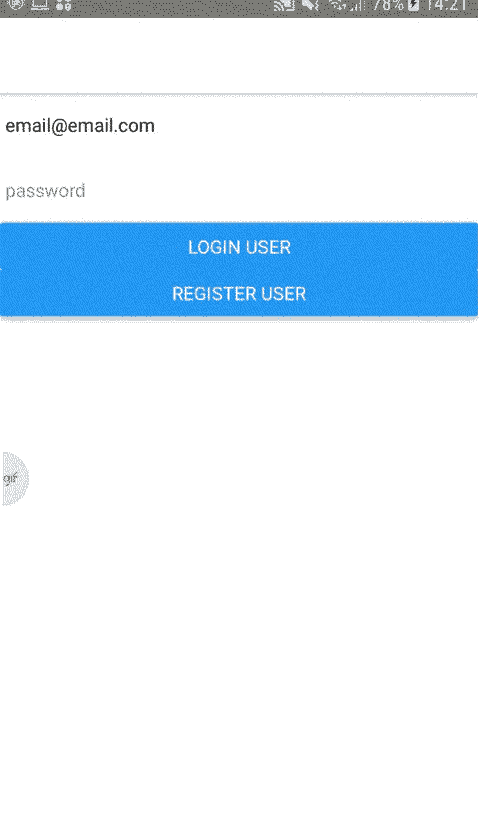

# 我最近做的一些事情

> 原文：<https://dev.to/heymarkkop/some-of-what-i-ve-done-lately-2lla>

## 登陆页面立于 React

使用 **React** 和 **React 钩子**，我已经为一项工作的编码挑战创建了一个**登陆页面**，该页面由[原子设计](http://bradfrost.com/blog/post/atomic-web-design/)构成。

登陆页面- [代码](https://github.com/Markkop/frontend-developer-challenge/tree/marcelo-kopmann)
登陆页面- [演示](https://frontend-developer-challenge.markkop.now.sh/)

液体错误:内部

## React 和 Python 制作的任务 App

在这个 **MVP** 中，作为另一项工作的编码挑战，我在后端使用了 **Flask (Python)** ，在前端使用了 **ReactJS** ，使用 SQLite 作为数据库。还有很多需要改进的地方，我也想在这个博客里分享一下。

FlaskReact - [代码](https://github.com/Markkop/FlaskReact)
FlaskReact - [演示:app](https://flaskreact.herokuapp.com/)T5】flask react-[演示:服务器](https://flaskreact-server.herokuapp.com/hello)

液体错误:内部

## 满堆进度

我已经**赶了一些进度**并且困惑地分享了我学到的大部分东西，你可能已经在上一篇帖子中注意到了。自从**用户和认证**之后，我用 Formik + Yup 和一个非常酷的**日期选择器**添加了一些**表单验证**。我还得把日期格式化，心想。
下一步是使用继电器添加**分页**。

> <video loop="" controls=""><source src="https://video.twimg.com/tweet_video/EErwFkBWwAgyCt6.mp4" type="video/mp4"></video>【2019 年 9 月 17 日下午 5:38】