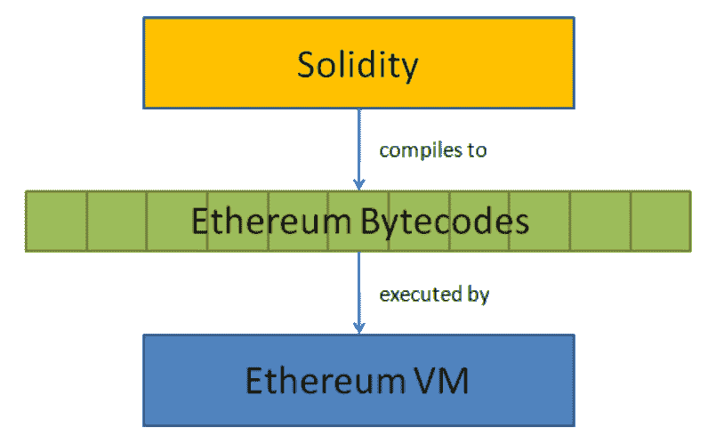

# 维普语，一种 Pythonic 语言

> 原文：<https://dev.to/codesharedot/vyper-a-pythonic-language-1lgj>

比特币是在去中心化的公共账本上设计的。区块链允许你直接从钱包里进行网上交易。

比特币不是为用脚本语言进行大规模计算而设计的。只是价值体系，没有网络之上的编程。

## 以太坊

“[以太坊](https://www.ethereum.org/)的创造者维塔利克·布特林(Vitalik Buterin)想对此进行实验。

就像 bitcion 一样，也有硬币，在 Ethereums 的情况下令牌是 Ether)。它使用燃料(天然气)来推动交易。

和比特币一样，以太(ETH)也有价格价值。如果你想的话，你可以用一个简单的 Python 脚本来获取它。

它不只是一个分散的公共账本(区块链)，而是增加了一个虚拟机(EVM)。其工作方式是每个节点运行一个 EVM。然后你就可以制作在网络上运行的智能合约(程序)。

## 编程 EVM

EVM 的创建是因为如果直接脚本被允许，坏人就可以在网络上运行脚本。您可以使用 Solidity 或 Vyper 语言对 EVM 进行编程。

[](https://res.cloudinary.com/practicaldev/image/fetch/s--h--ApRjq--/c_limit%2Cf_auto%2Cfl_progressive%2Cq_auto%2Cw_880/https://proxy.duckduckgo.com/iu/%3Fu%3Dhttps%253A%252F%252Fsteemitimages.com%252FDQmPFZUdMXLpzyAAUK5bYrYC7u4ZVEYcci5d1zWmPsMz2Ka%252Fimage.png%26f%3D1%26nofb%3D1)

Vyper 被做得和 Python 很像。语言的整体感觉是一样的，但是当然 Vyper 是为了创建智能合同。

当 Python 脚本作为

```
python filename.py 
```

vyper 脚本是使用

```
vyper filename.vy 
```

Vyper 支持列表、布尔、运算符和函数。总的来说，这是一个有趣的新实验，远远超越了区块链。

阅读更多信息:

*   [以太坊平台](https://www.ethereum.org/)
*   [维佩尔蟒语](https://github.com/ethereum/vyper)
*   [学习 Python](https://pythonbasics.org)