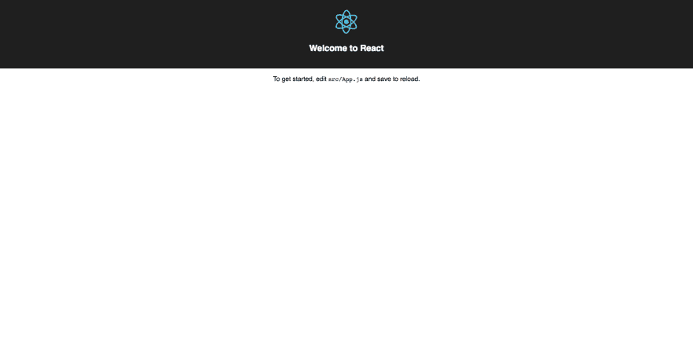
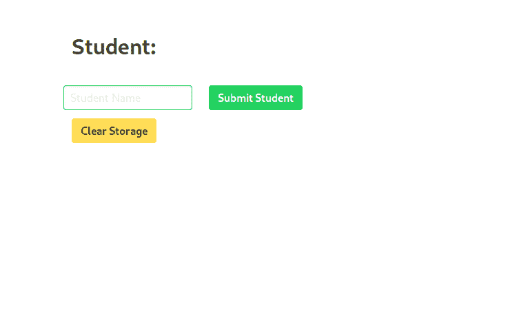
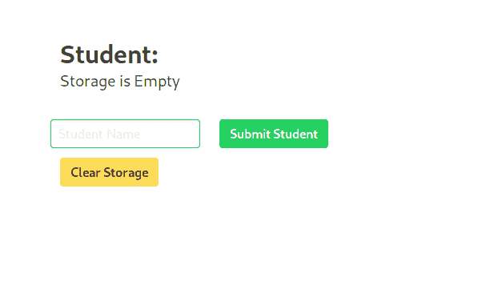

# 为虚拟对象反应状态-状态和虚拟 DOM

> 原文:[https://dev . to/mustafaanaskh 99/react-state-for-dummies-state-and-virtual-DOM-1ac 6](https://dev.to/mustafaanaskh99/react-state-for-dummies-state-and-virtual-dom-1ac6)

`This is part of a series of articles in which I try to break down the evolution of React State concept and try to showcase its importance by explaining the problems React State tackles in simple and intuitive way.`

又见面了，让我们跳过介绍，直接进入正题吧！

在[上一篇文章](https://dev.to/mustafaanaskh99/react-state-for-dummies-how-was-it-before-react-fp3)中，我们开发了一个页面，显示我们在文本字段中输入的学生姓名，并提交给本地存储。我们也有一个按钮来清除存储和删除学生的名字。我们用普通 Javascript 所做的一切！重点是展示如果我们每次想要添加或删除数据时都必须手动与 DOM 交互，会有多麻烦(React 出现之前就是这样)。

在这篇文章中，我们将开发相同的页面，但在反应！
(如果你还没有看过[上一篇文章](https://dev.to/mustafaanaskh99/react-state-for-dummies-how-was-it-before-react-fp3)，我建议你先去看看，然后再来看看这篇！在本文的结尾，你将能够比较这两个不同的代码，并亲自看到 React State 节省了多少时间和精力，以及为什么。

## 别废话了，我们走吧..

如果这是你第一次使用 React，并且你想先设置它，去查看[这个页面](https://create-react-app.dev/docs/getting-started)知道如何开始！

首先，让我们创建一个新文件夹，并在其中启动一个新的 react 项目。您可以将以下命令行复制粘贴到您的终端:

```
npx create-react-app my_app
cd my_app
npm start 
```

运行以下命令后，打开浏览器并转到`http://localhost:3000/`

您应该能够看到以下默认页面:

[T2】](https://res.cloudinary.com/practicaldev/image/fetch/s--DDpr8MlI--/c_limit%2Cf_auto%2Cfl_progressive%2Cq_auto%2Cw_880/https://d33wubrfki0l68.cloudfront.net/81002b3a34f82ff20150c08cfe686de8720e1739/6cfimg/react/reakit/cra-default-page.png)

在您喜欢的文本编辑器中打开项目，您就可以开始了！

## [](#removing-unnecessary-files-and-adding-bulma)删除不必要的文件，添加布尔玛

*   添加布尔玛:

让我们前往终端，在根目录下安装布尔玛依赖项:

```
npm i Bulma 
```

现在我们只需要将 CSS 库和依赖项导入到你的主 HTML 文件中。React 中的主文件可以在`public/index.html`中找到。在 React 中，`index.html`是主页面。然后，应用程序组件呈现并返回一些插入到`index.html`页面中的 HTML。

所以如果你去`src/index.js`你会看到这条线

```
ReactDOM.render(<App />, document.getElementById('root')); 
```

这基本上是告诉`<App />`组件将自己插入到 id 为“root”的 HTML 元素中。(您可以在`index.html`页面中找到具有该 id 的 div)。

不管怎样，我们现在需要做的就是让布尔玛准备好将这两行粘贴到`index.html`页面的`<head></head>`标签中:

```
<link rel="stylesheet" href="https://cdnjs.cloudflare.com/ajax/libs/bulma/0.7.5/css/bulma.min.css">
<script defer src="https://use.fontawesome.com/releases/v5.3.1/js/all.js"></script> 
```

*   删除文件:

在我们的项目目录(文件夹)中，让我们打开`src`目录并开始删除一些文件。由于我们将使用布尔玛，我们将删除`App.css`和`index.css`文件。也删除`App.test.js`，因为我们不会为了这篇文章而做测试。最后，删除`logo.svg`文件，因为我们不会在我们的页面中使用它。

你的 src 目录现在应该是这样的:
[](https://res.cloudinary.com/practicaldev/image/fetch/s--LhcxzTxP--/c_limit%2Cf_auto%2Cfl_progressive%2Cq_auto%2Cw_880/https://thepracticaldev.s3.amazonaws.com/i/7mf0uw8cac1z4cfuzfgo.png)

当然，因为我们删除了一些在默认代码中使用的文件，我们需要在继续之前做一些清理。继续删除对`App.js`和`index.js`中的徽标和`App.css`的导入，并删除应用程序组件中的所有内容，使其呈现一个空白的白色页面。

您最终的`App.js`文件应该是这样的:

```
import React from 'react';

function App() {
  return (
    <div className="App">

    </div>
  );
}

export default App; 
```

如您所见，我们的 App 组件实际上是一个功能组件。在 react 中，有两种类型的组件:

*   功能组件
*   类别组件

稍后我们将更深入地研究这两种类型，但是一个本质的区别是，您不能将状态与功能组件一起使用(这就是钩子被创建的原因！。在下一篇文章中会有更多关于函数式编程的内容)。对于本文，我们只想看看 state 是如何解决我们在[上一篇文章](https://dev.to/mustafaanaskh99/react-state-for-dummies-how-was-it-before-react-fp3)中提到的问题的，所以我们将把我们的 App 组件改为 class 组件。

这就是它的样子:

```
class App extends React.Component {
  render() { 
    return ( 
      <div className="App">

      </div>
     );
  }
} 
```

## [](#html-to-jsx)HTML 到 JSX

现在我们准备开始在 React 中构建页面。React 使用 HTML 语法，但它被称为 *JSX* 。基本上如果你想用 HTML 设计一个页面，React 也是一样的。您所要做的就是将 HTML 代码放入`return()`函数中。不过有一个小区别(您可能已经注意到了)，在 react 中，`class`被称为`className`，所有事件侦听器都是 camel case(*onClick = onClick*)。

因此，我们只需要对我们在`previous article`中编写的 HTML 代码做一些小的修改，然后将其粘贴到`return()`函数中。现在，我们将把`class`改为`className`，并删除所有的 onclick 方法。

我们的`App.js`现在应该是这样的:

```
import React from 'react';

class App extends React.Component {
  render() { 
    return ( 
        <section className="section">
          <div className="container">
              <h3 className="title">Student:</h3>
              <ul id="li" className="subtitle"></ul>
          </div>
          <section className="section">
              <div className="container">
                  <div className="columns">
                      <div className="columns">
                          <div className="column">
                              <input  className="input is-success" id="submit" type="text" placeholder="Student Name" />
                          </div>
                          <div className="column">
                              <input className="button is-success" type="button" value="Submit Student" />
                          </div>
                      </div>
                  </div>
                  <input className="button is-warning" type="button" value="Clear Storage" />
              </div>
          </section>
      </section>
     );
  }
}

export default App; 
```

而页面看起来是这样的:
[](https://res.cloudinary.com/practicaldev/image/fetch/s--csrwQ8ec--/c_limit%2Cf_auto%2Cfl_progressive%2Cq_auto%2Cw_880/https://thepracticaldev.s3.amazonaws.com/i/o8oepiq2drc9u5iccbai.png)

## [](#storing-the-value-in-state)存储状态中的值

因此，对于这个页面，我们所拥有的是学生的名字，我们应该从本地存储中获取这个名字。但是，如果 localStorage 为空，我们希望显示`Storage is Empty`。让我们一步一步来:

*   显示状态:

所以 state 只是一个 Javascript 对象，我们可以把任何东西放进去。在这种情况下，我们将存储一个名为“学生姓名”的值。为此，我们需要在`React.Component{ here }`内部和`render(return(...))`外部编写以下代码。

应该是这样的:

```
class App extends React.Component {
  state = {
    'student_name': 'Storage is Empty'
  }
  render() { 
    ...
} 
```

目前，我们默认将学生姓名存储为`Storage is Empty`。(稍后我们将在显示`Storage is Empty`之前检查是否有学生存储在 localStorage 中)。

在 React 中，`return()`函数中的所有内容都被呈现为 HTML。但是，很酷的一点是，你可以通过在你的类似 HTML 的 JSX 代码中插入 Javascript 来插入动态数据！这就是我们如何将包含我们的`student_name`值的 javascript `State`对象插入到页面中。

在我们的`App.js`文件中，我们将转到我们想要插入值的地方(在本例中是在`<ul></ul>`中)并编写以下内容:

```
<ul id="li" className="subtitle">
  <li>{this.state.student_name}</li>
</ul> 
```

(括号`{}`是你如何在 JSX 中插入 Javascript)。
现在我们可以看到我们的状态数据了！
T3T5】

*   更新状态:

我们希望能够实时更新状态并看到变化！首先让我们为此创建一个函数。

```
saveStudentInitial = () => {
    this.setState({
      student_name: e.target.value
    })
  } 
```

正如你所看到的，更新状态中任何值的语法是`this.setState({})`(我们将在接下来的文章中讨论怪异的`this`)。

这个函数说，获取传递给你的事件，提取它的值，然后用它更新`student_name`。但是如果你还记得[上一篇文章](https://dev.to/mustafaanaskh99/react-state-for-dummies-how-was-it-before-react-fp3)，这些变化通常不会出现在页面上，除非你手动操作 DOM！。嗯，这就是`setState`的特别之处。每次你使用组件时，它*会重新渲染*组件，使新的变化出现。而且，如果你有嵌套组件，不是所有的应用程序都可以重新渲染，而只是你使用了`setState`的组件。这就是为什么使用状态更加容易和有效。

现在我们需要从输入字段调用函数，并向它传递事件值。现在，让我们在用户更改输入时调用该函数，这样我们就可以测试实时数据更改。

让我们编辑输入字段代码，并使其调用`saveStudentInitial()` :

```
 <input className="input is-success" onChange={(e) => this.saveStudentInitial(e)} id="submit" type="text" placeholder="Student Name" /> 
```

现在，如果您尝试在输入字段中键入任何内容，您将会看到学生的姓名随着您的键入而改变。酷！

现在让我们让这个东西正常工作。我们真的不想在输入时更新学生姓名！但是我们仍然希望在用户输入时将名称的值保存在状态中，然后在单击提交按钮时提交它。因此，让我们在 state 对象中创建一个新值，并将其命名为`input_value`，默认情况下它是一个空字符串。

```
state = {
    input_value: '', 
    'student_name': 'Storage is Empty'
  } 
```

在`saveStudentInitial`函数中，我们希望更新输入值，而不是更新学生姓名。

```
saveStudentInitial = (e) => {
    this.setState({
      input_value: e.target.value
    })
  } 
```

酷！我们将值存储在前端的 React 中，我们只需要在单击 submit 按钮时将它保存在 localStorage 中。

*   设置状态后，将值保存到 localStorage:

让我们创建一个函数，将 input_value 保存在 localStorage 中，并将 student_name 设置为等于`input_value`！

```
saveStudent = () => {
    localStorage.setItem('student', this.state.input_value)
    this.setState({
      student_name: this.state.input_value
    })
  } 
```

让我们在单击 submit 按钮时运行它。

```
<input className="button is-success" type="button" value="Submit Student" onClick={() => this.saveStudent()}/> 
```

现在，如果你尝试提交任何新的名字，它会显示在屏幕上！。如果你刷新页面，你会看到`Students:`下面的副标题是空的。但我们只是将值保存到了存储中！让我们看看现在应该做什么..

*   当页面加载时，检查存储器中是否有任何值，并相应地改变状态

现在，每当组件被渲染/重新渲染时，我们首先要检查存储是否为空。如果它是空的，不会做任何事情，因为在我们的状态下`student_name`的默认值已经是`Storage is Empty`。但是，如果存储中有学生的名字，那么我们希望将我们州的`student_name`设置为该值。

```
componentDidMount = () => {
    let student = localStorage.getItem('student')
    if (student !== null){
      if (this.state.student_name !== student){
        this.setState({
          student_name: student
        })
      }
    }
  } 
```

哈？？什么是`componentDidMount`？。
componentDidMount 是一个函数，该函数在组件被呈现或重新呈现到页面时自动运行。这就是为什么我们需要小心，这就是为什么我们有两个 if 语句。我们不想陷入无限循环！

酷！我们差不多完成了。我们只需要适当地实现清除存储！

*   单击清除存储时，将状态设置为默认并清空存储。

```
clearStorage = () => {
    localStorage.clear()
    this.setState({
      student_name: 'Storage is Empty'
    })
  } 
```

请注意，每次我们添加新数据时，不是刷新页面，而是更新状态！它为我们做 DOM 操作。
当点击`Clear`按钮时，不要忘记调用这个函数:

```
<input className="button is-warning" type="button" value="Clear Storage" onClick={() => this.clearStorage()}/> 
```

我们最后的`App.js`现在看起来像这样:

```
import React from 'react';

class App extends React.Component {
  state = {
    input_value: '', 
    'student_name': 'Storage is Empty'
  }

  saveStudentInitial = (e) => {
    this.setState({
      input_value: e.target.value
    })
  }

  saveStudent = () => {
    localStorage.setItem('student', this.state.input_value)
    this.setState({
      student_name: this.state.input_value
    })
  }

  clearStorage = () => {
    localStorage.clear()
    this.setState({
      student_name: 'Storage is Empty'
    })
  }

  componentDidMount = () => {
    let student = localStorage.getItem('student')
    if (student !== null){
      if (this.state.student_name !== student){
        this.setState({
          student_name: student
        })
      }
    }
  }

  render() { 
    return ( 
        <section className="section">
          <div className="container">
              <h3 className="title">Student:</h3>
              <ul id="li" className="subtitle">
                <li>{this.state.student_name}</li>
              </ul>
          </div>
          <section className="section">
              <div className="container">
                  <div className="columns">
                      <div className="columns">
                          <div className="column">
                              <input className="input is-success" onChange={(e) => this.saveStudentInitial(e)} id="submit" type="text" placeholder="Student Name" />
                          </div>
                          <div className="column">
                              <input className="button is-success" type="button" value="Submit Student" onClick={() => this.saveStudent()}/>
                          </div>
                      </div>
                  </div>
                  <input className="button is-warning" type="button" value="Clear Storage" onClick={() => this.clearStorage()}/>
              </div>
          </section>
      </section>
     );
  }
}

export default App; 
```

我们完了。我们编写了一个高效、易于开发的创建、读取和删除页面！在接下来的文章中，我们将更多地讨论函数式编程和钩子！

感谢您的阅读，如果您需要任何帮助，请务必联系我们！