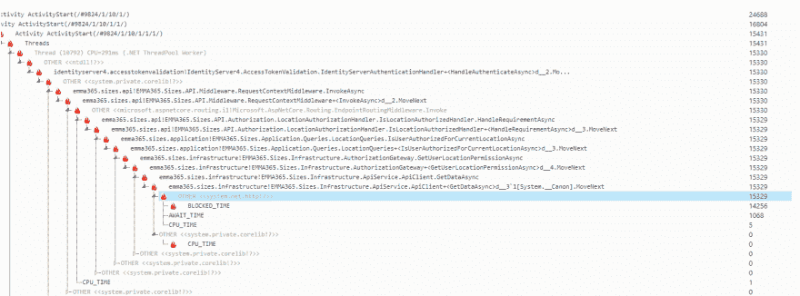

# Azure 应用服务之间的 API 网关调用慢得令人难以忍受

> 原文:[https://dev . to/buinauskas/unabulably-slow-API-gateway-calls-on-azure-app-service-3c2g](https://dev.to/buinauskas/unbearably-slow-api-gateway-calls-on-azure-app-service-3c2g)

大家好，

我想寻求帮助调试 ASP.NET 核心 Web API。

情况就是这样:

我们有一个授权服务，它公开了多个 RESTful APIs 来检查经过身份验证的用户是否可以访问某些业务对象。在我的案例中，业务对象是一个市场概念，它们是由项目授权的。因此 API 调用将如下所示:

```
GET https://authorization.service.com/markets?project=123456 
```

<svg width="20px" height="20px" viewBox="0 0 24 24" class="highlight-action crayons-icon highlight-action--fullscreen-on"><title>Enter fullscreen mode</title></svg> <svg width="20px" height="20px" viewBox="0 0 24 24" class="highlight-action crayons-icon highlight-action--fullscreen-off"><title>Exit fullscreen mode</title></svg>

成功响应将返回市场数组，未授权响应将返回 403 状态代码。

当我通过 Swagger 调用它，从邮递员那里调用它时，它都工作得很好——响应很快，在几十毫秒内就回来了。

现在，我的另一个服务正在授权过滤器中调用该服务，并根据响应继续或以禁止响应。

我已经为 HTTP 调用实现了一个可重用的客户端:

```
public class ApiClient : IApiClient
{
    private readonly HttpClient _client;
    private readonly JsonSerializer _jsonSerializer;

    public ApiClient(HttpClient httpClient, JsonSerializer jsonSerializer)
    {
        _client = httpClient ?? throw new ArgumentNullException(nameof(httpClient));
        _jsonSerializer = jsonSerializer ?? throw new ArgumentNullException(nameof(jsonSerializer));
    }

    public async Task<T> GetDataAsync<T>(string uri, string accessToken)
        where T : class
    {
        var request = CreateRequest(uri, accessToken);
        var response = await _client.SendAsync(request, HttpCompletionOption.ResponseHeadersRead);

        if (!response.IsSuccessStatusCode)
        {
            return default(T);
        }

        using (var responseStream = await response.Content.ReadAsStreamAsync())
        using (var streamReader = new StreamReader(responseStream))
        using (var jsonTextReader = new JsonTextReader(streamReader))
        {
            return _jsonSerializer.Deserialize<T>(jsonTextReader);
        }
    }

    private HttpRequestMessage CreateRequest(string uri, string accessToken)
    {
        var locationUri = new Uri(uri);

        var message = new HttpRequestMessage(HttpMethod.Get, locationUri);

        message.Headers.Add("Authorization", $"Bearer {accessToken}");

        return message;
    }
} 
```

<svg width="20px" height="20px" viewBox="0 0 24 24" class="highlight-action crayons-icon highlight-action--fullscreen-on"><title>Enter fullscreen mode</title></svg> <svg width="20px" height="20px" viewBox="0 0 24 24" class="highlight-action crayons-icon highlight-action--fullscreen-off"><title>Exit fullscreen mode</title></svg>

我的授权过滤器如下所示:

```
public class AuthorizeProjectFilter : IAsyncActionFilter
{
    private readonly IApiClient _apiClient;
    private readonly IMarketsContext _marketsContext;

    public AuthorizeProjectFilter(IApiClient apiClient, IMarketsContext marketsContext)
    {
        _apiClient = apiClient ?? throw new ArgumentNullException(nameof(apiClient));
        _marketsContext = marketsContext ?? throw new ArgumentNullException(nameof(marketsContext));
    }

    public async Task OnActionExecutionAsync(ActionExecutingContext context, ActionExecutionDelegate next)
    {
        if (
            context.HttpContext.Request.Query.TryGetValue(nameof(RequestBase.Project), out var value) &&
            context.HttpContext.Request.Headers.TryGetValue("Authorization", out var authorizationHeader)
            )
        {
            var project = value.ToString();
            var accessToken = authorizationHeader.ToString().Split(" ")[1];

            var markets = await _apiClient.GetDataAsync<IEnumerable<Market>>($"{_authorizationServiceOptions.Authorization}/markets?project={project}", accessToken);

            var authorized = markets.Any();

            if (!authorized)
            {
                context.Result = new ForbidResult();
            }
            else
            {
                _marketsContext.Markets = markets;
                await next();
            }
        }
    }
} 
```

<svg width="20px" height="20px" viewBox="0 0 24 24" class="highlight-action crayons-icon highlight-action--fullscreen-on"><title>Enter fullscreen mode</title></svg> <svg width="20px" height="20px" viewBox="0 0 24 24" class="highlight-action crayons-icon highlight-action--fullscreen-off"><title>Exit fullscreen mode</title></svg>

这在本地工作得很好，当我调用这个服务时请求很快，然而当我将它部署到 Azure App 服务时-响应需要 20 多秒，有时超过一分钟。应用程序计划也不是最便宜的，它应该很快。

这似乎不是冷启动问题，因为我可以继续调用服务——它仍然很慢。

我对 Azure diagnostics 进行了跟踪，得到了以下结果:
[](https://res.cloudinary.com/practicaldev/image/fetch/s--PJWcZefs--/c_limit%2Cf_auto%2Cfl_progressive%2Cq_auto%2Cw_880/https://thepracticaldev.s3.amazonaws.com/i/5f3xh1ith5nty218am1f.png)

似乎大部分时间都花在了`system.net.http`内的`BLOCKED_TIME`上，我在这里真的迷路了。

跟踪还捕获了一些异常，显示以下消息:

```
An attempt was made to access a socket in a way forbidden by its access permissions 
```

<svg width="20px" height="20px" viewBox="0 0 24 24" class="highlight-action crayons-icon highlight-action--fullscreen-on"><title>Enter fullscreen mode</title></svg> <svg width="20px" height="20px" viewBox="0 0 24 24" class="highlight-action crayons-icon highlight-action--fullscreen-off"><title>Exit fullscreen mode</title></svg>

我的`HttpClient`也是用`IHttpClientFactory` :
添加的

```
services
    .AddHttpClient<IApiClient, ApiClient>(client =>
    {
        client.DefaultRequestHeaders.Add("Accept", "application/json");
    })
    .ConfigurePrimaryHttpMessageHandler(() => new HttpClientHandler
    {
        UseProxy = false
    }); 
```

<svg width="20px" height="20px" viewBox="0 0 24 24" class="highlight-action crayons-icon highlight-action--fullscreen-on"><title>Enter fullscreen mode</title></svg> <svg width="20px" height="20px" viewBox="0 0 24 24" class="highlight-action crayons-icon highlight-action--fullscreen-off"><title>Exit fullscreen mode</title></svg>

我现在真的迷路了，我在谷歌上找不到任何对我有帮助的东西。

请帮帮忙:)