# 开发无服务器的 WhatsApp 聊天机器人

> 原文:[https://dev . to/ice beam 7/developing-a-server less-whatsapp-chatbot-4o 72](https://dev.to/icebeam7/developing-a-serverless-whatsapp-chatbot-4o72)

> 本文是 [#ServerlessSeptember](https://dev.to/azure/serverless-september-content-collection-593p-temp-slug-4543319?preview=f13be4da8a729201c3ed6f23d46efb13851b6800b723ddb762f89e410cdc057436b66afc9bdc49068f5fd8afddc5fb72575f4035266fadea4345a207) 的一部分。在这个无服务器的内容集合中，您可以找到其他有用的文章、详细的教程和视频。9 月份，每天都有来自社区成员和云倡导者的新文章发布，没错，每天都有。
> 
> 在[https://docs.microsoft.com/azure/azure-functions/](https://docs.microsoft.com/azure/azure-functions/?WT.mc_id=servsept_devto-blog-cxa)了解更多关于微软 Azure 如何实现你的无服务器功能。

聊天机器人是能够用自然语言与用户互动的人工智能软件。它们能够通过从用户的信息中提取关键词来检测用户的意图，然后对用户的请求做出适当的响应。如今，它们非常重要，因为它们可以有效地用于重复、耗时的任务，使公司能够专注于其他活动并优化资源(尤其是人力资源)。

微软提供了两项关键技术，LUIS T1 和 T2 T3 来开发和创建机器人。即使不是人工智能专家，你也可以开发和部署对话机器人，与你的用户互动并处理他们的需求。将 [Azure Bot 服务](https://azure.microsoft.com/en-us/services/bot-service/)添加到等式中，您将拥有一个连接到云的 Bot，它可以通过几个配置步骤插入到几个渠道，如 **Skype、微软团队、Facebook Messenger** ，甚至通过 **WebChat** 渠道插入到您的网站。

然而，一些频道目前在 Azure Bot 服务中不可用。 **WhatsApp** ，[截至 2019 年 7 月拥有 16 亿月用户的最受欢迎的信使应用](https://www.statista.com/statistics/258749/most-popular-global-mobile-messenger-apps/)就是一个显著的例子。我们的客户很乐意通过这个 messenger 应用程序与我们的应用程序进行交流。

那么，我们如何解决这个问题呢？ **Azure Functions 来救援了！**我们可以通过创建一个通过 *webhooks* 连接到 WhatsApp 号码的*无服务器*代码来简化事情。这意味着每次用户向该号码发送消息时，都会触发一个 Azure 功能。我们可以通过将回复与自然语言处理的 LUIS 模型联系起来，在回复中注入智能。简而言之，我们将使用三种技术:

*   路易斯(语言理解智能服务)
*   **Azure 功能**
*   **Twilio API** (用于访问 WhatsApp)

**我们开始吧！**

## [](#part-1-luis)第一部分:路易斯

LUIS 代表语言理解智能服务。它是微软人工智能平台的一部分，允许我们从用户的信息中识别用户的意图和关键元素。为了创建一个智能的语言处理模型，我们需要通过给它提供例子(话语)来训练它

**第一步。**创建一个新的 [LUIS 应用](https://www.luis.ai/applications)。
[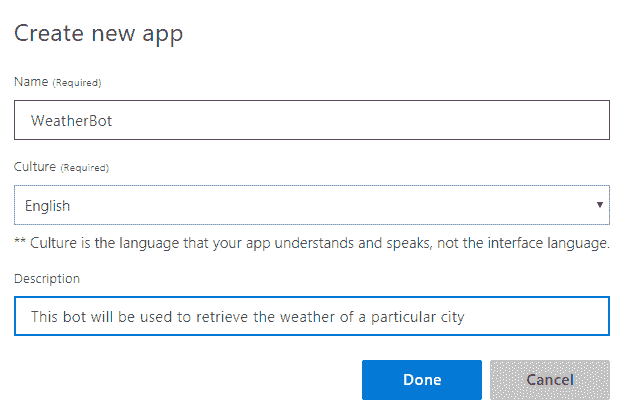](https://res.cloudinary.com/practicaldev/image/fetch/s--tYlHTMCn--/c_limit%2Cf_auto%2Cfl_progressive%2Cq_auto%2Cw_880/https://thepracticaldev.s3.amazonaws.com/i/9wnyjhmxuzixf5ca0b0f.png)

**第二步。**将 **geographyV2** 预构建的实体添加到项目中。一个实体代表将被识别的文本的一部分(例如，一个城市)
[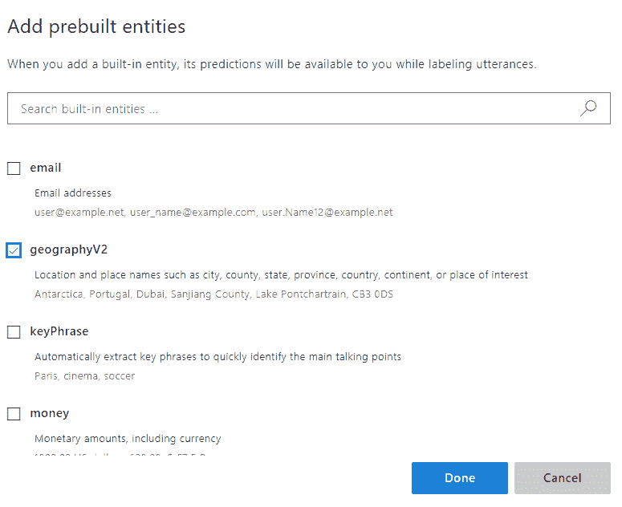](https://res.cloudinary.com/practicaldev/image/fetch/s--tgRHMoDT--/c_limit%2Cf_auto%2Cfl_progressive%2Cq_auto%2Cw_880/https://thepracticaldev.s3.amazonaws.com/i/zs07da94m0kcs350j78q.png)

**第三步。**创建一个新的意图: **GetCityWeather** 。意图代表用户的需求，比如预订酒店房间、寻找产品或查询特定城市的天气情况。

[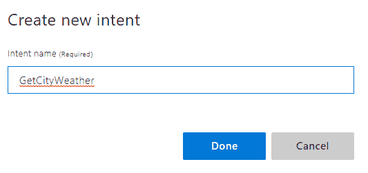](https://res.cloudinary.com/practicaldev/image/fetch/s--k_EYvIUa--/c_limit%2Cf_auto%2Cfl_progressive%2Cq_auto%2Cw_880/https://thepracticaldev.s3.amazonaws.com/i/wwrk8o1h252yg99vomop.png)

**第四步。**为此目的添加至少 **5 个样本话语**。请注意，城市被自动检测为 geographyV2 实体。该模型通过提供用户可能出于特定意图说出的例句变得更加智能。
[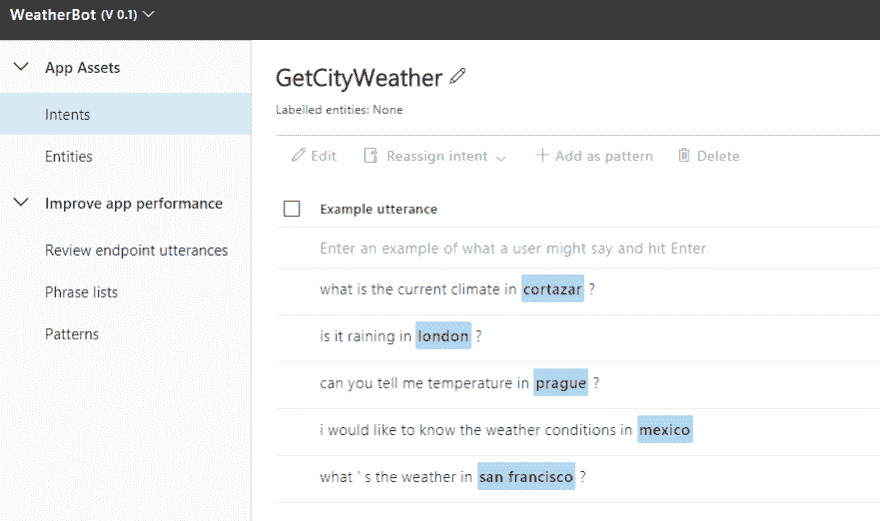](https://res.cloudinary.com/practicaldev/image/fetch/s--3u6ToVv3--/c_limit%2Cf_auto%2Cfl_progressive%2Cq_auto%2Cw_880/https://thepracticaldev.s3.amazonaws.com/i/c9kwl3v3va0wp2la7oup.png)

**第五步。**点击培训按钮，创建 LUIS 模型。当流程结束时，用一个新的请求测试它，看看它是否工作(它应该检测意图和实体):
[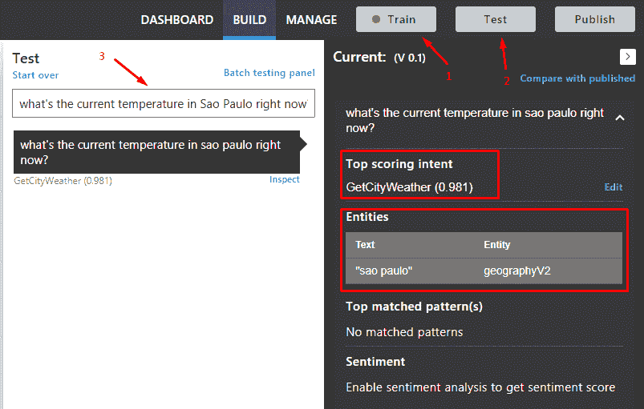](https://res.cloudinary.com/practicaldev/image/fetch/s--76BW9aGI--/c_limit%2Cf_auto%2Cfl_progressive%2Cq_auto%2Cw_880/https://thepracticaldev.s3.amazonaws.com/i/5nup6jmha2kw39wivc8t.png)

**第六步。**发布模型。选择生产槽然后去**天蓝资源**。从示例查询框中复制 URL，因为我们稍后将在第 3 部分的 Azure 函数查询和请求中使用它。
[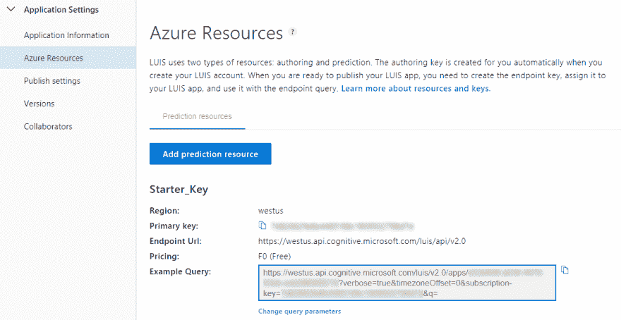](https://res.cloudinary.com/practicaldev/image/fetch/s--GowmGtjL--/c_limit%2Cf_auto%2Cfl_progressive%2Cq_auto%2Cw_880/https://thepracticaldev.s3.amazonaws.com/i/l00nldkxsayihiesb0i2.png)

## [](#part-2-openweathermap)第二部分:开放气象图

*[OpenWeatherMap](https://openweathermap.org/) 是一项服务，我们可以用它来获取特定城市的天气信息。*

**第一步。**注册服务。
T3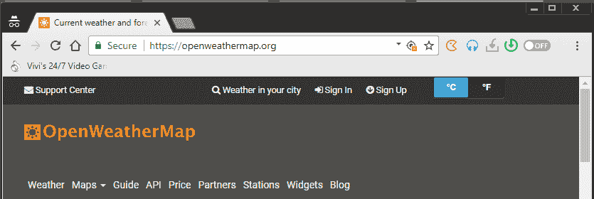T5】

**第二步。**点击 API，然后订阅当前天气数据 API。
T3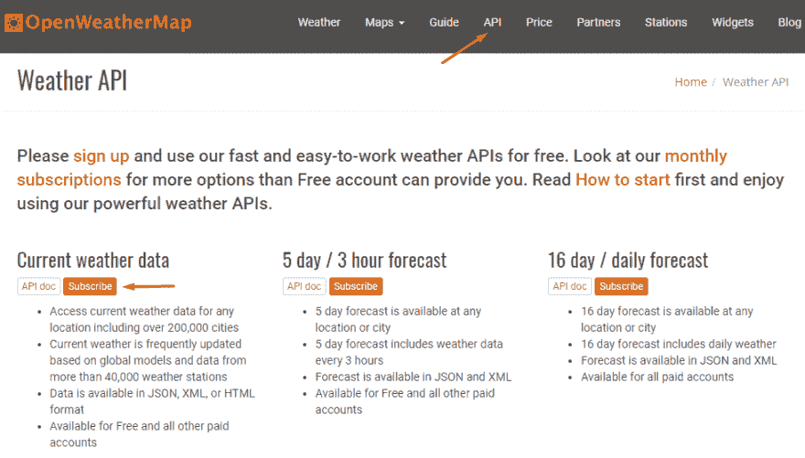T5】

**第三步。**选择自由层，获取 API 密钥
[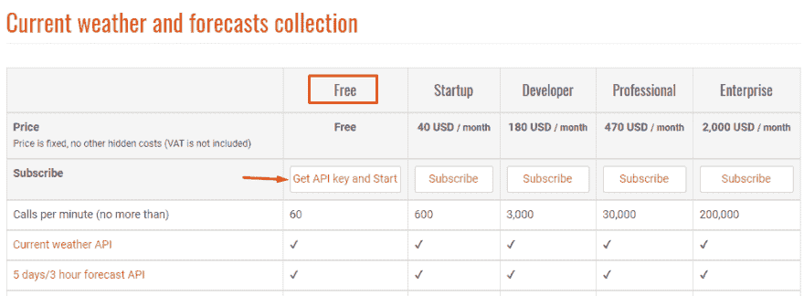](https://res.cloudinary.com/practicaldev/image/fetch/s--u0P-SL8o--/c_limit%2Cf_auto%2Cfl_progressive%2Cq_auto%2Cw_880/https://luisbeltran.mx/wp-content/uploads/2019/01/03-OpenWeatherMap-02.png)

**第四步。**复制 API 密钥，我们将在下一部分使用它。
T3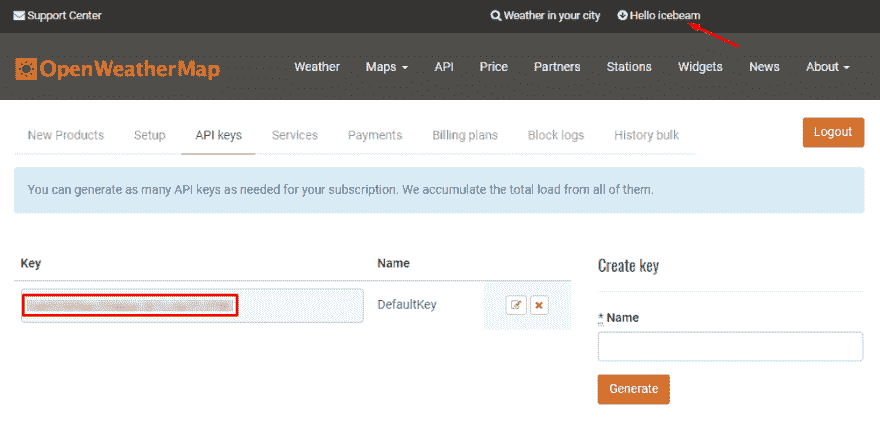T5】

## 第三部分:Azure 函数

Azure Functions 是一种无服务器计算服务，使您能够按需或响应事件运行脚本或代码，而无需显式配置或管理基础架构。

**第一步。**从 Azure 门户创建一个新的功能应用。它的名字是唯一的，所以 **serverlesschatbot** 对你不起作用，用另一个:-)
[](https://res.cloudinary.com/practicaldev/image/fetch/s--Wk05lgwz--/c_limit%2Cf_auto%2Cfl_progressive%2Cq_auto%2Cw_880/https://thepracticaldev.s3.amazonaws.com/i/ex1wk3hnazbl1muzftb8.png)

**第二步。**一旦创建了资源，添加一个名为 **receive-message** 的新 HTTP 触发器。然后点击查看文件，添加一个 **function.proj** 文件
[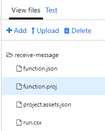](https://res.cloudinary.com/practicaldev/image/fetch/s--tpo2gs3U--/c_limit%2Cf_auto%2Cfl_progressive%2Cq_auto%2Cw_880/https://thepracticaldev.s3.amazonaws.com/i/udx8t9dbdd6of2c9ogz0.png)

**第三步。这个文件用于将一个 Nuget 包包含到我们的项目中。我们正在添加 Twilio 扩展，以便我们的代码可以在以后与 WhatsApp 号码进行交互。** 

```
<Project Sdk="Microsoft.NET.Sdk">
<PropertyGroup>
    <TargetFramework>netstandard2.0</TargetFramework>
  </PropertyGroup>
  <ItemGroup>
    <PackageReference Include="Microsoft.Azure.WebJobs.Extensions.Twilio" Version="3.0.0" />
  </ItemGroup>
</Project> 
```

**第四步。**接下来，我们有 run.csx 的代码，它是 Azure 函数的主要部分。在本例中，我们使用了第 1 部分(步骤 6)中的 URL 和第 2 部分(步骤 4)中的 API 键，所以在代码中替换它们。

在代码的第一部分中，我们包括了几个在调用 LUIS 和 OpenWeatherMap 的服务后反序列化它们的 JSON 响应所需的类。然后， **Run** 方法中的代码解析发送给 WhatsApp 号码的消息后生成的有效载荷。提取文本部分，我们有 **evaluateMessage** 方法，在该方法中，我们将文本发送到 LUIS published 模型，该模型处理消息并提取城市部分。如果成功，将请求打开 WeatherMap 以获取特定城市的天气。最后，该信息作为响应发送给用户。

```
#r "System.Runtime"
#r "Newtonsoft.Json"

using System.Net;
using System.Text; 
using System.Linq;
using System.Threading.Tasks;
using Newtonsoft.Json;
using Twilio.TwiML; 

// LUIS classes
public class LuisModel
{
    public string query { get; set; }
    public TopScoringIntent topScoringIntent { get; set; }
    public List<Intent> intents { get; set; }
    public List<Entity> entities { get; set; }
}

public class TopScoringIntent
{
    public string intent { get; set; }
    public double score { get; set; }
}

public class Intent
{
    public string intent { get; set; }
    public double score { get; set; }
}

public class Entity
{
    public string entity { get; set; }
    public string type { get; set; }
    public int startIndex { get; set; }
    public int endIndex { get; set; }
}

// OpenWeatherMap classes
public class WeatherModel
{
    public Coord coord { get; set; }
    public List<Weather> weather { get; set; }
    public string @base { get; set; }
    public Main main { get; set; }
    public int visibility { get; set; }
    public Wind wind { get; set; }
    public Clouds clouds { get; set; }
    public int dt { get; set; }
    public Sys sys { get; set; }
    public int id { get; set; }
    public string name { get; set; }
    public int cod { get; set; }
}

public class Weather
{
    public int id { get; set; }
    public string main { get; set; }
    public string description { get; set; }
    public string icon { get; set; }
}

public class Coord
{
    public double lon { get; set; }
    public double lat { get; set; }
}

public class Main
{
    public double temp { get; set; }
    public double pressure { get; set; }
    public double humidity { get; set; }
    public double temp_min { get; set; }
    public double temp_max { get; set; }
}

public class Wind
{
    public double speed { get; set; }
}

public class Clouds
{
    public double all { get; set; }
}

public class Sys
{
    public int type { get; set; }
    public int id { get; set; }
    public double message { get; set; }
    public string country { get; set; }
    public long sunrise { get; set; }
    public long sunset { get; set; }
}

// Main code
public static async Task<HttpResponseMessage> Run(HttpRequestMessage req, TraceWriter log)
{
    var data = await req.Content.ReadAsStringAsync();

    var formValues = data.Split('&') 
        .Select(value => value.Split('='))
        .ToDictionary(pair => Uri.UnescapeDataString(pair[0]).Replace("+", " "), 
                      pair => Uri.UnescapeDataString(pair[1]).Replace("+", " "));

    var text = formValues["Body"].ToString();
    var message = await evaluateMessage(text);
    var response = new MessagingResponse().Message(message);

    var twiml = response.ToString();
    twiml = twiml.Replace("utf-16", "utf-8");

    return new HttpResponseMessage
    { 
        Content = new StringContent(twiml, Encoding.UTF8, "application/xml")
    };
}

private static readonly HttpClient httpClient = new HttpClient();

private static async Task<string> evaluateMessage(string text)
{
    try
    {
        var luisURL = "Your-LUIS-URL-From-Step6-Part1";
        var luisResult = await httpClient.GetStringAsync($"{luisURL}{text});
        var luisModel = JsonConvert.DeserializeObject<LuisModel>(luisResult);

        if (luisModel.topScoringIntent.intent == "GetCityWeather")
        {
            var entity = luisModel.entities.FirstOrDefault();

            if (entity != null)
            {
                if (entity.type == "builtin.geographyV2.city")
                {
                    var city = entity.entity;
                    var apiKey = "Your-OpenWeatherMapKey-From-Step4-Part2";

                    var weatherURL = $"http://api.openweathermap.org/data/2.5/weather?appid={apiKey}&q={city}";

                    var weatherResult = await httpClient.GetStringAsync(weatherURL);
                    var weatherModel = JsonConvert.DeserializeObject<WeatherModel>(weatherResult);
                    weatherModel.main.temp -= 273.15;

                    var weather = $"{weatherModel.weather.First().main} ({weatherModel.main.temp.ToString("N2")} °C)";
                    return $"Weather of {city} is: {weather}";
                }
            }
        }
        else
            return "Sorry, I could not understand you!";
    }
    catch(Exception ex)
    {

    }

    return "Sorry, there was an error!";
} 
```

**第五步。**复制函数 URL，我们会在最后部分用到。
T3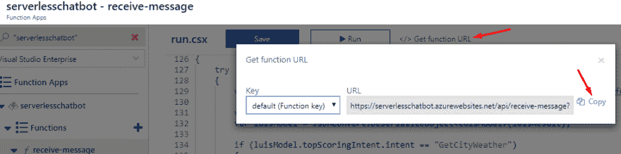T5】

## [](#final-part-twilio)Final Part: Twilio

为了与 WhatsApp 号码通信，我们可以使用 Twilio API。

**第一步。**创建一个[免费的 Twilio 账号](https://www.twilio.com/try-twilio)
[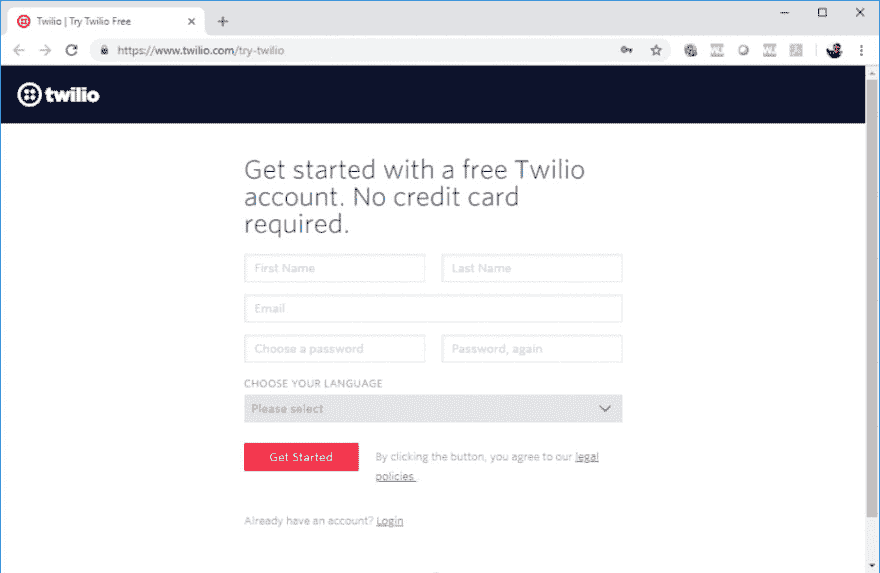](https://res.cloudinary.com/practicaldev/image/fetch/s--VGOxmIqU--/c_limit%2Cf_auto%2Cfl_progressive%2Cq_auto%2Cw_880/https://luisbeltran.mx/wp-content/uploads/2018/10/00-1-1024x667.png)

**第二步。**访问[可编程短信仪表板](https://www.twilio.com/console/sms/dashboard)，然后选择 WhatsApp Beta，然后点击开始。
[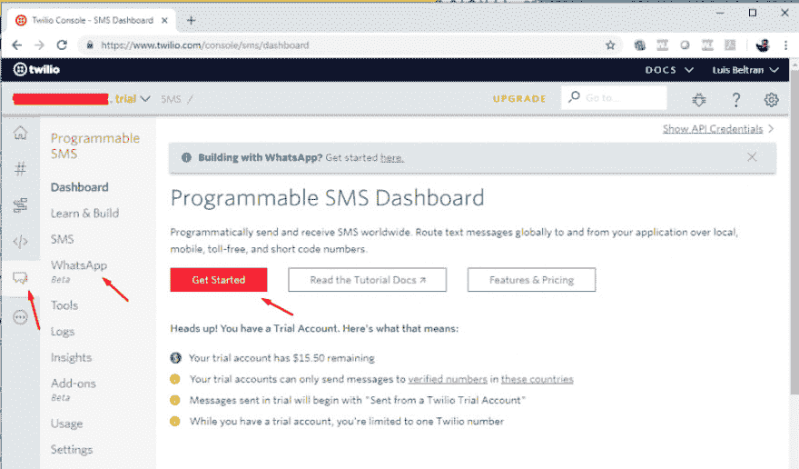](https://res.cloudinary.com/practicaldev/image/fetch/s--zU2F3wVj--/c_limit%2Cf_auto%2Cfl_progressive%2Cq_auto%2Cw_880/https://luisbeltran.mx/wp-content/uploads/2018/10/02-3-1024x601.png)

**第三步。**为 WhatsApp 激活 Twilio 沙盒。
T3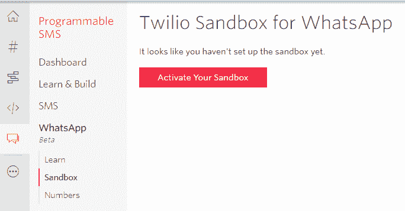T5】

**第四步。**通过从您的设备向指定号码
[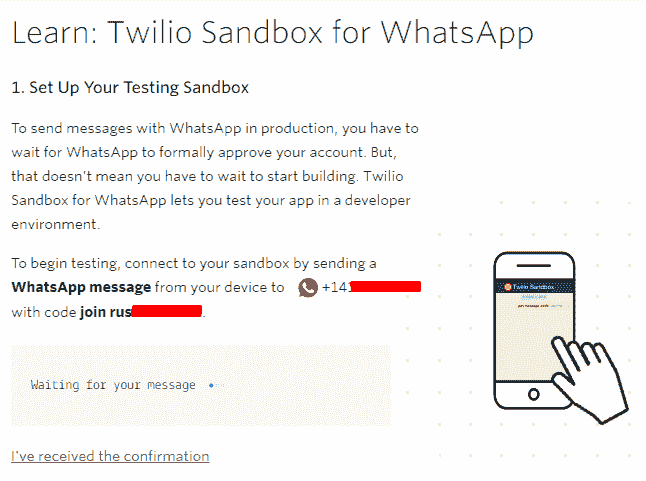](https://res.cloudinary.com/practicaldev/image/fetch/s--cWV8W646--/c_limit%2Cf_auto%2Cfl_progressive%2Cq_auto%2Cw_880/https://luisbeltran.mx/wp-content/uploads/2018/10/05-3.png) 发送特定的 WhatsApp 消息来设置测试沙箱

[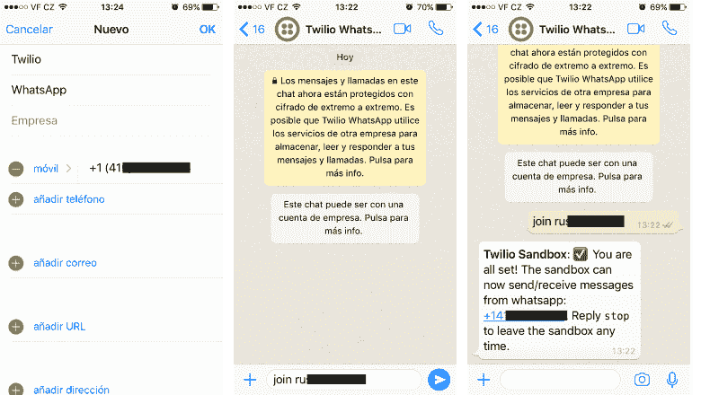T2】](https://res.cloudinary.com/practicaldev/image/fetch/s--pGg9NBLl--/c_limit%2Cf_auto%2Cfl_progressive%2Cq_auto%2Cw_880/https://luisbeltran.mx/wp-content/uploads/2018/10/img.png)

**第五步。**加入对话后，再次点击沙盒以访问配置。用上一部分第 5 步中的 Azure 函数 URL 替换“当有消息进来时”下的 URL。
T3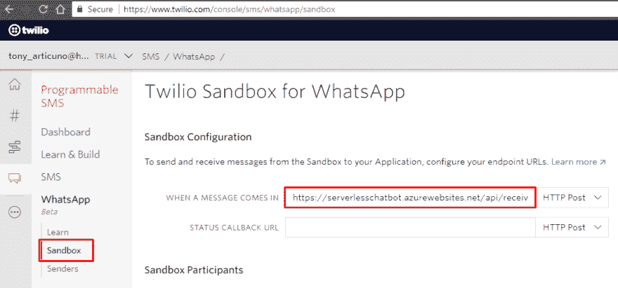T5】

**第六步。**就是这样！让我们测试我们的工作！
T3T5】

**成功！**耶！

由于涉及到多种技术，设置一切肯定需要一些时间。然而，你现在可以想象可能性。当你告诉你的用户他们可以通过 WhatsApp 与你的应用程序互动后，他们会有什么感觉？或者他们可以将他们的问题发送到一个特定的号码，该号码将处理所有这些问题？你可以用另一种技术代替 LUIS，比如用 [QnA Maker](https://www.qnamaker.ai/) 来处理用户的问题。例如，甚至有可能发送图像并让认知服务对其进行分析！

天空才是极限！:-)

当然，由于有了 Azure 功能，一切都在无服务器的体验下进行管理。

感谢你的时间，希望这篇文章对你有用(请在评论区告诉我你的想法:-D)。如果你想了解更多关于 Azure、Xamarin、人工智能等方面的知识，请访问我的[博客](https://luisbeltran.mx/)和 [YouTube 频道](https://youtube.com/user/darkicebeam)，我通常会在这里分享我的知识和经验。

编码快乐！

【男名】路易斯

PS:我还要感谢【Azure 倡导者([https://twitter.com/azureadvocates](https://twitter.com/azureadvocates))发起的[#无服务器 9 月](https://twitter.com/hashtag/serverlessseptember)！每天从社区和专家那里学到一些新东西是很棒的。

本出版物使用的参考资料:
[Twilio](https://www.twilio.com/docs/usage/tutorials/serverless-webhooks-azure-functions-and-csharp?code-sample=code-receive-sms-with-c-azure-functions-2&code-language=C%23&code-sdk-version=5.x)