# 像专家一样调试 Javascript

> 原文:[https://dev.to/gc_psk/debugging-javascript-like-a-pro-2gc0](https://dev.to/gc_psk/debugging-javascript-like-a-pro-2gc0)

## 发现 Chrome 提供的最佳调试工具

*本帖最初由[吉安卡洛·布翁普利斯科](https://medium.com/@.gc)T5 在[零碎](https://blog.bitsrc.io)上发表*

当你的代码没有按照你期望的方式运行时，你是那些控制台记录你的解决方案的人之一吗？如果是，请继续阅读。

本文旨在向您解释 Chrome Dev Tools 提供的最有用的工具和技术，以便比以前更好更快地调试您的 Javascript 代码。

到本文结束时，您将能够比以前更好更快地调试代码。

这是我们将要经历的事情的总结:

*   在特定行设置断点以调试代码

*   导航调用堆栈

*   暂停/恢复脚本执行

*   设置观察表达式

*   开发工具的生产力提示和技巧

在我们继续之前——一个免费提示:使用 [Bit](https://bit.dev) ( [Github](https://github.com/teambit/bit) )轻松管理、共享和重用你的 JS 组件。模块化和可重用性是更好、更可持续的代码的关键因素！

### 调试运行时代码

如果您调试代码的原因是由于 bug 或意外行为，您可能会对开发工具中的“Sources”选项卡感兴趣，这是我们将通过一组不同的场景深入探讨的部分。

[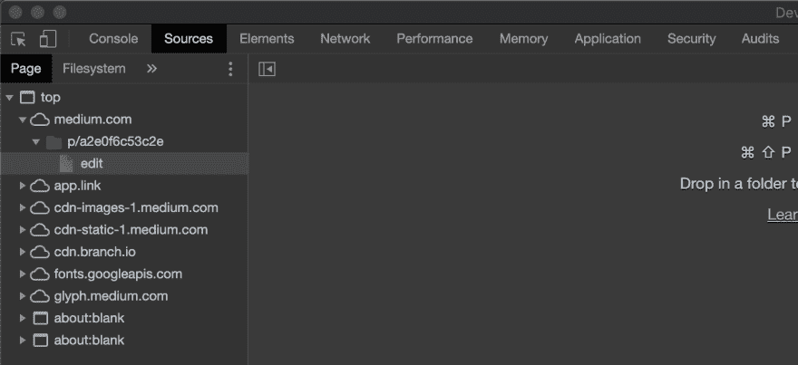T2】](https://res.cloudinary.com/practicaldev/image/fetch/s--PK3qyqpW--/c_limit%2Cf_auto%2Cfl_progressive%2Cq_auto%2Cw_880/https://cdn-images-1.medium.com/max/2886/1%2Ao-K2FM8avaFY0MDonke7eQ.png)

## 断点

如果您正在阅读本文，那么您可能已经习惯于通过将某个值记录到控制台来调试特定的行。但是我想让你介绍一种比简单的日志记录更强大的深入代码的方法:**断点**。

设置断点通常是调试过程的第一步。大多数浏览器中的内置开发工具允许您在正在调试的页面上运行的每一行代码的特定代码行和特定语句处停止代码的执行，但出于本文的目的，我们将专门使用 Chrome 开发工具。

### 断点是干什么用的？

通常，您可能希望停止代码的执行，以便能够交互式地检查我们感兴趣的特定上下文。

一旦代码在断点处停止，我们就可以通过访问作用域、导航调用堆栈，甚至在运行时更改代码来开始调试过程。

### 如何设置断点？

为了解释如何设置断点，我们将调试我出于教育目的使用的一个辅助项目的 Angular 代码库，尽管使用的技术并不重要。

*   你可能想做的第一件事是打开开发工具，并转到“源”标签

*   然后，我们需要打开我们想要调试的文件
    **提示:**在 Mac 上，⌘ + O 会打开文件选择器，你可以在那里找到需要的文件。在 Windows 上，使用 CTRL+O

*   一旦文件被打开，我们最终可以通过点击想要停止的代码行来设置断点。

[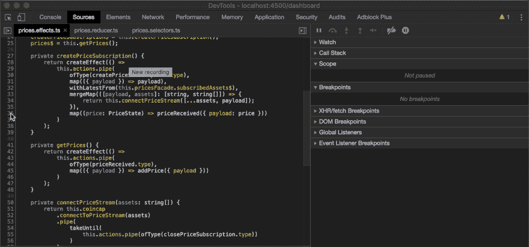 ](https://res.cloudinary.com/practicaldev/image/fetch/s--Glcnu2Uy--/c_limit%2Cf_auto%2Cfl_progressive%2Cq_66%2Cw_880/https://cdn-images-1.medium.com/max/4316/1%2AHZnwrJpcjJQuBQuamXriIg.gif) *设置断点*

正如你在上面的图片中看到的，我们可以比在一行代码上设置断点更深入，我们也可以将它设置到同一行代码上的语句。

我们设置了 3 个断点:

*   代码行中第一个在定义时停止执行的代码

*   第二个将在 priceReceived 函数执行之前停止

*   第三个函数将在调用 priceReceived 后立即停止，因此我们还可以检查 arrow 函数的返回值

当 arrow 函数被调用时，执行停止，右边的面板范围被填充了关于当前上下文的信息，并允许我们访问所有范围，以便我们可以检查我们感兴趣的值。

在这种情况下，你可以看到我们如何看到可变价格的价值。

[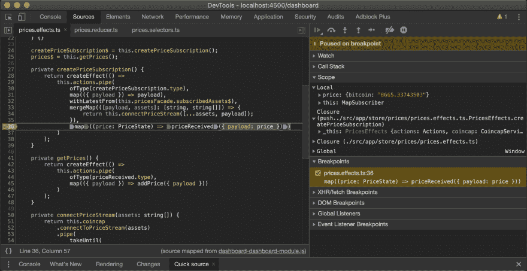 ](https://res.cloudinary.com/practicaldev/image/fetch/s--ae9Ltd_5--/c_limit%2Cf_auto%2Cfl_progressive%2Cq_auto%2Cw_880/https://cdn-images-1.medium.com/max/4324/1%2Aj56_-6hTF4z6pXWVC9TwnQ.png) *分析当前范围*

在下图中，一旦函数`priceReceived`被执行，我们的第三个断点就会被命中。

正如您在右侧面板中看到的，返回值将向我们显示匿名函数返回的内容

[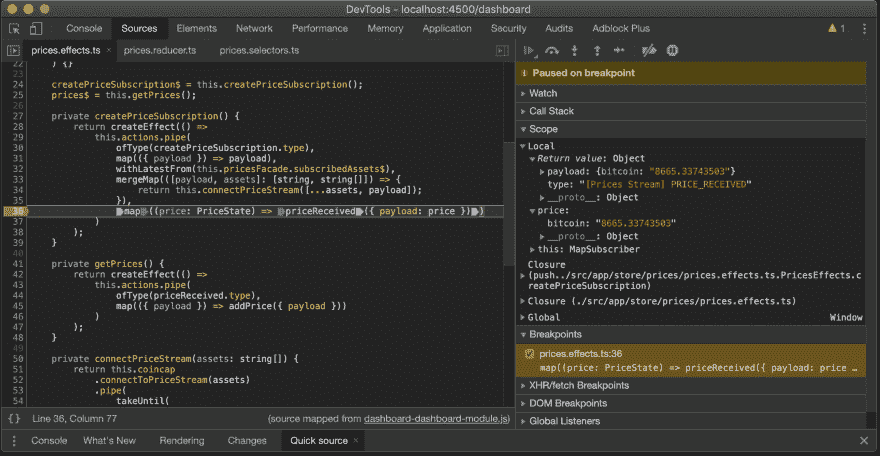 ](https://res.cloudinary.com/practicaldev/image/fetch/s--MZlJc3t0--/c_limit%2Cf_auto%2Cfl_progressive%2Cq_auto%2Cw_880/https://cdn-images-1.medium.com/max/4334/1%2Askx3u3zsEm3-VF338jG2Xw.png) *分析匿名函数的返回值*

### 暂时暂停断点

**场景**:你在整个代码库中设置了一堆断点。

您可能已经体验过，在调试时多次刷新页面是非常常见的。

您当前正在调试的代码可能有各种断点，有时，这些断点甚至会被调用数百次！是的，这可能会令人沮丧和耗时。

在这种情况下，我建议暂时暂停所有断点的执行，您可以通过切换下图中的图标来做到这一点:

[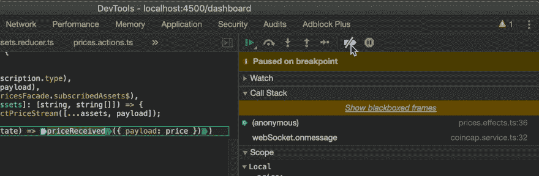 ](https://res.cloudinary.com/practicaldev/image/fetch/s--L-Km3WK---/c_limit%2Cf_auto%2Cfl_progressive%2Cq_66%2Cw_880/https://cdn-images-1.medium.com/max/3188/1%2AcnRKMhzmOptgjm0v6ey8-Q.gif) *停用所有断点*

### 出错时停止执行

**场景**:您得到一个意外的错误，但是您不想设置断点，因为您不确定错误将在何时抛出。

您可以在抛出错误时立即停止执行，这样您就可以检查范围并了解哪里出错了。

[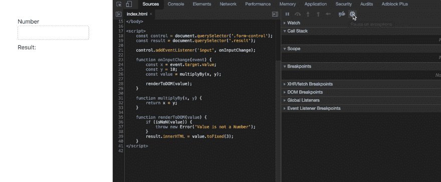 ](https://res.cloudinary.com/practicaldev/image/fetch/s--BIgUT4eR--/c_limit%2Cf_auto%2Cfl_progressive%2Cq_66%2Cw_880/https://cdn-images-1.medium.com/max/4780/1%2A6B4Uvz3g4sZpqlnUWDEBpw.gif) *暂停于异常*

### 条件断点

条件断点，顾名思义，只允许我们在条件为真时触发某些断点。

例如，在上面所示的例子中，用户可以在文本区域输入非数字值。JS 非常宽容，只会显示 NaN，而不会抛出错误。

**场景**:你有比上面那个更复杂的代码，想不出结果什么时候是 NaN。

当然，您可以设置一个断点，但是重现错误并不容易，而且您最终会花费半个小时来逐步执行您的代码。在这种情况下，您可以使用条件断点，仅当检查的值为 NaN 时才中断执行。

请参见下图:

[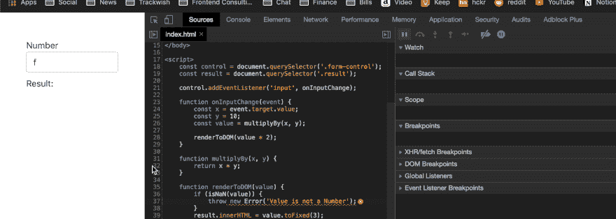 ](https://res.cloudinary.com/practicaldev/image/fetch/s--9wm6kM2G--/c_limit%2Cf_auto%2Cfl_progressive%2Cq_66%2Cw_880/https://cdn-images-1.medium.com/max/4504/1%2Ae-pc-wpZexL8tknq9wunLg.gif) *条件断点*

*   我们右键单击想要添加断点的代码行

*   点击“添加条件断点…”

*   添加有效的 JS 表达式。当然，当表达式被调用时，你可以访问作用域，这意味着我们可以引用参数 x 和 y

*   当表达式为真时，断点将被触发！

### 单步执行您的代码

为了充分利用开发工具，值得花一点时间，了解开发工具如何帮助我们快速遍历代码，而无需在每一行设置断点。

*   开发工具中最简单的导航器，允许你根据执行顺序一行一行的浏览你的代码。需要注意的是，由于将**步骤更改为下一个函数调用**，最近引入了**步骤**。调试异步代码时，*步骤*将按时间顺序移动到下一行

[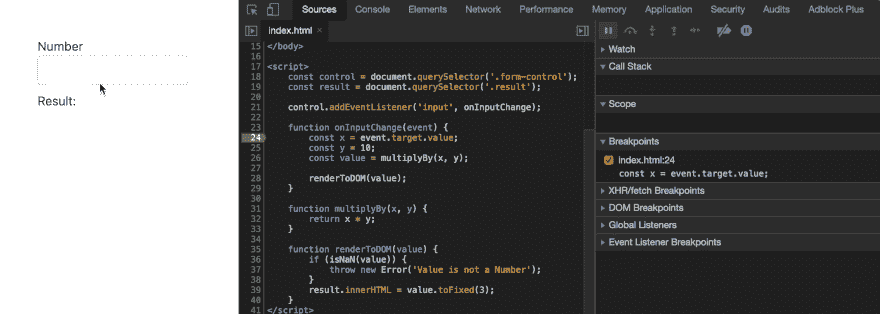](https://res.cloudinary.com/practicaldev/image/fetch/s--z53_T0yb--/c_limit%2Cf_auto%2Cfl_progressive%2Cq_66%2Cw_880/https://cdn-images-1.medium.com/max/4504/1%2AlnLSkTfTPgoZnH09TzPOJQ.gif)T3】步

*   **单步执行下一个函数调用**这个导航器允许你一行一行地单步执行，而不需要单步执行函数调用。也就是说，函数调用将被单步执行，除非在其中设置了断点，否则调试器不会在该函数的语句中停止

[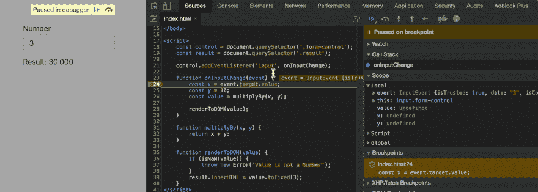 ](https://res.cloudinary.com/practicaldev/image/fetch/s--cs4KbzyF--/c_limit%2Cf_auto%2Cfl_progressive%2Cq_66%2Cw_880/https://cdn-images-1.medium.com/max/4504/1%2Ao8BEBvXjLJ2I5pATcWUWkw.gif) *下一步功能调用*

如果你注意上图，multiplyBy 和 renderToDOM 被执行了，但是调试器没有像之前的导航器那样进入它们(**步骤**)。

*   **进入下一个函数调用**从 Chrome 68 开始，这个导航器就改变了行为。这类似于我们之前看到的步骤。不同之处在于，当单步执行异步代码时，它将在异步代码中停止，而不是在按时间顺序运行的代码上停止。

[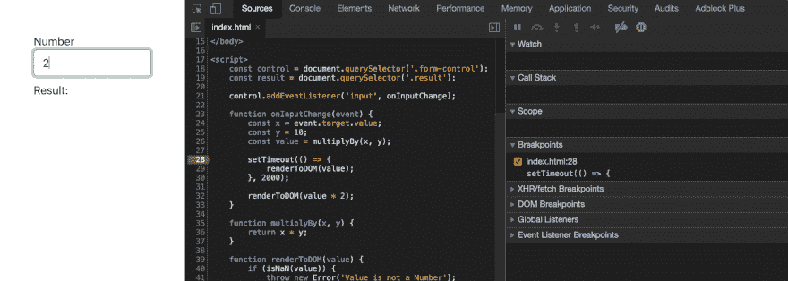 ](https://res.cloudinary.com/practicaldev/image/fetch/s--JfTj-Vt8--/c_limit%2Cf_auto%2Cfl_progressive%2Cq_66%2Cw_880/https://cdn-images-1.medium.com/max/4504/1%2AhQVAtoo06qMSQDlUCd-1DQ.gif) *进入下一步功能调用*

观察上面的图像:按时间顺序，第 32 行应该运行，但它没有运行。调试器等待并在 2 秒钟后移到第 29 行

*   * *跳出函数调用** 假设您对某个函数的执行不感兴趣，这个导航器允许您跳出函数，并会在函数调用后的下一行停止

[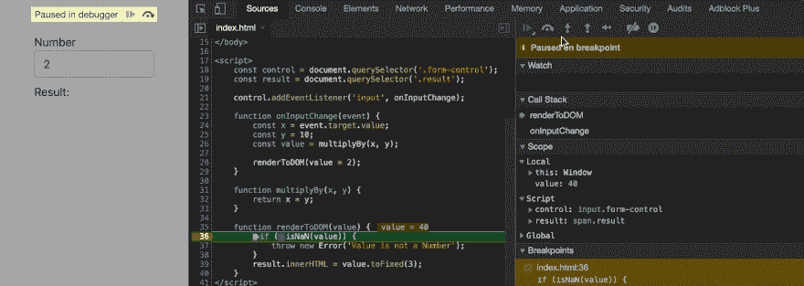 ](https://res.cloudinary.com/practicaldev/image/fetch/s--o_gbcQq5--/c_limit%2Cf_auto%2Cfl_progressive%2Cq_66%2Cw_880/https://cdn-images-1.medium.com/max/4508/1%2AbLRfIxnKbcz6-tikZi06Vw.gif) *步出函数调用*

上图发生了什么？

*   我们停在第 36 行的断点处

*   我们跳出了 renderToDOM 函数

*   调试器直接移到第 29 行，跳过了 renderToDOM 函数的其余部分

### 全局变量和急切的评价

有时，在全局范围内存储一些值会很有用，比如组件的类、大型数组或复杂对象。

在调试时将这些值添加到全局范围可以节省大量时间，例如，当您想用不同的参数调用该组件上的方法时。

[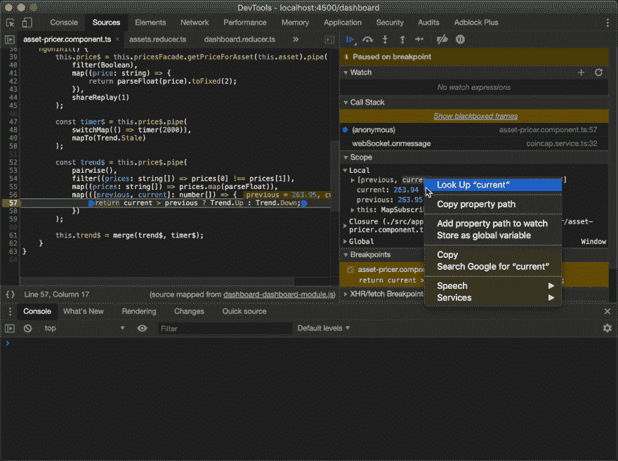 ](https://res.cloudinary.com/practicaldev/image/fetch/s--VRZ-XA3L--/c_limit%2Cf_auto%2Cfl_progressive%2Cq_66%2Cw_880/https://cdn-images-1.medium.com/max/3964/1%2AdatD6XsMhv__QA0eF2HjeA.gif) *从当前作用域设置一个全局变量*

在上图中，我将数组[previous，current]保存为一个全局变量。Dev 工具自动为变量指定一个名称，这个名称是 temp { n }, n 是基于先前保存的变量的数量。

正如你在上面的图片中看到的，变量被命名为 temp2，我可以在控制台中使用它，因为它现在是全局定义的！

由于**急切的评估，* * Chrome 68 中发布的一项功能*** *开发工具允许在编写语句时在控制台中评估语句，并显示方法的签名。

如果你注意上面的图片，当我将保存的变量映射到一个字符串数组时，不用按 Enter 键就可以立即看到结果。

## 导航调用堆栈

导航调用堆栈是开发工具提供的最有用的工具之一:您不仅可以在调用堆栈中来回跳转，还可以检查每一步的范围。

假设我们有一个非常简单的页面和一个脚本，它接受一个数字的输入，并将这个数字乘以 10 呈现在页面上。我们将调用两个函数:一个用于乘法，一个用于将结果呈现给 DOM。

[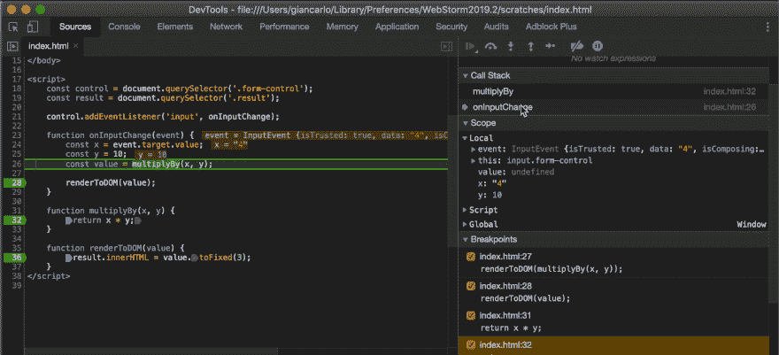 ](https://res.cloudinary.com/practicaldev/image/fetch/s--A29BRojU--/c_limit%2Cf_auto%2Cfl_progressive%2Cq_66%2Cw_880/https://cdn-images-1.medium.com/max/4328/1%2ASfNyMZRGB83s0lTWgEsk0A.gif) *通过调用堆栈导航*

如上图所示，我们只需点击“调用堆栈”窗格中的函数名称，就可以在调用堆栈中导航。

您可能也注意到了，每次我们从一个调用跳到另一个调用时，范围都会保留下来，我们可以在每一步对其进行分析！

### 黑盒脚本展平堆栈

通过从堆栈中排除某些脚本或匹配某种模式的脚本，黑盒脚本将有助于清理调用堆栈。

例如，如果我只对调试 userland 代码感兴趣(这种情况可能占 99%),我会添加一个模式来将 node_modules 文件夹下的所有脚本隐藏起来。

为了将脚本黑盒化，您有两种方法:

*   右键单击源代码面板中的脚本，然后单击“黑盒脚本”

*   进入 Chrome 设置页面，然后进入*黑盒*并点击*添加模式…*并输入你想要黑盒的模式，这在你想要排除大量脚本时很有用

[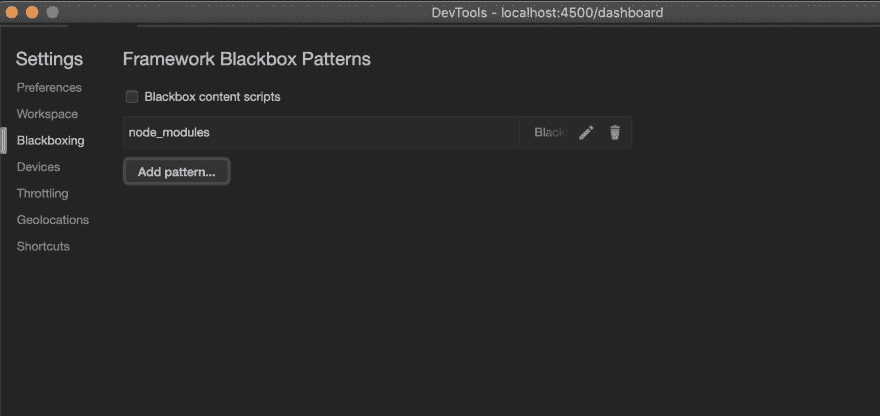 ](https://res.cloudinary.com/practicaldev/image/fetch/s--3OqhwgJq--/c_limit%2Cf_auto%2Cfl_progressive%2Cq_auto%2Cw_880/https://cdn-images-1.medium.com/max/3454/1%2AWgmPn7FqR0xFzdB9kPg1_Q.png) *将 node_modules 文件夹黑盒化*

## 观看表情

观察表达式使您能够定义一些 Javascript 表达式，开发工具将跟踪和执行这些表达式，并显示当前结果。这是一个特别有趣的工具，因为只要是有效的 Javascript 表达式，你几乎可以写任何你想写的东西。

例如，您可以编写一个表达式，并期望该表达式的结果始终为真，这样当表达式为假时，您就知道当前状态有问题。

有一个条件:

*   当我们使用断点进行调试时，观察表达式将被实时计算，不需要刷新

*   如果代码正在执行，您将需要手动单击刷新按钮

[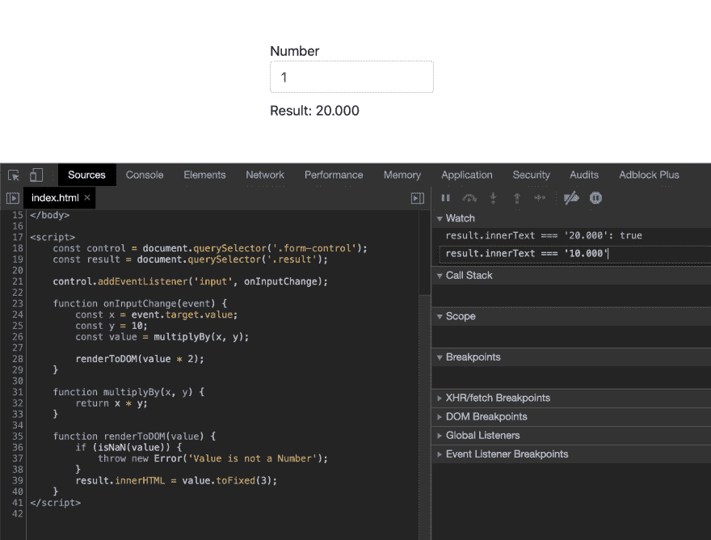T2】](https://res.cloudinary.com/practicaldev/image/fetch/s--4ERJHzvv--/c_limit%2Cf_auto%2Cfl_progressive%2Cq_auto%2Cw_880/https://cdn-images-1.medium.com/max/3344/1%2AvmDDbDAGSlmXnCP4zGg7GA.png)

## 最后的话

开发工具是调试复杂代码的不可思议的资源。有时，您可能会比控制台日志记录更深入，上面的工具将允许深入的调试体验。这些工具需要一些实践，然后你才能完全熟练地使用它们，所以如果你对所有可用的选项感到不熟悉，不要灰心丧气。

### 资源

以下是一些资源，可以帮助您全面理解开发工具提供的所有可用选项:

*   [开始在 Chrome DevTools 中调试 JavaScript](https://developers.google.com/web/tools/chrome-devtools/javascript/)

*   [控制台概述](https://developers.google.com/web/tools/chrome-devtools/console/)

如果您需要任何澄清，或者如果您认为有些事情不清楚或错误，请留下评论！

*如果你喜欢这篇文章，请在 [Medium](https://medium.com/@.gc) 或 [Twitter](https://twitter.com/home) 上关注我，获取更多关于 Javascript、RxJS、Typescript 等的[文章](https://frontend.consulting/)！*