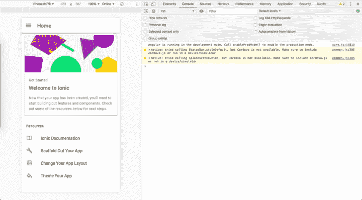
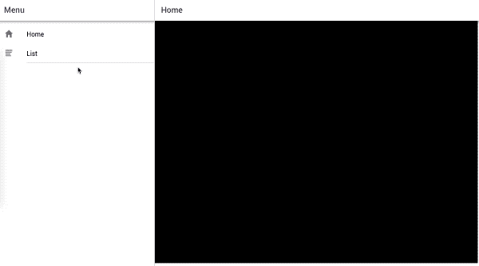
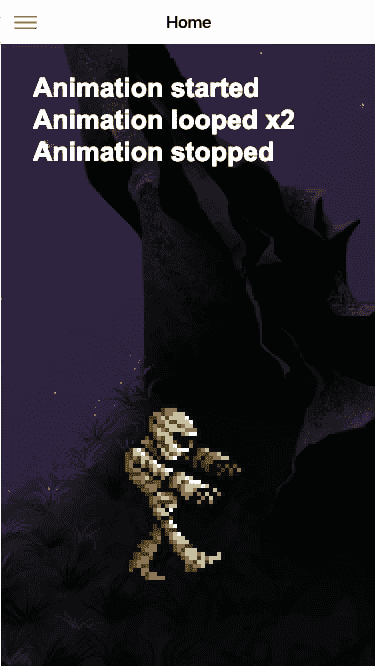
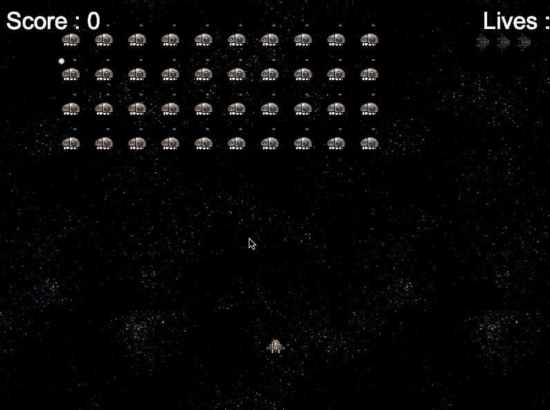

# 如何用 Ionic 4 和 Phaser 创建手机游戏& PWA

> 原文:[https://dev . to/ENA PPD/how-to-create-mobile-games-pwa-with-ionic-4 and-phaser-33k 9](https://dev.to/enappd/how-to-create-mobile-games-pwa-with-ionic-4-and-phaser-33k9)

* * *

> **你可以在** [**离子 4 相位器启动器**](https://store.enappd.com/product/ionic-phaser-game-framework-ionic-4/) 中找到完整的代码

Ionic 平台近年来已经成为 app 开发领域的大腕之一。在过去的几年里，从 Ionic 1 到 4，Ionic 不仅变得流行，而且还提高了它的健壮性和可靠性。今天，Ionic framework 是最容易制作 android 或 iOS 应用程序的框架之一，也是最先进的网络应用程序。🚀

Phaser 于 2013 年首次发布，现在已经成为 2D HTML5 游戏中的一个巨大的名字。基于 javascript，它可以很容易地集成到各种 javascript 框架中。👾 👾 👾

那么为什么要集成 Phaser 和 Ionic 呢？🚀 👾

虽然 Ionic 让你能够以闪电般的速度创建应用程序和 PWA，但你无法用它真正制作游戏。Phaser 虽然在游戏构建方面很棒，但并不是真的要构建一个结构化的移动或网络应用。因此，用 Phaser 构建一个外观简洁的游戏应用或 PWA 需要一个 HTML + CSS 包装器，Ionic 完美地填补了这个空白。


<figure>

<figcaption class="imageCaption">Ionic and Phaser be like ….</figcaption>

</figure>

### **第一步:创建一个 Ionic 4 应用**

首先确保你已经安装了最新的离子

```
npm install -g ionic
```

安装了 Ionic CLI 后，创建一个简单的 Ionic 应用程序

```
ionic start ioniser sidemenu
```

我选择了`sidemenu`作为布局选项，但是你也可以使用`blank`或者`tabs`。这个命令将生成一个基本的 Ionic 应用程序，在主页中有一个`sidemenu`和一些基本的 HTML。使用提供您的应用程序

```
ionic serve
```

并检查一切运行正常。对我来说，它看起来像以下



### **步骤 2:将 Phaser 包含在项目中**

Phaser 非常容易包含在项目中。本质上，它只是一个需要包含在 HTML5 项目中的 Javascript 文件。有两种方法可以做到

***# 1——酷的“一蹴而就”的方式(更快)***

从 [Phaser 官方下载](https://phaser.io/download/stable)下载`*phaser.min.js*`，并将其与您的项目链接。出于演示的目的，我将把这个文件保存在`assets`文件夹中，但是你也可以从 CDN 链接它。

将 phaser.js 文件包含在`index.html`文件中，如下所示

```
<script src="assets/phaser.min.js"></script>
```

现在，您可以使用以下命令将 phaser 包含在组件`.ts`文件中

```
declare var Phaser;
```

(为了检查`Phaser`包含了什么，试着安慰一下保存在`this`中的变量或它的`defaultState`，你就会对 Phaser 的构建有所了解。)

***# 2——复杂的“我是一个编码狂”方式***

从 phaser 下载 npm 包

```
npm install phaser-ce
```

准备 **webpack** 来编译 phaser 包，这样你就可以在。ts 文件。您可能需要为此准备自己的 webpack-config 并安装额外的模块。此后，您可以将变量导入为

```
import "pixi";
import "p2";
import * as Phaser from "phaser-ce";
```

详情见[这里](https://github.com/photonstorm/phaser-ce#browserify--cjs)(在写这篇博客的时候，我还没有尝试过这种方法)

### **步骤 3:实现相位器游戏**

> **你可以在** [**离子 4 相位器启动器**](https://store.enappd.com/product/ionic-phaser-game-framework-ionic-4/) 中找到完整的代码

出于示例目的，我们将使用一个简单的[相位器示例](https://phaser.io/examples/v2/animation/animation-events)，我们将制作一个**僵尸**行走。

不，不，不是那个僵尸。😆

我们将重点关注启动器附带的`home`组件。所以所有相关的 javascript 代码都将放在`home.page.ts`文件中。用以下内容替换`home.page.html`文件中的全部内容

```
<ion-content>
  <div id="phaser-example"></div>
</ion-content>
```

我们将在 javascript 逻辑中标识`phaser-example`,并在这个 div 中实例化游戏。

一个基本的 Phaser 游戏有三个默认函数——preload()、create()和 update()

**>预加载**——顾名思义，预加载资产等。在我们的例子中，这个函数将加载僵尸和背景图像。

```
preload() {
```

```
this.game.load.image('lazur', 'assets/thorn_lazur.png');
```

```
this.game.load.spritesheet('mummy', 'assets/metalslug_mummy37x45.png', 37, 45, 18);
```

```
}
```

**>创建** —创建游戏实例并加载游戏状态。在我们的游戏中，这个函数将设置场景中的图像。我们还将在这里创建和设置动画监听器。

```
create() {
```

```
// Set background
```

```
this.back = this.game.add.image(0, -400, 'lazur');
```

```
this.back.scale.set(2);
```

```
this.back.smoothed = false;
```

```
// Set mummy from a sprite
```

```
this.mummy = this.game.add.sprite(200, 360, 'mummy', 5);
```

```
this.mummy.scale.set(4);
```

```
this.mummy.smoothed = false;
```

```
// Set mummy animation
```

```
this.anim = this.mummy.animations.add('walk');
```

```
this.anim.onStart.add(that.animationStarted, this);
```

```
this.anim.onLoop.add(that.animationLooped, this);
```

```
this.anim.onComplete.add(that.animationStopped, this);
```

```
this.anim.play(10, true);
```

```
}
```

**>更新** —更新循环、动作、物理交互等游戏状态。对于我们的游戏，这将通过移动背景来更新动画，以创建“行走”的效果

```
update() {if (this.anim.isPlaying) { this.back.x -= 1;}}
```

还有 Tada！！！🎉 🎉🎉我们在*发球*窗口运行我们的游戏



<figure>

<figcaption class="imageCaption">Woohoo ! It’s …… alive</figcaption>

</figure>

同样，你可以用 Ionic 运行任何相位器游戏。相信我，Phaser 中有一些看起来不可思议的[游戏。不久前，我们制作了一个马里奥复制品，我将在另一篇博文中分享。](https://phaser.io/examples)

 **Phaser 的实现可能会让您与`this`的实现混淆。简而言之，一旦相位器场景被初始化，`this`就包含了默认的游戏状态。作为一名 Ionic 开发人员，或者如果您遵循 Ionic 文档，您将使用`this`来引用组件的类。所以你最终使用了冲突的`this`。为了快速解决这个问题，我将离子`this`分配给另一个变量`that`(😅)然后用它指向类函数。

常见的错误是声明`that = this`。是的，它确实通过`that`引用了`this`，但是一旦`this`改变，`that`也会改变，因此这样做没有意义。你可以做`that = Object.assign({},this)`，这是一个很好的标准代码。但是你会发现，这也不会导致我们想要的结果。因为 Ionic 中的`this`包含了`_prototype`中的类函数，要将这些函数复制到`that`中，您应该这样定义它

```
that = Object.create(this.constructor.prototype);
```

然后用`that`代替`this`来调用函数

例如`that.animationStarted`指向一个函数`animationStarted`。在这里使用`this`会抛出一个错误，因为`create()`函数是一个相位器默认值，并且在`this`中包含场景的默认状态

如果你对`this`的概念感到不舒服，你应该在这里阅读更多关于它的[。](https://code.tutsplus.com/tutorials/fully-understanding-the-codethiscode-keyword--net-21117)

(作为另一个变通办法，您可以将完整的 javascript 代码放在 Ionic 的类实现之外，甚至更糟，放在`index.html`的`<script></script>`标签中，但这太麻烦了。你将无法用这种方式编写庞大的游戏代码)

### **第四步:将游戏构建成一个渐进式网络应用**

让游戏在你的`ionic serve`窗口中运行令人印象深刻，但是如果你能在你自己的域中发布它会更酷。爱奥尼亚支持你。

通过运行以下命令为 PWA 部署准备应用程序

```
ng add @angular/pwa
```

`@angular/pwa`包会自动向应用程序添加一个服务人员和一个应用程序清单。那就跑

```
ionic build --prod
```

创建应用程序的发布版本。现在你的应用程序包含了一个可以在任何服务器上提供的`index.html`文件。最快的方法是在 firebase 主机上部署，方法是安装 firebase 工具，并使用`firebase deploy` ( [细节在此](https://firebase.google.com/docs/hosting/deploying))在 firebase 项目上部署游戏

🎉🎉🎉瞧啊。！你自己的游戏已经在你的网站上发布了🎉🎉🎉

### **第五步:将游戏制作成手机应用**

使用 Phaser 构建 Ionic 应用程序与构建常规 Ionic 应用程序完全相同。对于那些不熟悉 Ionic 4 中的过程的人，首先添加你想要在其上运行应用的平台

```
ionic cordova platform add android
```

然后通过运行以下命令在连接的设备或模拟器上运行应用程序

```
ionic cordova run android
```

您可能希望使用`window.innerWidth`和`window.innerHeight`根据设备尺寸调整`canvas`的尺寸。有了这个，你可以为所有的移动设备尺寸调整游戏画布。



<figure>

<figcaption class="imageCaption">Got yourself a mobile game</figcaption>

</figure>

经过这些调整，游戏看起来如上。不错吧。👻

酷的是，你仍然可以像移动应用程序一样拥有**侧菜单**或**标签**，并在游戏中加入应用程序的所有常规功能(反之亦然)，如登录、注册等。利用离子插件。

想在爱奥尼亚制作自己的 PUBG 或太空入侵者游戏吗？[试试做这个](https://phaser.io/tutorials/coding-tips-007)

### **结论**

Ionic 在制作移动应用程序方面速度超快，而 Phaser 则非常适合制作 2D HTML5 游戏。跟着这个博客把这两个结合起来，做一个快速的手机游戏 app 或者游戏 PWA。通过使用 Ionic 强大的插件来丰富游戏功能。玩得开心！

> 我们定期在 **Enappd** 做更多这样有趣的事情。请随意浏览我们的[有趣的应用程序启动器](http://enappd.com)。

### 更新

**太空入侵者**游戏现在包含在同一回购的`space-invaders`分支中。这是它看起来的样子



<figure>

<figcaption class="imageCaption">Space Invaders in Ionic + Phaser</figcaption>

</figure>

### 觉得这个帖子有意思？

还可以看看我们的其他博客文章，包括与 Ionic 4 中的[Firebase](https://medium.com/enappd/how-to-use-firebase-with-ionic-4-complete-guide-for-beginners-1888b1034024)、Ionic 4 中的[地理定位](https://medium.com/enappd/using-geolocation-and-beacon-plugins-in-ionic-4-754b41304007)、Ionic 4 中的[二维码和扫描仪](https://medium.com/enappd/qr-code-scanning-and-optical-character-recognition-ocr-in-ionic-4-95fd46be91dd)以及 Ionic 4 中的[支付网关](https://medium.com/enappd/payment-solutions-in-ionic-8c4bb28ce5cc)

### 需要免费离子 4 启动器？

你也可以在我们的网站[enappd.com](http://enappd.com)找到免费的离子 4 启动器

*   【Ionic 4 的免费聊天主题启动器
*   [游离离子 4 —燃烧基启动器](https://store.enappd.com/product/ionic4-firebase-starter/)

你也可以使用 [Ionic 4 完整版应用](https://store.enappd.com/product/ionic-4-full-app/)制作你的下一个精彩应用

### 参考

*   [离子文件](https://ionicframework.com/docs)**