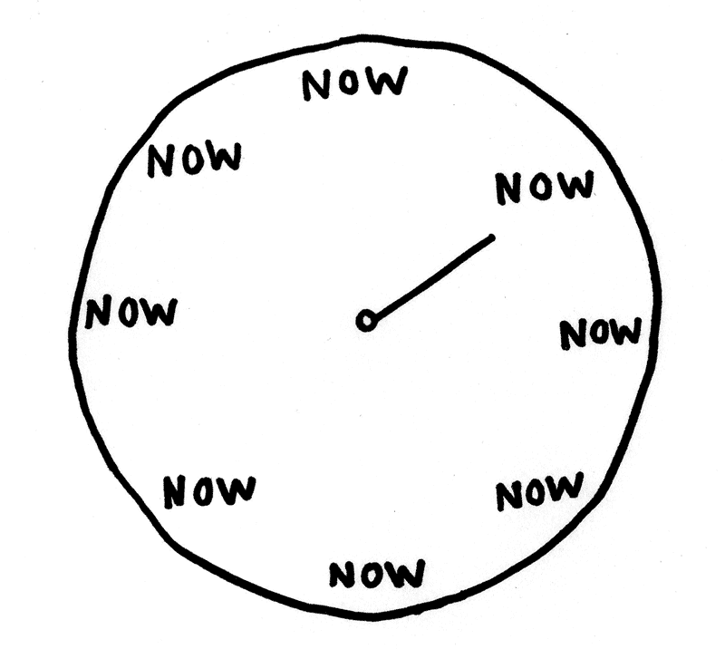

# Entendendo JavaScript:承诺

> 原文:[https://dev . to/Julio bguedes/entendendo-JavaScript-promises-4hep](https://dev.to/juliobguedes/entendendo-javascript-promises-4hep)

在 JavaScript 编程开始时，事情通常都很顺利:很容易理解语言语法，并吸收其他常用语言，如 Python 和 Java。当我们深入了解 JavaScript 实现的可能性时，每个初学者都会看到“pap 蠕虫:Promises”。

[T2】](https://i.giphy.com/media/gh6emBSF3auzxzQamc/giphy.gif)

但是，虽然诺言看起来很可怕，但在编程 JavaScript 的同时却是必不可少的，而且只要稍加练习，它们就会成为例行公事。在此文章中，我们将讨论承诺的内容，以及如何使用它们，以及每异步/await 增加一个。

## [](#antes-de-tudo-ass%C3%ADncrono)首先，异步

与 Python 和 Java 等其他一些语言不同，JavaScript 允许异步编程方式**，也就是说，函数的代码行可能不会一次执行一行:第 1、2 和 3 行不能保证第 4 行是单独执行的**

 **[T2】](https://i.giphy.com/media/tn8zWeNYA73G0/source.gif)

## [](#fetch)取

在本教程的剩馀部分中，我们将使用“`fetch`”作为示例的基础。fetch API 现在是 JavaScript 中的原生 API，它使我们能够在不使用外部 libs 的情况下执行 HTTP 请求。简而言之，请求是指来自服务器、API 或其他来源以外的来源的信息请求，而“`fetch`”则是我们在代码中请求此类信息的功能。

除了`fetch`之外，还有 libs 允许进行 HTTP 请求，社区中的一个强有力的例子是[公理](https://github.com/axios/axios/)。某些框架(如 Angular.js)具有允许您进行这些请求的内部函数(对于 Angular.js，则为“[$ http](https://docs.angularjs.org/api/ng/service/%24http)”)。

## O que sàO 承诺？

现在你答应了。如前一届会议所述，请购单从外部来源寻求资料。但是，名称*fetch*并不是随机选择的:从外部来源请求信息就像扔球给狗去接──在英语中， *go fetch* 是用来代替**catch**

[T2】](https://i.giphy.com/media/klPeFHrWqzPDW/giphy.gif)

但是，JavaScript 是异步的:如果第 3 行过长，如何阻止第 4 行运行？在这种情况下产生承诺:在我们的代码中，承诺(葡萄牙语中的承诺)用于防止第 4 行在第 3 行之前运行，因为在第 4 行之前需要从第 3 行获取信息。承诺的基本语义是`do this ... then do that`——`faça isso ... depois faça aquilo`。

不幸的是，和现实生活一样，并非所有的诺言都兑现了，我们必须警惕这种情况。在这种情况下，语义稍微让人联想到 Java 的‘t0’:如果无法检索信息或‘t1’的代码有错误，我们陷入了‘T2’。

[](https://res.cloudinary.com/practicaldev/image/fetch/s--6syuOMWC--/c_limit%2Cf_auto%2Cfl_progressive%2Cq_auto%2Cw_880/https://boygeniusreport.files.wordpress.com/2016/11/obama-trump-finger-cross-photoshop.jpg%3Fquality%3D98%26strip%3Dall) 

<figure>

<figcaption>奥巴马交叉手指:承诺也可能被打破！免责声明:这张照片是一张拼贴画</figcaption>

</figure>

即使我们的“`then`”内的代码不会导致错误，服务器引发的错误和通信错误也需要处理，例如:当您正在查找信息的外部服务未联机时，我们的请求会生成“*超时“*”错误如果在提出申请时我们没有连接到互联网，我们的申请会产生“*网络*”的错误。像这样的细节需要处理，这往往使承诺变成敏感的东西。

## [](#exemplos-de-promise)免除诺言

为了举例说明，我们的对外服务将是[open evufcg](https://github.com/OpenDevUFCG)的湖。

当我们向湖申请**【get】**时，他必须还给我们`{"status":"running"}`。因此，通过提取，让我们看一下作出这一请求所需的代码:

```
const url = 'https://laguinho.opendevufcg.org/';
const resposta = fetch(url);
console.log('Resposta:', resposta); 
```

<svg width="20px" height="20px" viewBox="0 0 24 24" class="highlight-action crayons-icon highlight-action--fullscreen-on"><title>Enter fullscreen mode</title></svg> <svg width="20px" height="20px" viewBox="0 0 24 24" class="highlight-action crayons-icon highlight-action--fullscreen-off"><title>Exit fullscreen mode</title></svg>

执行上述程式码时，`console.log`会传回类型为`Promise`的物件，而不是状态为的物件，这应该是传回。我们将承诺语义应用于代码:

```
const url = 'https://laguinho.opendevufcg.org/';
fetch(url).then((resposta) => {
  console.log('Resposta:', resposta);
}); 
```

<svg width="20px" height="20px" viewBox="0 0 24 24" class="highlight-action crayons-icon highlight-action--fullscreen-on"><title>Enter fullscreen mode</title></svg> <svg width="20px" height="20px" viewBox="0 0 24 24" class="highlight-action crayons-icon highlight-action--fullscreen-off"><title>Exit fullscreen mode</title></svg>

然后我们有一个类似`Response`的物体，从中可以获得外部服务给出的响应数据。由于池塘在 JSON 中将对象返回给我们，因此我们将在响应中应用“`json`”函数以获取数据。注意`json`功能也是承诺。

```
const url = 'https://laguinho.opendevufcg.org/';
fetch(url).then((resposta) => {
  console.log('Resposta:', resposta);
  resposta.json().then((respostaDoServidor) => {
    console.log('Resposta do Servidor:', respostaDoServidor);
  });
}); 
```

<svg width="20px" height="20px" viewBox="0 0 24 24" class="highlight-action crayons-icon highlight-action--fullscreen-on"><title>Enter fullscreen mode</title></svg> <svg width="20px" height="20px" viewBox="0 0 24 24" class="highlight-action crayons-icon highlight-action--fullscreen-off"><title>Exit fullscreen mode</title></svg>

到目前为止，我们所有的案子都成功了。但如果我们写错了 url 呢？由于在我们交换字母的 url(例如)中可能没有使用 JSON 进行通信的服务器，因此请求将失败。在这种情况下，我们需要一个 catch 语句，以防止抛出异常，并且我们可以相应地处理。让我们看看:

```
const url = 'https://laguinoh.opendevufcg.org/';
fetch(url).then((resposta) => {
  console.log('Resposta:', resposta);
  resposta.json().then((respostaDoServidor) => {
    console.log('Resposta do Servidor:', respostaDoServidor);
  });
}).catch((erro) => {
  console.log('Aconteceu um erro durante a requisição:', erro);
}); 
```

<svg width="20px" height="20px" viewBox="0 0 24 24" class="highlight-action crayons-icon highlight-action--fullscreen-on"><title>Enter fullscreen mode</title></svg> <svg width="20px" height="20px" viewBox="0 0 24 24" class="highlight-action crayons-icon highlight-action--fullscreen-off"><title>Exit fullscreen mode</title></svg>

现在，您可能已经了解他们承诺了什么，他们如何出现在您的代码中，以及如何处理它们。但就代码可读性而言，还有一个问题:如果相互之间有几个承诺，就很难理解执行流程。让我们看看一种不同的方式来写承诺。

## [](#plus-asyncawait)加:异步/等待

[T2】](https://res.cloudinary.com/practicaldev/image/fetch/s--VpXBn9gC--/c_limit%2Cf_auto%2Cfl_progressive%2Cq_auto%2Cw_880/https://github.com/boyEstrogen/Anime-Girls-Holding-Programming-Books/blob/master/Javascript/Doma_Umaru_Java_Script_The_Good_Parts.png%3Fraw%3Dtrue)

现在我们崇拜他们。Async/await 是一种令人兴奋且相当易读的方法来编写 Promises，因为它不仅不具有动词性，而且不会使代码因流或缩进而无法读取，但您需要将代码封装在函数中。使用 async/await:t0]撰写时，请参阅上述程式码

```
const url = 'https://laguinho.opendevufcg.org/';
const fluxo = async () => {
  try {
    const resposta = await fetch(url);
    const respostaServidor = await resposta.json();
    console.log('resposta do servidor', respostaServidor);
  } catch(erro) {
    console.log('Aconteceu um erro durante a requisição:', erro);
  }
}; 
```

<svg width="20px" height="20px" viewBox="0 0 24 24" class="highlight-action crayons-icon highlight-action--fullscreen-on"><title>Enter fullscreen mode</title></svg> <svg width="20px" height="20px" viewBox="0 0 24 24" class="highlight-action crayons-icon highlight-action--fullscreen-off"><title>Exit fullscreen mode</title></svg>

注意，无论错误发生在哪一行代码中，它总会落入`catch`的块中。如果你不喜欢代码中有块`try/catch`的想法，就知道你不是唯一的一个:我通常用两种风格的组合来写承诺，例如:

```
const url = 'https://laguinho.opendevufcg.org/';
const fluxo = async () => {
  const resposta = await fetch(url).catch((erro) => {
    console.log('Erro no fetch', erro);
  });
  const respostaServidor = await resposta.json().catch((erro) => {
    console.log('Erro no .json', erro);
  });
  console.log('resposta do servidor', respostaServidor);
}; 
```

<svg width="20px" height="20px" viewBox="0 0 24 24" class="highlight-action crayons-icon highlight-action--fullscreen-on"><title>Enter fullscreen mode</title></svg> <svg width="20px" height="20px" viewBox="0 0 24 24" class="highlight-action crayons-icon highlight-action--fullscreen-off"><title>Exit fullscreen mode</title></svg>

Async/Await 越来越受欢迎，但风格并不是每个人都喜欢的:由你决定是否使用:)

## [](#chegamos-ao-fim-desse-post-)我们到了这个岗位的尽头-我...。:(

非常感谢你的阅读，请随意消除任何现存的疑问。如果本教程有用，请查看我的[另一篇帖子](https://dev.to/opendevufcg/testes-em-javascript-conceitos-iniciais-1okj)，介绍 JavaScript 中的测试概念。

如果你想联系，就发一条推特！我请你继续读我的课文，看看我的[培养基](https://medium.com/@Juliobguedes/)。

如果您正在寻找有关葡萄牙语编程的帖子，我建议您看一看[openevufcg](https://dev.to/opendevufcg)的内容。如果你喜欢开源开发，好好欣赏一下 [GitHub](https://github.com/opendevufcg) 也！**