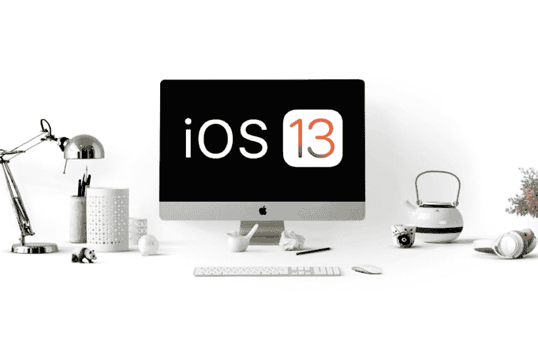

# Xcode 11 和 iOS 13 开发准备好了吗？

> 原文：<https://dev.to/brentonhouse/are-you-ready-for-xcode-11-and-ios-13-development-4h6g>

> 使用 Xcode 11 和 Xcode 10 并行开发成功

<figure>[](https://res.cloudinary.com/practicaldev/image/fetch/s--y-Qhlph8--/c_limit%2Cf_auto%2Cfl_progressive%2Cq_auto%2Cw_880/https://cdn-images-1.medium.com/max/1024/1%2Awx_CqSnA_1hbLMGWGgBQeA.png)

<figcaption>iOS 13 和 Xcode 11 开发准备好了吗？</figcaption>

</figure>

随着 iOS 13 的发布，很多开发者会希望将 Xcode 11 与 Xcode 10 同时安装。这允许您继续在 iOS 12.x 模拟器上测试您的应用程序，以及在新的 iOS 13.x 模拟器上测试它们。

### 安装 Xcode 11

1.  为此，你需要从苹果的开发者网站下载 Xcode 11:[https://developer.apple.com/download/more/](https://developer.apple.com/download/more/)
2.  将现有的版本 10 Xcode.app(在您的应用程序目录中)重命名为 Xcode10.app。现在将新下载的版本 11 Xcode.app 移到您的应用程序目录中。
3.  下载并安装 Xcode 11 的命令行工具(也可以在苹果开发者网站上找到:[https://developer.apple.com/download/more/](https://developer.apple.com/download/more/)
4.  打开 Xcode 的两个不同版本，确定它们都不需要任何其他设置。成功打开后，您可以关闭它们。

### 下载安装 Titanium SDK 8.2.0.GA

如果您使用 appcelerator CLI 工具，请打开终端并执行此命令:

```
appc ti sdk install 8.2.0.GA 
```

<svg width="20px" height="20px" viewBox="0 0 24 24" class="highlight-action crayons-icon highlight-action--fullscreen-on"><title>Enter fullscreen mode</title></svg> <svg width="20px" height="20px" viewBox="0 0 24 24" class="highlight-action crayons-icon highlight-action--fullscreen-off"><title>Exit fullscreen mode</title></svg>

或者这个命令，如果你使用的是开源的 Titanium CLI 工具:

```
ti sdk install 8.2.0.GA 
```

<svg width="20px" height="20px" viewBox="0 0 24 24" class="highlight-action crayons-icon highlight-action--fullscreen-on"><title>Enter fullscreen mode</title></svg> <svg width="20px" height="20px" viewBox="0 0 24 24" class="highlight-action crayons-icon highlight-action--fullscreen-off"><title>Exit fullscreen mode</title></svg>

这样，您现在可以在 tiapp.xml 文件中使用以下语法安装它:

```
<sdk-version>8.2.0.GA</sdk-version> 
```

<svg width="20px" height="20px" viewBox="0 0 24 24" class="highlight-action crayons-icon highlight-action--fullscreen-on"><title>Enter fullscreen mode</title></svg> <svg width="20px" height="20px" viewBox="0 0 24 24" class="highlight-action crayons-icon highlight-action--fullscreen-off"><title>Exit fullscreen mode</title></svg>

### 使用不同版本的 SDK 和 Xcode 构建您的应用

> *以下章节描述了作为开发人员您可能想要运行的不同目标场景*

#### 目标来自 SDK 8.2.x 的 iOS 13.x 模拟器

*如果您还没有将 Xcode 11 选为活动状态，您将需要运行以下命令:*

```
sudo xcode-select --switch /Applications/Xcode.app/Contents/Developer 
```

<svg width="20px" height="20px" viewBox="0 0 24 24" class="highlight-action crayons-icon highlight-action--fullscreen-on"><title>Enter fullscreen mode</title></svg> <svg width="20px" height="20px" viewBox="0 0 24 24" class="highlight-action crayons-icon highlight-action--fullscreen-off"><title>Exit fullscreen mode</title></svg>

确保在 tiapp.xml 中选择了 8.2 . x SDK

```
<sdk-version>8.2.0.GA</sdk-version> 
```

<svg width="20px" height="20px" viewBox="0 0 24 24" class="highlight-action crayons-icon highlight-action--fullscreen-on"><title>Enter fullscreen mode</title></svg> <svg width="20px" height="20px" viewBox="0 0 24 24" class="highlight-action crayons-icon highlight-action--fullscreen-off"><title>Exit fullscreen mode</title></svg>

现在，您可以从您的 Titanium 项目的根目录运行它:

```
ti build --platform ios 
```

<svg width="20px" height="20px" viewBox="0 0 24 24" class="highlight-action crayons-icon highlight-action--fullscreen-on"><title>Enter fullscreen mode</title></svg> <svg width="20px" height="20px" viewBox="0 0 24 24" class="highlight-action crayons-icon highlight-action--fullscreen-off"><title>Exit fullscreen mode</title></svg>

或者

```
appc run --platform ios 
```

<svg width="20px" height="20px" viewBox="0 0 24 24" class="highlight-action crayons-icon highlight-action--fullscreen-on"><title>Enter fullscreen mode</title></svg> <svg width="20px" height="20px" viewBox="0 0 24 24" class="highlight-action crayons-icon highlight-action--fullscreen-off"><title>Exit fullscreen mode</title></svg>

#### 目标来自 SDK 8.2.x 的 iOS 12.x 模拟器

*如果您还没有将 Xcode 10 选定为活动状态，您将需要运行以下命令:*

```
sudo xcode-select --switch /Applications/Xcode10.app/Contents/Developer 
```

<svg width="20px" height="20px" viewBox="0 0 24 24" class="highlight-action crayons-icon highlight-action--fullscreen-on"><title>Enter fullscreen mode</title></svg> <svg width="20px" height="20px" viewBox="0 0 24 24" class="highlight-action crayons-icon highlight-action--fullscreen-off"><title>Exit fullscreen mode</title></svg>

确保在 tiapp.xml 中选择了 8.2 . x SDK

```
<sdk-version>8.2.0.GA</sdk-version> 
```

<svg width="20px" height="20px" viewBox="0 0 24 24" class="highlight-action crayons-icon highlight-action--fullscreen-on"><title>Enter fullscreen mode</title></svg> <svg width="20px" height="20px" viewBox="0 0 24 24" class="highlight-action crayons-icon highlight-action--fullscreen-off"><title>Exit fullscreen mode</title></svg>

现在，您可以从您的 Titanium 项目的根目录运行它:

```
ti build --platform ios 
```

<svg width="20px" height="20px" viewBox="0 0 24 24" class="highlight-action crayons-icon highlight-action--fullscreen-on"><title>Enter fullscreen mode</title></svg> <svg width="20px" height="20px" viewBox="0 0 24 24" class="highlight-action crayons-icon highlight-action--fullscreen-off"><title>Exit fullscreen mode</title></svg>

或者

```
appc run --platform ios 
```

<svg width="20px" height="20px" viewBox="0 0 24 24" class="highlight-action crayons-icon highlight-action--fullscreen-on"><title>Enter fullscreen mode</title></svg> <svg width="20px" height="20px" viewBox="0 0 24 24" class="highlight-action crayons-icon highlight-action--fullscreen-off"><title>Exit fullscreen mode</title></svg>

#### 目标 8.2.x SDK 之前的 iOS 13 模拟器

*如果您还没有将 Xcode 11 选为活动状态，您将需要运行以下命令:*

```
sudo xcode-select --switch /Applications/Xcode.app/Contents/Developer 
```

<svg width="20px" height="20px" viewBox="0 0 24 24" class="highlight-action crayons-icon highlight-action--fullscreen-on"><title>Enter fullscreen mode</title></svg> <svg width="20px" height="20px" viewBox="0 0 24 24" class="highlight-action crayons-icon highlight-action--fullscreen-off"><title>Exit fullscreen mode</title></svg>

确保在 tiapp.xml
中选择了所需的 8.2.x 之前的 SDK

```
<sdk-version>8.1.1.GA</sdk-version> 
```

<svg width="20px" height="20px" viewBox="0 0 24 24" class="highlight-action crayons-icon highlight-action--fullscreen-on"><title>Enter fullscreen mode</title></svg> <svg width="20px" height="20px" viewBox="0 0 24 24" class="highlight-action crayons-icon highlight-action--fullscreen-off"><title>Exit fullscreen mode</title></svg>

现在，您可以从您的 Titanium 项目的根目录运行它:

```
ti build --platform ios 
```

<svg width="20px" height="20px" viewBox="0 0 24 24" class="highlight-action crayons-icon highlight-action--fullscreen-on"><title>Enter fullscreen mode</title></svg> <svg width="20px" height="20px" viewBox="0 0 24 24" class="highlight-action crayons-icon highlight-action--fullscreen-off"><title>Exit fullscreen mode</title></svg>

或者

```
appc run --platform ios 
```

<svg width="20px" height="20px" viewBox="0 0 24 24" class="highlight-action crayons-icon highlight-action--fullscreen-on"><title>Enter fullscreen mode</title></svg> <svg width="20px" height="20px" viewBox="0 0 24 24" class="highlight-action crayons-icon highlight-action--fullscreen-off"><title>Exit fullscreen mode</title></svg>

#### 目标来自 SDK 7.5.x 的 iOS 12 模拟器

*如果您还没有将 Xcode 10 选定为活动状态，您将需要运行以下命令:*

```
sudo xcode-select --switch /Applications/Xcode10.app/Contents/Developer 
```

<svg width="20px" height="20px" viewBox="0 0 24 24" class="highlight-action crayons-icon highlight-action--fullscreen-on"><title>Enter fullscreen mode</title></svg> <svg width="20px" height="20px" viewBox="0 0 24 24" class="highlight-action crayons-icon highlight-action--fullscreen-off"><title>Exit fullscreen mode</title></svg>

确保在 tiapp.xml
中选择了所需的 8.2.x 之前的 SDK

```
<sdk-version>8.1.1.GA</sdk-version> 
```

<svg width="20px" height="20px" viewBox="0 0 24 24" class="highlight-action crayons-icon highlight-action--fullscreen-on"><title>Enter fullscreen mode</title></svg> <svg width="20px" height="20px" viewBox="0 0 24 24" class="highlight-action crayons-icon highlight-action--fullscreen-off"><title>Exit fullscreen mode</title></svg>

现在，您可以从您的 Titanium 项目的根目录运行它:

```
ti build --platform ios 
```

<svg width="20px" height="20px" viewBox="0 0 24 24" class="highlight-action crayons-icon highlight-action--fullscreen-on"><title>Enter fullscreen mode</title></svg> <svg width="20px" height="20px" viewBox="0 0 24 24" class="highlight-action crayons-icon highlight-action--fullscreen-off"><title>Exit fullscreen mode</title></svg>

或者

```
appc run --platform ios 
```

<svg width="20px" height="20px" viewBox="0 0 24 24" class="highlight-action crayons-icon highlight-action--fullscreen-on"><title>Enter fullscreen mode</title></svg> <svg width="20px" height="20px" viewBox="0 0 24 24" class="highlight-action crayons-icon highlight-action--fullscreen-off"><title>Exit fullscreen mode</title></svg>

### 尽情享受为您的 Titanium 原生移动应用添加新的 iOS 13 功能吧！

> 随着 *SDK 8.2.0.GA 的发布，Axway Titanium 支持所有新的 iOS 13 功能，如黑暗模式和苹果登录！*

* * *