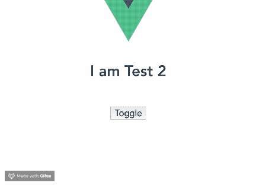

# 如何让你的组件在 Vue.js 中动态化

> 原文:[https://dev . to/bnevilleoneill/how-to-make-your-components-dynamic-in-vue-js-l87](https://dev.to/bnevilleoneill/how-to-make-your-components-dynamic-in-vue-js-l87)

**由[nwo se lotana](https://blog.logrocket.com/author/nwoselotanna/)撰写**

这篇文章介绍了在 Vue.js 的组件中引用 HTML 元素的方法。你可以通过使用 Vue 路由器或创建动态组件在视图或组件模板之间切换。

Vue 路由器用于在 DOM 中的视图或组件模板之间导航。要使用 Vue 路由器，请在 routes 组件中定义路由，并向 Vue 指示应该在事件(如 click)上安装新组件。

这是处理用户界面中侧边栏和菜单组件导航的正确方式。

如果您曾经想要在 DOM 中安装的两个任意组件之间切换而不创建路由，那么您可能想要使用动态组件。

### [](#dynamic-components)动态组件

Vue 动态组件使用户能够在两个或更多组件之间切换，而无需路由，甚至在切换回初始组件时保留数据的状态。

中心思想是让用户在用户界面中动态地安装和卸载组件，而不使用路由器。

### [](#why-are-dynamic-components-important)为什么动态组件很重要？

在设计用户界面时，您会想要某种形式的灵活性，以便根据应用程序状态显示或隐藏嵌套组件。动态组件以一种高效而简单的方式提供了这个平台。

该特性可以节省大量代码，因为您可以轻松地使用 Vue 条件结构(如 v-if 和 v-else)实现动态组件。通过使用占位符方法轻松地将逻辑绑定到组件，您可以使用条件结构来实现动态组件。

这种方法可以确保你的陈述总是干净和明确的。

[T2】](https://logrocket.com/signup/)

### [](#before-you-can-create-dynamic-components-in-vuejs-you-will-need-the-following-in-your-pc)在您可以在 Vue.js 中创建动态组件之前，您需要在您的 PC 中安装以下组件:

*   已安装 node . js 10 . x 及以上版本。您可以通过在终端/命令提示符下运行以下命令来验证您是否拥有 Node.js 版本 10 . x:`node -v`
*   代码编辑器(我强烈推荐使用 Visual Studio 代码)。
*   Vue 的最新版本，全球安装在您的机器上。
*   安装在您机器上的 Vue CLI 3.0。为此，请先卸载旧版本的 CLI:

`npm uninstall -g vue-cli`

然后，安装新的:

`npm install -g @vue/cli`

——在这里下载一个 Vue starter 项目[。

–解压下载的项目。

–导航到解压缩后的文件，并运行命令以保持所有依赖项最新:](https://github.com/viclotana/vue-canvas)

`npm install`

### [](#dynamic-components-syntax)动态组件语法

Vue 为动态组件提供了一个特殊的模板元素，简称为**组件**。语法看起来像这样:

```
<component v-bind:is=”currentComponent”></component> 
```

<svg width="20px" height="20px" viewBox="0 0 24 24" class="highlight-action crayons-icon highlight-action--fullscreen-on"><title>Enter fullscreen mode</title></svg> <svg width="20px" height="20px" viewBox="0 0 24 24" class="highlight-action crayons-icon highlight-action--fullscreen-off"><title>Exit fullscreen mode</title></svg>

**组件元素**也可以是自结束标签:

```
<component v-bind:is=”currentComponent”/> 
```

<svg width="20px" height="20px" viewBox="0 0 24 24" class="highlight-action crayons-icon highlight-action--fullscreen-on"><title>Enter fullscreen mode</title></svg> <svg width="20px" height="20px" viewBox="0 0 24 24" class="highlight-action crayons-icon highlight-action--fullscreen-off"><title>Exit fullscreen mode</title></svg>

第一个选项最适合浏览兼容性目的。

### [](#demo)演示

下载[启动项目](https://github.com/viclotana/vue-canvas)并在 VS 代码中打开它，查看一些动态组件的例子。starter 项目允许您访问一个现有的测试组件，创建第二个测试组件，并在两者之间切换。

导航到 components 文件夹并创建一个新文件。将文件命名为`Test2.vue`，并将下面的代码块复制到文件中:

```
<template>
  <div><h1>I am Test 2</h1>
  </div>
</template>
<script>
export default {
  name: 'Test2',
  props: {
    msg: String
  }
}
</script>
<!-- Add "scoped" attribute to limit CSS to this component only -->
<style scoped>
h3 {
  margin: 40px 0 0;
}
ul {
  list-style-type: none;
  padding: 0;
}
li {
  display: inline-block;
  margin: 0 10px;
}
a {
  color: #42b983;
}
</style> 
```

<svg width="20px" height="20px" viewBox="0 0 24 24" class="highlight-action crayons-icon highlight-action--fullscreen-on"><title>Enter fullscreen mode</title></svg> <svg width="20px" height="20px" viewBox="0 0 24 24" class="highlight-action crayons-icon highlight-action--fullscreen-off"><title>Exit fullscreen mode</title></svg>

现在您有了第二个组件，转到`App.vue`文件并注册组件:

```
<template>
  <div id="app">
    
    <Test />
    <Test2 />
  </div>
</template>
<script>
import Test from './components/Test.vue'
import Test2 from './components/Test2.vue'
export default {
  name: 'app',
  components: {
    Test, Test2
  }
}
</script> 
```

<svg width="20px" height="20px" viewBox="0 0 24 24" class="highlight-action crayons-icon highlight-action--fullscreen-on"><title>Enter fullscreen mode</title></svg> <svg width="20px" height="20px" viewBox="0 0 24 24" class="highlight-action crayons-icon highlight-action--fullscreen-off"><title>Exit fullscreen mode</title></svg>

这两个测试组件现在嵌套在根应用程序组件中。如果您只想挂载一个组件，然后动态地切换到另一个组件，那么您必须创建一个动态组件。

将下面的代码块复制到您的`app.vue`文件的模板部分:

```
<template>
   <div id="app">
    
    <component is="Test" />
   </div>
</template> 
```

<svg width="20px" height="20px" viewBox="0 0 24 24" class="highlight-action crayons-icon highlight-action--fullscreen-on"><title>Enter fullscreen mode</title></svg> <svg width="20px" height="20px" viewBox="0 0 24 24" class="highlight-action crayons-icon highlight-action--fullscreen-off"><title>Exit fullscreen mode</title></svg>

接下来，使用以下 serve 命令运行应用程序:

`npm run serve`

您将看到只有 Test 1 组件显示出来。

[T2】](https://res.cloudinary.com/practicaldev/image/fetch/s--GDrFCgRV--/c_limit%2Cf_auto%2Cfl_progressive%2Cq_auto%2Cw_880/https://blog.logrocket.com/wp-content/uploads/2019/09/test-1-nocdn.png)

如果仅在模板中指定了 Test 1 元素，那么这就是您将得到的确切响应。为了使组件成为动态的，我们可以用 v-bind 指令将它绑定到一个 set 属性。

```
<template>
  <div id="app">
    
    <component v-bind:is="component" />
  </div>
</template>
<script>
import Test from './components/Test.vue'
import Test2 from './components/Test2.vue'
export default {
  name: 'app',
  components: {
    Test, Test2
  },
  data (){
    return {
      component:"Test"
    }
  }
}
</script> 
```

<svg width="20px" height="20px" viewBox="0 0 24 24" class="highlight-action crayons-icon highlight-action--fullscreen-on"><title>Enter fullscreen mode</title></svg> <svg width="20px" height="20px" viewBox="0 0 24 24" class="highlight-action crayons-icon highlight-action--fullscreen-off"><title>Exit fullscreen mode</title></svg>

您的组件现在与数据中的组件属性绑定在一起。如果您将组件切换到`Test2`，它将自动安装 Test 2 组件。

在你的浏览器上测试一下。

### [](#adding-method-calls)添加方法调用

您可以添加方法调用来控制组件动态显示的逻辑。组件元素使您可以访问 Vue 实例中的每个构造。

下面是一个切换这两个组件的小方法的例子:

```
<template>
  <div id="app">
    
    <component v-bind:is="component" />
    <button v-on:click="toggle">Toggle</button>
  </div>
</template>
<script>
import Test from './components/Test.vue'
import Test2 from './components/Test2.vue'
export default {
  name: 'app',
  components: {
    Test,
     Test2
  },
  data (){
    return {
      component:"Test2"
    }
  },
  methods: {
    toggle(){
      if (this.component === Test) {
        this.component = Test2;
      } else {
        this.component = Test;
      }
    }
  }
}
</script> 
```

<svg width="20px" height="20px" viewBox="0 0 24 24" class="highlight-action crayons-icon highlight-action--fullscreen-on"><title>Enter fullscreen mode</title></svg> <svg width="20px" height="20px" viewBox="0 0 24 24" class="highlight-action crayons-icon highlight-action--fullscreen-off"><title>Exit fullscreen mode</title></svg>

### [](#keeping-data-values-alive-as-you-switch)切换时保持数据值不变

当 Vue 团队构建这个特性时，他们选择扩展它的功能，以包括存储每个状态的数据值。

为了存储这些数据，Vue 提供了一个名为 **keep-alive** 的模板元素。使用 keep-alive，您可以确保在从一个组件切换回另一个组件后，组件状态保持不变。

例如，如果您单击一个链接或在文本框中输入一个值，然后切换组件，keep-alive 会将您带回到切换回来时使用的同一链接或文本框。

要启用 keep-alive，请转到您的`app.vue`文件的模板部分，并用 keep-alive 元素:
包装组件元素

```
<keep-alive>
  <component v-bind:is="component" />
</keep-alive> 
```

<svg width="20px" height="20px" viewBox="0 0 24 24" class="highlight-action crayons-icon highlight-action--fullscreen-on"><title>Enter fullscreen mode</title></svg> <svg width="20px" height="20px" viewBox="0 0 24 24" class="highlight-action crayons-icon highlight-action--fullscreen-off"><title>Exit fullscreen mode</title></svg>

要查看它是否工作，通过将下面的代码块添加到模板部分，向您的`Test.vue`文件添加一个表单元素:

```
<template>
  <div><h1>I am Test 1</h1>
       <form>
         First name:<br>
         <input type="text" name="firstname"><br>
         Last name:<br>
         <input type="text" name="lastname">
       </form>
  </div>
</template> 
```

<svg width="20px" height="20px" viewBox="0 0 24 24" class="highlight-action crayons-icon highlight-action--fullscreen-on"><title>Enter fullscreen mode</title></svg> <svg width="20px" height="20px" viewBox="0 0 24 24" class="highlight-action crayons-icon highlight-action--fullscreen-off"><title>Exit fullscreen mode</title></svg>

保存所有项目文件后，再次运行应用程序。在输入框中键入内容，切换组件，然后切换回原始组件。您会注意到在切换组件之前键入的值与您离开时完全一样。

[T2】](https://res.cloudinary.com/practicaldev/image/fetch/s--zLirUYpb--/c_limit%2Cf_auto%2Cfl_progressive%2Cq_66%2Cw_880/https://blog.logrocket.com/wp-content/uploads/2019/09/Test-1-Test-2-gif-nocdn.gif)

### [](#conclusion)结论

这是对在 Vue.js 工作流中使用动态组件的介绍。您现在还可以通过保持活动来扩展组件元素的能力。

这是构建用户界面的一个很好的工具，可以应用于各种不同的用例。黑客快乐！

* * *

**编者按:**看到这个帖子有问题？你可以在这里找到正确的版本。

## [](#plug-logrocket-a-dvr-for-web-apps)Plug: [LogRocket](https://logrocket.com/signup/) ，一款适用于网络应用的 DVR

[](https://res.cloudinary.com/practicaldev/image/fetch/s--6FG5kvEL--/c_limit%2Cf_auto%2Cfl_progressive%2Cq_auto%2Cw_880/https://i2.wp.com/blog.logrocket.com/wp-content/uploads/2017/03/1d0cd-1s_rmyo6nbrasp-xtvbaxfg.png%3Fresize%3D1200%252C677%26ssl%3D1)

[log rocket](https://logrocket.com/signup/)是一个前端日志工具，让你重放问题，就像它们发生在你自己的浏览器中一样。LogRocket 不需要猜测错误发生的原因，也不需要向用户询问截图和日志转储，而是让您重放会话以快速了解哪里出错了。它可以与任何应用程序完美配合，不管是什么框架，并且有插件可以记录来自 Redux、Vuex 和@ngrx/store 的额外上下文。

除了记录 Redux 动作和状态，LogRocket 还记录控制台日志、JavaScript 错误、stacktraces、带有头+体的网络请求/响应、浏览器元数据、自定义日志。它还使用 DOM 来记录页面上的 HTML 和 CSS，甚至为最复杂的单页面应用程序重新创建像素级完美视频。

[免费试用](https://logrocket.com/signup/)。

* * *

帖子[如何让你的组件在 Vue.js 中动态化](https://blog.logrocket.com/how-to-make-your-components-dynamic-in-vue-js/)最先出现在 [LogRocket 博客](https://blog.logrocket.com)上。