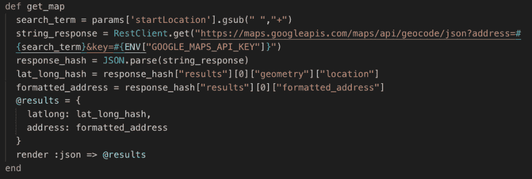
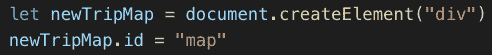
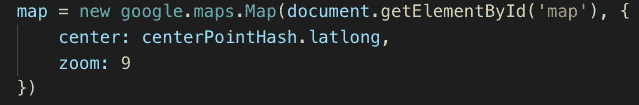
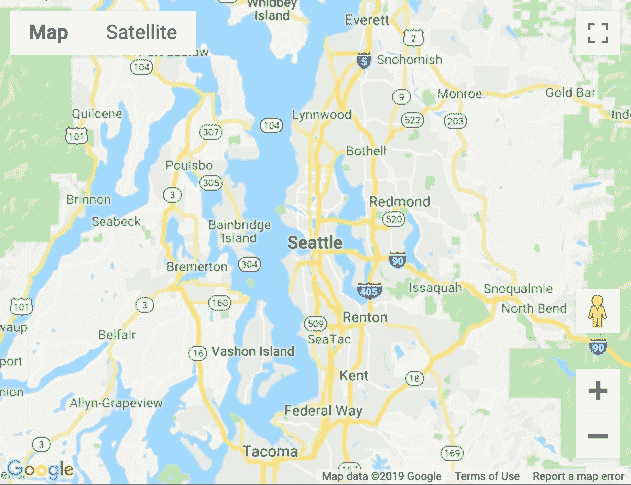
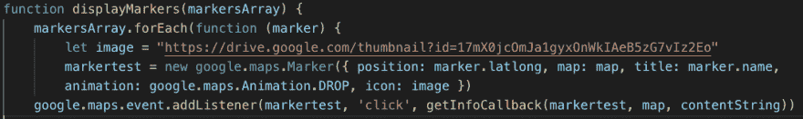
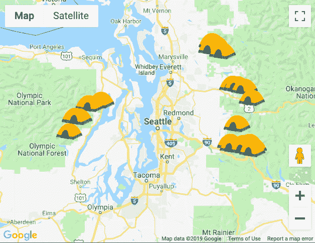

# 用马克笔制作地图

> 原文：<https://dev.to/bjfairchild/making-maps-with-markers-2dc7>

如果你有合适的工具，开始使用谷歌地图就像在公园散步一样容易。首先，您需要将 Google Maps 地理编码 API 添加到项目中。您可以在此处获得 API 密钥:

[https://developers . Google . com/maps/documentation/geocoding/get-API-key](https://developers.google.com/maps/documentation/geocoding/get-api-key)

地理编码是将地址(如街道地址)转换为地理坐标(如纬度和经度)的过程，可用于在地图上放置标记或定位地图。要获得您想要的坐标，首先您需要创建一个带有事件监听器的简单搜索栏。您将希望事件侦听器触发一个类似于以下内容的函数:

这里，我们获取用户在搜索栏中输入的字符串，并用加号替换单词之间的空格。这样做是为了格式化搜索词，让您可以直接将其插入到 url 中。稍加挖掘，您就可以从这个 API 调用将产生的 json 对象中提取纬度经度坐标。

嗯，太好了！你可能会问，下一步是什么？为了渲染地图本身，我们可以使用我们搜索的初始结果来使地图围绕我们的第一个纬度坐标居中。首先，我们将不得不创建 div 标签，我们的地图将生活在那里。

我们在这里添加 ID“map ”,这样我们就可以将这个 div 作为目标，用我们的地图填充它，如下所示:

这里，我们创建了一个新的地图，它以我们之前搜索得到的 lat-lng 坐标为中心，默认缩放比例为 9。如果我们将地图的中心放在华盛顿州的西雅图，我们会看到如下结果:

从这一点来说，这是用标记填充地图的一小步。利用我们先前的搜索方法，我们可以获得一组地理编码的坐标，并将它们存储到一个数组中。我们可以将这个标记数组传递给下面的函数，用标记填充我们的地图。

这个函数做了一些事情。首先，我们遍历标记数组，在保存在“位置”属性下的每个地理坐标处创建一个标记。我们还指定了要添加标记的地图。为了增加一些特色，您可以为标记设置自定义动画、标题和图像。在这种情况下，我的每个标记看起来都像一个野营帐篷，并且在填充后会从地图顶部掉落。如果将鼠标悬停在该位置上，该位置的名称也会作为工具提示出现在地图上。

现在你知道了！使用这些方法，您可以开始创建地图来完善任何可以利用它们的应用程序。