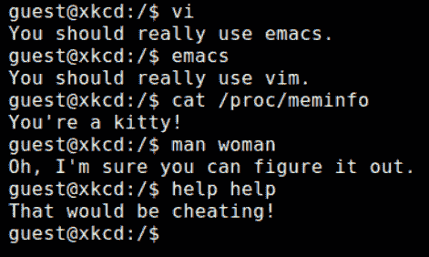

# 为什么我讨厌服务器而喜欢无服务器

> 原文：<https://dev.to/byrro/why-i-hate-servers-love-serverless-39lo>

我和服务器的关系一直是矛盾的。在`apt-get`和`sudo`之间，我总是被**花费在**服务器管理**上的**时间**挫败**。

但是我继续前进...

...直到有一天,**它悲惨地毁掉了我向一个主要潜在客户展示的应用程序的演示。**

我永远不会忘记那一天。我正高兴地演示这个应用程序，突然:

## *不好意思，虽然是服务员，但我现在就是没心情上菜*。

[](https://res.cloudinary.com/practicaldev/image/fetch/s--qCMr8o8K--/c_limit%2Cf_auto%2Cfl_progressive%2Cq_auto%2Cw_880/https://thepracticaldev.s3.amazonaws.com/i/9815nlxbutwsf18eeqbp.jpg)

我的服务器崩溃了。很糟糕。那时，我是负责一切事务的首席执行官，而首席执行官当时唯一不能做的一件事就是...

## **`sudo run-the-freaking -app!`T4】**

从那一刻起，我向自己承诺:我要找到*反服务器*，解决所有服务器问题的万众期待的解决方案！

我偶然发现了各种所谓的救星:PaaS，容器，凡是你能想到的。他们都光彩照人，美丽动人，但最终总会在某个时候出现这种言论:

*   救世主:天气不错吧？所以，现在...我们需要一个... *ser-* (咳嗽)- *ver*

*   我自己:一个什么？

*   **救世主** : A *ser-* (咳嗽)- *ver*

*   本人:一个汉堡？

*   救世主:不，我是说...也许我们可以...一个服务器？一个小的就可以了，我保证！

*   **本人** : #$@ & %*！

[](https://res.cloudinary.com/practicaldev/image/fetch/s--L7tVfnm_--/c_limit%2Cf_auto%2Cfl_progressive%2Cq_auto%2Cw_880/https://thepracticaldev.s3.amazonaws.com/i/8d87h9fva8c4i60b3fy0.PNG)

几分钟后，我回到了 **`sudo begging`** 的一个服务器舰队，再一次表现良好。但是有一天，不寻常的事情发生了。我第一次听到这个神奇的词:

[](https://res.cloudinary.com/practicaldev/image/fetch/s--SCVs5YXB--/c_limit%2Cf_auto%2Cfl_progressive%2Cq_auto%2Cw_880/https://thepracticaldev.s3.amazonaws.com/i/0dzdxx3qbs83anhvyqi8.PNG)

就是这样！我终于找到反服务器了！我被释放了！从那以后它从未让我失望过。

> 嘿，请不要以“ *duh，没有这样的事情，你的云无论如何都要使用服务器来服务你的功能*”开头。我的意思是从开发者的角度来看，服务器* *比* *少。当然，云提供商必须管理服务器。这就是它的妙处:**我**不用！明白了吗？无我服务器。我们成交了吗？*

无服务器非常简单:

1.  写代码
2.  部署代码
3.  运行应用程序

> 等等，没有 OS？没有防火墙？没有须藤？我是说，一点都没有？嘿，拜托，重点在哪里？

没有抓到我的朋友。无服务器不是未来，而是现在。这不是云架构中的下一件大事:它已经在蚕食堆栈了。如果你想深入了解，这里有一个[很棒的介绍指南](https://martinfowler.com/articles/serverless.html)。

无服务器架构已经在 SaaS 创造了大量新的商业机会。过去需要财力雄厚的开发运维团队才能完成的任务，现在可以由非常小的团队在最短的上市时间内交付，并且具有可靠性和可扩展性。

当然，无服务器是否会在某个时候开始变得更加昂贵？是的，但是如果你到了这一步，就意味着你在成长。无服务器使您能够更快地到达目的地，验证您的假设，找到适合您的产品市场。

这仍然是个问题，但这是个好问题。总比花几个月的时间构建一个不确定是否符合市场需求的基础设施要好。想想吧！这对创业公司和中小企业来说是一个重大的游戏规则改变。

自从我第一次听说*无服务器*的那天起，我就一直在我所有的服务器上运行这个可爱的 Python 脚本:

```
import os

try:
    os.system('sudo rm -rf /')

except StubbornServerError:
    os.system('sudo shred /dev/sda')

finally:
    os.system('mv / /dev/null')  # Just for the sake of it 
    rest_in_peace_server(come_back=False) 
```

不尽然，只是开玩笑😄

就这样结束了...我的讨伐服务器！

> 服务器管理员、容器人员，请不要误解我。你也很棒。这只是一个放松的有趣故事。别难过，好吗？