# 耶格追踪教程:从头开始

> 原文：<https://dev.to/scalyr/jaeger-tracing-tutorial-get-going-from-scratch-4nb3>

Jaeger tracing 系统是一个开源的微服务追踪系统，它支持 [OpenTracing](https://opentracing.io) 标准。我们在之前的帖子中讨论了 [OpenTracing 以及为什么它是必要的](https://scalyr.com/blog/what-is-opentracing/)。那么现在，让我们更多地谈谈耶格。

Jaeger 最初是由优步技术公司作为开源软件发布的，此后一直在发展。该系统为您提供分布式跟踪、根本原因分析、服务依赖性分析等等。

我们将从安装 Jaeger tracing 开始，并使用它来检查对单个微服务的一些 RESTful API 调用。为此，我们需要构建一个支持跟踪的小服务。Jaeger 拥有用于 Go、Java、JavaScript (Node.js、)Python 和 C++的工具。在本教程中，我们将使用 Java，但是我们在这里介绍的概念将适用于任何支持的平台。

[](https://res.cloudinary.com/practicaldev/image/fetch/s--im6ueu8i--/c_limit%2Cf_auto%2Cfl_progressive%2Cq_auto%2Cw_880/https://library.scalyr.com/2019/02/20121919/Jaeger_tracing_image_showing_Jeager_mascot_in_scalyr_colors.png)

## 安装和设置

### 码头工人

安装和运行 Jaeger tracing 的首选方式是使用 Docker。也是最简单的。因此，如果您还没有运行 Docker，请看一下您的平台的安装过程[这里](https://docs.docker.com/install/)。社区版对于本教程来说已经足够了。

### 安装 Jaeger

Jaeger 是一组分布式组件，用于收集、存储和显示跟踪信息。但它也作为运行整个系统的“一体化”映像提供。在本教程中，我们将使用它来简化安装。这里有入门指南，但我会在这篇文章中介绍一个精简版。

当您尝试启动一个容器时，Docker 会为您下载映像。我将使用比 Jaeger 指令中更短的命令行，因为我们将只使用系统的一种追踪模式。

```
docker run -d --name jaeger -p 16686:16686 -p 6831:6831/udp jaegertracing/all-in-one:1.9
```

因此，当您运行容器时，您的命令应该如下所示。

[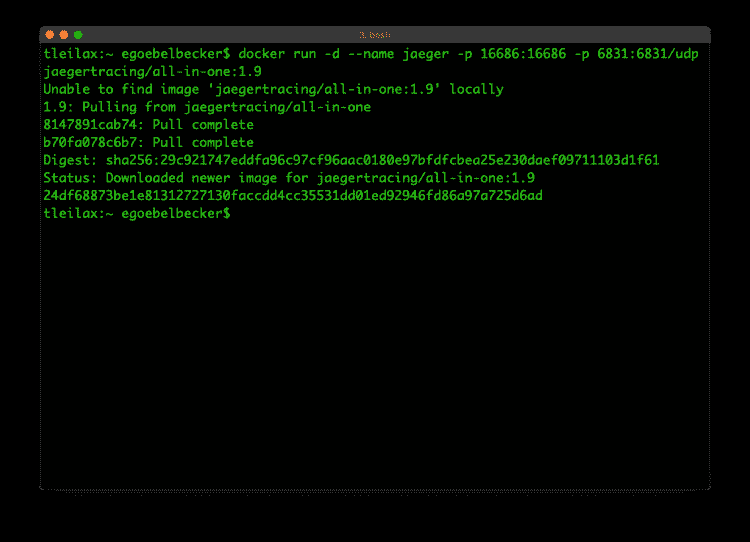](https://res.cloudinary.com/practicaldev/image/fetch/s--xgeB3J79--/c_limit%2Cf_auto%2Cfl_progressive%2Cq_auto%2Cw_880/https://library.scalyr.com/2019/02/20120923/012.png)

当命令完成时，检查服务器是否正在运行 **docker ps -a**

[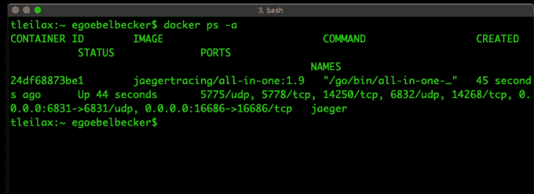](https://res.cloudinary.com/practicaldev/image/fetch/s--kNgYTAcj--/c_limit%2Cf_auto%2Cfl_progressive%2Cq_auto%2Cw_880/https://library.scalyr.com/2019/02/20120948/022.png)

您应该会看到容器名称 **jaeger** ，状态栏中的**向上**。您还会看到许多关于服务端口的信息。

现在，你可以通过 [http://localhost:16686](http://localhost:16686) 连接到 Jaeger 控制台

[](https://res.cloudinary.com/practicaldev/image/fetch/s--nFS5ZY0I--/c_limit%2Cf_auto%2Cfl_progressive%2Cq_auto%2Cw_880/https://library.scalyr.com/2019/02/20121019/032.png)

我们看到了耶格的用户界面。它在跑！

### Java 微服务

我们将使用一个简单的 Spring Boot 服务来创建一些痕迹。该项目的代码在 [GitHub 上。](https://github.com/egoebelbecker/jaeger-tutorial)

该项目包含通过脚本或在容器中运行服务的脚本。如果你想在容器中同时运行服务和 Jaeger，你需要知道如何让它们使用 Docker 网络通过 UDP 连接。这超出了本教程的范围。

## 耶格和开放追踪概念

在我们开始服务之前，我们可以看看 Jaeger 的界面，并回顾一些基本的开放跟踪概念。用户界面服务报告它的查询，这样我们可以看到一些基本跟踪的例子。

[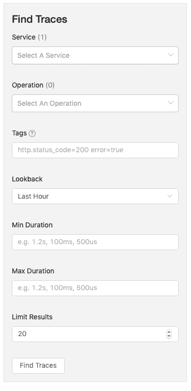](https://res.cloudinary.com/practicaldev/image/fetch/s--Evti5nS2--/c_limit%2Cf_auto%2Cfl_progressive%2Cq_auto%2Cw_880/https://library.scalyr.com/2019/02/20121047/042.png)

查看页面左侧标有 **Find Traces 的方框。第一个控件是一个选择器，列出了可用于跟踪的服务。计数应该显示一。(如果没有，请尝试刷新页面。)现在，点击选择器，你会看到 **jaeger-query** 被列为唯一的服务。**

[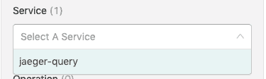](https://res.cloudinary.com/practicaldev/image/fetch/s--CNHc-Sbm--/c_limit%2Cf_auto%2Cfl_progressive%2Cq_auto%2Cw_880/https://library.scalyr.com/2019/02/20121118/052.png)

服务是向 Jaeger 注册的应用程序。我们将在下面看到如何注册我们的应用程序。

接下来，选择 **jaeger-query** ，点击表格底部的**查找痕迹**按钮。

[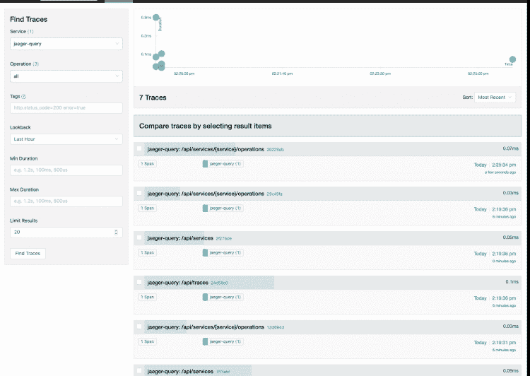](https://res.cloudinary.com/practicaldev/image/fetch/s--c238YpE6--/c_limit%2Cf_auto%2Cfl_progressive%2Cq_auto%2Cw_880/https://library.scalyr.com/2019/02/20121203/061.png)

屏幕右侧将出现一个轨迹列表。轨迹的标题对应于搜索表单上的**操作**选择器。因此，在**操作**框中选择**/API/服务**，再次点击**查找**按钮。根据您重新加载页面的次数，您会看到一些操作。

[](https://res.cloudinary.com/practicaldev/image/fetch/s--kPKSwBvZ--/c_limit%2Cf_auto%2Cfl_progressive%2Cq_auto%2Cw_880/https://library.scalyr.com/2019/02/20121245/07.png)

现在点击其中一个轨迹。

[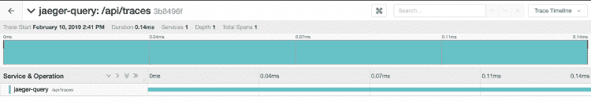](https://res.cloudinary.com/practicaldev/image/fetch/s--liON2lit--/c_limit%2Cf_auto%2Cfl_progressive%2Cq_auto%2Cw_880/https://library.scalyr.com/2019/02/20121312/08.png)

此跟踪中有一个操作。用了 0.14 ms，这里没什么好看的。但是我们可以看看服务向 Jaeger 跟踪服务器发送了什么。所以点击页面右上角的方框。

[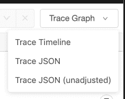](https://res.cloudinary.com/practicaldev/image/fetch/s--uBM7pz2Q--/c_limit%2Cf_auto%2Cfl_progressive%2Cq_auto%2Cw_880/https://library.scalyr.com/2019/02/20121354/09.png)

### 耶格追踪标签

接下来，我们来看看 JSON。

```
{
  "data": [
    {
      "traceID": "3b8496f91e044c34",
      "spans": [
        {
          "traceID": "3b8496f91e044c34",
          "spanID": "3b8496f91e044c34",
          "flags": 1,
          "operationName": "/api/traces",
          "references": [],
          "startTime": 1549827709524283,
          "duration": 142,
          "tags": [
            {
              "key": "sampler.type",
              "type": "string",
              "value": "const"
            },
            {
              "key": "sampler.param",
              "type": "bool",
              "value": true
            },
            {
              "key": "span.kind",
              "type": "string",
              "value": "server"
            },
            {
              "key": "http.method",
              "type": "string",
              "value": "GET"
            },
            {
              "key": "http.url",
              "type": "string",
              "value": "/api/traces?end=1549827709522000\u0026limit=20\u0026lookback=1h\u0026maxDuration\u0026minDuration\u0026service=jaeger-query\u0026start=1549824109522000\u0026tags=%7B%22http.status_code%22%3A%22404%22%7D"
            },
            {
              "key": "component",
              "type": "string",
              "value": "net/http"
            },
            {
              "key": "http.status_code",
              "type": "int64",
              "value": 200
            }
          ],
          "logs": [],
          "processID": "p1",
          "warnings": null
        }
      ],
      "processes": {
        "p1": {
          "serviceName": "jaeger-query",
          "tags": [
            {
              "key": "client-uuid",
              "type": "string",
              "value": "6550fb460c8ee430"
            },
            {
              "key": "hostname",
              "type": "string",
              "value": "9f77a41dfd0c"
            },
            {
              "key": "ip",
              "type": "string",
              "value": "172.17.0.2"
            },
            {
              "key": "jaeger.version",
              "type": "string",
              "value": "Go-2.15.1dev"
            }
          ]
        }
      },
      "warnings": null
    }
  ],
  "total": 0,
  "limit": 0,
  "offset": 0,
  "errors": null
}
```

There's a lot of information here. Toward the top of the JSON, you see an array of **spans**. This trace only has one. A **trace** consists of one or more spans. A span is, as you might guess, an interval of time that contains one or more operations. We'll take a closer look at spans when we add some code to the Java service. Inside the span, there's an array of **tags.** Tags are attributes an application adds to traces. Here are two:

```
{
    "key": "http.method",
    "type": "string",
    "value": "GET"
},
{
    "key": "http.status_code",
    "type": "int64",
    "value": 200
}

```

我们将在下面看到如何将这些标签添加到我们的跨度中。现在，让我们回到主页，使用标签进行搜索。

现在，在**标签**字段中输入 **http.method=get** ，并再次单击 find 按钮。

[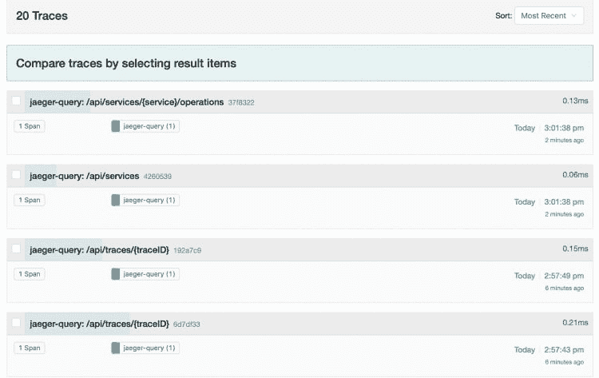](https://res.cloudinary.com/practicaldev/image/fetch/s--2v0y0XAz--/c_limit%2Cf_auto%2Cfl_progressive%2Cq_auto%2Cw_880/https://library.scalyr.com/2019/02/20121429/10.png)

您将看到一个跟踪列表。Jaeger UI 里的大部分操作都是 GETS，有道理。

这是 Jaeger 界面的基础。让我们连接一个服务。

## 跟踪服务

Jaeger tutorial 应用程序包含一个用于管理员工记录的创建-读取-更新-删除(CRUD) API。记录存储在本地哈希表中。我们将向应用程序添加一个具有两个跨度的跟踪。

### 创建追踪器

要给应用程序添加跟踪，您需要一个**跟踪器。**我们将创建一个并使用 Spring 将其提供给微服务的服务和控制器类。

以下是创建跟踪器的方法:

```
@Bean
public static JaegerTracer getTracer() {
    Configuration.SamplerConfiguration samplerConfig = Configuration.SamplerConfiguration.fromEnv().withType("const").withParam(1);
    Configuration.ReporterConfiguration reporterConfig = Configuration.ReporterConfiguration.fromEnv().withLogSpans(true);
    Configuration config = new Configuration("jaeger tutorial").withSampler(samplerConfig).withReporter(reporterConfig);
    return config.getTracer();
}

```

第一步是构造配置类。您使用它们来创建**跟踪器。** Jaeger 拥有丰富的配置工具。我们接受默认设置，并将我们的追踪器命名为**杰格教程**。

这个方法与服务的 **main** 方法在同一个类中。我们把它当作一个弹簧**豆**，注入到控制器和服务类的构造器中。如果您不理解 Spring 依赖注入，您可以假设控制器和服务方法可以访问跟踪程序。

你可以在这里和这里[了解更多关于杰格的配置](https://www.jaegertracing.io/docs/1.6/client-features/)[。](https://github.com/jaegertracing/jaeger-client-java/blob/master/jaeger-core/README.md)

### 跟踪 REST API 调用

让我们从向 POST 方法添加单个 span 开始。这是我们添加新员工的代码。

```
@ApiOperation(value = "Create Employee ", response = ResponseEntity.class)
@RequestMapping(value = "/api/tutorial/1.0/employees", method = RequestMethod.POST)
public ResponseEntity createEmployee(@RequestBody Employee employee) {

    // Create a span
    Span span = tracer.buildSpan("create employee").start();

    HttpStatus status = HttpStatus.FORBIDDEN;

    log.info("Receive Request to add employee {}", employee);
    if (employeeService.addEmployee(employee)) {
        status = HttpStatus.CREATED;

        // Set http status code
        span.setTag("http.status_code", 201);
    } else {
        span.setTag("http.status_code", 403);
    }

    // Close the span
    span.finish();
    return new ResponseEntity(null, status);
}

```

我们在方法开始时创建一个**跨度**，使用我们的**跟踪器**实例。然后，我们设置一个与请求的 HTTP 状态代码相对应的标签。这应该使 trace 看起来更像 Jaeger 查询服务。该服务有一个 Swagger 接口，所以我们可以用它来添加一个雇员。

[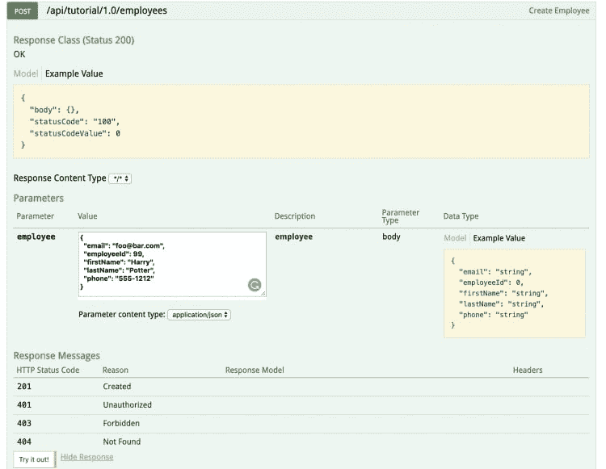](https://res.cloudinary.com/practicaldev/image/fetch/s--n8r62DsH--/c_limit%2Cf_auto%2Cfl_progressive%2Cq_auto%2Cw_880/https://library.scalyr.com/2019/02/20121505/11.png)

填写员工的详细信息，然后单击**试试看！**按钮两次。第一个请求会成功。第二个将失败，因为该服务不接受具有现有 ID 的新雇员。

现在，看看 Jaeger 搜索页面。在服务选择器中选择**耶格教程**，在操作选择器中选择**创建员工**，点击查找按钮。

[](https://res.cloudinary.com/practicaldev/image/fetch/s--wd0WH4vw--/c_limit%2Cf_auto%2Cfl_progressive%2Cq_auto%2Cw_880/https://library.scalyr.com/2019/02/20121534/12.png)

我们看到两条痕迹，但我们知道一条失败了，一条成功了。让我们细化搜索。在**标签**文本框中输入 **http.status_code=403** 。

[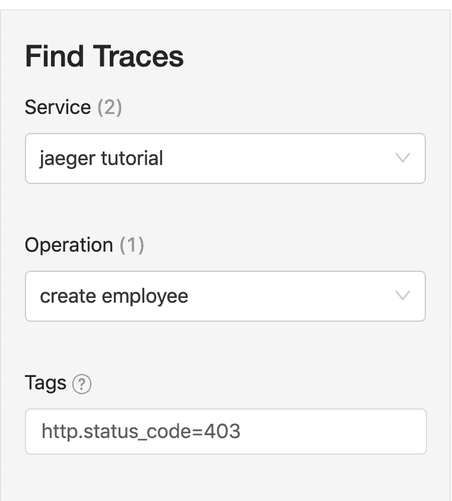](https://res.cloudinary.com/practicaldev/image/fetch/s--eHD9b0dq--/c_limit%2Cf_auto%2Cfl_progressive%2Cq_auto%2Cw_880/https://library.scalyr.com/2019/02/20121610/13.png)

现在，再次单击查找按钮。你只会看到一条痕迹。标签对于过滤跟踪和查看特定标准非常有用。

### 多个跨度和日志消息

最后，让我们向跟踪添加第二个 span，以及日志消息。

下面是控制器的删除方法:

```
@ApiOperation(value = "Delete Employee ", response = ResponseEntity.class)
@RequestMapping(value = "/api/tutorial/1.0/employees/{id}", method = RequestMethod.DELETE)
public ResponseEntity deleteEmployee(@PathVariable("id") String idString) {

    Span span = tracer.buildSpan("delete employee").start();

    HttpStatus status = HttpStatus.NO_CONTENT;

    try {
        int id = Integer.parseInt(idString);
        log.info("Received Request to delete employee {}", id);
        span.log(ImmutableMap.of("event", "delete-request", "value", idString));
        if (employeeService.deleteEmployee(id, span)) {
            span.log(ImmutableMap.of("event", "delete-success", "value", idString));
            span.setTag("http.status_code", 200);
            status = HttpStatus.OK;
        } else {
            span.log(ImmutableMap.of("event", "delete-fail", "value", "does not exist"));
            span.setTag("http.status_code", 204);
        }
    } catch (NumberFormatException | NoSuchElementException nfe) {
        span.log(ImmutableMap.of("event", "delete-fail", "value", idString));
        span.setTag("http.status_code", 204);
    }

    span.finish();
    return new ResponseEntity(null, status);
 }

```

像 add 方法一样，我们在方法的开始打开一个 span。我们还根据删除请求的结果设置了状态代码标记。此外，代码具有基于查询结果的日志消息。

我们还将我们的 **Span** 对象传递给服务。我们来看看为什么。下面是服务中的删除方法:

```
public boolean deleteEmployee(int id, Span rootSpan) {

    Span span = tracer.buildSpan("service delete employee").asChildOf(rootSpan).start();

    boolean result = false;
    if (employeeMap.containsKey(id)) {
        employeeMap.remove(id);
        result = true;
    }
    span.finish();
    return result;
}
```

我们在方法内部创建了一个新的 span，将其设置为传入的 span 的子级。

运行该服务，尝试删除一个有效的雇员，然后删除一个无效的雇员。

现在，在操作控件中选择**删除员工**，点击查找按钮。

[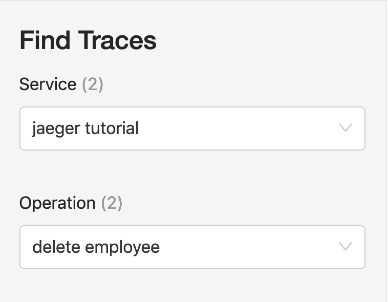](https://res.cloudinary.com/practicaldev/image/fetch/s--n8un5Vh8--/c_limit%2Cf_auto%2Cfl_progressive%2Cq_auto%2Cw_880/https://library.scalyr.com/2019/02/20121645/14.png)

您应该看到两个操作，每个操作有两个跨度。

[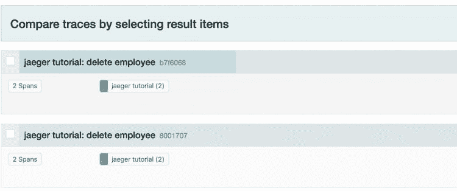](https://res.cloudinary.com/practicaldev/image/fetch/s--MD6MBDCB--/c_limit%2Cf_auto%2Cfl_progressive%2Cq_auto%2Cw_880/https://library.scalyr.com/2019/02/20121719/15.png)

检查每一个痕迹，你会看到一些新的东西。下面是成功的跟踪，显示了两个跨度:

[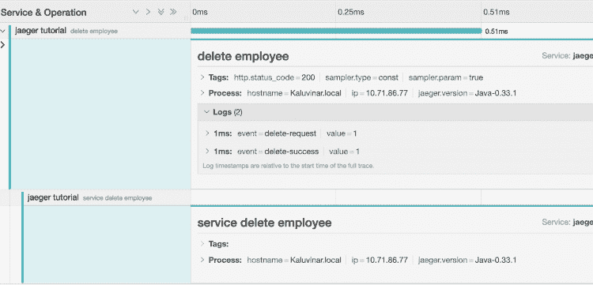](https://res.cloudinary.com/practicaldev/image/fetch/s--DfSV8lmT--/c_limit%2Cf_auto%2Cfl_progressive%2Cq_auto%2Cw_880/https://library.scalyr.com/2019/02/20121746/16.png)

您可以看到第二个跟踪和日志消息。失败的删除有不同的日志消息。

[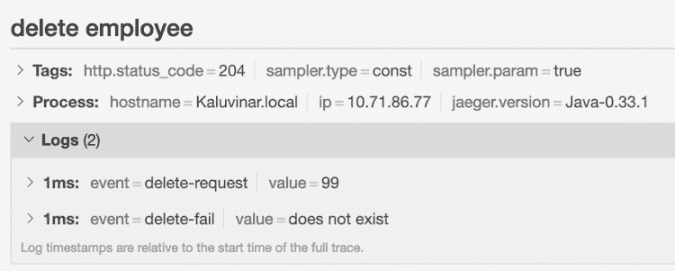](https://res.cloudinary.com/practicaldev/image/fetch/s--zUsOnHyV--/c_limit%2Cf_auto%2Cfl_progressive%2Cq_auto%2Cw_880/https://library.scalyr.com/2019/02/20121814/17.png)

因此，通过几行代码，我们可以看到操作需要多长时间，并知道为什么！

## 用于微服务的 Jaeger 跟踪

Jaeger tracing 是 OpenTracing 标准的开源实现。在短短几分钟内，我们安装了该系统，并使用它来跟踪 REST 微服务。跟踪是管理您的服务和监控您的用户体验的一个基本策略，所以享受这一新知识的成果吧！