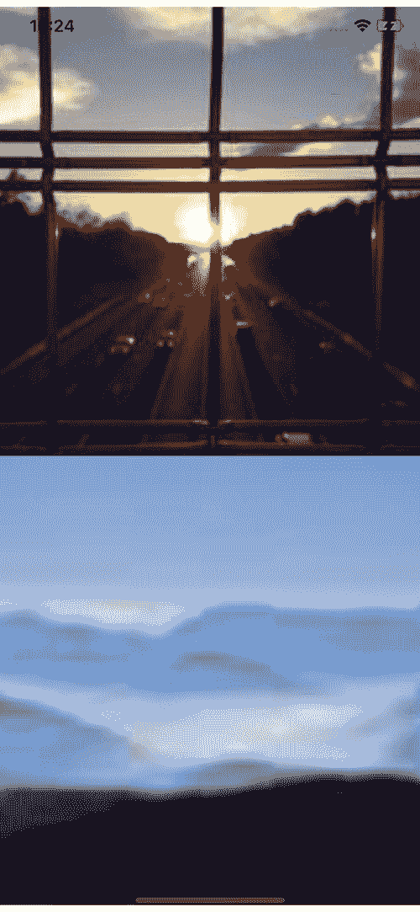

# 放大原因

> 原文:[https://dev.to/idkjs/zoom-in-reason-4kj7](https://dev.to/idkjs/zoom-in-reason-4kj7)

## [](#imagewithzoom-module)图像缩放模块

传入一个图像尺寸，该尺寸被传递给`uri`变量。无论图像大小如何，它都将缩放到在`styles##image`属性中定义的`width`和`height`。
每次调用这个组件时，都会从`https://picsum.photos/`检索一个不同的图像。

```
let styles =
  Style.(
    StyleSheet.create({
      "image": style(~width=400.->dp, ~height=400.->dp, ()),
    })
  );

[@react.component]
let make = (~size=?) => {
  <Image
    style=styles##image
    source={Image.Source.fromUriSource(
      Image.uriSource(~uri={j|https://picsum.photos/$size/$size|j}, ()),
    )}
  />;
}; 
```

[T2】](https://res.cloudinary.com/practicaldev/image/fetch/s--2Gy0Y7i0--/c_limit%2Cf_auto%2Cfl_progressive%2Cq_auto%2Cw_880/https://thepracticaldev.s3.amazonaws.com/i/67uhkd7lq20ykm89zdbm.png)

## [](#resources)资源

picsum .照片

[原回购](https://github.com/browniefed/KenWheelerReasonZoom/blob/master/re/root.re)通过[@布朗尼美联储](https://twitter.com/browniefed)

参见`snack.io`上的[https://expo.io/@idkjs/zoomreason](https://expo.io/@idkjs/zoomreason)。
参见[来源](https://github.com/idkjs/reason-expo-image-with-zoom)。