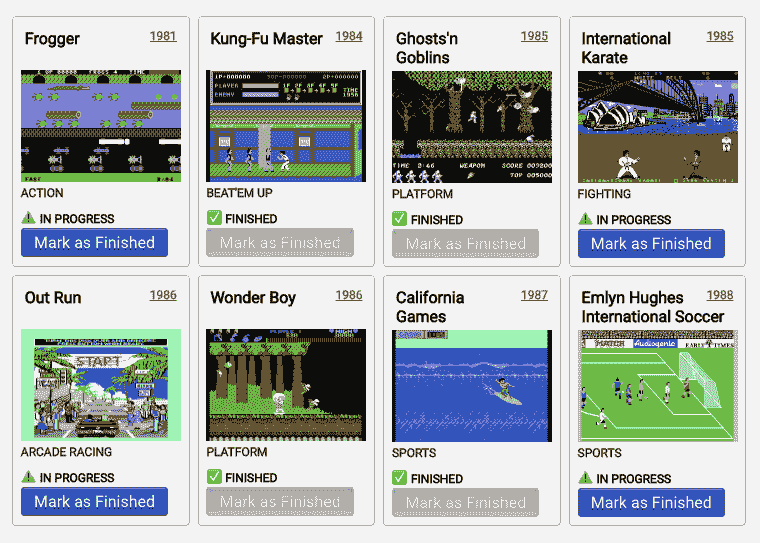

# 用钩子改变远程数据

> 原文:[https://dev.to/juliang/changing-remote-data-with-hooks-565p](https://dev.to/juliang/changing-remote-data-with-hooks-565p)

在本系列中，我们没有使用状态管理库或提出一个通用的解决方案，而是从最低限度开始，根据需要构建我们的状态管理。

* * *

*   在第一篇文章中，我们描述了如何用钩子装载和显示数据。
*   在第二篇文章中，我们将学习如何用钩子改变远程数据。
*   在第三篇文章中，我们将看到如何使用 React Context 在组件之间共享数据，而不使用全局变量、单例变量或求助于 MobX 或 Redux 等状态管理库。
*   在第四篇文章中，我们将看到如何使用 [SWR](https://swr.now.sh/) 在组件之间共享数据，这可能是我们从一开始就应该做的。

* * *

最终代码可以在这个 [GitHub repo](https://github.com/JulianG/minimal-state-management-demo) 中找到。它是 TypeScript，但是类型注释很少。**另外，请注意这不是生产代码。**为了专注于状态管理，许多其他方面没有被考虑(例如[依赖倒置](https://en.wikipedia.org/wiki/Dependency_inversion_principle)，测试或优化)。

## [](#changing-remote-data-with-hooks)用钩子改变远程数据

我们有上一篇文章中的游戏列表。**现在有了一个新的需求:**我们想让用户将每个游戏标记为“完成”。当他们这样做时，我们会立即将更改发送到服务器。

[T2】](https://res.cloudinary.com/practicaldev/image/fetch/s--Ly-92f-8--/c_limit%2Cf_auto%2Cfl_progressive%2Cq_auto%2Cw_880/https://thepracticaldev.s3.amazonaws.com/i/qbx38iq5guj2me3jnrkc.png)

为了将`"status"`的值从`"in-progress"`更改为`"finished"`，我们发出一个 **`PATCH`** 请求:

```
const setGameStatus = (id: number, status: Game['status']): Promise<Game> => {
  return fetch('http://localhost:3001/games/' + id, {
    method: "PATCH",
    headers: { "Content-Type": "application/json" },
    body: JSON.stringify({ status: status })
    })
    .then(response => response.json());
} 
```

<svg width="20px" height="20px" viewBox="0 0 24 24" class="highlight-action crayons-icon highlight-action--fullscreen-on"><title>Enter fullscreen mode</title></svg> <svg width="20px" height="20px" viewBox="0 0 24 24" class="highlight-action crayons-icon highlight-action--fullscreen-off"><title>Exit fullscreen mode</title></svg>

我们可以这样使用它:

```
const promise = setGameStatus(7, "finished"); 
```

<svg width="20px" height="20px" viewBox="0 0 24 24" class="highlight-action crayons-icon highlight-action--fullscreen-on"><title>Enter fullscreen mode</title></svg> <svg width="20px" height="20px" viewBox="0 0 24 24" class="highlight-action crayons-icon highlight-action--fullscreen-off"><title>Exit fullscreen mode</title></svg>

但是，我们把这个代码放在哪里呢？

我们可以从另一端来处理这个问题:**我们会如何使用我们的钩子呢？**

让我们创建一个`GameComponent`来渲染一个游戏，用 onClick 处理程序将它标记为完成。

* * *

***注意:*** *为了简单起见，我们将快速制作一个包含所有内容的`<pre>`，包括`onClick`处理程序。*

* * *

```
type GameComponentProps = { game: Game; markAsFinished: (id:number) => void };

const GameComponent = ({ game, markAsFinished }: GameComponentProps) => {
  return (
    <pre onClick={() => markAsFinished(game.id)}>
      Title: {game.title}
      Year: {game.year}
      Status: {game.status}
    </pre>
  );
}; 
```

<svg width="20px" height="20px" viewBox="0 0 24 24" class="highlight-action crayons-icon highlight-action--fullscreen-on"><title>Enter fullscreen mode</title></svg> <svg width="20px" height="20px" viewBox="0 0 24 24" class="highlight-action crayons-icon highlight-action--fullscreen-off"><title>Exit fullscreen mode</title></svg>

这个新组件需要一个`game`对象和一个`markAsFinished`函数。因此，我们的自定义钩子应该返回一个函数以及游戏列表，错误和未决:

```
//const { games, error, isPending } = useGames();
  const { games, error, isPending, markAsFinished } = useGames(); 
```

<svg width="20px" height="20px" viewBox="0 0 24 24" class="highlight-action crayons-icon highlight-action--fullscreen-on"><title>Enter fullscreen mode</title></svg> <svg width="20px" height="20px" viewBox="0 0 24 24" class="highlight-action crayons-icon highlight-action--fullscreen-off"><title>Exit fullscreen mode</title></svg>

这将允许我们呈现这样的游戏列表:

```
export const App = () => {
  const { games, error, isPending, markAsFinished } = useGames();

  return (
    <>
      {error && <pre>ERROR! {error}...</pre>}
      {isPending && <pre>LOADING...</pre>}
      <ol>
        {games.map(game => (
          <li key={game.id}>
            <GameComponent game={game} markAsFinished={markAsFinished} />
          </li>
        ))}
      </ol>
    </>
  );
}; 
```

<svg width="20px" height="20px" viewBox="0 0 24 24" class="highlight-action crayons-icon highlight-action--fullscreen-on"><title>Enter fullscreen mode</title></svg> <svg width="20px" height="20px" viewBox="0 0 24 24" class="highlight-action crayons-icon highlight-action--fullscreen-off"><title>Exit fullscreen mode</title></svg>

那是我们想要使用的。让我们改变一下我们的`useGames`钩子实现。

以下是目前为止的样子:

```
export const useGames = () => {
  const [games, error, isPending] = useAsyncFunction(getGames, emptyList);
  return { games, error, isPending };
}; 
```

<svg width="20px" height="20px" viewBox="0 0 24 24" class="highlight-action crayons-icon highlight-action--fullscreen-on"><title>Enter fullscreen mode</title></svg> <svg width="20px" height="20px" viewBox="0 0 24 24" class="highlight-action crayons-icon highlight-action--fullscreen-off"><title>Exit fullscreen mode</title></svg>

我们需要返回一个`markAsFinished`函数。

```
export const useGames = () => {
  const [games, error, isPending] = useAsyncFunction(getGames, emptyList);

  const markAsFinished = (id: number) => {
    setGameStatus(id, 'finished'); // setGameStatus is already defined outside the hook
  };

  return { games, error, isPending, markAsFinished };
}; 
```

<svg width="20px" height="20px" viewBox="0 0 24 24" class="highlight-action crayons-icon highlight-action--fullscreen-on"><title>Enter fullscreen mode</title></svg> <svg width="20px" height="20px" viewBox="0 0 24 24" class="highlight-action crayons-icon highlight-action--fullscreen-off"><title>Exit fullscreen mode</title></svg>

通过这段代码( *[参见 repo](https://github.com/JulianG/minimal-state-management-demo/tree/04-patch-server-data/src)* )我们现在将我们的更改发送到服务器**，但是除非我们重新加载页面并再次获取游戏列表，否则我们的客户端数据不会受到影响。**

### [](#updating-clientside-data)更新客户端数据

现在服务器有了更新后的值，但是客户机没有:列表在更改后没有更新。

```
const markAsFinished = (id: number) => {
  setGameStatus(id, 'finished')
    .then(game => ?????); // 🤔
}; 
```

<svg width="20px" height="20px" viewBox="0 0 24 24" class="highlight-action crayons-icon highlight-action--fullscreen-on"><title>Enter fullscreen mode</title></svg> <svg width="20px" height="20px" viewBox="0 0 24 24" class="highlight-action crayons-icon highlight-action--fullscreen-off"><title>Exit fullscreen mode</title></svg>

我们的服务器的`PATCH`请求返回一个带有修改后的游戏对象的承诺，我们可以用它来更新我们的客户端列表。无需在“打补丁”后重新获取游戏列表甚至是受影响的游戏。

```
const markAsFinished = (id: number) => {
  setGameStatus(id, 'finished')
    .then(updateGame); // 🤔 we need to define updateGame
}; 
```

<svg width="20px" height="20px" viewBox="0 0 24 24" class="highlight-action crayons-icon highlight-action--fullscreen-on"><title>Enter fullscreen mode</title></svg> <svg width="20px" height="20px" viewBox="0 0 24 24" class="highlight-action crayons-icon highlight-action--fullscreen-off"><title>Exit fullscreen mode</title></svg>

我们的`updateGame`函数将复制游戏数组，通过 id 找到游戏并用新的替换它。

```
export const useGames = () => {
  const [games, error, isPending] = useAsyncFunction(getGames, emptyList);

  const updateGame = (game: Game) => {
    const index = games.findIndex(g => g.id === game.id);
    if (index >= 0) {
      const gamesCopy = games.slice();
      gamesCopy[index] = game;
      setGames(gamesCopy); // 🤔 I don't see setGames declared anywhere...
    }
  }
  const markAsFinished = (id: number) => {
    setGameStatus(id, 'finished').then(updateGame);
  };

  return { games, error, isPending, markAsFinished };
}; 
```

<svg width="20px" height="20px" viewBox="0 0 24 24" class="highlight-action crayons-icon highlight-action--fullscreen-on"><title>Enter fullscreen mode</title></svg> <svg width="20px" height="20px" viewBox="0 0 24 24" class="highlight-action crayons-icon highlight-action--fullscreen-off"><title>Exit fullscreen mode</title></svg>

哦！我们没有`setGames`功能。我们的`useAsyncFunction`没有提供从外部设置值的方法。但是我们不想修改它，因为在现实世界的项目中，我们可能会用 [react-async](https://www.npmjs.com/package/react-async) 来替换它的功能。

我们可以改变我们的`useGames`自定义钩子来保持状态，并且每当`fetchedGames`改变时(或者当我们调用`setGames`时，当然)更新它。

```
export const useGames = () => {
  const [fetchedGames, error, isPending] = useAsyncFunction(getGames, emptyList);

  const [games, setGames] = React.useState(emptyList); // 😎 now we have setGames!
  React.useEffect(() => {
    setGames(fetchedGames);
  }, [fetchedGames]);

  ... 
```

<svg width="20px" height="20px" viewBox="0 0 24 24" class="highlight-action crayons-icon highlight-action--fullscreen-on"><title>Enter fullscreen mode</title></svg> <svg width="20px" height="20px" viewBox="0 0 24 24" class="highlight-action crayons-icon highlight-action--fullscreen-off"><title>Exit fullscreen mode</title></svg>

我们的`useGame`钩子文件现在看起来是这样的( *[参见回购中的整个文件](https://github.com/JulianG/minimal-state-management-demo/blob/05-update-client-data/src/useGames.ts)* )

```
export const useGames = () => {
  const [fetchedGames, error, isPending] = useAsyncFunction(getGames, emptyList);

  const [games, setGames] = React.useState(emptyList);
  React.useEffect(() => {
    setGames(fetchedGames);
  }, [fetchedGames]);

  const updateGame = (game: Game) => {
    const index = games.findIndex(g => g.id === game.id);
    if (index >= 0) {
      const gamesCopy = games.slice();
      gamesCopy[index] = game;
      setGames(gamesCopy);
    }
  };
  const markAsFinished = (id: number) => {
    setGameStatus(id, 'finished').then(updateGame);
  };

  return { games, error, isPending, markAsFinished };
}; 
```

<svg width="20px" height="20px" viewBox="0 0 24 24" class="highlight-action crayons-icon highlight-action--fullscreen-on"><title>Enter fullscreen mode</title></svg> <svg width="20px" height="20px" viewBox="0 0 24 24" class="highlight-action crayons-icon highlight-action--fullscreen-off"><title>Exit fullscreen mode</title></svg>

### [](#refactoring)重构

这看起来有点乱。我们可以将其提取到一个自定义的钩子:

```
const useFetchedGames = () => {
  const [fetchedGames, error, isPending] = useAsyncFunction(getGames, emptyList);

  const [games, setGames] = React.useState(emptyList);
  React.useEffect(() => {
    setGames(fetchedGames);
  }, [fetchedGames]);

  return {games, setGames, error, isPending};
} 
```

<svg width="20px" height="20px" viewBox="0 0 24 24" class="highlight-action crayons-icon highlight-action--fullscreen-on"><title>Enter fullscreen mode</title></svg> <svg width="20px" height="20px" viewBox="0 0 24 24" class="highlight-action crayons-icon highlight-action--fullscreen-off"><title>Exit fullscreen mode</title></svg>

```
export const useGames = () => {
  const { games, error, isPending, setGames } = useFetchedGames();
    ...
} 
```

<svg width="20px" height="20px" viewBox="0 0 24 24" class="highlight-action crayons-icon highlight-action--fullscreen-on"><title>Enter fullscreen mode</title></svg> <svg width="20px" height="20px" viewBox="0 0 24 24" class="highlight-action crayons-icon highlight-action--fullscreen-off"><title>Exit fullscreen mode</title></svg>

( *[参见回购中的整个文件](https://github.com/JulianG/minimal-state-management-demo/blob/05-update-client-data-refactored/src/useGames.ts)* )

### [](#handling-errors)处理错误

```
❌ 404 Not Found 
```

<svg width="20px" height="20px" viewBox="0 0 24 24" class="highlight-action crayons-icon highlight-action--fullscreen-on"><title>Enter fullscreen mode</title></svg> <svg width="20px" height="20px" viewBox="0 0 24 24" class="highlight-action crayons-icon highlight-action--fullscreen-off"><title>Exit fullscreen mode</title></svg>

就像以前一样，我们已经忘记了处理错误。当`PATCH`请求失败时会发生什么？

首先，我们有两个调用服务器的函数，但是只有一个(`getGames`)检查响应的状态代码。

```
const getGames = (): Promise<Game[]> => {
  return fetch('http://localhost:3001/games/').then(response => {
    if (response.status !== 200) {
      throw new Error(`${response.status}  ${response.statusText}`);
    }
    return response.json();
  });
};

export const setGameStatus = (id: number, status: Game['status']): Promise<Game> => {
  return fetch('http://localhost:3001/games/' + id, {
    method: 'PATCH',
    headers: { "Content-Type": "application/json" },
    body: JSON.stringify({ status: status })
  }).then(response => response.json()); // 😰 no error handling
}; 
```

<svg width="20px" height="20px" viewBox="0 0 24 24" class="highlight-action crayons-icon highlight-action--fullscreen-on"><title>Enter fullscreen mode</title></svg> <svg width="20px" height="20px" viewBox="0 0 24 24" class="highlight-action crayons-icon highlight-action--fullscreen-off"><title>Exit fullscreen mode</title></svg>

我们不想重复，所以我们将把错误处理提取到一个新函数中，并在两种情况下都使用它。

```
function parseResponse<T>(response: Response): Promise<T> {
  if (response.status !== 200) {
    throw new Error(`${response.status}  ${response.statusText}`);
  }
  return response.json();
}

export const getGames = (): Promise<Game[]> => {
  return fetch('http://localhost:3001/games/').then(response =>
    parseResponse(response)
  );
};

export const setGameStatus = (id: number, status: Game['status']): Promise<Game> => {
  return fetch('http://localhost:3001/games/' + id, {
    method: 'PATCH',
    headers: { 'Content-Type': 'application/json' },
    body: JSON.stringify({ status: status })
  }).then(response => parseResponse(response));
}; 
```

<svg width="20px" height="20px" viewBox="0 0 24 24" class="highlight-action crayons-icon highlight-action--fullscreen-on"><title>Enter fullscreen mode</title></svg> <svg width="20px" height="20px" viewBox="0 0 24 24" class="highlight-action crayons-icon highlight-action--fullscreen-off"><title>Exit fullscreen mode</title></svg>

为了保持整洁，我们将这些函数移动到一个新的 **gameClientAPI.ts** 文件中( *[见 repo](https://github.com/JulianG/minimal-state-management-demo/blob/06-error-handling-1/src/gameClientAPI.ts)* )。我们的`useGames`钩子从它那里导入函数。我们正在分离关注点，并保持我们的文件简短。

现在我们可以捕捉来自`markAsFinished` :
的错误

```
const markAsFinished = (id: number) => {
  setGameStatus(id, 'finished')
    .then(updateGame)
    .catch(error =>
      alert(
        `There was a problem updating this game.\n` +
          `Please try again later.\n\n` +
          `(${error.toString()})`
      )
    );
}; 
```

<svg width="20px" height="20px" viewBox="0 0 24 24" class="highlight-action crayons-icon highlight-action--fullscreen-on"><title>Enter fullscreen mode</title></svg> <svg width="20px" height="20px" viewBox="0 0 24 24" class="highlight-action crayons-icon highlight-action--fullscreen-off"><title>Exit fullscreen mode</title></svg>

( *[见回购](https://github.com/JulianG/minimal-state-management-demo/blob/06-error-handling-2/src/useGames.ts)* )

## [](#conclusion)结论

我们已经成功地以自定义 React 挂钩的形式将命令式 API 包装在更具声明性的 API 中，因此它可以在 React 函数组件中使用。当一个组件需要访问游戏列表并对其进行修改时，它可以简单地导入`useGames`钩子。

### [](#whats-next)接下来是什么？

只要数据只由一个组件使用，这就没问题。没有必要拥有一个全局(ish)存储，或者使用 Redux 或 MobX。但是如果不止一个组件需要访问相同的数据，我们应该将它“提升”到一个公共的祖先组件。

在共同祖先不是一致性组件的直接父组件的情况下，我们可以通过使用 React 上下文来避免适当的钻取。

我们将在本系列的下一篇文章中看到我们如何做到这一点。

## [](#resources)资源

延伸阅读:

*   [使用状态挂钩](https://reactjs.org/docs/hooks-state.html)
*   [使用效果挂钩](https://reactjs.org/docs/hooks-effect.html)
*   [钩子 API 引用](https://reactjs.org/docs/hooks-reference.html)
*   [何时使用备忘录和使用回拨](https://kentcdodds.com/blog/usememo-and-usecallback/)
*   [用 React.useEffect 取消承诺](https://juliangaramendy.dev/use-promise-subscription/)