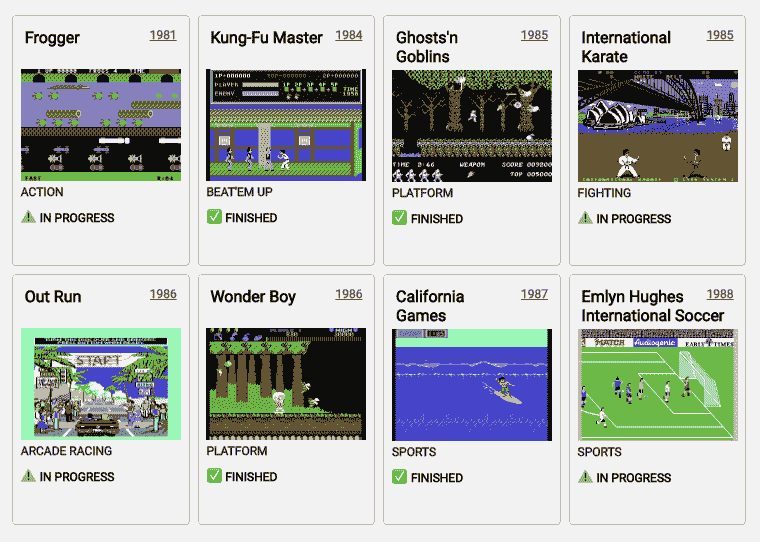

# 用钩子装载和显示数据

> 原文:[https://dev . to/juliang/loading-and-display-data-with-hooks-jlj](https://dev.to/juliang/loading-and-displaying-data-with-hooks-jlj)

在本系列中，我们没有使用状态管理库或提出一个通用的解决方案，而是从最低限度开始，根据需要构建我们的状态管理。

* * *

*   在第一篇文章中，我们将描述如何用钩子加载和显示数据。
*   在第二篇文章中，我们将学习如何用钩子改变远程数据。
*   在第三篇文章中，我们将看到如何使用 React Context 在组件之间共享数据，而不使用全局变量、单例变量或求助于 MobX 或 Redux 等状态管理库。
*   在第四篇文章中，我们将看到如何使用 [SWR](https://swr.now.sh/) 在组件之间共享数据，这可能是我们从一开始就应该做的。

* * *

最终代码可以在这个 [GitHub repo](https://github.com/JulianG/minimal-state-management-demo) 中找到。它是 TypeScript，但是类型注释很少。**另外，请注意这不是生产代码。**为了专注于状态管理，许多其他方面没有被考虑(例如[依赖倒置](https://en.wikipedia.org/wiki/Dependency_inversion_principle)，测试或优化)。

## [](#loading-data-with-hooks)用钩子加载数据

假设我们有一个 REST API，其中包含一系列 [Commodore 64](https://en.wikipedia.org/wiki/Commodore_64) 游戏。我是说，为什么不呢？

**需求:**我们要加载列表并显示游戏。

[T2】](https://res.cloudinary.com/practicaldev/image/fetch/s--DGXqcpyt--/c_limit%2Cf_auto%2Cfl_progressive%2Cq_auto%2Cw_880/https://thepracticaldev.s3.amazonaws.com/i/1vp7uggnq1ldbz3iw035.png)

### [](#1-basic-fetching)1。基本抓取

下面是我们如何从服务器获取游戏列表:

```
const getGames = () => {
  return fetch('http://localhost:3001/games/').then(response => response.json());
}; 
```

<svg width="20px" height="20px" viewBox="0 0 24 24" class="highlight-action crayons-icon highlight-action--fullscreen-on"><title>Enter fullscreen mode</title></svg> <svg width="20px" height="20px" viewBox="0 0 24 24" class="highlight-action crayons-icon highlight-action--fullscreen-off"><title>Exit fullscreen mode</title></svg>

我们可以在 React 应用程序中使用它。我们的第一次迭代如下:

**App.tsx** (由 index.tsx 渲染)( *[见回购](https://github.com/JulianG/minimal-state-management-demo/tree/01-basic-fetching-2/src)* )

```
import React from 'react';

const getGames = () => {
  return fetch('http://localhost:3001/games/').then(response => response.json());
};

export const App = () => {
  const [games, setGames] = React.useState([]);

  React.useEffect(() => {
    getGames().then(games => setGames(games));
  }, []);

  return <pre>{JSON.stringify(games, null, 2)}</pre>;
}; 
```

<svg width="20px" height="20px" viewBox="0 0 24 24" class="highlight-action crayons-icon highlight-action--fullscreen-on"><title>Enter fullscreen mode</title></svg> <svg width="20px" height="20px" viewBox="0 0 24 24" class="highlight-action crayons-icon highlight-action--fullscreen-off"><title>Exit fullscreen mode</title></svg>

在第一次呈现我们的`App`组件时，`games`数组将为空。然后当`getGames`返回的承诺结算时，`games`数组包含了我们所有的游戏，它们会以非常基本的方式显示出来。

### [](#2-custom-react-hook)2。自定义反应挂钩

我们可以很容易地将其提取到一个单独文件中的自定义 React 钩子中。

**使用游戏。ts** ( *[参见 rest](https://github.com/JulianG/minimal-state-management-demo/blob/02-custom-react-hook/src)*)

```
import React from 'react';

const getGames = () => {
  return fetch('http://localhost:3001/games/').then(response => response.json());
};

export const useGames = () => {
  const [games, setGames] = React.useState([]);

  React.useEffect(() => {
    getGames().then(games => setGames(games));
  }, []);

  return games;
}; 
```

<svg width="20px" height="20px" viewBox="0 0 24 24" class="highlight-action crayons-icon highlight-action--fullscreen-on"><title>Enter fullscreen mode</title></svg> <svg width="20px" height="20px" viewBox="0 0 24 24" class="highlight-action crayons-icon highlight-action--fullscreen-off"><title>Exit fullscreen mode</title></svg>

**App.tsx** ( *[参见回购](https://github.com/JulianG/minimal-state-management-demo/blob/02-custom-react-hook/src)* )

```
import React from 'react';
import { useGames } from './useGames';

export const App = () => {
  const games = useGames();
  return <pre>{JSON.stringify(games, null, 2)}</pre>;
}; 
```

<svg width="20px" height="20px" viewBox="0 0 24 24" class="highlight-action crayons-icon highlight-action--fullscreen-on"><title>Enter fullscreen mode</title></svg> <svg width="20px" height="20px" viewBox="0 0 24 24" class="highlight-action crayons-icon highlight-action--fullscreen-off"><title>Exit fullscreen mode</title></svg>

### [](#3-handling-errors-and-pending-state)3。处理错误和挂起状态

我们的自定义钩子不处理挂起和错误状态。从服务器加载数据时没有视觉反馈，更糟糕的是:失败时没有错误消息。如果服务器关闭，游戏列表将保持为空，没有错误。

我们可以解决这个问题。有这方面的库，最流行的是[react-async](https://www.npmjs.com/package/react-async)；但是我现在还不想添加依赖项。让我们看看处理错误和挂起状态所需的最少代码是多少。

#### [](#useasyncfunction)使用同步功能

我们编写了一个自定义钩子，它接受一个异步函数(返回一个承诺)和一个默认值。

这个钩子返回一个包含 3 个元素的元组:`[value, error, isPending]`。它调用 async 函数一次*，并在解析时更新值，当然，除非有错误。

```
function useAsyncFunction<T>(asyncFunction: () => Promise<T>, defaultValue: T) {
  const [state, setState] = React.useState({
    value: defaultValue,
    error: null,
    isPending: true
  });

  React.useEffect(() => {
    asyncFunction()
      .then(value => setState({ value, error: null, isPending: false }))
      .catch(error => setState({ ...state, error: error.toString(), isPending: false }));
  }, [asyncFunction]); // *

  const { value, error, isPending } = state;
  return [value, error, isPending];
} 
```

<svg width="20px" height="20px" viewBox="0 0 24 24" class="highlight-action crayons-icon highlight-action--fullscreen-on"><title>Enter fullscreen mode</title></svg> <svg width="20px" height="20px" viewBox="0 0 24 24" class="highlight-action crayons-icon highlight-action--fullscreen-off"><title>Exit fullscreen mode</title></svg>

* *我们的`useAsyncFunction`里面的`useEffect`会调用一次异步函数，然后每次`asyncFunction`改变的时候。更多详情:[使用状态挂钩](https://reactjs.org/docs/hooks-state.html)，[使用效果挂钩](https://reactjs.org/docs/hooks-effect.html)，[挂钩 API 参考](https://reactjs.org/docs/hooks-reference.html)。*

现在，在 useGames.ts 中，我们可以简单地使用这个新的定制钩子，传递函数`getGames`和一个空数组的初始值作为参数。

```
...
export const useGames = () => {
  const games = useAsyncFunction(getGames, []); // 🤔 new array on every render?
  return games;
}; 
```

<svg width="20px" height="20px" viewBox="0 0 24 24" class="highlight-action crayons-icon highlight-action--fullscreen-on"><title>Enter fullscreen mode</title></svg> <svg width="20px" height="20px" viewBox="0 0 24 24" class="highlight-action crayons-icon highlight-action--fullscreen-off"><title>Exit fullscreen mode</title></svg>

不过，有个小问题。每次调用`useGames`时，也就是每次我们的`App`组件渲染时，我们都传递一个新的空数组。这导致我们的数据在每次渲染时被重新获取，但是每次获取都会导致一次新的渲染，所以这导致了一个无限循环。

我们可以通过在钩子外的常量中存储初始值来避免这种情况:

```
...
const emptyList = [];

export const useGames = () => {
  const [games] = useAsyncFunction(getGames, emptyList);
  return games;
}; 
```

<svg width="20px" height="20px" viewBox="0 0 24 24" class="highlight-action crayons-icon highlight-action--fullscreen-on"><title>Enter fullscreen mode</title></svg> <svg width="20px" height="20px" viewBox="0 0 24 24" class="highlight-action crayons-icon highlight-action--fullscreen-off"><title>Exit fullscreen mode</title></svg>

#### [](#small-typescript-interlude)小型打字稿插曲

如果你使用普通的 JavaScript，你可以跳过这一部分。

如果您使用的是严格类型脚本，由于“noImplicitAny”编译器选项，上述代码将无法工作。这是因为`const emptyList = [];`是一个隐式的`any`数组。

我们可以像`const emptyList: any[] = [];`一样注释它，然后继续前进。**但是我们使用打字稿是有原因的。**明确的`any`可以(也应该)更具体。

这个列表的元素是什么？**游戏！**是游戏列表。

```
const emptyList: Game[] = []; 
```

<svg width="20px" height="20px" viewBox="0 0 24 24" class="highlight-action crayons-icon highlight-action--fullscreen-on"><title>Enter fullscreen mode</title></svg> <svg width="20px" height="20px" viewBox="0 0 24 24" class="highlight-action crayons-icon highlight-action--fullscreen-off"><title>Exit fullscreen mode</title></svg>

当然，现在我们**必须给**定义一个`Game`类型。但是不要绝望！我们有来自服务器的 JSON 响应，每个游戏对象看起来像这样:

```
{  "id":  5,  "title":  "Kung-Fu Master",  "year":  1984,  "genre":  "beat'em up",  "url":  "https://en.wikipedia.org/wiki/Kung-Fu_Master_(video_game)",  "status":  "in-progress",  "img":  "http://localhost:3001/img/kung-fu-master.gif"  } 
```

<svg width="20px" height="20px" viewBox="0 0 24 24" class="highlight-action crayons-icon highlight-action--fullscreen-on"><title>Enter fullscreen mode</title></svg> <svg width="20px" height="20px" viewBox="0 0 24 24" class="highlight-action crayons-icon highlight-action--fullscreen-off"><title>Exit fullscreen mode</title></svg>

我们可以使用 [transform.tools](https://transform.tools/json-to-typescript) 将其转换为 TypeScript 接口(或类型)。

```
type Game = {
  id: number;
  title: string;
  year: number;
  genre: string;
  url: string;
  status: 'not-started' | 'in-progress' | 'finished';
  img: string;
}; 
```

<svg width="20px" height="20px" viewBox="0 0 24 24" class="highlight-action crayons-icon highlight-action--fullscreen-on"><title>Enter fullscreen mode</title></svg> <svg width="20px" height="20px" viewBox="0 0 24 24" class="highlight-action crayons-icon highlight-action--fullscreen-off"><title>Exit fullscreen mode</title></svg>

##### [](#one-more-thing)还有一件事:

我们说`useAsyncFunction`返回了一个 tuple，但是 TypeScript 的推断(@3.6.2)并不理解这一点。它推断返回类型为`Array<(boolean | Game[] | null)>`。我们可以显式地将函数的返回类型标注为`[T, string | null, boolean]`，其中`T`是`value`的(泛型)类型，`(string | null)`是`error`的类型，`boolean`是`isPending`。

```
export function useAsyncFunction<T>(
  asyncFunction: () => Promise<T>,
  defaultValue: T
): [T, string | null, boolean] {
  ...
} 
```

<svg width="20px" height="20px" viewBox="0 0 24 24" class="highlight-action crayons-icon highlight-action--fullscreen-on"><title>Enter fullscreen mode</title></svg> <svg width="20px" height="20px" viewBox="0 0 24 24" class="highlight-action crayons-icon highlight-action--fullscreen-off"><title>Exit fullscreen mode</title></svg>

现在，当我们使用该函数时，TypeScript 会建议正确的类型。

```
const [games] = useAsyncFunction(getGames, emptyList); // games is of type Game[] 
```

<svg width="20px" height="20px" viewBox="0 0 24 24" class="highlight-action crayons-icon highlight-action--fullscreen-on"><title>Enter fullscreen mode</title></svg> <svg width="20px" height="20px" viewBox="0 0 24 24" class="highlight-action crayons-icon highlight-action--fullscreen-off"><title>Exit fullscreen mode</title></svg>

打字稿插曲结束。

#### [](#composing-our-custom-hooks)编写自定义钩子

**useAsyncFunction.ts** 现在看起来是这样的:( *[见回购](https://github.com/JulianG/minimal-state-management-demo/blob/03-handling-error-pending-1/src/useAsyncFunction.ts)* )

```
import React from 'react';

export function useAsyncFunction<T>(
  asyncFunction: () => Promise<T>,
  defaultValue: T
): [T, string | null, boolean] {
  const [state, setState] = React.useState({
    value: defaultValue,
    error: null,
    isPending: true
  });

  React.useEffect(() => {
    asyncFunction()
      .then(value => setState({ value, error: null, isPending: false }))
      .catch(error =>
        setState({ value: defaultValue, error: error.toString(), isPending: false })
      );
  }, [asyncFunction, defaultValue]);

  const { value, error, isPending } = state;
  return [value, error, isPending];
} 
```

<svg width="20px" height="20px" viewBox="0 0 24 24" class="highlight-action crayons-icon highlight-action--fullscreen-on"><title>Enter fullscreen mode</title></svg> <svg width="20px" height="20px" viewBox="0 0 24 24" class="highlight-action crayons-icon highlight-action--fullscreen-off"><title>Exit fullscreen mode</title></svg>

我们在我们的`useGames`钩子中使用它:

**使用游戏。ts** ( *[参见 rest](https://github.com/JulianG/minimal-state-management-demo/blob/03-handling-error-pending-1/src/useGames.ts)*)

```
import { useAsyncFunction } from './useAsyncFunction';

const getGames = (): Promise<Game[]> => {
  return fetch('http://localhost:3001/games/').then(response => response.json());
};

type Game = {
  id: number;
  title: string;
  year: number;
  genre: string;
  url: string;
  status: 'not-started' | 'in-progress' | 'finished';
  img: string;
};

const emptyList: Game[] = [];

export const useGames = () => {
  const [games] = useAsyncFunction(getGames, emptyList);
  return games;
}; 
```

<svg width="20px" height="20px" viewBox="0 0 24 24" class="highlight-action crayons-icon highlight-action--fullscreen-on"><title>Enter fullscreen mode</title></svg> <svg width="20px" height="20px" viewBox="0 0 24 24" class="highlight-action crayons-icon highlight-action--fullscreen-off"><title>Exit fullscreen mode</title></svg>

#### [](#changing-ui-to-display-errors-and-pending-states)改变用户界面以显示错误和未决状态

太好了！但是我们仍然没有处理错误和未决状态。我们需要改变我们的`App`组件:

```
import React from 'react';
import { useGames } from './useGames';

export const App = () => {
  const { games, error, isPending } = useGames();

  return (
    <>
      {error && <pre>ERROR! {error}...</pre>}
      {isPending && <pre>LOADING...</pre>}
      <pre>{JSON.stringify(games, null, 2)}</pre>
    </>
  );
}; 
```

<svg width="20px" height="20px" viewBox="0 0 24 24" class="highlight-action crayons-icon highlight-action--fullscreen-on"><title>Enter fullscreen mode</title></svg> <svg width="20px" height="20px" viewBox="0 0 24 24" class="highlight-action crayons-icon highlight-action--fullscreen-off"><title>Exit fullscreen mode</title></svg>

而我们的`useGames`钩子应该返回一个带有三个键的对象:`games`、`error`、`isPending`。

```
export const useGames = () => {
  const [games, error, isPending] = useAsyncFunction(getGames, emptyList);
  return { games, error, isPending };
}; 
```

<svg width="20px" height="20px" viewBox="0 0 24 24" class="highlight-action crayons-icon highlight-action--fullscreen-on"><title>Enter fullscreen mode</title></svg> <svg width="20px" height="20px" viewBox="0 0 24 24" class="highlight-action crayons-icon highlight-action--fullscreen-off"><title>Exit fullscreen mode</title></svg>

我们还改进了我们的`getGames`函数，将不同于 200 的 HTTP 状态代码作为错误:

```
const getGames = (): Promise<Game[]> => {
  return fetch('http://localhost:3001/games/').then(response => {
    if (response.status !== 200) {
      throw new Error(`${response.status}  ${response.statusText}`);
    }
    return response.json();
  });
}; 
```

<svg width="20px" height="20px" viewBox="0 0 24 24" class="highlight-action crayons-icon highlight-action--fullscreen-on"><title>Enter fullscreen mode</title></svg> <svg width="20px" height="20px" viewBox="0 0 24 24" class="highlight-action crayons-icon highlight-action--fullscreen-off"><title>Exit fullscreen mode</title></svg>

我们到目前为止的代码是这样的:( *[见回购](https://github.com/JulianG/minimal-state-management-demo/tree/03-handling-error-pending-2/src)* )。

## [](#conclusion)结论

我们已经看到了如何使用 React 钩子从 REST API 加载数据。

在下一篇文章中，我们将看到如何使用 HTTP `PATCH`请求改变远程数据，以及当请求成功时如何更新我们的客户端数据。

## [](#resources)资源

延伸阅读:

*   [使用状态挂钩](https://reactjs.org/docs/hooks-state.html)
*   [使用效果挂钩](https://reactjs.org/docs/hooks-effect.html)
*   [钩子 API 引用](https://reactjs.org/docs/hooks-reference.html)
*   [何时使用备忘录和使用回拨](https://kentcdodds.com/blog/usememo-and-usecallback/)
*   [用 React.useEffect 取消承诺](https://juliangaramendy.dev/use-promise-subscription/)